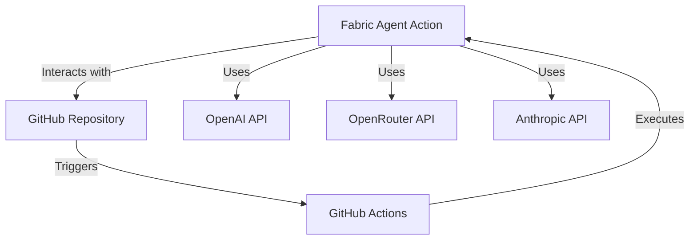
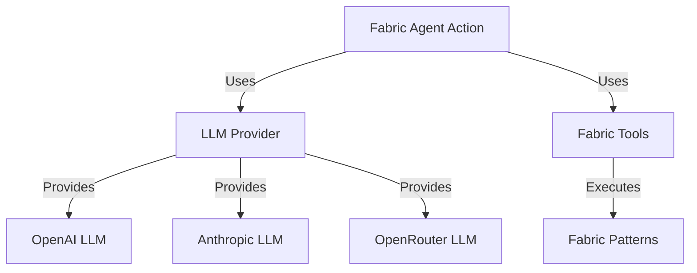
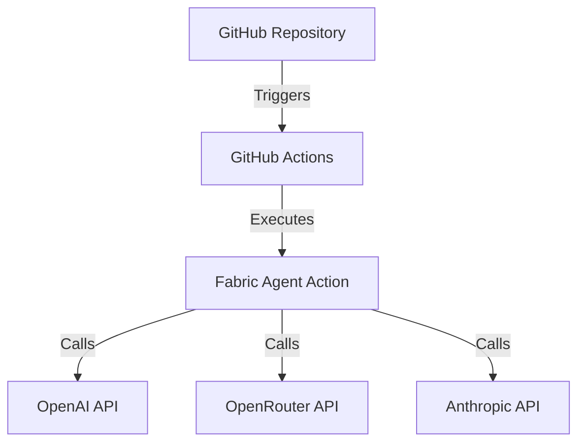
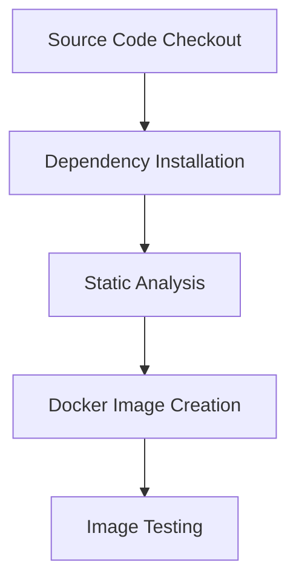

# Project Design Document for Fabric Agent Action

## BUSINESS POSTURE
The Fabric Agent Action project aims to automate complex workflows in GitHub using an agent-based approach that leverages Fabric Patterns and Large Language Models (LLMs). The primary business goals include:

- **Enhancing Workflow Efficiency**: Automating repetitive tasks in GitHub workflows to save time and reduce manual errors.
- **Improving Collaboration**: Facilitating better communication and collaboration among team members through automated responses and actions.
- **Cost Management**: Implementing security controls to prevent unauthorized usage and manage API costs effectively.

### Business Risks
- **Unauthorized Access**: Risk of unauthorized users triggering workflows, leading to increased API costs.
- **Operational Downtime**: Potential for system failures or bugs that could disrupt automated workflows.
- **Data Sensitivity**: Handling sensitive data in workflows without proper security measures could lead to data breaches.

## SECURITY POSTURE
### Existing Security Controls
- **Access Control Patterns**: Implemented conditions in workflows to restrict access based on user roles and repository ownership.
- **Environment Variables**: Use of secrets for API keys to prevent exposure in the codebase.

### Accepted Risks
- **Limited User Access**: While access control patterns mitigate unauthorized access, there is still a risk of legitimate users making mistakes in workflow triggers.

### Recommended Security Controls
- **Rate Limiting**: Implement rate limiting on API calls to prevent abuse.
- **Audit Logging**: Maintain logs of all actions taken by the Fabric Agent Action for accountability and troubleshooting.

### Security Requirements
- **Authentication**: Use of GitHub OAuth for user authentication.
- **Authorization**: Role-based access control to restrict actions based on user roles.
- **Input Validation**: Ensure all inputs to the action are validated to prevent injection attacks.
- **Cryptography**: Use of secure methods for storing and transmitting sensitive data, such as API keys.

## DESIGN
### C4 CONTEXT

| Name                | Type          | Description                                           | Responsibilities                                   | Security Controls                       |
|---------------------|---------------|-------------------------------------------------------|---------------------------------------------------|-----------------------------------------|
| Fabric Agent Action | System        | GitHub Action for automating workflows                | Execute fabric patterns based on user input       | Access Control Patterns                 |
| GitHub Repository    | System        | Repository where the action is implemented            | Store code and manage workflows                    | OAuth Authentication                    |
| OpenAI API          | External API  | API for accessing OpenAI's language models            | Provide LLM capabilities for processing requests   | API Key Management                      |
| OpenRouter API      | External API  | API for accessing multiple LLMs                        | Provide alternative LLM capabilities                | API Key Management                      |
| Anthropic API       | External API  | API for accessing Anthropic's language models         | Provide LLM capabilities for processing requests    | API Key Management                      |
| GitHub Actions      | System        | CI/CD tool for automating workflows                   | Trigger workflows based on repository events       | Access Control Patterns                 |

### C4 CONTAINER

| Name                | Type          | Description                                           | Responsibilities                                   | Security Controls                       |
|---------------------|---------------|-------------------------------------------------------|---------------------------------------------------|-----------------------------------------|
| Fabric Agent Action | Container     | Main application container for the GitHub Action      | Manage workflow execution and interaction with APIs| Access Control Patterns                 |
| LLM Provider         | Component     | Manages LLM instances and configurations              | Create and manage LLM instances                    | API Key Management                      |
| Fabric Tools        | Component     | Manages fabric patterns and their execution           | Execute fabric patterns based on user input       | Input Validation                        |
| OpenAI LLM          | External API  | LLM instance for OpenAI                               | Process requests using OpenAI's models             | API Key Management                      |
| Anthropic LLM       | External API  | LLM instance for Anthropic                            | Process requests using Anthropic's models          | API Key Management                      |
| OpenRouter LLM      | External API  | LLM instance for OpenRouter                           | Process requests using OpenRouter's models         | API Key Management                      |
| Fabric Patterns     | Data          | Collection of patterns for various tasks              | Provide templates for LLM processing                | Input Validation                        |

### DEPLOYMENT
The Fabric Agent Action is deployed as a GitHub Action, which can be triggered by various events in a GitHub repository, such as pull requests, issue comments, or pushes. The deployment architecture is as follows:

| Name                | Type          | Description                                           | Responsibilities                                   | Security Controls                       |
|---------------------|---------------|-------------------------------------------------------|---------------------------------------------------|-----------------------------------------|
| GitHub Repository    | System        | Repository where the action is implemented            | Store code and manage workflows                    | OAuth Authentication                    |
| GitHub Actions      | System        | CI/CD tool for automating workflows                   | Trigger workflows based on repository events       | Access Control Patterns                 |
| Fabric Agent Action | Container     | Main application container for the GitHub Action      | Manage workflow execution and interaction with APIs| Access Control Patterns                 |
| OpenAI API          | External API  | API for accessing OpenAI's language models            | Provide LLM capabilities for processing requests   | API Key Management                      |
| OpenRouter API      | External API  | API for accessing multiple LLMs                        | Provide alternative LLM capabilities                | API Key Management                      |
| Anthropic API       | External API  | API for accessing Anthropic's language models         | Provide LLM capabilities for processing requests    | API Key Management                      |

### BUILD
The Fabric Agent Action is built using Docker, with a focus on security controls during the build process. The build process includes:

1. **Source Code Checkout**: The code is checked out from the GitHub repository.
2. **Dependency Installation**: Dependencies are installed using Poetry.
3. **Static Analysis**: Tools like Ruff and Bandit are used to perform static analysis and security checks.
4. **Docker Image Creation**: A Docker image is built using the Dockerfile.
5. **Image Testing**: The built image is tested to ensure it functions as expected.

## RISK ASSESSMENT
### Critical Business Processes
- Workflow automation in GitHub.
- API interactions with external LLM providers.

### Data Sensitivity
- API keys and sensitive data used in workflows are considered highly sensitive and must be protected.

## QUESTIONS & ASSUMPTIONS
### Questions
1. What additional security measures can be implemented to further protect API keys?
2. Are there specific compliance requirements that need to be addressed for this project?

### Assumptions
- The project will be deployed in a controlled environment with access restrictions.
- Users triggering workflows will have appropriate permissions based on their roles.