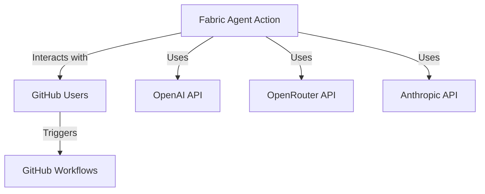
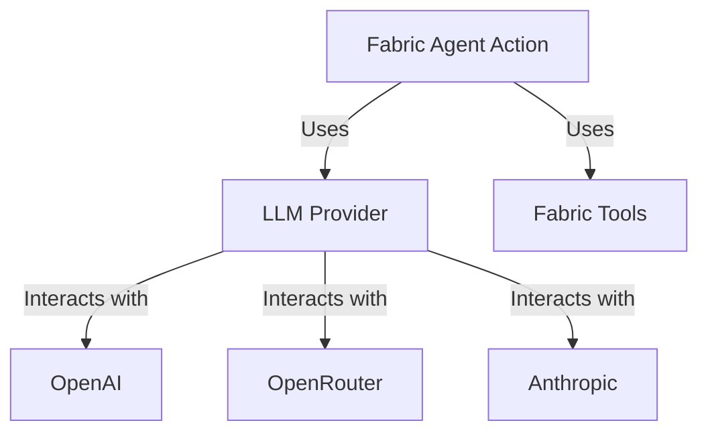
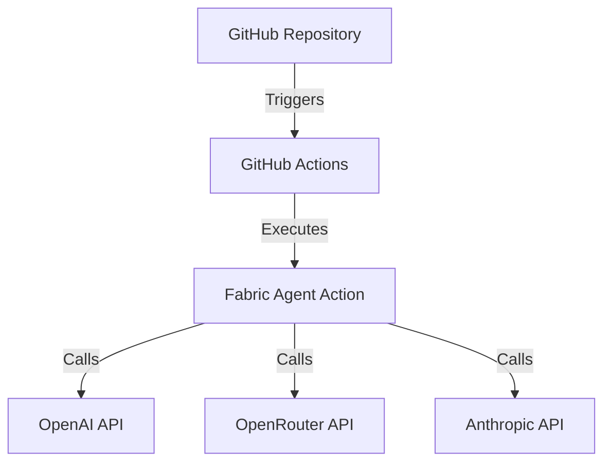
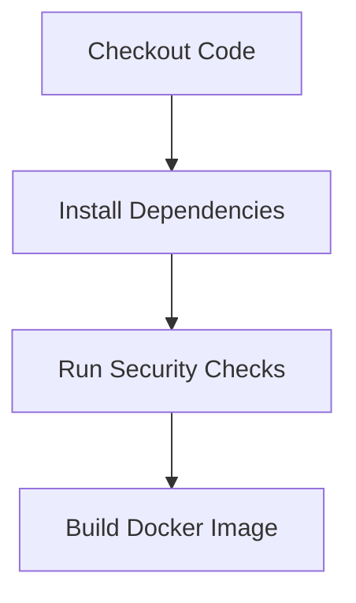

# Project Design Document for Fabric Agent Action

## BUSINESS POSTURE
The Fabric Agent Action project aims to automate complex workflows in GitHub using an agent-based approach that leverages Fabric Patterns and Large Language Models (LLMs). The primary business goals include:

- **Enhancing Workflow Efficiency**: By automating repetitive tasks, the project seeks to improve productivity for developers and teams using GitHub.
- **Reducing Manual Errors**: Automation minimizes human error in executing workflows, leading to more reliable outcomes.
- **Providing Flexibility**: The ability to choose between different LLM providers and agent types allows users to tailor the action to their specific needs.

### Business Risks
- **Unauthorized Access**: If security controls are not properly implemented, unauthorized users may exploit the action, leading to increased API costs or data breaches.
- **Dependency on External Services**: The reliance on third-party LLM providers may introduce risks related to service availability and data privacy.
- **Complexity of Integration**: Integrating the action into existing workflows may pose challenges, particularly for teams with less technical expertise.

## SECURITY POSTURE
### Existing Security Controls
- **Access Control Patterns**: The action implements specific conditions to restrict access based on the context of GitHub events (e.g., pull requests, comments).
- **Environment Variable Management**: Sensitive API keys are managed through GitHub secrets to prevent exposure in the codebase.

### Accepted Risks
- **Limited Control Over External APIs**: The project accepts the risk associated with using external LLM providers, including potential service outages and data handling practices.

### Recommended Security Controls
- **Rate Limiting**: Implement rate limiting on API calls to prevent abuse and manage costs effectively.
- **Audit Logging**: Maintain logs of actions taken by the agent for accountability and troubleshooting.

### Security Requirements
- **Authentication**: Ensure that only authorized users can trigger the action.
- **Authorization**: Implement role-based access control to restrict actions based on user roles.
- **Input Validation**: Validate inputs to prevent injection attacks or malformed requests.
- **Cryptography**: Use encryption for sensitive data in transit and at rest.

## DESIGN
### C4 CONTEXT

| Name                     | Type          | Description                                           | Responsibilities                                   | Security Controls                          |
|--------------------------|---------------|-------------------------------------------------------|---------------------------------------------------|-------------------------------------------|
| Fabric Agent Action      | System        | GitHub Action for automating workflows                | Execute fabric patterns based on user input       | Access Control Patterns                    |
| GitHub Users             | Actor         | Users interacting with GitHub                         | Trigger workflows and provide input                | Authentication, Authorization              |
| OpenAI API               | External System| LLM provider for executing fabric patterns            | Process requests and return results                 | API Key Management                         |
| OpenRouter API           | External System| Alternative LLM provider                               | Process requests and return results                 | API Key Management                         |
| Anthropic API            | External System| Another LLM provider                                   | Process requests and return results                 | API Key Management                         |
| GitHub Workflows         | System        | CI/CD workflows in GitHub                             | Execute actions based on events                     | Rate Limiting, Audit Logging               |

### C4 CONTAINER

| Name                     | Type          | Description                                           | Responsibilities                                   | Security Controls                          |
|--------------------------|---------------|-------------------------------------------------------|---------------------------------------------------|-------------------------------------------|
| Fabric Agent Action      | Container     | Main application container                             | Execute workflows and manage interactions          | Access Control Patterns                    |
| LLM Provider             | Container     | Manages interactions with LLM providers               | Create and manage LLM instances                    | API Key Management                         |
| Fabric Tools             | Container     | Manages fabric patterns and their execution           | Read and invoke fabric patterns                     | Input Validation                           |
| OpenAI                   | External Service| LLM provider for executing fabric patterns            | Process requests and return results                 | API Key Management                         |
| OpenRouter               | External Service| Alternative LLM provider                               | Process requests and return results                 | API Key Management                         |
| Anthropic                | External Service| Another LLM provider                                   | Process requests and return results                 | API Key Management                         |

### DEPLOYMENT
The Fabric Agent Action is deployed as a GitHub Action, which can be triggered by various GitHub events such as pull requests, issue comments, and pushes. The deployment architecture is as follows:

| Name                     | Type          | Description                                           | Responsibilities                                   | Security Controls                          |
|--------------------------|---------------|-------------------------------------------------------|---------------------------------------------------|-------------------------------------------|
| GitHub Repository        | Environment    | Source code repository for the action                 | Hosts the action and triggers workflows            | Rate Limiting, Audit Logging               |
| GitHub Actions           | Environment    | CI/CD environment for executing actions               | Executes the Fabric Agent Action                   | Rate Limiting, Audit Logging               |
| Fabric Agent Action      | Container     | Main application container                             | Execute workflows and manage interactions          | Access Control Patterns                    |
| OpenAI API               | External Service| LLM provider for executing fabric patterns            | Process requests and return results                 | API Key Management                         |
| OpenRouter API           | External Service| Alternative LLM provider                               | Process requests and return results                 | API Key Management                         |
| Anthropic API            | External Service| Another LLM provider                                   | Process requests and return results                 | API Key Management                         |

### BUILD
The project is built using Docker and Poetry. The build process includes the following steps:

1. **Checkout Code**: The code is checked out from the GitHub repository.
2. **Install Dependencies**: Dependencies are installed using Poetry.
3. **Run Security Checks**: Security checks are performed using Bandit.
4. **Build Docker Image**: A Docker image is built for the action.

## RISK ASSESSMENT
### Critical Business Processes
- **Workflow Automation**: The primary process being protected is the automation of workflows in GitHub.
- **Data Handling**: Ensuring that sensitive data (API keys, user inputs) is handled securely.

### Data Sensitivity
- **API Keys**: Highly sensitive, as they provide access to external services.
- **User Inputs**: Varies in sensitivity; may contain proprietary or confidential information.

## QUESTIONS & ASSUMPTIONS
### Questions
1. What specific user roles will be defined for access control?
2. Are there any specific compliance requirements that need to be addressed?
3. What is the expected volume of API calls, and how will rate limiting be managed?

### Assumptions
- The project will be deployed in a GitHub environment with appropriate permissions.
- Users will have a basic understanding of GitHub Actions and workflows.
- Security controls will be implemented as recommended to mitigate risks.