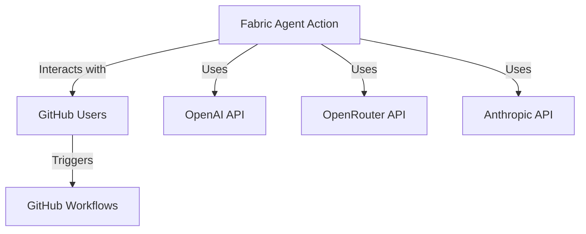
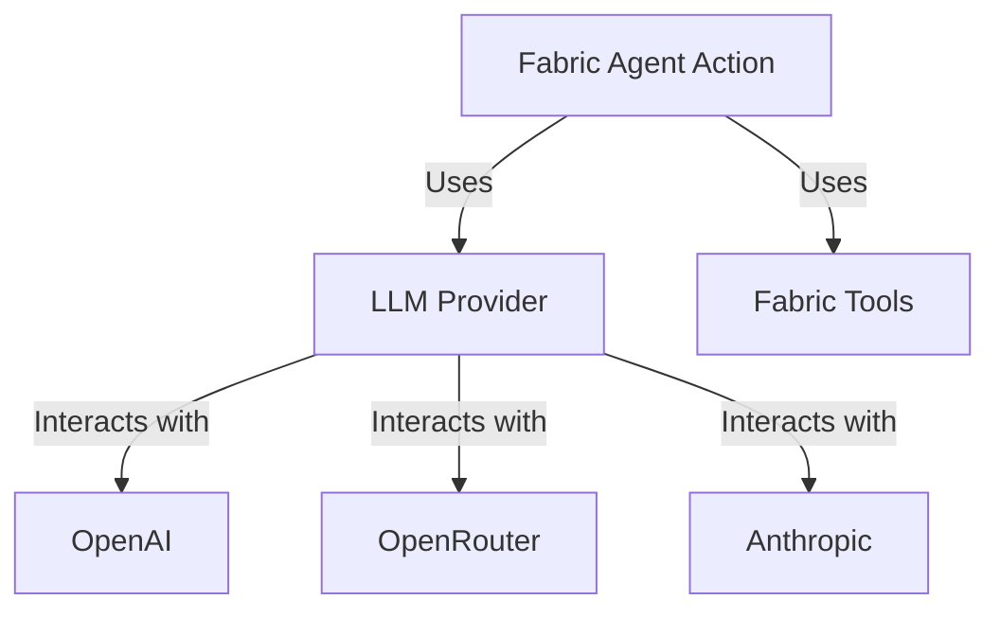
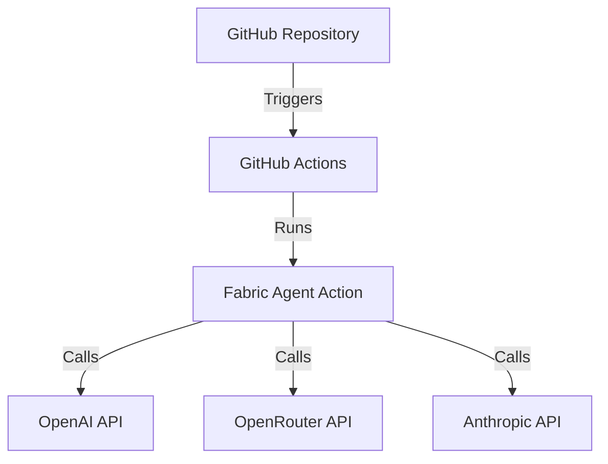
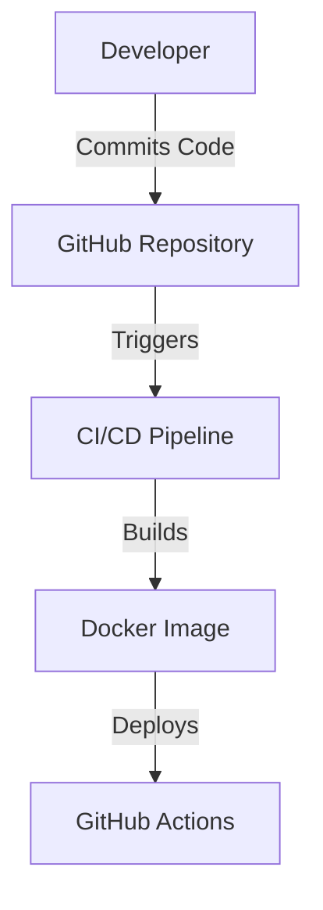

# Project Design Document for Fabric Agent Action

## BUSINESS POSTURE
The Fabric Agent Action project aims to automate complex workflows in GitHub using an agent-based approach that leverages Fabric Patterns and Large Language Models (LLMs). The primary business goals include:

- **Enhancing Workflow Efficiency**: By automating repetitive tasks and providing intelligent suggestions, the project seeks to improve the productivity of developers and teams.
- **Seamless Integration**: The action is designed to be easily integrated into existing GitHub workflows, minimizing setup time and maximizing usability.
- **Multi-Provider Support**: Offering flexibility in choosing LLM providers (OpenAI, OpenRouter, Anthropic) to cater to different user preferences and availability.

### Business Risks
- **Unauthorized Access**: Potential misuse of the action could lead to unauthorized API usage and increased costs.
- **Dependency on External Services**: Reliance on third-party LLM providers may introduce risks related to service availability and performance.
- **Data Privacy**: Handling sensitive data through LLMs raises concerns about data security and compliance with privacy regulations.

## SECURITY POSTURE
### Existing Security Controls
- **Access Control Patterns**: Implemented conditions to restrict access based on the context of GitHub events (e.g., pull requests, comments).
- **Environment Variables**: Sensitive API keys are stored in GitHub secrets to prevent exposure in the codebase.

### Accepted Risks
- **Accepted Risk**: The action may be exposed to public repositories, allowing unauthorized users to trigger workflows, albeit with access control measures in place.

### Recommended Security Controls
- **Security Control**: Implement rate limiting on API calls to prevent abuse.
- **Security Control**: Introduce logging and monitoring to track usage patterns and detect anomalies.
- **Security Control**: Regularly review and update access control conditions to adapt to evolving threats.

### Security Requirements
- **Authentication**: Use GitHub's built-in authentication mechanisms to verify user identity.
- **Authorization**: Implement role-based access control to restrict actions based on user roles.
- **Input Validation**: Ensure all inputs are validated to prevent injection attacks.
- **Cryptography**: Use secure methods for storing and transmitting sensitive data, such as API keys.

## DESIGN
### C4 CONTEXT

| Name                | Type          | Description                                           | Responsibilities                                   | Security Controls                          |
|---------------------|---------------|-------------------------------------------------------|---------------------------------------------------|--------------------------------------------|
| Fabric Agent Action | System        | GitHub Action for automating workflows                | Execute fabric patterns based on user input       | Access control patterns, environment variables |
| GitHub Users        | Actor         | Users interacting with the GitHub Action              | Trigger workflows, provide input                   | N/A                                        |
| OpenAI API          | External API  | LLM provider for executing fabric patterns             | Process requests and return results                | API key management                         |
| OpenRouter API      | External API  | Alternative LLM provider                               | Process requests and return results                | API key management                         |
| Anthropic API       | External API  | Another LLM provider                                   | Process requests and return results                | API key management                         |
| GitHub Workflows     | System        | GitHub CI/CD workflows that utilize the action        | Automate tasks based on events                     | N/A                                        |

### C4 CONTAINER

| Name                | Type          | Description                                           | Responsibilities                                   | Security Controls                          |
|---------------------|---------------|-------------------------------------------------------|---------------------------------------------------|--------------------------------------------|
| Fabric Agent Action | Container     | Main application container for the GitHub Action      | Execute workflows and manage interactions          | Access control patterns, environment variables |
| LLM Provider         | Component     | Manages interactions with LLM providers               | Create and manage LLM instances                    | API key management                         |
| Fabric Tools         | Component     | Contains fabric patterns and tools                    | Execute specific tasks based on user input        | Input validation                           |
| OpenAI               | External API  | LLM provider for executing fabric patterns             | Process requests and return results                | API key management                         |
| OpenRouter           | External API  | Alternative LLM provider                               | Process requests and return results                | API key management                         |
| Anthropic            | External API  | Another LLM provider                                   | Process requests and return results                | API key management                         |

### DEPLOYMENT
The Fabric Agent Action is deployed as a GitHub Action, which can be triggered by various GitHub events such as push, pull request, or issue comment. The deployment architecture is as follows:

| Name                | Type          | Description                                           | Responsibilities                                   | Security Controls                          |
|---------------------|---------------|-------------------------------------------------------|---------------------------------------------------|--------------------------------------------|
| GitHub Repository    | System        | Repository where the action is defined                | Hosts the action code and configuration           | N/A                                        |
| GitHub Actions       | System        | CI/CD platform for running workflows                   | Executes the Fabric Agent Action                   | N/A                                        |
| Fabric Agent Action   | Container     | Main application container for the GitHub Action      | Execute workflows and manage interactions          | Access control patterns, environment variables |
| OpenAI API           | External API  | LLM provider for executing fabric patterns             | Process requests and return results                | API key management                         |
| OpenRouter API       | External API  | Alternative LLM provider                               | Process requests and return results                | API key management                         |
| Anthropic API        | External API  | Another LLM provider                                   | Process requests and return results                | API key management                         |

### BUILD
The Fabric Agent Action is built using Docker, with the following build process:

1. **Source Code**: The code is stored in a GitHub repository.
2. **Dockerfile**: A Dockerfile is used to define the build process, including dependencies and entry points.
3. **CI/CD Pipeline**: GitHub Actions are used to automate the build and testing process, ensuring that the code is validated before deployment.

### RISK ASSESSMENT
- **Critical Business Processes**: The automation of workflows in GitHub is critical for enhancing productivity and ensuring efficient project management.
- **Data Sensitivity**: The project handles API keys and user inputs, which may contain sensitive information. Proper measures must be taken to secure this data.

## QUESTIONS & ASSUMPTIONS
### Questions
1. What additional security measures can be implemented to further protect against unauthorized access?
2. How can we ensure the reliability of external LLM providers?
3. What are the potential impacts of service outages on the functionality of the Fabric Agent Action?

### Assumptions
- The project will be deployed in a secure environment with proper access controls.
- Users will follow best practices for managing API keys and sensitive data.
- The action will be used primarily in private repositories to minimize exposure to unauthorized users.