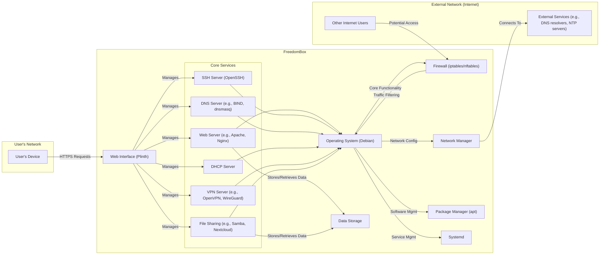

## Project Design Document: FreedomBox (Improved)

**1. Introduction**

This document provides a detailed architectural design of the FreedomBox project. It aims to clearly outline the system's components, their interactions, and the overall architecture. This document will serve as a foundation for subsequent threat modeling activities, enabling a comprehensive understanding of potential security vulnerabilities. This revision expands on the initial design to provide greater detail and clarity for security analysis.

**2. Project Goals and Scope**

* **Goal:** To provide a user-friendly, self-hosted server platform that empowers individuals to control their digital lives and data.
* **Scope:** This document covers the core software components of a typical FreedomBox installation, including the operating system, key services, and the web interface. It focuses on the logical architecture, key data flows, and security-relevant interactions. While it mentions examples of applications, the primary focus remains on the foundational elements of FreedomBox. Specific application configurations and vulnerabilities are outside the scope of this document unless they directly impact core FreedomBox functionality.

**3. System Overview**

FreedomBox is built upon a Debian-based operating system and provides a web-based interface (Plinth) for managing various server applications and services. It aims to be a single point of control for a user's personal server needs, simplifying the management of self-hosted services.

**4. Detailed Component Description**

* **Operating System (Debian):**
    * **Description:** The foundational operating system providing core functionalities.
    * **Responsibilities:** Kernel operations, process management, file system management, hardware interaction, user management.
    * **Security Considerations:**  Vulnerability management of Debian packages, kernel security, proper user and permission management.

* **Web Interface (Plinth):**
    * **Description:** The primary web application for user interaction and system management.
    * **Responsibilities:** User authentication, authorization, session management, displaying system status, configuring and managing core services, handling user input.
    * **Security Considerations:**  Susceptible to common web application vulnerabilities (e.g., Cross-Site Scripting (XSS), Cross-Site Request Forgery (CSRF), authentication bypass, insecure session handling, injection vulnerabilities). Secure coding practices and regular security audits are crucial.

* **Core Services:**
    * **Description:** A collection of essential server applications providing the core functionality of FreedomBox.
    * **Responsibilities and Security Considerations for individual services:**
        * **Web Server (e.g., Apache, Nginx):**
            * **Responsibilities:** Serving web pages for Plinth and potentially other hosted applications.
            * **Security Considerations:**  Vulnerabilities in the web server software itself, misconfiguration leading to information disclosure or unauthorized access, protection against common web attacks (e.g., SQL injection if interacting with a database, path traversal).
        * **SSH Server (OpenSSH):**
            * **Responsibilities:** Providing secure remote access for administrative tasks.
            * **Security Considerations:**  Brute-force attacks, weak password policies, vulnerabilities in the SSH daemon, insecure key management.
        * **DNS Server (e.g., BIND, dnsmasq):**
            * **Responsibilities:** Resolving domain names for the local network and potentially for external queries.
            * **Security Considerations:**  DNS spoofing, DNS cache poisoning, vulnerabilities in the DNS server software, amplification attacks.
        * **DHCP Server:**
            * **Responsibilities:** Assigning IP addresses and network configuration to devices on the local network.
            * **Security Considerations:**  DHCP starvation attacks, rogue DHCP servers, information disclosure.
        * **VPN Server (e.g., OpenVPN, WireGuard):**
            * **Responsibilities:** Providing secure remote access to the FreedomBox network.
            * **Security Considerations:**  Vulnerabilities in the VPN server software, weak encryption configurations, improper key management, denial-of-service attacks.
        * **File Sharing (e.g., Samba, Nextcloud):**
            * **Responsibilities:** Enabling file sharing within the local network or remotely.
            * **Security Considerations:**  Authentication bypass, unauthorized access to files, vulnerabilities in the file sharing software, insecure file permissions.

* **Firewall (iptables/nftables):**
    * **Description:** A network security system controlling incoming and outgoing traffic based on defined rules.
    * **Responsibilities:** Filtering network traffic, blocking unauthorized access attempts, allowing necessary traffic for services.
    * **Security Considerations:**  Misconfiguration leading to open ports or allowing malicious traffic, bypass vulnerabilities in the firewall rules, state exhaustion attacks.

* **Network Manager:**
    * **Description:** Manages network interfaces, connections, and routing configurations.
    * **Responsibilities:** Configuring network interfaces, handling DHCP client functionality, managing VPN client connections, managing routing tables.
    * **Security Considerations:**  Vulnerabilities allowing network configuration manipulation, insecure handling of network credentials, potential for man-in-the-middle attacks if not using secure protocols.

* **Data Storage:**
    * **Description:** The persistent storage medium for system data, configurations, and user files.
    * **Responsibilities:** Storing and retrieving data for the operating system and services.
    * **Security Considerations:**  Data at rest encryption, access control mechanisms, protection against data breaches, ensuring data integrity.

* **Package Manager (apt):**
    * **Description:** A tool for installing, updating, and removing software packages.
    * **Responsibilities:** Managing software dependencies, retrieving and installing software packages, updating system software.
    * **Security Considerations:**  Compromised package repositories, man-in-the-middle attacks during package downloads, vulnerabilities in the package manager itself. Ensuring the integrity and authenticity of package sources is critical.

* **Systemd:**
    * **Description:** A system and service manager responsible for system initialization and service management.
    * **Responsibilities:** Booting the system, starting, stopping, and managing services, managing system resources.
    * **Security Considerations:**  Privilege escalation vulnerabilities, insecure service unit configurations, denial-of-service through resource exhaustion.

**5. Key Data Flows (Expanded)**

* **User Authentication to Plinth:**
    * User's Device -> FreedomBox (Web Interface - Plinth) via HTTPS (requesting login page).
    * FreedomBox (Web Interface - Plinth) -> Data Storage (retrieving user credentials).
    * FreedomBox (Web Interface - Plinth) -> User's Device (sending login form).
    * User's Device -> FreedomBox (Web Interface - Plinth) via HTTPS (submitting credentials).
    * FreedomBox (Web Interface - Plinth) -> Data Storage (verifying credentials).
    * FreedomBox (Web Interface - Plinth) -> User's Device (granting access or denying login).

* **External User Connecting via VPN:**
    * External User -> FreedomBox (Firewall) via UDP/TCP port (e.g., 1194 for OpenVPN, 51820 for WireGuard).
    * FreedomBox (Firewall) -> VPN Server.
    * VPN Server -> Data Storage (retrieving VPN configuration and user credentials).
    * VPN Server -> Network Manager (establishing the VPN tunnel).
    * Encrypted traffic flows between External User and FreedomBox.

* **FreedomBox Performing DNS Resolution:**
    * FreedomBox -> Network Manager (requesting DNS resolution for a hostname).
    * Network Manager -> Local DNS Resolver (if configured).
    * Local DNS Resolver (if configured) -> External DNS Resolver (via UDP/TCP port 53).
    * External DNS Resolver -> Network Manager (returning IP address).
    * Network Manager -> Requesting application within FreedomBox.

* **Software Update Process:**
    * FreedomBox -> Package Manager (apt) (initiating update process).
    * Package Manager (apt) -> Configured Package Repositories (via HTTPS).
    * Package Repositories -> Package Manager (apt) (providing package lists and checksums).
    * Package Manager (apt) -> Downloads package files (via HTTPS).
    * Package Manager (apt) -> Verifies package integrity (using checksums).
    * Package Manager (apt) -> Installs or updates packages.

**6. Deployment Model**

A typical FreedomBox deployment involves installing the software on a dedicated single-board computer (e.g., Raspberry Pi), a virtual machine, or a physical server within a home or small office network. It is generally expected to be behind a Network Address Translation (NAT) router and connected to the internet. Users typically access it through their local network or remotely via VPN or port forwarding (with associated security risks).

**7. Security Considerations (Detailed)**

This section expands on the initial security considerations, providing more specific examples of potential threats and vulnerabilities.

* **Authentication and Authorization:**
    * **Threats:** Brute-force attacks on login forms, weak password usage, session hijacking, privilege escalation vulnerabilities in Plinth or individual services.
    * **Mitigations:** Strong password policies, multi-factor authentication, secure session management (e.g., HTTPOnly and Secure flags), principle of least privilege.

* **Network Security:**
    * **Threats:** Unauthorized access from the internet or local network, port scanning, denial-of-service attacks, man-in-the-middle attacks.
    * **Mitigations:** Properly configured firewall rules (least privilege principle for ports), intrusion detection/prevention systems (IDS/IPS), using secure protocols (HTTPS, SSH), disabling unnecessary services.

* **Data Security:**
    * **Threats:** Data breaches due to unauthorized access, data corruption, insecure storage of sensitive information (e.g., passwords, private keys).
    * **Mitigations:** Data at rest encryption, access control lists (ACLs), regular backups, secure deletion of sensitive data.

* **Software Vulnerabilities:**
    * **Threats:** Exploitation of known vulnerabilities in the operating system, core services, and Plinth, leading to remote code execution, information disclosure, or denial of service.
    * **Mitigations:** Regular software updates and patching, vulnerability scanning, using security auditing tools.

* **Supply Chain Security:**
    * **Threats:** Compromised software packages or dependencies containing malware.
    * **Mitigations:** Verifying package signatures, using trusted repositories, monitoring for suspicious package updates.

* **Physical Security:**
    * **Threats:** Unauthorized physical access to the device, leading to data theft or tampering.
    * **Mitigations:** Secure physical location of the device, BIOS/UEFI passwords, full disk encryption.

* **Denial of Service (DoS):**
    * **Threats:** Attacks aimed at making the FreedomBox unavailable by overwhelming its resources.
    * **Mitigations:** Rate limiting, traffic filtering, resource monitoring, using a reverse proxy with DoS protection.

* **Privacy:**
    * **Threats:** Unintentional or malicious disclosure of user data, lack of transparency in data handling.
    * **Mitigations:** Implementing privacy-preserving configurations, providing clear privacy policies, minimizing data collection.

**8. Assumptions and Constraints**

* It is assumed that the user has a basic understanding of networking concepts.
* The FreedomBox is assumed to be connected to a reliable internet connection.
* The user is responsible for configuring strong passwords and keeping the system updated.
* This design document focuses on a standard FreedomBox installation and may not cover all possible configurations or third-party applications.
* The security of the underlying hardware is assumed.

**9. Future Considerations**

* **Improved Containerization:**  Further leveraging containerization technologies for service isolation and simplified deployment and management of applications.
* **Enhanced Monitoring and Logging:** Implementing a centralized logging system and robust monitoring tools for proactive security monitoring and incident response.
* **Automated Security Hardening:** Developing automated scripts or tools to apply security best practices and configurations.
* **Integration with Hardware Security Modules (HSMs):** Exploring the use of HSMs for enhanced security of cryptographic keys and sensitive data.
* **Formal Security Audits:** Conducting regular independent security audits of the FreedomBox codebase and infrastructure.

This improved document provides a more detailed and nuanced understanding of the FreedomBox architecture, making it a more effective foundation for comprehensive threat modeling activities. The expanded component descriptions, data flows, and security considerations offer a clearer picture of potential attack surfaces and vulnerabilities.
