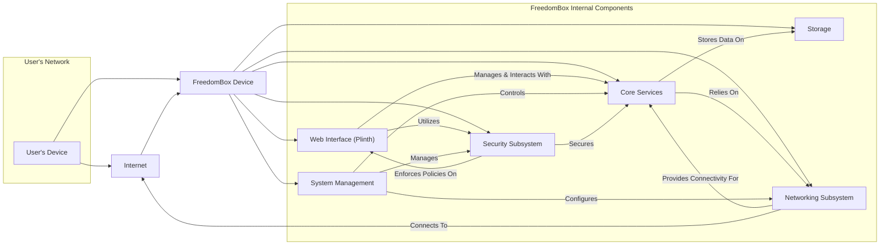
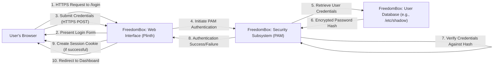
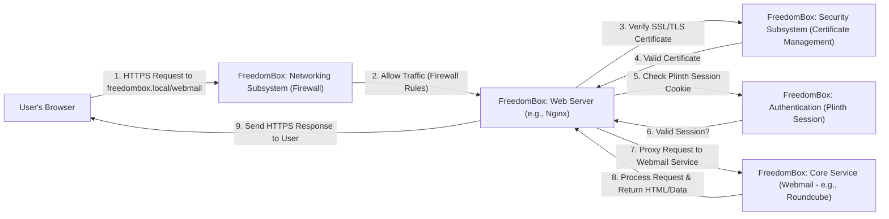
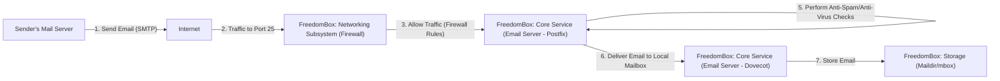

# FreedomBox Project Design Document

**Version:** 1.1
**Date:** October 26, 2023
**Author:** AI Software Architect

## 1. Introduction

This document provides a detailed architectural design of the FreedomBox project. It outlines the key components, their interactions, and data flows within the system. This document serves as a foundation for understanding the system's structure and will be used as the basis for future threat modeling activities.

### 1.1. Purpose

The primary purpose of this document is to provide a comprehensive and understandable description of the FreedomBox architecture. It aims to:

- Clearly define the system's boundaries and major components.
- Describe the interactions between these components in detail.
- Illustrate the flow of data within the system for various use cases.
- Provide sufficient detail for security analysis, threat modeling, and development efforts.

### 1.2. Scope

This document covers the core architectural aspects of the FreedomBox project, focusing on the software components running on the FreedomBox device itself. It includes:

- High-level system architecture with detailed component interactions.
- Descriptions of key software components, including underlying technologies.
- Data flow diagrams for common and critical use cases.
- In-depth initial security considerations and potential vulnerabilities.

This document does not cover:

- The specific hardware on which FreedomBox is deployed (although hardware interactions are considered).
- Extremely granular configuration management details beyond the scope of architectural understanding.
- The internal workings of individual applications installable on FreedomBox, unless they directly impact core FreedomBox architecture.

### 1.3. Target Audience

This document is intended for:

- Security engineers and architects responsible for threat modeling and security assessments of the FreedomBox project.
- Software developers contributing to the FreedomBox codebase.
- System administrators deploying, configuring, and maintaining FreedomBox instances.
- Technical stakeholders requiring a deep understanding of the FreedomBox architecture and its security implications.

## 2. System Overview

FreedomBox is a free software operating system designed for single-board computers (SBCs) and servers. Its core objective is to provide individuals with a private and secure platform to host their own digital services, encompassing email, file sharing, and communication tools. The central tenet is to empower users with autonomy over their personal data and online presence.

The system is structured as a collection of interconnected services and applications, centrally managed through a web-based interface. The underlying operating system is typically Debian-based, providing a stable foundation.

### 2.1. High-Level Architecture Diagram

### 2.2. Key Components

- **Web Interface (Plinth):** The primary point of interaction for users to manage their FreedomBox. It's a web application providing a dashboard for service configuration, user management, and system monitoring.
- **Core Services:** A suite of applications and daemons delivering the fundamental functionalities of FreedomBox. Examples include:
    - **DNS Server (Unbound):** Provides local DNS resolution, often configured to use upstream DNS servers.
    - **VPN Server (OpenVPN, WireGuard):** Enables secure, encrypted connections for remote access or site-to-site networking.
    - **Email Server (Postfix, Dovecot, potentially others):** Handles the sending, receiving, and storage of emails.
    - **File Sharing (Samba, Nextcloud):** Offers network file sharing capabilities using protocols like SMB/CIFS or web-based interfaces.
    - **Web Server (Apache, Nginx):** Hosts web applications, reverse proxies, and static content.
- **System Management:** Components responsible for the operational integrity and maintenance of the FreedomBox environment:
    - **Package Manager (APT):** Manages the installation, updating, and removal of software packages from Debian repositories.
    - **Configuration Management (Ansible):** Automates the configuration of system services and applications, ensuring consistency.
    - **Backup and Restore Utilities (e.g., `rsync`, `borg`):** Facilitates the creation and restoration of system and user data backups.
    - **Logging and Monitoring (systemd journal, potentially Prometheus/Grafana):** Collects and displays system logs and performance metrics.
- **Storage:** The underlying file system and storage devices used to persist system configurations, user files, and application data. This typically resides on the device's internal storage or connected external drives.
- **Networking Subsystem:** Manages the network interfaces, routing, and security aspects of network communication:
    - **Firewall (iptables, nftables):** Implements network filtering rules to control inbound and outbound traffic.
    - **Network Configuration Tools (`networkd`, `ifupdown`):** Manages IP addressing, routing tables, and network interface states.
    - **DHCP Server (e.g., `dnsmasq`):** Optionally provides IP address assignment to devices on the local network.
- **Security Subsystem:** Enforces security policies and provides security-related functionalities across the FreedomBox:
    - **Authentication and Authorization Framework (PAM):** Manages user authentication and authorization for various services.
    - **Intrusion Detection/Prevention (potential future integration of tools like Fail2ban):** Monitors for malicious activity and can take actions like blocking IP addresses.
    - **Certificate Management (Let's Encrypt integration via `certbot`):** Automates the acquisition and renewal of SSL/TLS certificates for secure HTTPS connections.

## 3. Component Details

This section provides a more granular description of the key components, including their functionalities, technologies, and interactions.

### 3.1. Web Interface (Plinth)

- **Functionality:** Serves as the central control panel for FreedomBox administration.
- **Key Features:**
    - User authentication (login, logout).
    - Service management (installation, configuration, starting, stopping, enabling, disabling).
    - System status monitoring (CPU usage, memory usage, disk space).
    - User and group management (creation, deletion, modification).
    - Network configuration (basic settings).
    - Software updates management.
- **Technology:** Primarily developed using Python, often leveraging web frameworks like Django or Flask. The frontend typically involves HTML, CSS, and JavaScript.
- **Interactions:**
    - Communicates with Core Services and System Management components via APIs (often RESTful) or direct function calls (within the same system).
    - Interacts with the Security Subsystem for user authentication and authorization.
    - Presents information to the user's web browser via HTTPS.

### 3.2. Core Services

- **Functionality:** Delivers the primary services offered by FreedomBox.
- **Examples and Technologies:**
    - **DNS Server (Unbound):** A validating, recursive, and caching DNS resolver. Configuration is often managed through Plinth, which modifies Unbound's configuration files.
    - **VPN Server (OpenVPN, WireGuard):** OpenVPN uses TLS/SSL for secure tunnels, while WireGuard uses криптографически secure protocols. Plinth manages configuration files and user credentials.
    - **Email Server (Postfix, Dovecot):** Postfix acts as the Mail Transfer Agent (MTA), handling email routing and delivery. Dovecot is the Mail Delivery Agent (MDA), providing POP3/IMAP access for users. Configuration involves modifying Postfix and Dovecot configuration files.
    - **File Sharing (Samba, Nextcloud):** Samba provides SMB/CIFS network file sharing for Windows and other systems. Nextcloud is a more comprehensive web-based platform offering file syncing, sharing, and collaboration features. Plinth manages user access and basic configurations.
    - **Web Server (Apache, Nginx):** These servers host web applications and can act as reverse proxies for other services. Configuration files are managed to define virtual hosts and proxy settings.
- **Interactions:**
    - Interacts with the Networking Subsystem for network communication (listening on ports, establishing connections).
    - Interacts with Storage for reading and writing data (e.g., storing emails, user files).
    - May interact with the Security Subsystem for authentication and authorization, depending on the service.
    - Configuration is often mediated through Plinth.

### 3.3. System Management

- **Functionality:** Oversees the health, maintenance, and configuration of the FreedomBox system.
- **Key Features and Technologies:**
    - **Software Package Management (APT):** Uses the `apt` command-line tool and interacts with Debian package repositories defined in `/etc/apt/sources.list`.
    - **Configuration Management (Ansible):** Executes Ansible playbooks (often written in YAML) to automate system configuration tasks, ensuring idempotency.
    - **Backup and Restore Utilities:** May utilize tools like `rsync` for simple file backups or more advanced solutions like `borg` for deduplicated and encrypted backups. Configuration often involves cron jobs or systemd timers.
    - **Logging and Monitoring:** Relies on `systemd-journald` for central logging. Potentially integrates with monitoring tools like Prometheus and Grafana for visualizing system metrics.
- **Interactions:**
    - Interacts directly with the operating system kernel and system services.
    - Receives instructions from Plinth for user-initiated actions (e.g., software updates, service restarts).
    - Interacts with Storage for storing backups and log files.
    - May interact with the Networking Subsystem for network-related configurations.

### 3.4. Storage

- **Functionality:** Provides persistent storage for all data within the FreedomBox.
- **Key Aspects:**
    - **File System:** Typically uses `ext4` or potentially `btrfs`.
    - **Partitioning:** Defines how the storage device is divided into partitions (e.g., root partition, `/boot`).
    - **Mount Points:** Specifies where partitions are attached to the file system hierarchy.
    - **External Storage:** FreedomBox often supports mounting external USB drives for additional storage.
- **Technology:** Standard Linux file system and storage management utilities (`mount`, `fdisk`, `parted`).
- **Interactions:**
    - Accessed by all other components for reading and writing data, including application data, configuration files, and user files.

### 3.5. Networking Subsystem

- **Functionality:** Manages all aspects of network connectivity and security for the FreedomBox.
- **Key Components and Technologies:**
    - **Firewall (iptables, nftables):** `iptables` is a traditional firewall utility, while `nftables` is a more modern replacement. Firewall rules are defined to permit or deny network traffic based on source/destination IP addresses, ports, and protocols.
    - **Network Interface Configuration (`networkd`, `ifupdown`):** `networkd` is a systemd component for managing network configurations, while `ifupdown` is a more traditional approach. Configuration files define IP addresses, netmasks, gateway, and DNS servers for each network interface.
    - **DHCP Server (`dnsmasq`):** Provides DHCP services to assign IP addresses to devices on the local network. Configuration files define the IP address range, lease times, and other DHCP options.
- **Interactions:**
    - Controls all network traffic entering and leaving the FreedomBox device.
    - Provides network connectivity for Core Services to communicate with the internet and local network.
    - Configuration is often managed through Plinth or directly via configuration files.

### 3.6. Security Subsystem

- **Functionality:** Implements and enforces security policies across the FreedomBox.
- **Key Aspects and Technologies:**
    - **Authentication and Authorization Framework (PAM - Pluggable Authentication Modules):** A suite of libraries that allows different authentication mechanisms to be plugged into applications. Configuration files in `/etc/pam.d/` define authentication policies for various services.
    - **Intrusion Detection/Prevention (Potential future integration of Fail2ban):** Fail2ban monitors log files for suspicious activity (e.g., failed login attempts) and can automatically block offending IP addresses by adding rules to the firewall.
    - **Certificate Management (Let's Encrypt integration via `certbot`):** `certbot` automates the process of obtaining and renewing SSL/TLS certificates from Let's Encrypt, ensuring secure HTTPS connections for web services.
- **Interactions:**
    - Interacts with Plinth to authenticate user logins.
    - Interacts with Core Services to enforce access controls and potentially provide secure communication channels (e.g., TLS for email).
    - Manages certificates used by web servers and other services requiring secure connections.

## 4. Data Flow Diagrams

This section illustrates the flow of data for critical and common use cases within the FreedomBox system.

### 4.1. User Login to Plinth (Detailed)

**Description:**

1. The user navigates to the FreedomBox login page via HTTPS.
2. Plinth serves the login form to the user's browser.
3. The user submits their username and password via an HTTPS POST request.
4. Plinth initiates the authentication process using the Pluggable Authentication Modules (PAM) framework.
5. PAM attempts to retrieve the stored user credentials, typically from `/etc/shadow`.
6. The encrypted password hash for the provided username is retrieved.
7. PAM compares the hash of the submitted password with the stored hash.
8. PAM returns the authentication result (success or failure) to Plinth.
9. If authentication is successful, Plinth creates a session cookie and sends it to the user's browser.
10. Plinth redirects the user to the main dashboard.

### 4.2. Accessing Self-Hosted Webmail via HTTPS

**Description:**

1. The user attempts to access their self-hosted webmail through their browser via HTTPS.
2. The Networking Subsystem's firewall evaluates the incoming request based on configured rules, allowing traffic to the web server port (typically 443).
3. The Web Server (e.g., Nginx) receives the request and verifies the SSL/TLS certificate to establish a secure connection.
4. The Security Subsystem's Certificate Management ensures a valid certificate is in place.
5. The Web Server checks for a valid Plinth session cookie to authenticate the user.
6. If a valid session exists, the Web Server proxies the request to the backend Webmail service (e.g., Roundcube).
7. The Webmail service processes the request and generates the HTML and data for the webmail interface.
8. The Webmail service returns the response to the Web Server.
9. The Web Server sends the HTTPS response back to the user's browser.

### 4.3. Receiving an Incoming Email

**Description:**

1. An external mail server sends an email destined for a user on the FreedomBox.
2. The email travels across the internet to the FreedomBox's public IP address on port 25 (SMTP).
3. The Networking Subsystem's firewall evaluates the incoming connection attempt.
4. Firewall rules are configured to allow incoming SMTP traffic to reach the Email Server (Postfix).
5. Postfix receives the email via the SMTP protocol.
6. Postfix may perform anti-spam and anti-virus checks on the incoming email.
7. Postfix delivers the email to the appropriate local mailbox, typically handled by Dovecot.
8. Dovecot stores the email in the user's mailbox on the FreedomBox's storage.

## 5. Security Considerations

This section provides a more detailed overview of security considerations and potential vulnerabilities within the FreedomBox architecture.

- **Authentication and Authorization Weaknesses:**
    - **Brute-force attacks:**  Vulnerable login endpoints (Plinth, SSH) could be targeted by brute-force attacks. Mitigation: Implement rate limiting, account lockout policies, and consider multi-factor authentication.
    - **Weak password policies:**  Users might choose weak passwords, making accounts susceptible to compromise. Mitigation: Enforce strong password complexity requirements.
    - **Insecure session management:**  Vulnerabilities in session handling (e.g., predictable session IDs, lack of HTTPOnly/Secure flags) could lead to session hijacking. Mitigation: Use cryptographically secure session IDs, implement proper session lifecycle management, and utilize secure cookie flags.
- **Web Interface (Plinth) Vulnerabilities:**
    - **Cross-Site Scripting (XSS):**  Improper input sanitization could allow attackers to inject malicious scripts into web pages viewed by other users. Mitigation: Implement robust input validation and output encoding.
    - **Cross-Site Request Forgery (CSRF):**  Attackers could trick authenticated users into performing unintended actions. Mitigation: Implement anti-CSRF tokens.
    - **SQL Injection:**  If Plinth interacts with a database, unsanitized user input could lead to SQL injection attacks. Mitigation: Use parameterized queries or ORM frameworks that prevent SQL injection.
    - **Insecure Direct Object References (IDOR):**  Users might be able to access resources they are not authorized to by manipulating object IDs. Mitigation: Implement proper authorization checks for all resource access.
- **Network Security Deficiencies:**
    - **Insecure firewall rules:**  Overly permissive firewall rules could expose unnecessary services to the internet. Mitigation: Follow the principle of least privilege when configuring firewall rules.
    - **Lack of intrusion detection/prevention:**  Without an IDS/IPS, malicious activity might go undetected. Mitigation: Consider integrating tools like Fail2ban or more comprehensive IDS/IPS solutions.
    - **Exposure of sensitive services:**  Services like SSH running on default ports could be targeted by automated attacks. Mitigation: Change default ports for sensitive services or restrict access by IP address.
- **Core Service Vulnerabilities:**
    - **Software vulnerabilities:**  Outdated versions of core services might contain known security vulnerabilities. Mitigation: Implement a robust software update mechanism and keep all packages up to date.
    - **Service-specific misconfigurations:**  Improper configuration of services like the email server or VPN server could introduce security weaknesses. Mitigation: Follow security best practices for each service and perform regular security audits.
    - **Insecure inter-service communication:**  Communication between internal services should be secured. Mitigation: Utilize secure protocols for inter-service communication where appropriate.
- **Data Security Risks:**
    - **Unencrypted sensitive data at rest:**  Storing sensitive data (e.g., user credentials, emails) without encryption could lead to data breaches if the system is compromised. Mitigation: Encrypt sensitive data at rest.
    - **Insecure data transmission:**  Transmitting sensitive data over unencrypted connections (e.g., HTTP) exposes it to eavesdropping. Mitigation: Enforce the use of HTTPS and other secure protocols.
    - **Insufficient access controls on data:**  Improperly configured file permissions could allow unauthorized access to sensitive data. Mitigation: Implement strict access controls based on the principle of least privilege.
- **Software Supply Chain Risks:**
    - **Compromised packages:**  Malicious actors could inject malware into software packages. Mitigation: Verify package integrity using checksums and signatures.
    - **Vulnerable dependencies:**  FreedomBox relies on numerous software libraries, which might contain vulnerabilities. Mitigation: Regularly scan dependencies for vulnerabilities and update them promptly.
- **Insufficient Logging and Monitoring:**
    - **Lack of audit trails:**  Without sufficient logging, it can be difficult to investigate security incidents. Mitigation: Implement comprehensive logging of security-relevant events.
    - **Absence of real-time monitoring:**  Not monitoring system activity in real-time can delay the detection of attacks. Mitigation: Implement real-time monitoring and alerting for suspicious activity.

## 6. Deployment Considerations

FreedomBox deployment involves several key considerations for security and functionality.

- **Network Topology:**  How the FreedomBox is connected to the network (e.g., directly to the internet, behind a router) significantly impacts security. Deploying behind a NAT router provides an initial layer of protection.
- **Firewall Configuration:**  Properly configuring the firewall is paramount. A "default deny" policy with explicitly allowed traffic is recommended.
- **Port Forwarding:** If the FreedomBox is behind a NAT router, necessary ports (e.g., 80, 443 for web services, 25 for SMTP) need to be forwarded to the FreedomBox's internal IP address. Securely managing port forwarding rules is crucial.
- **DNS Configuration:**  Setting up appropriate DNS records (A, MX, etc.) is necessary for external access to services like email and web hosting.
- **Physical Security:**  Protecting the physical device from unauthorized access is important, especially if it contains sensitive data.
- **Backup Strategy:**  Implementing a regular backup strategy is essential for data recovery. This includes backing up system configurations and user data. Consider both local and offsite backups.
- **Initial Setup Security:**  The initial setup process should enforce strong password creation and guide users through basic security hardening steps.
- **Regular Updates:**  Maintaining the FreedomBox with the latest security updates is crucial. Automating updates (with appropriate safeguards) is recommended.

## 7. Future Considerations

- **Enhanced Intrusion Detection and Prevention:** Implementing a more robust IDS/IPS solution with real-time threat detection and automated response capabilities.
- **Security Auditing Tools:** Integrating tools for automated security audits and vulnerability scanning.
- **Containerization of Services:**  Containerizing individual services could improve isolation and simplify management.
- **Centralized Log Management (SIEM):**  Implementing a Security Information and Event Management (SIEM) system for centralized log collection, analysis, and alerting.
- **Improved Multi-Factor Authentication Options:**  Expanding the available multi-factor authentication methods.
- **Secure Boot Implementation:**  Ensuring the integrity of the boot process to prevent the loading of malicious software.
- **Integration with Hardware Security Modules (HSMs):**  Utilizing HSMs for securely storing cryptographic keys.

This improved document provides a more detailed and comprehensive architectural design of the FreedomBox project, focusing on aspects relevant to security and threat modeling.