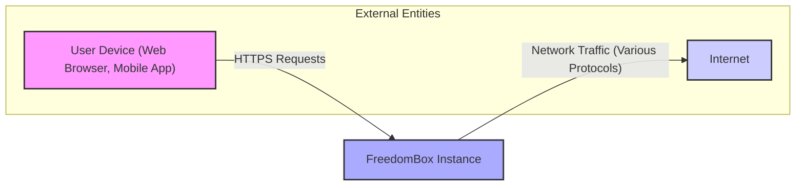

# Project Design Document: FreedomBox

**Version:** 1.1
**Date:** October 26, 2023
**Author:** AI Software Architect

## 1. Introduction

This document provides an enhanced and detailed design overview of the FreedomBox project, building upon the previous version. FreedomBox is a collaborative, community-driven effort focused on creating free and open-source software for personal servers. This empowers users to host their own digital services and data, thereby increasing control over their digital lives and reducing dependence on centralized entities. This document elaborates on the system's architecture, dissects its key components, meticulously maps data flow, and comprehensively addresses security considerations. Its primary purpose is to serve as a robust foundation for subsequent threat modeling exercises.

## 2. Goals and Objectives

The core goals underpinning the FreedomBox project are:

* **Elevated User Sovereignty:** To equip users with the necessary software to self-host services and manage their data independently.
* **Robust Privacy and Security:** To establish a secure and private environment for personal communication and data storage, minimizing exposure to third-party surveillance.
* **Fostering Decentralization:** To contribute to a more distributed internet ecosystem by simplifying the process for individuals to operate their own servers.
* **Intuitive User Experience:** To offer an accessible and user-friendly interface for managing a personal server, catering to users with varying levels of technical proficiency.
* **Commitment to Open Source:** To ensure the software remains free, open-source, and collaboratively developed, fostering transparency and community involvement.

## 3. System Architecture

FreedomBox is implemented as a software layer designed to be installed on a physical device (such as a Raspberry Pi or a small server appliance) or within a virtualized environment. It presents a web-based management interface, facilitating the configuration and administration of various services and system settings.

### 3.1. High-Level Architecture Diagram

### 3.2. Logical Components

The FreedomBox system is structured around the following key logical components, categorized for clarity:

* **Core Management & User Interface:**
    * **Plinth (Web Interface):** The central web-based interface for managing the FreedomBox instance.
    * **Application Management Subsystem:** Responsible for installing, updating, and removing applications (services).
    * **User and Identity Management Subsystem:** Handles user account creation, authentication, and authorization.
    * **System Configuration Management:** Manages core system settings, such as time, locale, and updates.

* **Networking & Connectivity:**
    * **Networking Configuration Subsystem:** Manages network interfaces, DNS, routing, and related settings.
    * **Firewall Management (e.g., `iptables`, `nftables`):** Controls network traffic flow based on defined rules.
    * **DNS Server (e.g., `dnsmasq`, `bind9`):** Provides local DNS resolution.
    * **VPN Server (e.g., OpenVPN, WireGuard):** Enables secure remote access and network tunneling.

* **Service Hosting & Data Management:**
    * **Web Server (e.g., Nginx, Apache):** Serves web content and acts as a reverse proxy.
    * **Database Server (e.g., SQLite, PostgreSQL, MariaDB):** Provides data persistence for applications.
    * **Mail Server (e.g., Postfix, Dovecot):** Handles email sending and receiving.
    * **File Sharing Service (e.g., Samba, Nextcloud):** Enables file sharing and collaboration.
    * **Backup and Restore Subsystem:** Facilitates data backup and recovery.

* **Security & Monitoring:**
    * **Authentication and Authorization Framework (e.g., PAM):** Manages user authentication and access control.
    * **Intrusion Prevention System (e.g., Fail2ban):** Detects and blocks malicious login attempts.
    * **HTTPS Certificate Management (e.g., Let's Encrypt integration):** Automates the acquisition and renewal of SSL/TLS certificates.
    * **Logging and Auditing Subsystem (`systemd-journald`, application logs):** Records system and application events for monitoring and security analysis.

* **Underlying System:**
    * **Operating System (Typically Debian-based):** Provides the foundational platform for FreedomBox.
    * **System Services (`systemd`):** Manages the lifecycle of system processes and services.

### 3.3. Data Storage

FreedomBox utilizes the underlying operating system's file system for data persistence. Key data categories and potential storage locations include:

* **Application Data:**
    * Databases (e.g., `/var/lib/postgresql`, `/var/lib/mysql`, application-specific directories).
    * Application configuration files (e.g., `/etc/<application>`, `/opt/<application>/config`).
    * User-generated content (location varies by application, e.g., `/var/spool/mail`, user home directories).
* **System Configuration Data:**
    * Operating system configuration files (e.g., files under `/etc`).
    * FreedomBox-specific configuration (e.g., `/etc/freedombox`).
* **User Data:**
    * User home directories (typically under `/home`).
    * Data managed by specific applications (e.g., Nextcloud data directory).
* **Logs:**
    * System logs (`/var/log`, managed by `systemd-journald`).
    * Application-specific logs (location varies by application).

### 3.4. Networking

FreedomBox's network interactions encompass:

* **Inbound Connections:**
    * User access to the web interface (HTTPS, port 443).
    * Access to hosted services (ports vary depending on the service, e.g., SSH on port 22, email on ports 25, 143, 993, etc.).
    * VPN connections (ports vary depending on the VPN protocol).
* **Outbound Connections:**
    * Software updates (accessing package repositories).
    * DNS queries (to configured DNS servers).
    * Communication with external services (e.g., sending emails, accessing external APIs).
    * Time synchronization (NTP).
* **Local Network Interactions:**
    * Communication with other devices on the local network (e.g., file sharing via Samba).
    * Service discovery protocols (e.g., mDNS).

Network security is enforced through firewall rules, port management, and potentially VPN configurations to secure remote access.

## 4. Key Components in Detail

This section provides a more in-depth look at some critical components:

### 4.1. Plinth (Web Interface)

* **Purpose:** Serves as the primary graphical user interface for managing the FreedomBox.
* **Technology:** Typically implemented using Python with the Django web framework, providing a Model-View-Template (MVT) architecture.
* **Functionality:**
    * User authentication and authorization.
    * Displaying system status and information.
    * Managing users and groups.
    * Installing, configuring, and managing applications (services).
    * Configuring network settings (firewall, DNS, interfaces).
    * Accessing logs and monitoring tools.
* **Security Considerations:**
    * Protection against common web vulnerabilities (Cross-Site Scripting (XSS), Cross-Site Request Forgery (CSRF), SQL Injection).
    * Secure session management.
    * Proper input validation and output encoding.
    * Role-Based Access Control (RBAC).

### 4.2. Application Management Subsystem

* **Purpose:** Streamlines the process of installing, updating, and removing software applications (services) on the FreedomBox.
* **Technology:** Primarily leverages the underlying Debian operating system's package management system (`apt`). May also involve containerization technologies (like Docker or LXC) for certain applications.
* **Functionality:**
    * Interacting with package repositories to download application packages.
    * Resolving and installing dependencies.
    * Configuring application settings through Plinth or configuration files.
    * Managing application lifecycles (starting, stopping, restarting, enabling, disabling).
* **Security Considerations:**
    * Verifying the authenticity and integrity of downloaded packages (using cryptographic signatures).
    * Managing application permissions and resource usage.
    * Isolating applications to prevent interference or security breaches.

### 4.3. Networking Configuration Subsystem

* **Purpose:** Provides tools and interfaces for managing the network settings of the FreedomBox.
* **Technology:** Interacts with various operating system networking utilities and configuration files, such as `iproute2`, `netplan`, `resolvconf`, and firewall management tools (`iptables`, `nftables`).
* **Functionality:**
    * Configuring network interfaces (Ethernet, Wi-Fi).
    * Setting static or dynamic IP addresses (DHCP client).
    * Configuring DNS resolvers.
    * Managing firewall rules to control inbound and outbound traffic.
    * Setting up port forwarding and network address translation (NAT).
* **Security Considerations:**
    * Implementing a default-deny firewall policy.
    * Carefully configuring port forwarding rules to avoid exposing unnecessary services.
    * Protecting against DNS spoofing and other network attacks.

### 4.4. User and Identity Management Subsystem

* **Purpose:** Manages user accounts, their credentials, and their access rights to the FreedomBox and its services.
* **Technology:** Relies on standard Linux user management tools (`useradd`, `usermod`, `groupadd`) and the Pluggable Authentication Modules (PAM) framework for authentication.
* **Functionality:**
    * Creating and managing local user accounts.
    * Setting and changing user passwords.
    * Managing user groups and permissions.
    * Potentially integrating with external authentication providers (e.g., LDAP).
* **Security Considerations:**
    * Enforcing strong password policies.
    * Securely storing password hashes.
    * Implementing proper authorization controls to restrict access to sensitive resources.
    * Considering multi-factor authentication (MFA).

## 5. Data Flow

The following diagram illustrates a more detailed data flow scenario for a user accessing a web application hosted on the FreedomBox:

```mermaid
graph LR
    subgraph "User Environment"
        A["User Device"]
    end
    B["Internet"]
    subgraph "FreedomBox Instance"
        C["Firewall (iptables/nftables)"]
        D["Web Server (Nginx/Apache)"]
        E["Application Server (e.g., Python/WSGI)"]
        F["Database Server (e.g., PostgreSQL)"]
    end

    A -- "HTTPS Request" --> B
    B -- "Port 443" --> C
    C -- "Allowed Traffic" --> D
    D -- "Reverse Proxy to Application" --> E
    E -- "Database Query" --> F
    F -- "Data Response" --> E
    E -- "HTTP Response" --> D
    D -- "Allowed Traffic" --> C
    C -- "Port 443" --> B
    B -- "HTTPS Response" --> A
    style A fill:#f9f,stroke:#333,stroke-width:2px
    style B fill:#ccf,stroke:#333,stroke-width:2px
    style C fill:#aaf,stroke:#333,stroke-width:2px
    style D fill:#aaf,stroke:#333,stroke-width:2px
    style E fill:#aaf,stroke:#333,stroke-width:2px
    style F fill:#aaf,stroke:#333,stroke-width:2px
```

**Detailed Data Flow Description:**

1. **User Initiates Request:** A user on their device sends an HTTPS request to access a web application hosted on the FreedomBox.
2. **Internet Transit:** The request travels across the internet.
3. **Firewall Inspection:** The FreedomBox firewall intercepts the incoming request on port 443. Firewall rules determine if the traffic is allowed.
4. **Web Server Handling:** If allowed, the request reaches the web server (e.g., Nginx or Apache). The web server may handle static content directly or act as a reverse proxy.
5. **Application Server Processing:** For dynamic content, the web server forwards the request to the appropriate application server (e.g., a Python application running with a WSGI server).
6. **Database Interaction:** The application server may need to retrieve or store data, sending a database query to the database server (e.g., PostgreSQL).
7. **Database Response:** The database server processes the query and returns the requested data to the application server.
8. **Response Generation:** The application server processes the data and generates an HTTP response.
9. **Response Delivery (Reverse Path):** The HTTP response travels back through the web server, firewall, and internet to the user's device.

## 6. Security Considerations

Security is a foundational principle of FreedomBox. Key security considerations are categorized below:

* **System Hardening:**
    * **Secure Boot:** Verifying the integrity of the boot process.
    * **Minimal Installation:** Reducing the attack surface by installing only necessary software.
    * **Disabling Unnecessary Services:** Turning off services that are not required.
* **Network Security:**
    * **Strict Firewall Rules:** Implementing a default-deny policy and allowing only necessary traffic.
    * **Intrusion Prevention (Fail2ban):** Blocking hosts exhibiting malicious behavior.
    * **Regular Security Audits:** Reviewing firewall rules and network configurations.
* **Authentication and Authorization:**
    * **Strong Password Policies:** Enforcing complexity requirements and regular password changes.
    * **Secure Password Storage:** Using strong hashing algorithms.
    * **Principle of Least Privilege:** Granting users and applications only the necessary permissions.
    * **Consideration of Multi-Factor Authentication (MFA).**
* **Data Protection:**
    * **HTTPS Encryption:** Enforcing HTTPS for all web traffic using valid certificates.
    * **Data Encryption at Rest:** Considering encryption of sensitive data stored on the file system.
    * **Regular Backups:** Implementing a robust backup and restore strategy.
* **Software Updates and Patch Management:**
    * **Automated Security Updates:** Configuring automatic updates for the operating system and applications.
    * **Vulnerability Scanning:** Regularly scanning for known vulnerabilities.
* **Application Security:**
    * **Secure Application Development Practices:** Encouraging the use of secure coding practices for applications.
    * **Regular Application Updates:** Keeping applications up-to-date with security patches.
    * **Input Validation and Output Encoding:** Protecting against common web vulnerabilities.
* **Physical Security:**
    * **Securing the Physical Device:** Protecting the hardware from unauthorized access.
* **User Education:**
    * **Promoting Security Awareness:** Educating users about security best practices.

## 7. Deployment

FreedomBox can be deployed in various scenarios:

* **Bare Metal on Dedicated Hardware:**
    * **Single-Board Computers (SBCs):** Raspberry Pi, BeagleBone, etc. - ideal for low-power, always-on operation.
    * **Small Server Appliances:** Purpose-built devices designed for server tasks.
* **Virtualized Environments:**
    * **Virtual Machines (VMs):** Running on hypervisors like VirtualBox, VMware, KVM.
* **Cloud Instances (Less Common):**
    * On cloud providers like AWS, Azure, GCP, although this somewhat contradicts the self-hosting philosophy.

The deployment process typically involves:

* **Downloading a FreedomBox OS Image:** A pre-configured operating system image with FreedomBox installed.
* **Flashing the Image:** Writing the image to a storage medium (SD card, USB drive).
* **Booting the Device:** Starting the device with the flashed storage medium.
* **Initial Configuration:** Accessing the web interface to complete the setup process.
* **Installing on an Existing OS:** Alternatively, FreedomBox can be installed on top of an existing Debian-based system.

## 8. Future Considerations

The FreedomBox project continues to evolve. Future development areas include:

* **Enhanced User Experience (UX):** Further simplifying the user interface and improving usability.
* **Expanded Application Ecosystem:** Integrating more applications and services.
* **Improved Security Features:** Implementing more advanced security measures, such as intrusion detection systems (IDS) and security information and event management (SIEM).
* **Decentralized Identity and Authentication:** Exploring integration with decentralized identity solutions to further enhance user control.
* **Simplified Backup and Restore Solutions:** Making data backup and recovery more user-friendly and robust.
* **Performance Optimization:** Improving the performance and scalability of the system.
* **Mobile Application Development:** Creating mobile apps for easier access and management.
* **Strengthening Community Engagement:** Fostering a larger and more active community of contributors and users.

This enhanced design document provides a more detailed and structured overview of the FreedomBox project, offering a solid foundation for comprehensive threat modeling and further development efforts.