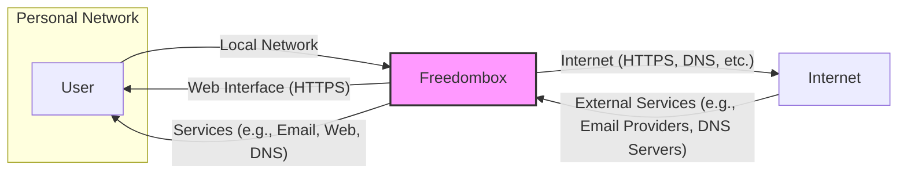

# BUSINESS POSTURE

The Freedombox project aims to empower individuals by providing them with a personal server solution that promotes privacy, security, and decentralization. It allows users to host their own digital services at home, reducing reliance on centralized, often privacy-invasive, corporate services.

Business Priorities and Goals:
- Provide users with a user-friendly and accessible platform for self-hosting digital services.
- Promote digital autonomy and privacy by enabling users to control their data and services.
- Foster a community-driven, open-source ecosystem around personal servers.
- Offer a secure and reliable alternative to centralized cloud services.

Business Risks:
- Complexity of self-hosting can deter less technically inclined users.
- Security vulnerabilities in the software could compromise user data and trust.
- Lack of widespread adoption could limit the network effects and community support.
- Competition from established centralized service providers and other self-hosting solutions.
- Ensuring long-term sustainability and maintenance of the open-source project.

# SECURITY POSTURE

Existing Security Controls:
- security control: Open Source Development - The project is open source, allowing for community review and scrutiny of the code, potentially leading to faster identification and resolution of vulnerabilities. (Implemented: GitHub Repository)
- security control: Regular Security Audits - (Assumption) The project likely undergoes periodic security audits, either by internal contributors or external security experts, to identify and address potential security flaws. (Location: Documentation or Project Website - needs verification)
- security control: Secure Software Development Practices - (Assumption) Developers follow secure coding practices to minimize vulnerabilities during development. (Location: Development Guidelines - needs verification)
- security control: Package Management Security - Freedombox relies on Debian package management, which includes security updates and vulnerability patching for system packages. (Implemented: Debian OS)
- security control: Firewall - Freedombox likely configures a firewall (iptables or nftables) to restrict network access to services. (Implemented: Freedombox software, needs verification in design)
- security control: HTTPS/TLS - Web interfaces and services are expected to use HTTPS/TLS for encrypted communication. (Implemented: Web server configuration, needs verification in design)
- security control: User Authentication - Freedombox requires user authentication to access the web interface and services. (Implemented: Freedombox software, needs verification in design)
- security control: Access Control - Freedombox likely implements access control mechanisms to manage user permissions and access to different services and data. (Implemented: Freedombox software, needs verification in design)
- security control: Regular Security Updates - The system is designed to receive regular security updates from Debian and Freedombox project. (Implemented: Update mechanisms, needs verification in design)

Accepted Risks:
- accepted risk: Complexity of configuration can lead to user misconfigurations and security weaknesses.
- accepted risk: Reliance on community contributions for security fixes may result in slower response times compared to commercial products.
- accepted risk: Potential vulnerabilities in third-party software components used by Freedombox.
- accepted risk: Users' lack of security expertise can lead to insecure practices and compromised systems.

Recommended Security Controls:
- security control: Automated Security Scanning - Implement automated security scanning tools (SAST, DAST) in the CI/CD pipeline to detect vulnerabilities early in the development process.
- security control: Vulnerability Management Program - Establish a formal vulnerability management program to track, prioritize, and remediate identified vulnerabilities.
- security control: Security Awareness Training - Provide security awareness training for developers and users to promote secure coding practices and responsible usage.
- security control: Penetration Testing - Conduct regular penetration testing to simulate real-world attacks and identify weaknesses in the system's security posture.
- security control: Incident Response Plan - Develop and maintain an incident response plan to effectively handle security incidents and breaches.
- security control: Secure Configuration Management - Implement secure configuration management practices to ensure consistent and secure system configurations across deployments.
- security control: Supply Chain Security - Implement measures to verify the integrity and security of third-party dependencies and components used in Freedombox.

Security Requirements:
- Authentication:
    - Requirement: Strong password policy enforcement for user accounts.
    - Requirement: Multi-factor authentication (MFA) support for enhanced account security.
    - Requirement: Secure session management to prevent session hijacking.
- Authorization:
    - Requirement: Role-based access control (RBAC) to manage user permissions and access to services.
    - Requirement: Principle of least privilege should be applied to user and service permissions.
    - Requirement: Audit logging of authorization decisions and access attempts.
- Input Validation:
    - Requirement: Input validation and sanitization for all user inputs to prevent injection attacks (e.g., SQL injection, XSS).
    - Requirement: Data validation to ensure data integrity and prevent unexpected behavior.
    - Requirement: Rate limiting and input throttling to mitigate brute-force attacks and denial-of-service attempts.
- Cryptography:
    - Requirement: Use of strong cryptographic algorithms and protocols for data encryption in transit and at rest (where applicable).
    - Requirement: Secure key management practices for cryptographic keys.
    - Requirement: Proper handling of sensitive data (e.g., passwords, private keys) to prevent exposure.

# DESIGN

## C4 CONTEXT



Context Diagram Elements:

- Element:
    - Name: User
    - Type: Person
    - Description: Individual user who interacts with the Freedombox to access services and manage their personal server.
    - Responsibilities: Manages their Freedombox, accesses services, and is responsible for the security of their devices and network.
    - Security controls: Strong passwords, device security, network security (home router firewall, Wi-Fi security).

- Element:
    - Name: Freedombox
    - Type: Software System
    - Description: Personal server software that provides various services like email, web server, DNS server, file sharing, and more. Runs on user-owned hardware.
    - Responsibilities: Hosting personal services, managing user data, providing a secure and private platform.
    - Security controls: User authentication, authorization, input validation, HTTPS/TLS, firewall, regular security updates, secure configuration.

- Element:
    - Name: Internet
    - Type: External System
    - Description: The global network that Freedombox connects to for accessing external services and making services accessible from outside the local network (optional).
    - Responsibilities: Providing connectivity to external services and users.
    - Security controls: Standard internet protocols and infrastructure security.

- Element:
    - Name: External Services
    - Type: External System
    - Description: Services on the internet that Freedombox might interact with, such as email providers for sending/receiving emails, DNS servers for domain name resolution, etc.
    - Responsibilities: Providing external services that Freedombox may rely on.
    - Security controls: Service-specific security controls implemented by external providers.

- Element:
    - Name: Local Network
    - Type: Environment
    - Description: User's home or local network where the Freedombox is deployed and user devices are connected.
    - Responsibilities: Providing network connectivity within the user's local environment.
    - Security controls: Home router firewall, Wi-Fi security (WPA2/WPA3), network segmentation (optional).

## C4 CONTAINER

```mermaid
graph LR
    subgraph "Freedombox Container"
        subgraph "Web Server Container"
            WS[Web Server (e.g., Nginx, Apache)]
        end
        subgraph "Application Container"
            AC[Freedombox Core Applications (Python)]
        end
        subgraph "Database Container"
            DB[Database (e.g., PostgreSQL)]
        end
        subgraph "Service Containers"
            SC[(Service Containers (e.g., Email Server, DNS Server))]
        end
        subgraph "System Services Container"
            SS[(System Services (e.g., Firewall, SSH))]
        end
        AC -- "HTTPS, API Calls" --> WS
        AC -- "Database Queries" --> DB
        AC -- "Service Specific Protocols" --> SC
        AC -- "System Calls" --> SS
        WS -- "HTTPS" --> U[User]
        SC -- "Service Protocols (e.g., SMTP, DNS)" --> I[Internet]
        SS -- "System Management" --> O[Operating System (Debian)]
    end
    U -- "Web Interface (HTTPS)" --> WS
    I -- "Service Protocols" --> SC
    style WS fill:#f9f,stroke:#333,stroke-width:2px
    style AC fill:#f9f,stroke:#333,stroke-width:2px
    style DB fill:#f9f,stroke:#333,stroke-width:2px
    style SC fill:#f9f,stroke:#333,stroke-width:2px
    style SS fill:#f9f,stroke:#333,stroke-width:2px
```

Container Diagram Elements:

- Element:
    - Name: Web Server Container
    - Type: Container
    - Description: Handles HTTP/HTTPS requests, serves the Freedombox web interface, and potentially acts as a reverse proxy for other services. Examples: Nginx, Apache.
    - Responsibilities: Web interface access, HTTPS termination, reverse proxying, static content serving.
    - Security controls: HTTPS/TLS configuration, web server security hardening, input validation for web requests, protection against common web attacks (e.g., XSS, CSRF).

- Element:
    - Name: Application Container
    - Type: Container
    - Description: Contains the core Freedombox application logic, written in Python. Manages services, user accounts, configuration, and interacts with other containers.
    - Responsibilities: Core application logic, service management, user management, configuration management, API endpoints.
    - Security controls: Authentication and authorization logic, input validation, secure coding practices, API security, session management, access control to backend services.

- Element:
    - Name: Database Container
    - Type: Container
    - Description: Stores persistent data for Freedombox, such as user accounts, configurations, and application data. Example: PostgreSQL.
    - Responsibilities: Data persistence, data integrity, data security.
    - Security controls: Database access control, data encryption at rest (optional but recommended), regular backups, database security hardening, protection against SQL injection.

- Element:
    - Name: Service Containers
    - Type: Container
    - Description: Contains individual services provided by Freedombox, such as email server (e.g., Postfix, Dovecot), DNS server (e.g., BIND, Unbound), web server for user websites, etc. These might be packaged as separate containers or integrated within the system.
    - Responsibilities: Providing specific services, handling service-specific protocols.
    - Security controls: Service-specific security configurations, protocol security (e.g., STARTTLS for SMTP), access control, input validation for service protocols.

- Element:
    - Name: System Services Container
    - Type: Container
    - Description: Includes essential system services like firewall (iptables/nftables), SSH server, system logging, and update mechanisms. These are often managed by the underlying operating system but are crucial for Freedombox functionality and security.
    - Responsibilities: System security, network security, remote access, system monitoring, updates.
    - Security controls: Firewall rules, SSH server hardening, secure logging configuration, secure update mechanisms, intrusion detection/prevention (optional).

- Element:
    - Name: Operating System (Debian)
    - Type: Infrastructure
    - Description: The underlying Debian Linux operating system that provides the foundation for Freedombox.
    - Responsibilities: Base system functionality, kernel, system libraries, package management, security updates.
    - Security controls: Kernel security features, system hardening, regular security updates provided by Debian project, package management security.

## DEPLOYMENT

Deployment Architecture: Single Server Deployment

```mermaid
graph LR
    subgraph "User's Home Network"
        subgraph "Freedombox Hardware"
            HW[Hardware (e.g., Raspberry Pi, x86 Server)]
            subgraph "Operating System"
                OS[Debian Linux]
                subgraph "Freedombox Software"
                    WS[Web Server]
                    AC[Application Core]
                    DB[Database]
                    SC[Services]
                    SS[System Services]
                end
                OS -- "Runs On" --> HW
                WS -- "Runs On" --> OS
                AC -- "Runs On" --> OS
                DB -- "Runs On" --> OS
                SC -- "Runs On" --> OS
                SS -- "Runs On" --> OS
            end
        end
        R[Home Router/Firewall] -- "Port Forwarding (Optional)" --> HW
        U[User Devices] -- "Local Network" --> R
        R -- "Internet Connection" --> I[Internet]
    end
    U -- "Web Interface (HTTPS)" --> WS
    I -- "Services (e.g., Email, Web)" --> R
    style HW fill:#f9f,stroke:#333,stroke-width:2px
    style OS fill:#f9f,stroke:#333,stroke-width:2px
    style WS fill:#f9f,stroke:#333,stroke-width:2px
    style AC fill:#f9f,stroke:#333,stroke-width:2px
    style DB fill:#f9f,stroke:#333,stroke-width:2px
    style SC fill:#f9f,stroke:#333,stroke-width:2px
    style SS fill:#f9f,stroke:#333,stroke-width:2px
```

Deployment Diagram Elements:

- Element:
    - Name: Hardware (e.g., Raspberry Pi, x86 Server)
    - Type: Infrastructure
    - Description: Physical hardware on which Freedombox is installed. Can be a Raspberry Pi, a dedicated x86 server, or a virtual machine.
    - Responsibilities: Providing physical resources (CPU, memory, storage, network interface) for Freedombox to run.
    - Security controls: Physical security of the hardware, secure boot (if supported), hardware security features (if available).

- Element:
    - Name: Debian Linux
    - Type: Software
    - Description: The operating system installed on the hardware, providing the base system environment for Freedombox.
    - Responsibilities: Operating system functionalities, kernel, system libraries, package management, security updates.
    - Security controls: Kernel security features, system hardening, regular security updates, package management security.

- Element:
    - Name: Freedombox Software (Web Server, Application Core, Database, Services, System Services)
    - Type: Software
    - Description: The collection of software components that constitute the Freedombox application, deployed on top of the Debian OS.
    - Responsibilities: Providing personal server functionalities, managing services, handling user requests, storing data.
    - Security controls: (Refer to Container Diagram Security Controls for each component).

- Element:
    - Name: Home Router/Firewall
    - Type: Infrastructure
    - Description: User's home router that connects their local network to the internet and typically includes a firewall.
    - Responsibilities: Network connectivity, firewall protection for the local network, NAT (Network Address Translation).
    - Security controls: Firewall rules, network segmentation (VLANs), Wi-Fi security (WPA2/WPA3), router security hardening, regular firmware updates.

- Element:
    - Name: User Devices
    - Type: Infrastructure
    - Description: User's computers, smartphones, tablets, etc., connected to the local network, used to access Freedombox services.
    - Responsibilities: User interaction with Freedombox services.
    - Security controls: Device security (antivirus, firewall, OS updates), strong passwords, user awareness of phishing and malware.

- Element:
    - Name: Internet
    - Type: Environment
    - Description: The external network that the home network connects to.
    - Responsibilities: External connectivity.
    - Security controls: Internet infrastructure security, external service provider security.

## BUILD

```mermaid
graph LR
    subgraph "Developer Environment"
        DEV[Developer] -- "Code Changes" --> VCS[Version Control System (GitHub)]
    end
    subgraph "CI/CD Pipeline (e.g., GitHub Actions)"
        VCS -- "Webhook" --> CI[CI Server]
        CI -- "Build & Test" --> BA[Build Artifacts]
        CI -- "Security Checks (SAST, Linters)" --> BA
        CI -- "Publish" --> AR[Artifact Repository (e.g., Debian Package Repository)]
    end
    AR -- "Package Install" --> FB[Freedombox Instance]
    style DEV fill:#f9f,stroke:#333,stroke-width:2px
    style VCS fill:#f9f,stroke:#333,stroke-width:2px
    style CI fill:#f9f,stroke:#333,stroke-width:2px
    style BA fill:#f9f,stroke:#333,stroke-width:2px
    style AR fill:#f9f,stroke:#333,stroke-width:2px
    style FB fill:#f9f,stroke:#333,stroke-width:2px
```

Build Process Description:

1. Developer makes code changes and commits them to the Version Control System (VCS), which is likely GitHub for Freedombox.
2. A webhook from the VCS triggers the CI/CD pipeline, which is assumed to be GitHub Actions or a similar system.
3. The CI server fetches the code, performs build and test processes, and executes security checks such as SAST (Static Application Security Testing) scanners and linters to identify potential vulnerabilities and code quality issues.
4. Upon successful build and security checks, the CI server publishes the build artifacts, likely Debian packages, to an Artifact Repository. This could be a dedicated Debian package repository or a part of the project's infrastructure.
5. Freedombox instances then consume these artifacts by installing or updating packages from the Artifact Repository, deploying the new version of the software.

Build Security Controls:
- security control: Version Control System (VCS) - Using Git and GitHub provides traceability of code changes and collaboration features. Access control to the repository is crucial.
- security control: CI/CD Pipeline - Automates the build, test, and release process, ensuring consistency and repeatability.
- security control: Automated Security Checks - SAST scanners and linters integrated into the CI pipeline help identify vulnerabilities and code quality issues early in the development lifecycle.
- security control: Build Artifact Signing - Signing build artifacts (Debian packages) cryptographically ensures integrity and authenticity, preventing tampering and supply chain attacks. (Needs verification if implemented)
- security control: Artifact Repository Security - Secure access control and storage for the artifact repository to prevent unauthorized modifications or access to build artifacts.
- security control: Dependency Management - Using dependency management tools to track and manage third-party libraries and dependencies, and scanning for known vulnerabilities in dependencies. (Needs verification if implemented)
- security control: Build Environment Security - Secure and hardened build environment to prevent compromise of the build process itself.

# RISK ASSESSMENT

Critical Business Processes:
- Providing users with access to their personal services (email, web, DNS, etc.).
- Maintaining the confidentiality, integrity, and availability of user data.
- Ensuring the security and privacy of user communications.
- Maintaining the reputation and trust of the Freedombox project.
- Software updates and maintenance to ensure system stability and security.

Data Sensitivity:
- User credentials (passwords, API keys): Highly sensitive, requiring strong protection to prevent unauthorized access.
- Personal data (emails, contacts, calendar entries, files): Sensitive, requiring protection to maintain user privacy and comply with data protection regulations (if applicable).
- System configuration data: Sensitive, as it can reveal system vulnerabilities if exposed.
- Logs: Potentially sensitive, as they can contain user activity information and system events.

Data Sensitivity Levels:
- Highly Sensitive: User credentials, private keys, personal data.
- Sensitive: System configuration data, logs.
- Public: Open-source code, documentation, public website content.

# QUESTIONS & ASSUMPTIONS

Questions:
- What specific security audits are conducted for Freedombox and how often?
- Are automated security scanning tools (SAST, DAST) integrated into the CI/CD pipeline?
- Is there a formal vulnerability management program in place?
- Is penetration testing conducted regularly?
- Are build artifacts (Debian packages) cryptographically signed?
- What dependency management and vulnerability scanning practices are in place for third-party libraries?
- What is the process for users to report security vulnerabilities?
- Is multi-factor authentication (MFA) supported for user accounts?
- Is data encryption at rest implemented for sensitive data?

Assumptions:
- Assumption: Freedombox aims to follow secure software development lifecycle principles.
- Assumption: The project values user privacy and security as core principles.
- Assumption: Regular security updates are provided for Freedombox and its dependencies.
- Assumption: A firewall is configured by default in Freedombox deployments.
- Assumption: HTTPS/TLS is used for web interface and service access.
- Assumption: User authentication and authorization mechanisms are in place.
- Assumption: The build process is automated using CI/CD pipelines.
- Assumption: The project uses Debian package management for software distribution.