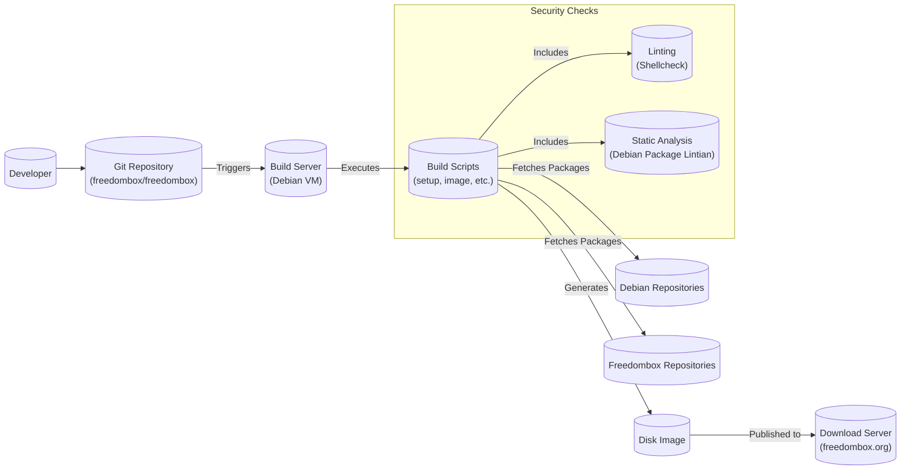

# BUSINESS POSTURE

Business Priorities and Goals:

*   Provide users with a private, secure, and easy-to-use personal server.
*   Empower users to control their own data and communications.
*   Promote decentralization and resist censorship.
*   Offer an alternative to centralized cloud services.
*   Build a sustainable and community-driven open-source project.
*   Maintain a user-friendly experience, even for non-technical users.
*   Ensure the system is extensible and adaptable to future needs.

Most Important Business Risks:

*   Compromise of user data and privacy due to security vulnerabilities.
*   System unavailability or instability, leading to user frustration and loss of trust.
*   Inability to keep up with evolving security threats and technological advancements.
*   Lack of adoption and community engagement, hindering project sustainability.
*   Legal or regulatory challenges related to data privacy and security.
*   Reputational damage due to security incidents or perceived lack of privacy.
*   Difficulty in maintaining a balance between security and usability.

# SECURITY POSTURE

Existing Security Controls:

*   security control: Debian-based operating system, providing a stable and secure foundation with regular security updates. (Described in the project's documentation and inherent in the choice of Debian).
*   security control: Automatic updates to ensure timely patching of security vulnerabilities. (Described in the project's documentation and implemented through Debian's unattended-upgrades).
*   security control: Use of HTTPS for secure communication between the user and the FreedomBox. (Described in the project's documentation and implemented through Let's Encrypt integration).
*   security control: Firewall to restrict network access to the FreedomBox. (Described in the project's documentation and implemented through `firewalld`).
*   security control: Access control mechanisms to limit user privileges and protect sensitive data. (Described in the project's documentation and implemented through Plinth's user management).
*   security control: Regular security audits and penetration testing (mentioned on the project website, details may vary).
*   security control: Sandboxing of applications to limit the impact of potential vulnerabilities. (Partially implemented through application-specific configurations and systemd features).
*   security control: Use of strong passwords and support for multi-factor authentication (2FA) (implemented in Plinth).

Accepted Risks:

*   accepted risk: Reliance on third-party applications and services, which may introduce their own security risks.
*   accepted risk: Potential for user misconfiguration, leading to security vulnerabilities.
*   accepted risk: Limited resources for comprehensive security testing and auditing.
*   accepted risk: The inherent complexity of securing a multi-purpose server environment.
*   accepted risk: The possibility of zero-day exploits affecting the underlying operating system or applications.

Recommended Security Controls:

*   Implement a comprehensive intrusion detection and prevention system (IDPS).
*   Enhance sandboxing capabilities using technologies like containers (e.g., Docker, Podman) or virtual machines.
*   Implement regular vulnerability scanning and penetration testing.
*   Provide more detailed security hardening guides and checklists for users.
*   Develop a formal security incident response plan.
*   Integrate Security-Enhanced Linux (SELinux) or AppArmor for mandatory access control.

Security Requirements:

*   Authentication:
    *   Strong password policies enforced.
    *   Support for multi-factor authentication (2FA) for all user accounts.
    *   Secure storage of user credentials (e.g., using salted hashing).
    *   Protection against brute-force attacks.
    *   Session management with secure timeouts and logout functionality.

*   Authorization:
    *   Role-based access control (RBAC) to restrict user privileges.
    *   Principle of least privilege applied throughout the system.
    *   Clear separation of duties for different user roles.
    *   Auditing of all access and authorization attempts.

*   Input Validation:
    *   All user inputs are validated and sanitized to prevent injection attacks (e.g., SQL injection, cross-site scripting).
    *   Use of whitelisting rather than blacklisting for input validation.
    *   Proper encoding of output to prevent cross-site scripting (XSS).
    *   Protection against other common web vulnerabilities (e.g., CSRF, command injection).

*   Cryptography:
    *   Use of strong, industry-standard cryptographic algorithms and protocols.
    *   Secure key management practices.
    *   Encryption of sensitive data at rest and in transit.
    *   Regular review and update of cryptographic configurations.
    *   HTTPS with HSTS (HTTP Strict Transport Security).

# DESIGN

## C4 CONTEXT

```mermaid
graph LR
    subgraph FreedomBox System
        freedombox["FreedomBox"]
    end

    User((User)))
    User -- Access web interface, SSH, etc. --> freedombox
    Internet((Internet)))
    freedombox -- Provides services to --> Internet
    freedombox -- Retrieves updates from --> DebianRepos[("Debian Repositories")]
    freedombox -- Sends/Receives emails via --> EmailServers[("Email Servers")]
    freedombox -- Retrieves/Publishes data to --> Federation[("Federated Services\n(e.g., Matrix, XMPP)")]

```

Element List:

*   Element:
    *   Name: User
    *   Type: Person
    *   Description: A person who interacts with FreedomBox.
    *   Responsibilities: Accesses services provided by FreedomBox, manages their data and settings.
    *   Security controls: Strong passwords, 2FA, secure browsing practices.

*   Element:
    *   Name: FreedomBox
    *   Type: Software System
    *   Description: The core software system providing a private server environment.
    *   Responsibilities: Hosting applications, managing user accounts, providing network services, ensuring security and privacy.
    *   Security controls: Firewall, automatic updates, HTTPS, access control, application sandboxing (partial).

*   Element:
    *   Name: Internet
    *   Type: External System
    *   Description: The global network of interconnected computers.
    *   Responsibilities: Provides connectivity for FreedomBox to access external resources and for users to access FreedomBox.
    *   Security controls: Standard Internet security protocols (e.g., TLS/SSL).

*   Element:
    *   Name: Debian Repositories
    *   Type: External System
    *   Description: Servers hosting Debian software packages.
    *   Responsibilities: Providing software updates and new packages to FreedomBox.
    *   Security controls: Package signing, secure repository access (HTTPS).

*   Element:
    *   Name: Email Servers
    *   Type: External System
    *   Description: Servers used for sending and receiving emails.
    *   Responsibilities: Handling email communication for FreedomBox users.
    *   Security controls: Standard email security protocols (e.g., TLS/SSL, SPF, DKIM, DMARC).

*   Element:
    *   Name: Federated Services
    *   Type: External System
    *   Description: Distributed services that FreedomBox can interact with (e.g., Matrix, XMPP).
    *   Responsibilities: Providing decentralized communication and data sharing capabilities.
    *   Security controls: Federation protocols, encryption, access control mechanisms specific to each service.

## C4 CONTAINER

```mermaid
graph LR
    subgraph FreedomBox System
        User((User)))
        Internet((Internet)))

        subgraph FreedomBox
            WebUI[("Web Interface\n(Plinth)")]
            Apps[("Applications\n(e.g., Matrix, Nextcloud)")]
            SystemServices[("System Services\n(e.g., SSH, DNS, Firewall)")]
            Database[(Database)]

            WebUI -- Uses --> Apps
            Apps -- Uses --> SystemServices
            Apps -- Stores data in --> Database
        end

        User -- HTTPS --> WebUI
        User -- SSH --> SystemServices
        Apps -- Network Requests --> Internet
    end

```

Element List:

*   Element:
    *   Name: Web Interface (Plinth)
    *   Type: Web Application
    *   Description: The primary user interface for managing FreedomBox.
    *   Responsibilities: Providing a user-friendly interface for configuring applications and system settings, managing user accounts, displaying system status.
    *   Security controls: HTTPS, authentication, authorization, input validation, session management.

*   Element:
    *   Name: Applications
    *   Type: Web Applications / Services
    *   Description: Various applications hosted on FreedomBox (e.g., Matrix, Nextcloud, file sharing, email).
    *   Responsibilities: Providing specific functionalities to users (e.g., chat, file storage, email).
    *   Security controls: Application-specific security measures, sandboxing (partial), regular updates.

*   Element:
    *   Name: System Services
    *   Type: Services
    *   Description: Core system services required for FreedomBox operation (e.g., SSH, DNS, Firewall).
    *   Responsibilities: Providing network connectivity, security, and other essential functions.
    *   Security controls: Firewall rules, secure configuration, regular updates, SSH key authentication.

*   Element:
    *   Name: Database
    *   Type: Database
    *   Description: Stores data for applications and system configuration.
    *   Responsibilities: Persistently storing data, ensuring data integrity and availability.
    *   Security controls: Access control, encryption (if applicable), regular backups.

*   Element:
    *   Name: User
    *   Type: Person
    *   Description: A person who interacts with FreedomBox.
    *   Responsibilities: Accesses services provided by FreedomBox, manages their data and settings.
    *   Security controls: Strong passwords, 2FA, secure browsing practices.

*   Element:
    *   Name: Internet
    *   Type: External System
    *   Description: The global network of interconnected computers.
    *   Responsibilities: Provides connectivity for FreedomBox to access external resources and for users to access FreedomBox.
    *   Security controls: Standard Internet security protocols (e.g., TLS/SSL).

## DEPLOYMENT

Possible Deployment Solutions:

1.  Physical Hardware (e.g., Raspberry Pi, other single-board computers): This is the most common and recommended deployment method.
2.  Virtual Machine (on a local computer or a cloud provider): Offers flexibility but may require more technical expertise.
3.  Cloud-based image (on platforms like AWS, Azure, GCP): Less common, but possible for users who prefer cloud hosting.

Chosen Deployment Solution (Detailed Description): Physical Hardware (Raspberry Pi 4)

```mermaid
graph LR
    subgraph Deployment Environment
        subgraph Raspberry Pi 4
            subgraph FreedomBox OS
                subgraph Containers
                    Plinth[("Plinth Container")]
                    App1[("App 1 Container")]
                    App2[("App 2 Container")]
                end
                Firewall[("Firewall\n(firewalld)")]
                OS[("Debian OS")]
            end
            SDCard[("SD Card\n(Storage)")]
        end
        Router[("Router/Firewall")]
        Internet((Internet)))
    end

    Router -- Forwards Ports --> Firewall
    Firewall -- Allows Traffic --> OS
    OS -- Runs --> Containers
    Containers -- Store Data --> SDCard
    Internet -- Connects to --> Router

```

Element List:

*   Element:
    *   Name: Raspberry Pi 4
    *   Type: Hardware
    *   Description: A single-board computer used to host FreedomBox.
    *   Responsibilities: Providing the physical computing resources for FreedomBox.
    *   Security controls: Physical security of the device.

*   Element:
    *   Name: FreedomBox OS
    *   Type: Operating System
    *   Description: A customized Debian-based operating system for FreedomBox.
    *   Responsibilities: Managing hardware resources, running applications, providing a secure environment.
    *   Security controls: Debian security features, automatic updates, firewall.

*   Element:
    *   Name: Containers
    *   Type: Containerization Technology
    *   Description: Used to isolate applications and improve security (future implementation).
    *   Responsibilities: Running applications in isolated environments.
    *   Security controls: Container security best practices, resource limits, image signing.

*   Element:
    *   Name: Plinth Container
    *   Type: Container
    *   Description: Container for the Plinth web interface.
    *   Responsibilities: Running the Plinth web application.
    *   Security controls: Container-specific security measures.

*   Element:
    *   Name: App 1 Container
    *   Type: Container
    *   Description: Example container for an application.
    *   Responsibilities: Running a specific application.
    *   Security controls: Container-specific security measures.

*   Element:
    *   Name: App 2 Container
    *   Type: Container
    *   Description: Example container for another application.
    *   Responsibilities: Running a specific application.
    *   Security controls: Container-specific security measures.

*   Element:
    *   Name: Firewall (firewalld)
    *   Type: Software
    *   Description: Controls network access to FreedomBox.
    *   Responsibilities: Blocking unauthorized network connections.
    *   Security controls: Firewall rules, regular updates.

*   Element:
    *   Name: Debian OS
    *   Type: Operating System
    *   Description: The base operating system.
    *   Responsibilities: Managing hardware and software resources.
    *   Security controls: Debian's built-in security features.

*   Element:
    *   Name: SD Card (Storage)
    *   Type: Hardware
    *   Description: Stores the operating system, applications, and user data.
    *   Responsibilities: Providing persistent storage.
    *   Security controls: Data encryption (optional).

*   Element:
    *   Name: Router/Firewall
    *   Type: Hardware/Software
    *   Description: The user's home router, providing network connectivity and basic firewall protection.
    *   Responsibilities: Connecting FreedomBox to the Internet, providing initial network security.
    *   Security controls: Router's built-in firewall, secure configuration.

*   Element:
    *   Name: Internet
    *   Type: External System
    *   Description: The global network of interconnected computers.
    *   Responsibilities: Provides connectivity for FreedomBox to access external resources and for users to access FreedomBox.
    *   Security controls: Standard Internet security protocols (e.g., TLS/SSL).

## BUILD

The FreedomBox build process involves creating disk images for various hardware platforms. While the repository doesn't use a traditional CI system like Jenkins or GitHub Actions for publicly distributing builds, it does have scripts and tools for automating the image creation process. The process is primarily driven by scripts within the repository, executed in a controlled environment.



Build Process Description:

1.  Developers contribute code to the Git repository.
2.  A build server (typically a Debian virtual machine) is set up with the necessary tools and dependencies.
3.  Build scripts (e.g., `setup`, `image`) within the repository are executed.
4.  These scripts fetch packages from Debian and Freedombox repositories.
5.  The scripts perform various tasks, including:
    *   Setting up the target environment (e.g., creating a chroot).
    *   Installing required packages.
    *   Configuring system settings.
    *   Building FreedomBox-specific packages (e.g., Plinth).
    *   Creating a disk image.
6.  Security checks are integrated into the build process:
    *   Linting (e.g., Shellcheck) to identify potential issues in shell scripts.
    *   Static analysis (e.g., Debian package lintian) to check for package quality and security issues.
7.  The resulting disk image is then typically tested and published to a download server.

Security Controls in Build Process:

*   security control: Use of a controlled build environment (Debian VM) to minimize the risk of contamination.
*   security control: Reliance on official Debian repositories for base packages, ensuring package integrity through cryptographic signatures.
*   security control: Use of build scripts to automate the process and reduce manual errors.
*   security control: Integration of linting (Shellcheck) to catch potential scripting errors.
*   security control: Use of static analysis tools (lintian) to identify potential packaging issues.
*   security control: (Potentially) Code signing of FreedomBox-specific packages. (Needs verification from the repository).

# RISK ASSESSMENT

Critical Business Processes to Protect:

*   User data privacy and confidentiality.
*   System availability and stability.
*   Integrity of the FreedomBox software and configuration.
*   User authentication and authorization.
*   Secure communication channels (HTTPS, encrypted email, etc.).
*   Reputation and trustworthiness of the FreedomBox project.

Data to Protect and Sensitivity:

*   User credentials (passwords, usernames, API keys): High sensitivity.
*   Personal data stored within applications (emails, files, contacts, messages): High sensitivity.
*   System configuration files: Medium sensitivity.
*   Application logs: Medium sensitivity (may contain sensitive information).
*   Network traffic metadata: Medium sensitivity.
*   Public keys: Low sensitivity.

# QUESTIONS & ASSUMPTIONS

Questions:

*   What is the specific process for handling security vulnerabilities reported by users or researchers?
*   Are there any plans to implement more comprehensive sandboxing using containers or VMs?
*   What are the specific procedures for security audits and penetration testing?
*   How are FreedomBox-specific packages signed and verified?
*   What is the long-term strategy for managing the increasing complexity of securing a multi-purpose server?
*   What mechanisms are in place to detect and respond to intrusions?
*   Is there a dedicated security team or individual responsible for security oversight?
*   How is user data backed up and restored, and what security measures are in place for backups?
*   What are the specific legal and regulatory requirements that FreedomBox aims to comply with?

Assumptions:

*   BUSINESS POSTURE: The primary goal is to provide a secure and private personal server for non-technical users. The project prioritizes user privacy and data ownership over extensive features or enterprise-level scalability.
*   SECURITY POSTURE: The project follows security best practices where possible, but may have limited resources for advanced security measures. Users are expected to take some responsibility for securing their own devices and networks.
*   DESIGN: The system is designed to be modular and extensible, allowing for the addition of new applications and features. The core components are based on well-established open-source technologies. The build process is automated but may not use a publicly accessible CI/CD pipeline.