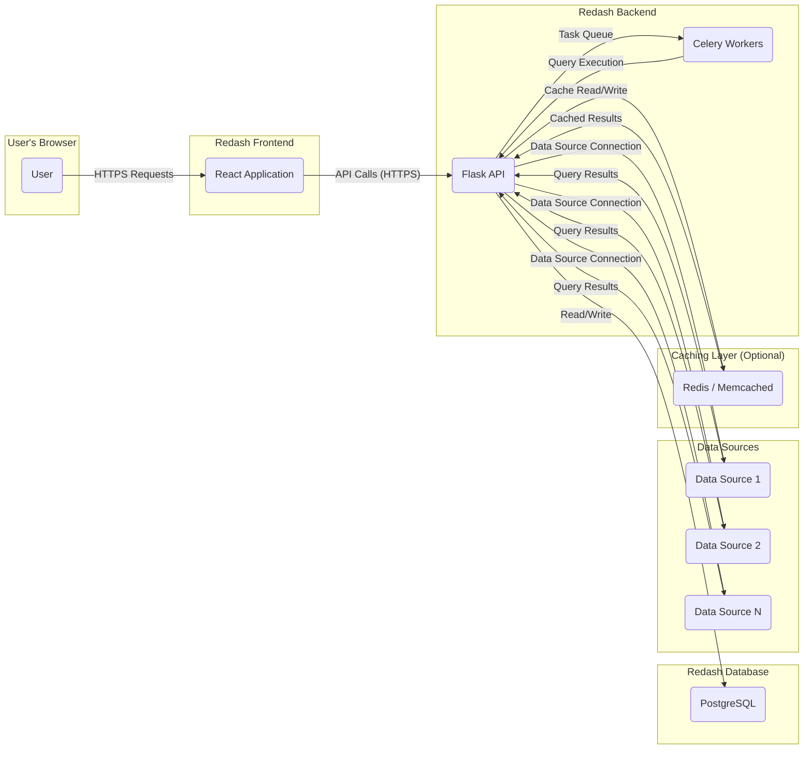

# Project Design Document: Redash

**Version:** 1.1
**Date:** October 26, 2023
**Author:** AI Software Architect

## 1. Introduction

This document provides an enhanced overview of the Redash project's architecture. Redash is an open-source platform enabling users to connect to various data sources, construct dashboards, and share visualizations. This detailed design serves as the foundational document for subsequent threat modeling activities, providing a comprehensive understanding of the system's components and interactions.

## 2. Goals

* Deliver a clear and concise description of the Redash architecture, suitable for security analysis.
* Precisely identify key components, their responsibilities, and their interactions within the system.
* Clearly illustrate critical data flows, highlighting potential points of interest for security assessment.
* Detail the technologies and dependencies involved in the Redash platform.
* Act as the definitive basis for identifying potential security threats, vulnerabilities, and attack vectors.

## 3. Non-Goals

* In-depth design specifications for individual features or modules within Redash.
* Granular infrastructure provisioning or deployment procedures beyond a high-level architectural context.
* Detailed performance tuning or optimization strategies.
* Specific code implementation details or algorithms.

## 4. Architecture Overview

Redash adopts a standard web application architecture, comprising a frontend user interface for user interaction, a backend API to handle business logic, and a persistent data store for application data. Asynchronous tasks are managed by background workers. The core functionality centers around establishing connections to diverse data sources, executing user-defined queries, and presenting the results through interactive visualizations and dashboards.

## 5. Component Details

* **Frontend (Web Application):**
    * **Description:** The user-facing interface for Redash, facilitating user interaction with the platform. Implemented using React.
    * **Responsibilities:**
        * Managing user authentication and authorization processes.
        * Enabling the creation and administration of data source connections.
        * Providing an interface for writing and executing data queries.
        * Facilitating the construction and management of dashboards and visualizations.
        * Handling user account management and administrative functions.
    * **Technology:** React, JavaScript, HTML, CSS.

* **Backend (API):**
    * **Description:** A RESTful API serving as the core logic layer, processing requests from the frontend and orchestrating interactions with the database and connected data sources. Built using Python with the Flask framework.
    * **Responsibilities:**
        * Exposing and managing API endpoints for all frontend communications.
        * Handling the execution and management of user-defined queries.
        * Managing connections to various configured data sources.
        * Enforcing user and permission management policies.
        * Managing the creation and retrieval of dashboards and visualizations.
        * Implementing alerting and scheduled task functionalities.
    * **Technology:** Python, Flask, Celery (for asynchronous task processing), potentially various Python database connector libraries.

* **Database:**
    * **Description:** The persistent data store for Redash metadata, including user credentials, data source connection details, query definitions, dashboard configurations, visualization specifications, and alert rules.
    * **Responsibilities:**
        * Providing persistent storage for all Redash application-specific data.
        * Ensuring the integrity and availability of stored data.
    * **Technology:** PostgreSQL (the default and recommended choice), with potential support for other relational databases through configuration.

* **Background Workers:**
    * **Description:**  Processes asynchronous and deferred tasks, such as executing data queries against external sources, refreshing dashboard data, and dispatching configured alerts.
    * **Responsibilities:**
        * Offloading computationally intensive and time-consuming tasks from the main API process to improve responsiveness.
        * Scheduling and executing recurring tasks based on defined intervals.
    * **Technology:** Celery, utilizing a message broker such as Redis or RabbitMQ for task queuing and distribution.

* **Data Sources:**
    * **Description:** External systems, including databases, APIs, and cloud services, that Redash connects to in order to retrieve and visualize data.
    * **Responsibilities:**
        * Providing data to Redash in response to executed queries.
        * Managing authentication and authorization for data access.
    * **Technology:**  Varies significantly depending on the specific data source (e.g., PostgreSQL, MySQL, BigQuery, RESTful APIs, cloud-specific services). Redash employs specialized connectors and drivers for each data source type.

* **Caching Layer (Optional but Highly Recommended):**
    * **Description:** An optional caching mechanism used to store the results of frequently executed queries, thereby reducing the load on data sources and improving response times.
    * **Responsibilities:**
        * Enhancing performance by serving pre-computed query results.
        * Reducing the frequency of direct queries to data sources.
    * **Technology:** Redis or Memcached are commonly used implementations for the caching layer.

## 6. Data Flow

**Detailed Data Flow Description:**

* **User Interaction:** A user initiates an action within the Redash frontend via their web browser (e.g., creating a query, running a dashboard). Communication is secured via HTTPS.
* **Frontend API Requests:** The React application sends API requests over HTTPS to the backend Flask API to handle user actions.
* **Backend Processing & Data Storage:** The Flask API receives the requests and performs necessary operations:
    * **Metadata Operations:**  For actions involving Redash metadata (e.g., saving a dashboard, creating a user), the API interacts with the PostgreSQL database for read and write operations.
    * **Asynchronous Task Delegation:** For long-running tasks like query execution or dashboard refreshes, the API enqueues tasks to the Celery workers via the message broker.
* **Background Task Execution:** Celery workers retrieve tasks from the queue and execute them. A primary task is executing queries against configured data sources.
* **Data Source Interaction:**  The backend API or Celery workers establish connections to the specified data sources using the stored connection credentials and execute the user-defined queries.
* **Result Retrieval:** Data sources return the query results to the initiating backend component (API or worker).
* **Optional Caching:** The backend may interact with the caching layer (Redis or Memcached) to store the query results. Subsequent requests for the same query may retrieve results from the cache, bypassing the data source.
* **Response to Frontend:** The backend API sends the results of the operation (e.g., query results, dashboard data) back to the frontend application.
* **Display to User:** The React application renders the received data and visualizations within the user's browser.

## 7. Security Considerations (Focused on Threat Modeling)

This section highlights key security considerations relevant for threat modeling, focusing on potential vulnerabilities and attack vectors:

* **Authentication and Authorization Vulnerabilities:**
    * **Threat:** Brute-force attacks against login forms.
    * **Threat:** Weak or default credentials.
    * **Threat:** Circumvention of authentication mechanisms.
    * **Threat:** Insufficient authorization controls allowing users to access or modify resources beyond their privileges (e.g., accessing other users' data sources or queries).
* **Data Source Credential Management Risks:**
    * **Threat:** Storage of data source credentials in plaintext or using weak encryption.
    * **Threat:** Unauthorized access to stored credentials leading to data breaches in connected systems.
    * **Threat:** Injection vulnerabilities in data source connection configuration allowing attackers to inject malicious connection strings.
* **Input Validation and Injection Attacks:**
    * **Threat:** SQL injection vulnerabilities in query execution if user-provided input is not properly sanitized.
    * **Threat:** Cross-site scripting (XSS) vulnerabilities in dashboards or visualizations, allowing attackers to inject malicious scripts into the frontend.
    * **Threat:** Command injection vulnerabilities if Redash processes user-provided input to execute system commands.
* **Query Security and Data Access Control:**
    * **Threat:** Users with overly broad data access permissions querying sensitive data they shouldn't access.
    * **Threat:** Malicious queries designed to overload or crash data sources (Denial of Service).
    * **Threat:** Data exfiltration through crafted queries.
* **Network Security Weaknesses:**
    * **Threat:** Man-in-the-middle attacks if HTTPS is not properly implemented or configured.
    * **Threat:** Exposure of internal Redash components if network segmentation is insufficient.
    * **Threat:** Vulnerabilities in underlying operating systems or network services.
* **Cross-Site Request Forgery (CSRF):**
    * **Threat:** Attackers tricking authenticated users into performing unintended actions on the Redash platform.
* **Data Encryption Deficiencies:**
    * **Threat:** Sensitive data at rest in the database (e.g., user credentials, API keys) being compromised if encryption is not implemented or is weak.
    * **Threat:** Sensitive data in transit not being encrypted, leading to potential interception.
* **Logging and Auditing Gaps:**
    * **Threat:** Insufficient logging making it difficult to detect and respond to security incidents.
    * **Threat:** Tampering with or deletion of audit logs.
* **Dependency Vulnerabilities:**
    * **Threat:** Exploitation of known vulnerabilities in third-party libraries and frameworks used by Redash.

## 8. Deployment Model (Common Scenarios)

Redash is typically deployed using one of the following models, each with its own security implications:

* **Single Server Deployment:** All components (frontend, backend, database, workers) are co-located on a single server. This model simplifies deployment but can increase the attack surface if the server is compromised.
* **Containerized Deployment (Docker/Kubernetes):** Components are packaged into Docker containers and orchestrated using tools like Docker Compose or Kubernetes. This model offers better isolation and scalability but introduces security considerations related to container image management and orchestration platform security.
* **Cloud-Based Deployment:** Redash is deployed on cloud platforms (e.g., AWS, Azure, GCP) leveraging managed services for databases, container orchestration, and other infrastructure components. This model offers scalability and reliability but requires careful configuration of cloud security controls and IAM policies.

## 9. Technologies Used

* **Primary Programming Languages:** Python, JavaScript
* **Frontend Framework:** React
* **Backend Framework:** Flask (Python)
* **Asynchronous Task Queue:** Celery
* **Message Broker (for Celery):** Redis or RabbitMQ
* **Database (Default):** PostgreSQL
* **Optional Caching Technologies:** Redis or Memcached
* **Web Server (Production):** Typically Gunicorn or uWSGI (Python WSGI servers) behind a reverse proxy like Nginx.

This enhanced design document provides a more detailed and security-focused understanding of the Redash project's architecture. It serves as a crucial input for conducting thorough threat modeling and identifying appropriate security controls.