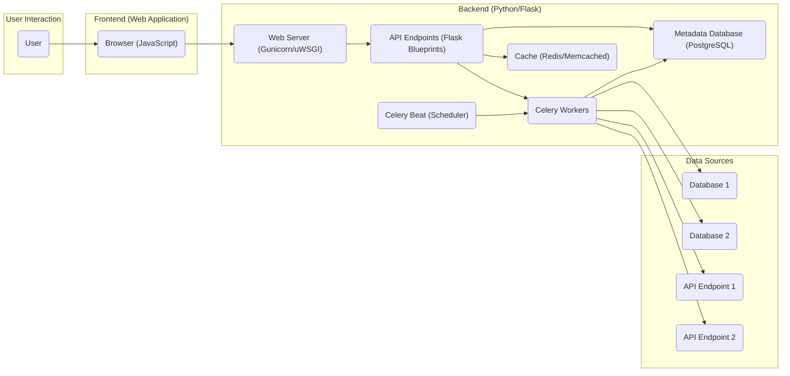
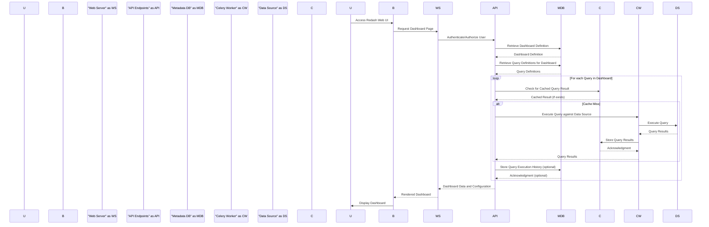

# Project Design Document: Redash

**Version:** 1.1
**Date:** October 26, 2023
**Author:** AI Software Architect

## 1. Introduction

This document provides a detailed architectural design of the Redash project, an open-source data visualization and dashboarding tool. This document serves as a foundation for understanding the system's components, interactions, and data flows, which is crucial for subsequent threat modeling activities.

### 1.1. Purpose

The primary purpose of this document is to outline the architecture of Redash in a clear and comprehensive manner. This will enable security professionals to effectively identify potential threats and vulnerabilities within the system.

### 1.2. Scope

This document covers the core components and functionalities of Redash, including its web application, API, background workers, and interactions with external data sources. It focuses on the logical architecture and key data flows involved in common user operations.

### 1.3. Target Audience

This document is intended for:

*   Security engineers and architects responsible for threat modeling and security assessments.
*   Development teams involved in maintaining and extending Redash.
*   Operations teams responsible for deploying and managing Redash instances.

## 2. High-Level Architecture

Redash follows a typical web application architecture with a backend API, background workers, and a frontend user interface.

## 3. Component Details

This section provides a detailed description of each major component within the Redash architecture.

### 3.1. Frontend (Web Application)

*   **Description:** The user interface of Redash, typically built using JavaScript frameworks. It resides in the user's browser and handles user interactions, renders dashboards and visualizations, and communicates with the backend API via HTTP requests.
*   **Responsibilities:**
    *   Presenting interactive data visualizations (charts, tables, maps).
    *   Providing interfaces for creating and editing queries using various data source-specific languages (e.g., SQL).
    *   Enabling users to design and arrange dashboards.
    *   Managing user sessions and presenting the application's state.
    *   Handling user authentication flows (login, logout).
*   **Key Technologies:** JavaScript, HTML, CSS, potentially React, Redux, or similar frameworks, charting libraries (e.g., Chart.js, D3.js).

### 3.2. Backend (Python/Flask)

*   **Description:** The core application logic of Redash, built using the Python Flask framework. It exposes RESTful API endpoints for the frontend and manages asynchronous background tasks via Celery.
*   **Responsibilities:**
    *   Authenticating users and authorizing access to resources based on roles and permissions.
    *   Receiving and validating API requests from the frontend.
    *   Managing connections to various data sources, securely storing connection details.
    *   Orchestrating the execution of queries against data sources.
    *   Scheduling and managing background tasks such as refreshing dashboard data and sending alerts.
    *   Storing and retrieving metadata about users, data sources, queries, dashboards, and alerts.
    *   Implementing business logic for features like query sharing, permissions management, and alert configuration.
*   **Key Technologies:** Python, Flask, Flask-RESTful (or similar for API development), SQLAlchemy (ORM for database interaction), Celery (distributed task queue), Redis or Memcached (for caching and Celery broker/backend), PostgreSQL (for storing application metadata).

#### 3.2.1. Web Server (Gunicorn/uWSGI)

*   **Description:** A production-ready WSGI server that sits in front of the Flask application. It handles incoming HTTP requests, manages worker processes, and provides a more robust and scalable deployment environment compared to Flask's built-in development server.
*   **Responsibilities:**
    *   Receiving HTTP requests from the frontend (typically via a reverse proxy like Nginx).
    *   Spawning and managing multiple worker processes to handle concurrent requests.
    *   Load balancing requests across worker processes.
    *   Serving static files (e.g., JavaScript, CSS, images).

#### 3.2.2. API Endpoints (Flask Blueprints)

*   **Description:**  Organized sets of API routes within the Flask application, structured using Flask Blueprints. Each blueprint typically handles a specific domain of functionality. Examples include:
    *   `QueriesBlueprint`: Manages the creation, execution, and retrieval of queries.
    *   `DashboardsBlueprint`: Handles operations related to dashboards, such as creation, modification, and fetching.
    *   `DataSourcesBlueprint`: Manages the configuration and testing of data source connections.
    *   `UsersBlueprint`: Handles user authentication, authorization, and profile management.
    *   `AlertsBlueprint`: Manages the creation, modification, and triggering of alerts.
*   **Responsibilities:**
    *   Defining API endpoints using specific HTTP methods (GET, POST, PUT, DELETE).
    *   Implementing request validation and data sanitization.
    *   Interacting with the metadata database and other backend components to fulfill requests.
    *   Returning responses in JSON format, adhering to a consistent API structure.
    *   Enforcing authentication and authorization policies for each endpoint.

#### 3.2.3. Celery Beat (Scheduler)

*   **Description:** A component of Celery that runs periodically to schedule tasks for execution by the Celery workers. It reads a schedule configuration (often stored in the metadata database or a configuration file) and enqueues tasks at specified intervals.
*   **Responsibilities:**
    *   Triggering scheduled dashboard refreshes to keep visualizations up-to-date.
    *   Triggering scheduled alert evaluations to check if alert conditions are met.
    *   Potentially scheduling other periodic maintenance tasks, such as cleaning up old data or running reports.

#### 3.2.4. Celery Workers

*   **Description:** Independent processes that consume tasks from the Celery task queue and execute them asynchronously. This allows the web application to remain responsive by offloading time-consuming operations.
*   **Responsibilities:**
    *   Executing queries against configured data sources using the appropriate database drivers or API clients.
    *   Processing query results and potentially storing them in the cache.
    *   Refreshing dashboard data by re-running underlying queries.
    *   Evaluating alert conditions based on query results and sending notifications (e.g., email, Slack).
    *   Handling data source connection testing and validation.

#### 3.2.5. Cache (Redis/Memcached)

*   **Description:** An in-memory data store used for caching frequently accessed data to reduce database load and improve response times. Redash typically uses Redis or Memcached for this purpose.
*   **Responsibilities:**
    *   Caching the results of executed queries to avoid redundant database calls.
    *   Caching rendered dashboard data for faster loading.
    *   Potentially caching other frequently accessed metadata or configuration settings.
    *   Serving as a message broker for Celery in some deployment configurations.

#### 3.2.6. Metadata Database (PostgreSQL)

*   **Description:** A relational database (typically PostgreSQL) used to persist Redash's internal application data. This includes user information, data source configurations, query definitions, dashboard layouts, and alert settings.
*   **Responsibilities:**
    *   Storing user accounts, roles, and permissions.
    *   Storing connection details and credentials for configured data sources (ideally encrypted).
    *   Storing the definitions and metadata associated with saved queries.
    *   Storing the layout and configuration of dashboards.
    *   Storing alert definitions, notification settings, and execution history.
    *   Persisting application settings and configurations.

### 3.3. Data Sources

*   **Description:** External systems that Redash connects to for retrieving and visualizing data. Redash supports a wide range of data sources through its extensible architecture.
*   **Responsibilities:**
    *   Storing and managing the actual data that users want to analyze and visualize.
    *   Providing an interface (e.g., SQL, API) for Redash to query and retrieve data.
    *   Authenticating and authorizing Redash's access based on provided credentials.
*   **Examples:** PostgreSQL, MySQL, Amazon Redshift, Google BigQuery, Snowflake, various REST APIs, Elasticsearch, MongoDB.

## 4. Data Flow

This section describes the typical data flow for a common user interaction: creating and viewing a dashboard.

## 5. Security Considerations

This section outlines security considerations based on the architecture. A more detailed threat model will build upon these points.

*   **Authentication and Authorization:**
    *   Ensure strong password policies and consider multi-factor authentication.
    *   Implement robust role-based access control (RBAC) to manage permissions for users and groups.
    *   Securely manage API keys and tokens used for authentication.
*   **Data Source Credentials Management:**
    *   Encrypt data source credentials stored in the metadata database using strong encryption algorithms.
    *   Implement secure methods for providing and managing credentials, avoiding storing them in plain text in configuration files.
    *   Consider using secrets management solutions for storing and accessing sensitive credentials.
*   **Input Validation:**
    *   Thoroughly validate all user inputs on both the frontend and backend to prevent injection attacks (e.g., SQL injection, cross-site scripting).
    *   Sanitize user-provided data before using it in queries or displaying it in the UI.
*   **Data Security in Transit:**
    *   Enforce HTTPS for all communication between the browser and the web server to encrypt sensitive data.
    *   Use secure connections (e.g., TLS/SSL) when connecting to data sources.
*   **Data Security at Rest:**
    *   Encrypt sensitive data stored in the metadata database, including data source credentials and potentially other sensitive information.
    *   Implement appropriate access controls and encryption for the cache.
*   **Rate Limiting:**
    *   Implement rate limits on API endpoints to prevent abuse and denial-of-service attacks.
    *   Consider different rate limits for authenticated and unauthenticated users.
*   **Dependency Management:**
    *   Regularly update all dependencies (Python packages, JavaScript libraries) to patch known security vulnerabilities.
    *   Use dependency scanning tools to identify and address vulnerabilities.
*   **Session Management:**
    *   Use secure session cookies with appropriate flags (e.g., HttpOnly, Secure).
    *   Implement session timeouts and consider mechanisms for invalidating sessions.
*   **Content Security Policy (CSP):**
    *   Implement a strict Content Security Policy to mitigate cross-site scripting (XSS) attacks by controlling the sources from which the browser is allowed to load resources.
*   **Regular Security Audits and Penetration Testing:**
    *   Conduct regular security audits and penetration testing to proactively identify and address potential vulnerabilities in the application and infrastructure.
*   **Logging and Monitoring:**
    *   Implement comprehensive logging to track user activity, API requests, and potential security events.
    *   Set up monitoring and alerting for suspicious activity.
*   **Protection against Common Web Attacks:**
    *   Implement measures to protect against common web application vulnerabilities such as CSRF (Cross-Site Request Forgery), clickjacking, and others.

## 6. Deployment Considerations

Redash can be deployed in various environments, each with its own security implications:

*   **Self-hosted (On-premises or Cloud VMs):**
    *   Requires careful configuration and management of the underlying operating system, network, and security settings.
    *   Security responsibilities are primarily on the deploying organization.
    *   Consider using security hardening best practices for the operating system and web server.
*   **Containerized (Docker, Kubernetes):**
    *   Provides isolation and portability but requires securing the container runtime and orchestration platform.
    *   Implement security best practices for container images, registries, and network policies.
    *   Utilize Kubernetes security features like Network Policies, RBAC, and Pod Security Policies (or Pod Security Admission).
*   **Managed Services:**
    *   Offloads some security responsibilities to the cloud provider.
    *   Leverage the security features and compliance certifications offered by the managed service provider.
    *   Understand the shared responsibility model and ensure proper configuration of the managed Redash instance.

Deployment choices significantly impact the attack surface and the security controls that need to be implemented. For instance, exposing Redash directly to the internet requires robust authentication, authorization, and protection against web attacks. Deploying within a private network reduces the external attack surface but still necessitates internal security measures.

## 7. Technologies Used

This is a summary of the key technologies involved in the Redash project.

*   **Programming Languages:** Python, JavaScript
*   **Web Framework:** Flask
*   **Task Queue:** Celery
*   **Caching:** Redis or Memcached
*   **Metadata Database:** PostgreSQL
*   **WSGI Server:** Gunicorn or uWSGI
*   **Frontend Libraries/Frameworks:** Likely React or similar
*   **Database ORM:** SQLAlchemy
*   **API Development:** Flask-RESTful or similar

This document provides a more detailed and improved overview of the Redash architecture, providing a stronger foundation for a thorough threat modeling exercise. The enhanced component descriptions, refined data flow diagrams, and expanded security considerations offer a more comprehensive understanding of the system's inner workings and potential vulnerabilities.