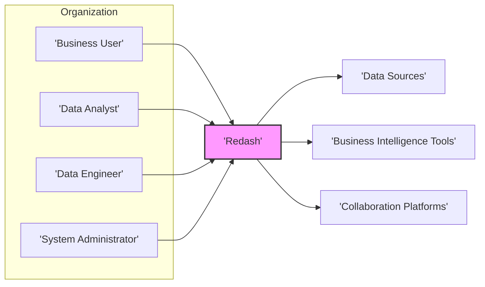
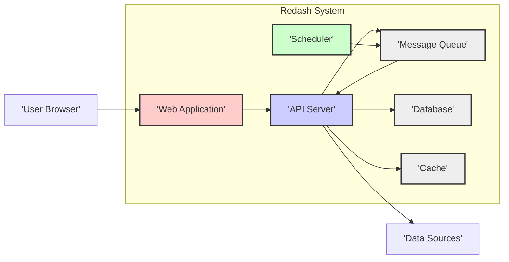
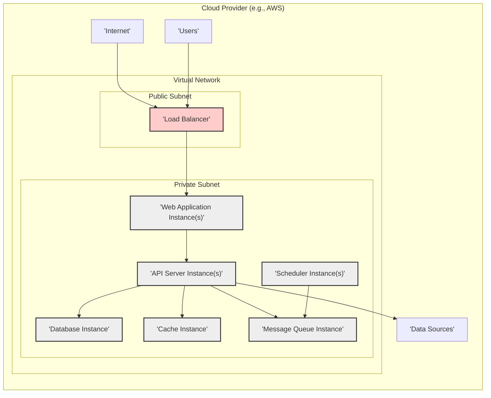

# BUSINESS POSTURE

Redash is a data visualization and dashboarding platform designed to enable organizations to become data-driven. It aims to democratize data access by allowing users to connect to various data sources, create visualizations, build dashboards, and share insights across teams.

Business Priorities and Goals:
- Enable data-driven decision-making across the organization.
- Provide self-service data exploration and visualization capabilities to non-technical users.
- Centralize data access and reporting from disparate data sources.
- Improve efficiency in data analysis and reporting processes.
- Facilitate data sharing and collaboration within teams and across the organization.

Business Risks:
- Data breaches and unauthorized access to sensitive data through the Redash platform.
- Data integrity issues due to vulnerabilities in data processing or visualization components.
- Availability disruptions impacting business operations reliant on Redash dashboards and reports.
- Compliance violations related to data privacy and security regulations if Redash is not properly secured.
- Misleading or inaccurate insights derived from Redash due to data quality issues or misconfigurations.

# SECURITY POSTURE

Existing Security Controls:
- security control: HTTPS for web traffic encryption. (Standard practice for web applications)
- security control: Authentication mechanisms for user login. (Likely username/password, potentially integration with other providers)
- security control: Authorization model to control access to data sources, queries, and dashboards. (Role-based access control is expected)
- security control: Input validation on user-provided data, such as query parameters and form inputs. (General web application security practice)
- security control: Secure software development lifecycle practices, including code reviews and testing. (Common in open-source projects, but level of rigor can vary)
- security control: Regular security updates and patching of dependencies. (Essential for maintaining security posture)
- accepted risk: Potential vulnerabilities in third-party libraries and components. (Open-source projects rely on many dependencies)
- accepted risk: Risk of misconfiguration by users leading to security weaknesses. (Users have flexibility in configuration)

Recommended Security Controls:
- security control: Implement multi-factor authentication (MFA) for user accounts to enhance login security.
- security control: Integrate with centralized identity providers (e.g., SAML, OAuth 2.0) for enterprise-grade authentication and single sign-on (SSO).
- security control: Implement robust input validation and sanitization to prevent injection attacks (SQL injection, XSS).
- security control: Regularly perform penetration testing and vulnerability scanning to identify and remediate security weaknesses.
- security control: Implement security information and event management (SIEM) or logging and monitoring to detect and respond to security incidents.
- security control: Data encryption at rest for sensitive data stored within Redash database.
- security control: Implement rate limiting and request throttling to protect against denial-of-service attacks.
- security control: Establish a security incident response plan to handle security breaches effectively.
- security control: Conduct security awareness training for Redash users and administrators.

Security Requirements:
- Authentication:
    - requirement: Secure authentication mechanism to verify user identity.
    - requirement: Support for strong passwords and password complexity policies.
    - requirement: Option for multi-factor authentication (MFA).
    - requirement: Integration with enterprise identity providers (e.g., Active Directory, Okta) via SAML or OAuth 2.0.
    - requirement: Session management to control user session duration and prevent session hijacking.
- Authorization:
    - requirement: Role-based access control (RBAC) to manage user permissions.
    - requirement: Granular access control to data sources, queries, dashboards, and other resources.
    - requirement: Ability to define custom roles and permissions based on organizational needs.
    - requirement: Audit logging of authorization decisions and access attempts.
- Input Validation:
    - requirement: Comprehensive input validation for all user-provided data.
    - requirement: Sanitization of user inputs to prevent injection attacks (SQL, XSS, etc.).
    - requirement: Use of parameterized queries or prepared statements to prevent SQL injection.
    - requirement: Validation of file uploads to prevent malicious file uploads.
- Cryptography:
    - requirement: Encryption of sensitive data at rest (e.g., database encryption).
    - requirement: Encryption of data in transit using HTTPS for all web communication.
    - requirement: Secure storage and management of cryptographic keys.
    - requirement: Use of strong and up-to-date cryptographic algorithms and protocols.

# DESIGN

## C4 CONTEXT

Context Diagram Elements:

- Name: Business User
    - Type: Person
    - Description: Business users who consume dashboards and reports created in Redash to gain insights and make data-driven decisions.
    - Responsibilities: View dashboards, explore data visualizations, and share insights with colleagues.
    - Security controls: Authentication to access Redash, authorization to view specific dashboards and data.

- Name: Data Analyst
    - Type: Person
    - Description: Data analysts who use Redash to create queries, build visualizations, and design dashboards for business users.
    - Responsibilities: Connect to data sources, write queries, create visualizations, build dashboards, and share them with business users.
    - Security controls: Authentication to access Redash, authorization to access data sources and create/manage queries and dashboards.

- Name: Data Engineer
    - Type: Person
    - Description: Data engineers responsible for managing data infrastructure, data pipelines, and ensuring data availability and quality for Redash.
    - Responsibilities: Configure data source connections, manage data source permissions, and potentially optimize data queries for Redash.
    - Security controls: Authentication to access Redash, authorization to manage data sources and connections, potentially manage user permissions.

- Name: System Administrator
    - Type: Person
    - Description: System administrators responsible for installing, configuring, and maintaining the Redash platform.
    - Responsibilities: Install and configure Redash, manage users and permissions, monitor system performance, and ensure system security.
    - Security controls: Authentication to access Redash administration interface, authorization to manage system settings and users, access to server infrastructure.

- Name: Redash
    - Type: Software System
    - Description: The Redash platform itself, providing data visualization and dashboarding capabilities.
    - Responsibilities: Connect to various data sources, execute queries, render visualizations, manage dashboards, handle user authentication and authorization, and provide API access.
    - Security controls: Authentication, authorization, input validation, data encryption in transit (HTTPS), potentially data encryption at rest, security logging and monitoring.

- Name: Data Sources
    - Type: External System
    - Description: Various databases, data warehouses, APIs, and other data sources that Redash connects to for querying and data retrieval. Examples include PostgreSQL, MySQL, Snowflake, BigQuery, REST APIs.
    - Responsibilities: Store and provide access to organizational data.
    - Security controls: Data source specific security controls (authentication, authorization, encryption), network security to control access from Redash.

- Name: Business Intelligence Tools
    - Type: External System
    - Description: Other BI tools or platforms that might be used alongside Redash or consume data from Redash.
    - Responsibilities: Provide alternative or complementary data analysis and visualization capabilities.
    - Security controls: Tool-specific security controls, API security if interacting with Redash.

- Name: Collaboration Platforms
    - Type: External System
    - Description: Platforms like Slack, Microsoft Teams, email, etc., used for sharing Redash dashboards and reports.
    - Responsibilities: Facilitate communication and collaboration around data insights derived from Redash.
    - Security controls: Platform-specific security controls, secure sharing mechanisms for Redash links and reports.

## C4 CONTAINER

Container Diagram Elements:

- Name: Web Application
    - Type: Container
    - Description: Frontend web application built with React, served to user browsers. Handles user interface, visualization rendering, and user interactions.
    - Responsibilities: Present user interface, handle user requests, render visualizations, communicate with API Server.
    - Security controls: Input validation on client-side, secure handling of user sessions, protection against XSS and CSRF attacks, HTTPS for communication with user browser and API Server.

- Name: API Server
    - Type: Container
    - Description: Backend API server built with Python (likely Flask or Django), responsible for business logic, authentication, authorization, data access, query execution, and communication with other containers.
    - Responsibilities: Handle API requests from Web Application, authenticate and authorize users, manage data source connections, execute queries against data sources, manage dashboards and visualizations, interact with Database, Cache, and Message Queue.
    - Security controls: Authentication and authorization enforcement, input validation, secure data access logic, protection against injection attacks (SQL, command injection), API rate limiting, security logging, HTTPS for communication with Web Application.

- Name: Scheduler
    - Type: Container
    - Description: Background process responsible for scheduling tasks like query refreshes, dashboard updates, and alerts.
    - Responsibilities: Schedule and trigger background tasks, manage task queues, interact with Message Queue to enqueue tasks for API Server.
    - Security controls: Secure task scheduling logic, authorization to execute scheduled tasks, secure communication with Message Queue.

- Name: Message Queue
    - Type: Container
    - Description: Asynchronous message queue (e.g., Redis, RabbitMQ) used for decoupling components and handling background tasks.
    - Responsibilities: Queue and deliver messages between API Server and Scheduler, manage task queues.
    - Security controls: Access control to message queue, secure configuration of message queue, potentially message encryption in transit within the queue.

- Name: Database
    - Type: Container
    - Description: Relational database (e.g., PostgreSQL) used to store Redash metadata, including users, dashboards, queries, visualizations, data source connections, and application settings.
    - Responsibilities: Persist Redash application data, provide data storage and retrieval for API Server.
    - Security controls: Database access control (authentication and authorization), data encryption at rest, regular database backups, database security hardening.

- Name: Cache
    - Type: Container
    - Description: In-memory cache (e.g., Redis, Memcached) used to cache query results and frequently accessed data to improve performance.
    - Responsibilities: Cache query results, improve response times, reduce load on data sources and database.
    - Security controls: Access control to cache, secure configuration of cache, data in cache is typically considered less sensitive as it's derived data, but still needs protection against unauthorized access.

## DEPLOYMENT

Deployment Solution: Cloud-based Deployment (AWS, GCP, Azure)

Deployment Diagram Elements:

- Name: Load Balancer
    - Type: Infrastructure
    - Description: Cloud load balancer (e.g., AWS ALB, GCP Load Balancer) distributing traffic to Web Application instances.
    - Responsibilities: Load balancing, SSL termination, routing traffic to healthy Web Application instances, DDoS protection.
    - Security controls: HTTPS termination, DDoS protection, access control lists (ACLs), security groups.

- Name: Web Application Instance(s)
    - Type: Infrastructure (Compute Instance)
    - Description: Virtual machines or containers running Web Application container. Multiple instances for scalability and high availability.
    - Responsibilities: Serve Web Application, handle user requests, render frontend.
    - Security controls: Operating system hardening, security patching, security groups, network segmentation, access control to instances.

- Name: API Server Instance(s)
    - Type: Infrastructure (Compute Instance)
    - Description: Virtual machines or containers running API Server container. Multiple instances for scalability and high availability.
    - Responsibilities: Serve API, handle backend logic, data access, query execution.
    - Security controls: Operating system hardening, security patching, security groups, network segmentation, access control to instances.

- Name: Scheduler Instance(s)
    - Type: Infrastructure (Compute Instance)
    - Description: Virtual machines or containers running Scheduler container. Can be single or multiple instances for redundancy.
    - Responsibilities: Schedule background tasks.
    - Security controls: Operating system hardening, security patching, security groups, network segmentation, access control to instances.

- Name: Message Queue Instance
    - Type: Infrastructure (Managed Service)
    - Description: Managed message queue service (e.g., AWS SQS, GCP Pub/Sub, Azure Service Bus) or self-hosted message queue cluster (e.g., Redis Cluster, RabbitMQ Cluster).
    - Responsibilities: Message queuing and delivery.
    - Security controls: Access control to message queue service, encryption in transit (if supported by service), secure configuration of message queue.

- Name: Cache Instance
    - Type: Infrastructure (Managed Service)
    - Description: Managed cache service (e.g., AWS ElastiCache, GCP Memorystore, Azure Cache for Redis) or self-hosted cache cluster (e.g., Redis Cluster, Memcached Cluster).
    - Responsibilities: Caching data for performance.
    - Security controls: Access control to cache service, encryption in transit and at rest (if supported by service), secure configuration of cache.

- Name: Database Instance
    - Type: Infrastructure (Managed Service)
    - Description: Managed database service (e.g., AWS RDS, GCP Cloud SQL, Azure SQL Database) or self-hosted database cluster (e.g., PostgreSQL Cluster).
    - Responsibilities: Persistent data storage.
    - Security controls: Database access control, data encryption at rest, data encryption in transit, database backups, database security hardening, regular security patching.

- Name: Virtual Network
    - Type: Infrastructure (Networking)
    - Description: Virtual private network (VPC) in cloud provider to isolate Redash infrastructure.
    - Responsibilities: Network isolation, network segmentation.
    - Security controls: Network access control lists (NACLs), security groups, subnet isolation.

## BUILD

```mermaid
flowchart LR
    DEV["'Developer'"] --> VCS["'Version Control System (GitHub)'"]
    VCS --> BUILD_SYS["'Build System (GitHub Actions)'"]
    BUILD_SYS --> TEST["'Automated Tests & Security Scanners'"]
    TEST --> ARTIFACT["'Build Artifacts (Containers, Packages)'"]
    ARTIFACT --> REGISTRY["'Container Registry / Package Repository'"]

    style BUILD_SYS fill:#fcc,stroke:#333,stroke-width:2px
    style TEST fill:#fcc,stroke:#333,stroke-width:2px
    style ARTIFACT fill:#fcc,stroke:#333,stroke-width:2px
    style REGISTRY fill:#fcc,stroke:#333,stroke-width:2px
```

Build Process Elements:

- Name: Developer
    - Type: Person
    - Description: Software developers contributing code to the Redash project.
    - Responsibilities: Write code, commit code changes, create pull requests.
    - Security controls: Secure development practices, code reviews, adherence to coding standards.

- Name: Version Control System (GitHub)
    - Type: Tool
    - Description: GitHub repository hosting Redash source code.
    - Responsibilities: Source code management, version control, collaboration platform.
    - Security controls: Access control to repository, branch protection, audit logging of code changes.

- Name: Build System (GitHub Actions)
    - Type: Tool (CI/CD)
    - Description: Automated build system using GitHub Actions for CI/CD.
    - Responsibilities: Automated building, testing, and packaging of Redash software.
    - Security controls: Secure CI/CD pipeline configuration, access control to CI/CD system, secrets management for credentials, build process isolation.

- Name: Automated Tests & Security Scanners
    - Type: Tool (Security)
    - Description: Automated tests (unit, integration, etc.) and security scanners (SAST, linters, dependency scanners) integrated into the build process.
    - Responsibilities: Ensure code quality, detect bugs, identify security vulnerabilities early in the development lifecycle.
    - Security controls: Regularly updated scanners, vulnerability reporting, integration with build pipeline to fail builds on critical findings.

- Name: Build Artifacts (Containers, Packages)
    - Type: Artifact
    - Description: Output of the build process, including container images (Docker), packages (Python packages), and other deployable artifacts.
    - Responsibilities: Deployable software components.
    - Security controls: Artifact signing, vulnerability scanning of artifacts, secure storage of artifacts.

- Name: Container Registry / Package Repository
    - Type: Tool (Registry)
    - Description: Container registry (e.g., Docker Hub, GitHub Container Registry) and package repository (e.g., PyPI) for storing and distributing build artifacts.
    - Responsibilities: Store and distribute build artifacts.
    - Security controls: Access control to registry/repository, vulnerability scanning of stored artifacts, secure artifact distribution.

# RISK ASSESSMENT

Critical Business Processes:
- Data analysis and reporting for business decision-making.
- Real-time monitoring of key business metrics and KPIs.
- Data exploration and ad-hoc querying for insights.
- Sharing data insights and dashboards across the organization.

Data Sensitivity:
- Data being visualized and analyzed in Redash can vary greatly in sensitivity depending on the organization and data sources connected.
- Potential data categories include:
    - Personally Identifiable Information (PII): If Redash is used to analyze customer data or employee data. Sensitivity: High.
    - Financial Data: Revenue, sales, expenses, profit margins. Sensitivity: High.
    - Business Strategy and Planning Data: Market analysis, product roadmaps, competitive intelligence. Sensitivity: High to Medium.
    - Operational Data: System performance metrics, application logs, usage statistics. Sensitivity: Medium to Low.
- Sensitivity level depends on the specific data sources connected to Redash and how it is used within the organization. It's crucial to classify data sources and data accessed through Redash based on sensitivity levels to apply appropriate security controls.

# QUESTIONS & ASSUMPTIONS

Questions:
- What are the specific data sources that Redash will connect to in the target environment? (This impacts data sensitivity and required data source security controls).
- What are the user roles and responsibilities within the organization that will be using Redash? (This helps define granular authorization requirements).
- What are the compliance requirements (e.g., GDPR, HIPAA, SOC 2) that Redash needs to adhere to? (This dictates specific security controls and data handling practices).
- What is the organization's risk appetite regarding data security and system availability? (This influences the prioritization of security controls).
- What existing security infrastructure and tools are already in place within the organization? (This helps integrate Redash security controls with existing systems).

Assumptions:
- Redash will be deployed in a cloud environment for scalability and manageability.
- Data sources connected to Redash contain sensitive business data that requires protection.
- Users accessing Redash will include business users, data analysts, and system administrators with varying levels of access and permissions.
- Security is a high priority for the organization deploying Redash, and they are willing to invest in implementing necessary security controls.
- The organization has basic security controls in place, such as network security, access management, and basic monitoring.