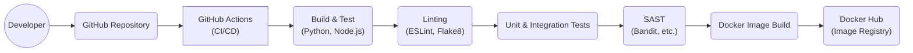

Okay, let's create a design document for the Redash project based on the provided GitHub repository.

# BUSINESS POSTURE

Redash is an open-source data visualization and dashboarding tool designed to connect to various data sources, query them, and create visualizations and dashboards. It appears to be targeted towards businesses of all sizes that need to analyze and share data insights. The project seems to be mature, with a large community and ongoing development.

Business Priorities:

*   Enable users to easily connect to and query various data sources.
*   Provide a user-friendly interface for creating visualizations and dashboards.
*   Facilitate sharing and collaboration on data insights.
*   Maintain a stable and reliable platform.
*   Foster a strong open-source community.

Business Goals:

*   Become a leading open-source data visualization tool.
*   Attract a large and active user base.
*   Grow the community of contributors.
*   Potentially offer a commercial/hosted version for revenue generation (observed in the repository).

Most Important Business Risks:

*   Data breaches or unauthorized access to sensitive data stored in connected data sources.
*   Service unavailability or performance issues impacting user productivity.
*   Vulnerabilities in the application leading to data corruption or loss.
*   Competition from other open-source and commercial data visualization tools.
*   Lack of adoption or engagement from the open-source community.

# SECURITY POSTURE

Existing Security Controls (based on observation of the repository):

*   security control: Authentication: User authentication via email/password, Google OAuth, SAML, and other methods. (Implemented in `redash/authentication.py` and related files).
*   security control: Authorization: Role-based access control (Admin, User) and object-level permissions (queries, dashboards, data sources). (Described in documentation and implemented in `redash/permissions.py` and related files).
*   security control: Input Validation: Parameterized queries to prevent SQL injection. (Observed in query execution logic).
*   security control: API Security: API keys for controlling access to the Redash API. (Implemented in `redash/handlers/api.py` and related files).
*   security control: CSRF Protection: Measures to prevent Cross-Site Request Forgery. (Observed in the codebase).
*   security control: Dependency Management: Use of requirements files and dependency management tools. (Observed in `requirements.txt`, `requirements_dev.txt`, etc.).
*   security control: Docker Deployment: Containerization for consistent and isolated deployments. (Observed in `Dockerfile` and related files).
*   security control: Configuration Management: Environment variables and configuration files for managing settings. (Observed throughout the codebase).

Accepted Risks:

*   accepted risk: The project relies heavily on third-party libraries, introducing potential supply chain risks.
*   accepted risk: The open-source nature of the project means that vulnerabilities may be discovered and exploited before patches are available.
*   accepted risk: Users are responsible for securing their own data sources and network configurations.

Recommended Security Controls:

*   Implement a robust Content Security Policy (CSP) to mitigate XSS risks.
*   Introduce regular security audits and penetration testing.
*   Implement a comprehensive logging and monitoring system to detect and respond to security incidents.
*   Provide detailed security documentation and best practices for users.
*   Implement a vulnerability disclosure program.
*   Consider implementing two-factor authentication (2FA).
*   Implement rate limiting to prevent brute-force attacks.

Security Requirements:

*   Authentication:
    *   Support multiple authentication methods (email/password, OAuth, SAML).
    *   Enforce strong password policies.
    *   Provide session management with secure cookies.
    *   Consider 2FA/MFA.
*   Authorization:
    *   Implement granular role-based access control.
    *   Enforce object-level permissions.
    *   Regularly review and update permissions.
*   Input Validation:
    *   Validate all user inputs on the server-side.
    *   Use parameterized queries for all database interactions.
    *   Sanitize user inputs to prevent XSS.
*   Cryptography:
    *   Use strong encryption algorithms for storing sensitive data (e.g., API keys, database credentials).
    *   Use HTTPS for all communication.
    *   Regularly update cryptographic libraries.

# DESIGN

## C4 CONTEXT

```mermaid
graph LR
    subgraph "Redash System Context"
        User(("User")) --> Redash("Redash")
        Redash --> Databases(("Data Sources\n(Databases, APIs, etc.)"))
        Redash --> SMTP(("SMTP Server"))
        Redash --> "Alert Destinations"
    end
```

Element Descriptions:

*   Element:
    *   Name: User
    *   Type: Person
    *   Description: A person who interacts with Redash to query data, create visualizations, and build dashboards.
    *   Responsibilities:
        *   Authenticating to Redash.
        *   Creating and managing queries, visualizations, and dashboards.
        *   Sharing data insights with other users.
        *   Configuring data source connections.
    *   Security controls:
        *   Authentication (username/password, OAuth, SAML).
        *   Authorization (RBAC, object-level permissions).

*   Element:
    *   Name: Redash
    *   Type: Software System
    *   Description: The Redash data visualization and dashboarding platform.
    *   Responsibilities:
        *   Providing a web interface for users.
        *   Connecting to various data sources.
        *   Executing queries and retrieving data.
        *   Rendering visualizations and dashboards.
        *   Managing user accounts and permissions.
        *   Sending email notifications.
    *   Security controls:
        *   Input validation.
        *   Parameterized queries.
        *   CSRF protection.
        *   API key management.

*   Element:
    *   Name: Data Sources (Databases, APIs, etc.)
    *   Type: External System
    *   Description: Various databases, APIs, and other services that Redash connects to for retrieving data.
    *   Responsibilities:
        *   Storing and managing data.
        *   Responding to queries from Redash.
    *   Security controls:
        *   Managed by the user/organization owning the data source.
        *   Redash uses provided credentials (API keys, usernames/passwords) to connect.

*   Element:
    *   Name: SMTP Server
    *   Type: External System
    *   Description: An email server used by Redash to send notifications and alerts.
    *   Responsibilities:
        *   Relaying emails from Redash to recipients.
    *   Security controls:
        *   Managed by the user/organization owning the SMTP server.
        *   Redash uses provided credentials to connect.

*   Element:
    *   Name: Alert Destinations
    *   Type: External System
    *   Description: External systems that can receive alerts from Redash, such as Slack, PagerDuty, Webhooks.
    *   Responsibilities:
        *   Receiving and processing alerts.
    *   Security controls:
        *   Managed by the user/organization owning the alert destination.
        *   Redash uses provided credentials/API keys to connect.

## C4 CONTAINER

```mermaid
graph LR
    subgraph Redash
        User(("User")) --> WebApp("Web Application\n(Python/Flask, React)")
        WebApp --> API("API Server\n(Python/Flask)")
        API --> RQ("Task Queue\n(Redis, RQ)")
        RQ --> Workers(("Query Workers\n(Python)"))
        Workers --> Databases(("Data Sources"))
        API --> DB("PostgreSQL\n(Metadata DB)")
        WebApp -.-> DB
        API --> SMTP
        API --> "Alert Destinations"
    end
```

Element Descriptions:

*   Element:
    *   Name: Web Application (Python/Flask, React)
    *   Type: Web Application
    *   Description: The front-end user interface built with React and served by a Flask backend.
    *   Responsibilities:
        *   Rendering the user interface.
        *   Handling user interactions.
        *   Communicating with the API server.
    *   Security controls:
        *   CSRF protection.
        *   Authentication and authorization checks (delegated to the API server).
        *   Content Security Policy (recommended).

*   Element:
    *   Name: API Server (Python/Flask)
    *   Type: API
    *   Description: The backend API server that handles requests from the web application and manages data access.
    *   Responsibilities:
        *   Authenticating and authorizing users.
        *   Managing queries, visualizations, and dashboards.
        *   Interacting with the metadata database.
        *   Enqueuing query execution tasks.
        *   Sending email.
    *   Security controls:
        *   Authentication (username/password, OAuth, SAML).
        *   Authorization (RBAC, object-level permissions).
        *   API key management.
        *   Input validation.
        *   Rate limiting (recommended).

*   Element:
    *   Name: Task Queue (Redis, RQ)
    *   Type: Message Queue
    *   Description: A task queue system using Redis and RQ for asynchronous query execution.
    *   Responsibilities:
        *   Receiving query execution tasks from the API server.
        *   Distributing tasks to worker processes.
    *   Security controls:
        *   Secure configuration of Redis (authentication, network access).

*   Element:
    *   Name: Query Workers (Python)
    *   Type: Worker Processes
    *   Description: Python worker processes that execute queries against data sources.
    *   Responsibilities:
        *   Retrieving tasks from the task queue.
        *   Connecting to data sources.
        *   Executing queries and retrieving results.
        *   Returning results to the API server.
    *   Security controls:
        *   Parameterized queries.
        *   Secure handling of data source credentials.

*   Element:
    *   Name: PostgreSQL (Metadata DB)
    *   Type: Database
    *   Description: A PostgreSQL database that stores Redash metadata (users, queries, dashboards, data sources, etc.).
    *   Responsibilities:
        *   Storing and managing Redash metadata.
    *   Security controls:
        *   Secure configuration of PostgreSQL (authentication, network access, encryption).
        *   Regular backups.

*   Element:
    *   Name: Data Sources
    *   Type: External System
    *   Description: External databases and APIs that Redash connects to.
    *   Responsibilities: See Context Diagram.
    *   Security controls: See Context Diagram.

*   Element:
    *   Name: SMTP
    *   Type: External System
    *   Description: External SMTP server.
    *   Responsibilities: See Context Diagram.
    *   Security controls: See Context Diagram.

*   Element:
    *   Name: Alert Destinations
    *   Type: External System
    *   Description: External systems for alerts.
    *   Responsibilities: See Context Diagram.
    *   Security controls: See Context Diagram.

## DEPLOYMENT

Possible Deployment Solutions:

1.  Docker Compose: Using the provided `docker-compose.yml` file for local development and testing.
2.  Docker Swarm/Kubernetes: For production deployments requiring scalability and high availability.
3.  Manual Installation: Installing Redash directly on a server without using Docker.
4.  Cloud Provider Specific (AWS, GCP, Azure): Using managed services like ECS, EKS, GKE, AKS, or deploying directly to VMs.

Chosen Solution (for detailed description): Docker Compose (for simplicity and reproducibility, suitable for smaller deployments or development/testing).

```mermaid
graph LR
    subgraph "Docker Host"
        subgraph redash_network [Redash Network]
            redash_server("Redash Server")
            redash_worker("Redash Worker")
            redash_redis("Redis")
            redash_postgres("PostgreSQL")
            redash_nginx("Nginx")
        end
    end
    User(("User")) -.-> redash_nginx
    redash_worker --> redash_postgres
    redash_worker --> redash_redis
    redash_worker --> Databases(("Data Sources"))
    redash_server --> redash_postgres
    redash_server --> redash_redis
    redash_server --> SMTP(("SMTP Server"))
    redash_server --> "Alert Destinations"
```

Element Descriptions:

*   Element:
    *   Name: Docker Host
    *   Type: Infrastructure
    *   Description: The physical or virtual machine that hosts the Docker containers.
    *   Responsibilities:
        *   Running the Docker Engine.
        *   Providing resources (CPU, memory, storage) to the containers.
    *   Security controls:
        *   Operating system security hardening.
        *   Firewall configuration.
        *   Regular security updates.

*   Element:
    *   Name: redash_server
    *   Type: Docker Container
    *   Description: Container running the Redash web server and API.
    *   Responsibilities: See Container Diagram.
    *   Security controls: See Container Diagram.

*   Element:
    *   Name: redash_worker
    *   Type: Docker Container
    *   Description: Container running the Redash query worker processes.
    *   Responsibilities: See Container Diagram.
    *   Security controls: See Container Diagram.

*   Element:
    *   Name: redash_redis
    *   Type: Docker Container
    *   Description: Container running the Redis server for the task queue.
    *   Responsibilities: See Container Diagram.
    *   Security controls: See Container Diagram.

*   Element:
    *   Name: redash_postgres
    *   Type: Docker Container
    *   Description: Container running the PostgreSQL database.
    *   Responsibilities: See Container Diagram.
    *   Security controls: See Container Diagram.

*   Element:
    *   Name: redash_nginx
    *   Type: Docker Container
    *   Description: Container running the Nginx web server as a reverse proxy.
    *   Responsibilities:
        *   Serving static assets.
        *   Routing traffic to the Redash web server.
        *   SSL termination (if configured).
    *   Security controls:
        *   Secure configuration of Nginx.
        *   SSL/TLS configuration.

*   Element:
    *   Name: User
    *   Type: Person
    *   Description: See Context Diagram.
    *   Responsibilities: See Context Diagram.
    *   Security controls: See Context Diagram.

*   Element:
    *   Name: Data Sources
    *   Type: External System
    *   Description: See Context Diagram.
    *   Responsibilities: See Context Diagram.
    *   Security controls: See Context Diagram.

*   Element:
    *   Name: SMTP Server
    *   Type: External System
    *   Description: See Context Diagram.
    *   Responsibilities: See Context Diagram.
    *   Security controls: See Context Diagram.

*   Element:
    *   Name: Alert Destinations
    *   Type: External System
    *   Description: See Context Diagram.
    *   Responsibilities: See Context Diagram.
    *   Security controls: See Context Diagram.

*   Element:
    *   Name: Redash Network
    *   Type: Network
    *   Description: Internal network for communication between Redash containers.
    *   Responsibilities: Isolate Redash internal communication.
    *   Security controls: Docker network isolation.

## BUILD

The Redash build process involves several steps, from code changes by developers to the creation of Docker images.



Build Process Description:

1.  Developer commits code changes to the GitHub repository.
2.  GitHub Actions triggers a CI/CD workflow.
3.  The workflow builds the application (Python backend and React frontend).
4.  Linters (ESLint for JavaScript, Flake8 for Python) check code style and potential errors.
5.  Unit and integration tests are executed.
6.  Static Application Security Testing (SAST) tools (e.g., Bandit for Python) scan the codebase for vulnerabilities.
7.  If all checks pass, Docker images are built.
8.  The Docker images are pushed to a container registry (e.g., Docker Hub).

Security Controls in Build Process:

*   Code Review: Pull requests and code reviews before merging changes.
*   Linting: Enforcing code style and identifying potential errors.
*   Automated Testing: Unit and integration tests to catch bugs and regressions.
*   SAST: Scanning for security vulnerabilities in the codebase.
*   Dependency Management: Using requirements files and tools to manage dependencies and track vulnerabilities.
*   Docker Image Security: Building secure Docker images by minimizing the attack surface, using trusted base images, and scanning for vulnerabilities.
*   CI/CD Pipeline Security: Securing the CI/CD pipeline itself (access control, secrets management).

# RISK ASSESSMENT

Critical Business Processes:

*   Data Querying and Visualization: The core functionality of Redash, enabling users to analyze data.
*   Dashboard Creation and Sharing: Allowing users to create and share insights with others.
*   Data Source Connectivity: Connecting to various data sources to retrieve data.
*   User Authentication and Authorization: Managing user access and permissions.

Data to Protect and Sensitivity:

*   Redash Metadata (PostgreSQL):
    *   User credentials (hashed passwords, API keys). Sensitivity: High
    *   Data source connection details (credentials, URLs). Sensitivity: High
    *   Query definitions and results (may contain sensitive data). Sensitivity: Variable, depends on the data source and queries.
    *   Dashboard configurations. Sensitivity: Medium
*   Data Source Data:
    *   Data stored in connected data sources. Sensitivity: Variable, depends on the data source. Redash acts as a conduit to this data.
*   Redis Data:
    *   Temporary data related to task queue. Sensitivity: Low-Medium

# QUESTIONS & ASSUMPTIONS

Questions:

*   What are the specific compliance requirements (e.g., GDPR, HIPAA, SOC 2) that Redash needs to adhere to?
*   What is the expected scale of the deployment (number of users, data sources, queries per day)?
*   What are the existing security policies and procedures of the organization deploying Redash?
*   Are there any specific threat models or attack vectors that are of particular concern?
*   What level of support and maintenance is expected for the Redash deployment?

Assumptions:

*   BUSINESS POSTURE: The organization deploying Redash has a basic understanding of data security and privacy.
*   BUSINESS POSTURE: The organization is responsible for securing their own data sources and network infrastructure.
*   SECURITY POSTURE: The default security configurations of Redash are used unless explicitly modified.
*   SECURITY POSTURE: Users are responsible for creating strong passwords and managing their API keys securely.
*   DESIGN: The Docker Compose deployment is used for smaller deployments or development/testing.
*   DESIGN: The organization has the necessary infrastructure and expertise to manage a Docker-based deployment.
*   DESIGN: The build process described is based on the observed GitHub Actions workflows and may vary.