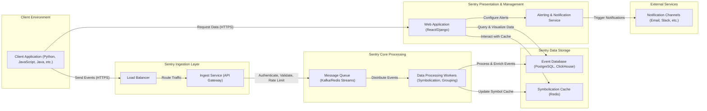

# Project Design Document: Sentry

**Version:** 1.1
**Date:** October 26, 2023
**Author:** AI Software Architect

## 1. Introduction

This document provides an enhanced architectural design of the Sentry project, an open-source error tracking and performance monitoring platform. Building upon the initial design, this version aims to provide even greater clarity and detail regarding Sentry's components, their interactions, and the overall system architecture. This refined design will serve as a robust foundation for subsequent threat modeling activities, enabling a more comprehensive security analysis.

## 2. Goals and Objectives

The primary goals of Sentry are to:

* **Comprehensive Error Capture and Aggregation:**  Collect error events, exceptions, and log messages from a diverse range of applications and environments, ensuring no critical issue is missed.
* **Rich Contextual Information for Debugging:** Offer in-depth information about errors, including detailed stack traces with source code context, local variables, user context, environment details (OS, browser, etc.), and release information.
* **Efficient Error Resolution Workflow:**  Enable developers to quickly identify, diagnose, prioritize, and resolve errors through features like issue grouping, assignment, status tracking, and integration with issue tracking systems.
* **Proactive Application Performance Monitoring:** Track key performance indicators (KPIs) such as transaction duration, database query performance, and frontend load times to proactively identify and address performance bottlenecks before they impact users.
* **Real-time Issue Awareness and Alerting:** Provide a customizable dashboard and flexible alerting mechanisms (email, Slack, PagerDuty, etc.) for immediate notification of critical errors and performance regressions.
* **Broad Platform and Language Support with Extensibility:** Integrate seamlessly with a wide array of programming languages, frameworks, and platforms through well-maintained SDKs, and offer extension points for custom integrations and functionality.

## 3. High-Level Architecture

Sentry employs a distributed client-server architecture with distinct components collaborating to achieve its objectives.

## 4. Key Components

This section provides a more detailed breakdown of the major components within the Sentry system.

### 4.1. Client SDKs

* **Functionality:** Language-specific libraries integrated directly into client applications to automatically or manually capture errors, exceptions, breadcrumbs (user actions leading to an error), and performance data (transactions, spans).
* **Responsibilities:**
    * **Automatic Instrumentation:** Intercept unhandled exceptions and errors based on language conventions.
    * **Manual Instrumentation:** Provide APIs for developers to explicitly capture events, log messages, and performance metrics.
    * **Context Collection:** Gather rich contextual information such as stack traces (with in-app frames), local variables (where supported), user information (ID, email, IP address), environment details (OS, browser, device), release information (version control), and tags.
    * **Event Formatting and Enrichment:** Format collected data into a standardized JSON payload adhering to the Sentry protocol.
    * **Secure Transmission:** Transmit events to the Ingest Service over HTTPS, often with configurable options for proxy settings and certificate pinning.
    * **Buffering and Retry Mechanisms:** Implement strategies to buffer events locally and retry transmission in case of network issues.
    * **Rate Limiting and Sampling:** Implement client-side rate limiting and sampling to control the volume of events sent to Sentry, preventing overload.
* **Examples:** `sentry-python`, `sentry-javascript`, `sentry-java`, `sentry-ruby`, `sentry-go`, and many more community-supported SDKs.

### 4.2. Ingest Service (API Gateway)

* **Functionality:** The primary entry point for receiving events from client SDKs, acting as an API gateway for the Sentry backend.
* **Responsibilities:**
    * **Load Balancing:** Distribute incoming traffic across multiple instances of the Ingest Service for scalability and resilience.
    * **Authentication and Authorization:** Verify the authenticity of incoming requests using API keys (DSNs - Data Source Names) associated with specific projects.
    * **Payload Validation:** Validate the structure and content of event payloads against the Sentry protocol schema.
    * **Rate Limiting:** Enforce rate limits per project and organization to prevent abuse and ensure fair resource allocation.
    * **Data Enrichment (Initial):** Perform basic data enrichment, such as geolocating IP addresses.
    * **Message Queueing:** Enqueue validated events onto the Message Queue for asynchronous processing by worker services.
* **Technology:** Typically built using robust web frameworks like Django or Flask, often deployed behind a load balancer (e.g., Nginx, HAProxy).

### 4.3. Message Queue

* **Functionality:** A distributed message broker that acts as a buffer and decouples the Ingest Service from the Data Processing Workers, ensuring reliable and scalable event processing.
* **Responsibilities:**
    * **Reliable Message Delivery:** Guarantee at-least-once delivery of events to consumers.
    * **Scalability and Throughput:** Handle high volumes of incoming events efficiently.
    * **Durability:** Persist messages to prevent data loss in case of failures.
    * **Topic/Queue Management:** Organize events into different topics or queues for different processing needs.
* **Examples:** Apache Kafka, Redis Streams are commonly used.

### 4.4. Data Processing Workers

* **Functionality:** A pool of worker processes that consume events from the Message Queue and perform various processing tasks.
* **Responsibilities:**
    * **Event Consumption:** Read events from the designated message queue(s).
    * **Symbolication:** Resolve memory addresses in stack traces to their corresponding source code locations using uploaded debug symbols (DWARF, PDB files). This process often involves interacting with the Symbolication Cache.
    * **Error Grouping:** Group similar errors together based on configurable rules (e.g., exception type, message, stack trace frames) to reduce noise and facilitate efficient issue management.
    * **Data Enrichment (Advanced):** Extract and enrich event data with additional information, such as identifying the responsible code owner or applying custom tags.
    * **Storage in Event Database:** Persist the processed and enriched event data into the Event Database.
    * **Symbolication Cache Updates:** Update the Symbolication Cache with newly processed symbol files.
* **Technology:** Typically implemented using task queue systems like Celery (with Redis or RabbitMQ as a broker) or custom-built worker frameworks.

### 4.5. Event Database

* **Functionality:** The primary data store for processed error and performance events, optimized for efficient querying and analysis of large datasets.
* **Responsibilities:**
    * **Persistent Storage:** Store event data, including raw event payloads, processed information, and metadata.
    * **Efficient Querying and Filtering:** Provide fast and flexible querying capabilities based on various attributes (time, project, environment, tags, user, etc.).
    * **Scalability and High Availability:** Handle large volumes of data and high query loads with resilience.
    * **Data Retention Policies:** Enforce configurable data retention policies to manage storage costs.
* **Examples:** PostgreSQL (for transactional data and metadata), ClickHouse (for high-volume event data optimized for analytical queries).

### 4.6. Symbolication Cache

* **Functionality:** A fast and efficient cache for storing processed symbol files, significantly speeding up the symbolication process.
* **Responsibilities:**
    * **Symbol File Storage:** Store uploaded and processed symbol files.
    * **Fast Retrieval:** Provide low-latency access to symbol files for Data Processing Workers.
    * **Cache Invalidation:** Implement mechanisms for invalidating cached symbol files when new versions are uploaded.
* **Examples:** Redis is a common choice due to its speed and in-memory data storage.

### 4.7. Web Application (React/Django)

* **Functionality:** Provides the user interface (UI) and API for interacting with Sentry, allowing users to view, analyze, and manage error and performance data.
* **Responsibilities (UI):**
    * **Dashboard Visualization:** Display error trends, performance metrics, and key insights through interactive dashboards and charts.
    * **Issue Exploration:** Allow users to browse, filter, and search through individual error events and performance transactions.
    * **Issue Management:** Provide tools for assigning issues, setting statuses, adding comments, and integrating with issue tracking systems (Jira, Trello, etc.).
    * **Project and User Management:** Manage projects, teams, users, and their permissions.
    * **Alert Configuration:** Configure alert rules based on various criteria (error frequency, performance thresholds).
    * **Source Code Integration:** Display source code context within stack traces for easier debugging.
* **Responsibilities (API):**
    * **Data Retrieval:** Provide endpoints for programmatically accessing event data, performance metrics, and project information.
    * **Project and User Management (API):** Allow programmatic creation and management of projects, users, and teams.
    * **Integration Endpoints:** Offer APIs for integrating Sentry with other tools and services.
* **Technology:** Typically a modern web framework like React for the frontend and a backend framework like Django (Python) for the API and server-side logic.

### 4.8. Alerting & Notification Service

* **Functionality:** Monitors event streams and triggers notifications based on user-defined alert rules.
* **Responsibilities:**
    * **Rule Evaluation:** Continuously evaluate incoming events against configured alert rules.
    * **Notification Triggering:** Send notifications via various channels (email, Slack, PagerDuty, webhooks) when alert conditions are met.
    * **Alert Configuration Management:** Allow users to create, modify, and manage alert rules based on various criteria (e.g., error frequency, specific error types, performance thresholds).
    * **Rate Limiting (Notifications):** Implement rate limiting for notifications to prevent overwhelming users.
* **Technology:** Can be integrated within the web application or implemented as a separate microservice.

## 5. Data Flow

The data flow within Sentry follows a well-defined path:

1. **Event Occurrence:** An error, exception, or performance event occurs within a monitored client application.
2. **Client SDK Capture:** The appropriate Sentry SDK intercepts the event and collects relevant contextual data.
3. **Event Transmission (HTTPS):** The SDK securely transmits the event payload to the Sentry Ingest Service via HTTPS.
4. **Ingest Service Processing:** The Ingest Service receives the event, authenticates the request, validates the payload, and applies rate limiting.
5. **Event Queueing:** The validated event is placed onto the Message Queue (e.g., Kafka).
6. **Worker Consumption:** Data Processing Workers consume events from the Message Queue.
7. **Symbolication (if applicable):** Workers retrieve necessary symbol files from the Symbolication Cache (or fetch them if missing) to symbolicate stack traces.
8. **Data Processing and Enrichment:** Workers process the event, group it with similar issues, and enrich it with additional metadata.
9. **Event Storage:** The processed and enriched event data is stored in the Event Database (e.g., ClickHouse).
10. **Alert Evaluation:** The Alerting & Notification Service continuously monitors the stream of processed events.
11. **Alert Triggering (Conditional):** If an event matches a configured alert rule, the Alerting & Notification Service triggers a notification.
12. **Notification Delivery:** Notifications are sent to the configured notification channels (e.g., email, Slack).
13. **User Access and Analysis:** Users access and analyze the stored event data and performance metrics through the Web Application's UI or API.

## 6. Security Considerations (Detailed for Threat Modeling)

This section expands on the initial security considerations, providing more specific details relevant for threat modeling.

* **Authentication and Authorization:**
    * **Web Application Authentication:** Secure password hashing (e.g., bcrypt), multi-factor authentication (MFA), and potentially single sign-on (SSO) integration (e.g., SAML, OAuth 2.0) for user logins.
    * **API Authentication:** API keys (DSNs) with appropriate scoping and rotation policies for client SDKs. Bearer tokens for programmatic API access.
    * **Role-Based Access Control (RBAC):** Granular permissions to control access to projects, data, and administrative functions within the web application.
* **Data Security:**
    * **Encryption at Rest:** Encryption of sensitive data within the Event Database and other data stores using industry-standard encryption algorithms.
    * **Encryption in Transit:** Mandatory use of HTTPS for all communication between clients and the Sentry backend, and between internal components where applicable.
    * **Personally Identifiable Information (PII) Handling:**  Mechanisms for identifying, anonymizing, or redacting PII in event data based on configuration and legal requirements (GDPR, CCPA).
    * **Data Retention and Purging:** Configurable data retention policies and secure data purging mechanisms to comply with regulations and manage storage.
* **Input Validation and Sanitization:**
    * **Strict Input Validation:** Rigorous validation of event payloads at the Ingest Service to prevent injection attacks (e.g., SQL injection, cross-site scripting).
    * **Output Sanitization:** Proper sanitization of user-provided input displayed in the web application to prevent cross-site scripting (XSS) vulnerabilities.
* **Rate Limiting and Abuse Prevention:**
    * **Ingest Rate Limiting:** Rate limiting at the Ingest Service based on project, organization, and IP address to prevent abuse and denial-of-service attacks.
    * **Notification Rate Limiting:** Rate limiting for notifications to prevent overwhelming users and notification channels.
* **Infrastructure Security:**
    * **Secure Server Configuration:** Hardening of server operating systems and applications based on security best practices.
    * **Network Segmentation:** Isolating different components of the Sentry infrastructure using firewalls and network policies.
    * **Regular Security Patching:** Timely application of security patches to operating systems, libraries, and application dependencies.
    * **Web Application Firewall (WAF):** Deployment of a WAF to protect against common web application attacks.
* **Dependency Management:**
    * **Vulnerability Scanning:** Regular scanning of third-party dependencies for known vulnerabilities.
    * **Dependency Updates:** Keeping dependencies up-to-date with security patches.
* **Secrets Management:**
    * **Secure Storage of Credentials:** Use of secure secrets management solutions (e.g., HashiCorp Vault, AWS Secrets Manager) to store and manage sensitive credentials.
    * **Avoid Hardcoding Secrets:**  Prevent hardcoding of secrets in the codebase or configuration files.
* **Code Security:**
    * **Secure Coding Practices:** Adherence to secure coding guidelines and principles throughout the development process.
    * **Regular Security Audits and Penetration Testing:** Conducting periodic security audits and penetration testing to identify and address potential vulnerabilities.

## 7. Deployment

Sentry offers flexible deployment options to suit various needs:

* **Self-Hosted Deployment:**
    * **Infrastructure Management:** Requires managing all infrastructure components (servers, databases, message queues) independently.
    * **Customization and Control:** Offers maximum control over the environment and allows for deep customization.
    * **Operational Overhead:** Involves significant operational overhead for installation, configuration, maintenance, and scaling.
    * **Deployment Methods:** Can be deployed using Docker Compose, Kubernetes, or manual installations.
* **SaaS (getsentry.com):**
    * **Managed Service:** Sentry manages all infrastructure and operations.
    * **Simplified Management:** Reduces operational overhead and allows users to focus on using the platform.
    * **Scalability and Reliability:** Leverages Sentry's infrastructure for scalability and high availability.
    * **Cost Considerations:** Involves subscription fees based on usage.
* **Hybrid Deployment:**
    * **Combination of Self-Hosted and SaaS:**  Potentially using some self-hosted components (e.g., on-premise data storage for compliance) while leveraging Sentry's SaaS for other functionalities.
    * **Complexity:** Introduces additional complexity in managing and integrating different environments.

Common deployment technologies include:

* **Containerization:** Docker for packaging and deploying components.
* **Orchestration:** Kubernetes for managing and scaling containerized applications.
* **Infrastructure as Code (IaC):** Tools like Terraform or Ansible for automating infrastructure provisioning and configuration.

## 8. Future Considerations

* **Advanced Performance Monitoring:** Implementing more granular performance monitoring capabilities, such as code-level performance profiling and distributed tracing.
* **Enhanced Error Analysis with Machine Learning:** Utilizing machine learning algorithms for automated anomaly detection, root cause analysis, and prediction of potential issues.
* **Improved Integrations and Extensibility:** Expanding the ecosystem of integrations with other development and operations tools, and providing more flexible extension points for custom functionality.
* **Enhanced Security Features:** Continuously improving security features based on evolving threats and best practices, such as more advanced anomaly detection and threat intelligence integration.

This enhanced design document provides a more detailed and comprehensive understanding of the Sentry project architecture, serving as a valuable resource for in-depth threat modeling and security analysis.