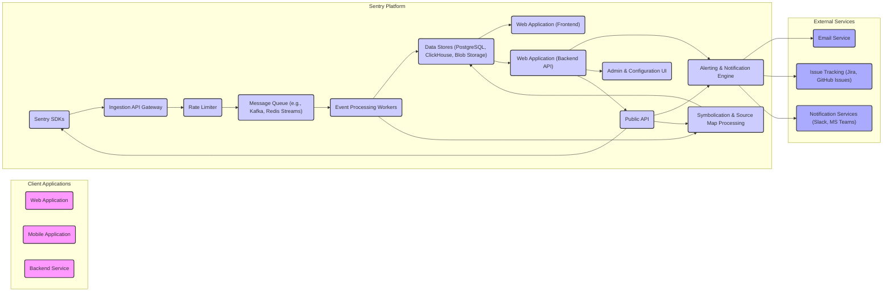

## Project Design Document: Sentry (Improved)

**1. Introduction**

This document provides an enhanced architectural design overview of the Sentry error tracking and performance monitoring platform. It details the core components, their interactions, and the data flow within the system, serving as a basis for subsequent threat modeling activities. The aim is to provide a clear and comprehensive understanding of Sentry's architecture for security analysis.

**2. Project Overview**

Sentry is an open-source application performance monitoring (APM) and error tracking platform designed to help developers proactively identify, diagnose, and resolve issues in their applications. It aggregates errors, exceptions, and performance data from diverse application environments, offering tools for analysis, alerting, and issue management.

**3. System Architecture**

The following diagram illustrates the refined high-level architecture of Sentry.

**4. Component Descriptions**

*   **Client Applications:**
    *   "Web Application": Frontend applications executing within web browsers, typically using JavaScript-based Sentry SDKs.
    *   "Mobile Application": Applications running on mobile operating systems (e.g., iOS, Android), utilizing platform-specific Sentry SDKs.
    *   "Backend Service": Server-side applications and microservices written in various languages, integrated with relevant Sentry SDKs.

*   **Sentry Platform:**
    *   "Sentry SDKs": Language-specific libraries integrated into client applications to capture and transmit error and performance events. They handle formatting, basic data enrichment, and secure transmission.
    *   "Ingestion API Gateway": The entry point for events sent by the Sentry SDKs. It handles authentication, basic validation, and routing of incoming data.
    *   "Rate Limiter": Protects the Sentry platform from abuse and overload by controlling the rate of incoming events from different sources.
    *   "Message Queue (e.g., Kafka, Redis Streams)": A distributed message broker used to decouple the ingestion layer from processing workers, ensuring resilience and enabling asynchronous processing of events.
    *   "Event Processing Workers": A pool of worker processes that consume events from the message queue and perform core processing tasks, including:
        *   Normalization and enrichment of event data.
        *   Stack trace parsing and grouping of similar errors.
        *   Applying filters and integrations.
        *   Storing processed data in the data stores.
    *   "Data Stores (PostgreSQL, ClickHouse, Blob Storage)": Persistent storage for various types of Sentry data:
        *   PostgreSQL: Stores metadata, user information, project configurations, and aggregated data.
        *   ClickHouse: Optimized for storing and querying high-volume event data for analytics and performance monitoring.
        *   Blob Storage (e.g., AWS S3, Google Cloud Storage): Used for storing large payloads like source maps and debug symbols.
    *   "Web Application (Frontend)": The user interface built with technologies like React, providing users with dashboards, error details, issue management tools, and configuration options.
    *   "Web Application (Backend API)": The API layer powering the frontend and providing programmatic access to Sentry's functionalities. Handles authentication, authorization, and data retrieval.
    *   "Alerting & Notification Engine":  Evaluates event data against defined rules and triggers notifications through various channels when specific conditions are met.
    *   "Symbolication & Source Map Processing":  Processes stack traces by resolving function names and file paths using debug symbols and source maps, making errors more understandable, especially for minified JavaScript code.
    *   "Admin & Configuration UI":  A section of the web application dedicated to administrative tasks, such as user management, organization settings, project configuration, and integration management.
    *   "Public API": A documented API allowing external applications and services to interact with Sentry programmatically for tasks like sending events, retrieving data, and managing projects.

*   **External Services:**
    *   "Email Service": Used for sending email notifications related to alerts, user invitations, and other system events.
    *   "Issue Tracking (Jira, GitHub Issues)": Integrations with external issue tracking systems, allowing users to create and link Sentry issues to their existing workflows.
    *   "Notification Services (Slack, MS Teams)": Integrations with messaging platforms to deliver real-time alerts and notifications to development teams.

**5. Data Flow**

The typical lifecycle of an error or performance event within Sentry involves the following steps:

1. An error, exception, or performance event occurs within a "Client Application".
2. The integrated "Sentry SDKs" capture detailed information about the event, including stack traces, context variables, user details, and timestamps.
3. The SDK transmits the event data to the "Ingestion API Gateway" over a secure HTTPS connection, often including authentication credentials.
4. The "Ingestion API Gateway" authenticates the request and performs basic validation of the event data.
5. The "Rate Limiter" assesses the incoming event against configured limits to prevent abuse and ensure platform stability.
6. The event is then enqueued into the "Message Queue".
7. Available "Event Processing Workers" consume events from the queue.
8. Workers process the event, potentially utilizing the "Symbolication & Source Map Processing" service to enhance stack trace information.
9. The processed event data is persisted in the appropriate "Data Stores" (PostgreSQL, ClickHouse, Blob Storage).
10. Users interact with the "Web Application (Frontend)" which fetches data from the "Web Application (Backend API)" to view and analyze the collected events.
11. The "Alerting & Notification Engine" continuously evaluates incoming events against defined rules.
12. When an alert condition is met, the "Alerting & Notification Engine" triggers notifications.
13. Notifications are dispatched via the configured external services: "Email Service", "Issue Tracking", or "Notification Services".
14. External applications can also interact with Sentry through the "Public API" to send events or retrieve data.

**6. Technology Stack (Illustrative and Common)**

This list highlights common technologies used in Sentry's implementation:

*   Programming Languages: Python, JavaScript (Node.js, React), Go
*   Web Framework: Django, React
*   Databases: PostgreSQL, ClickHouse, Redis
*   Message Queue: Kafka, Redis Streams
*   Object Storage: AWS S3, Google Cloud Storage, Azure Blob Storage
*   Caching: Redis, Memcached
*   Search Engine:  (Often Elasticsearch or similar for advanced search capabilities)
*   Operating System: Linux
*   Cloud Providers: AWS, Google Cloud, Azure (for hosted Sentry offerings)

**7. Security Considerations (Categorized)**

This section provides a high-level overview of key security considerations, categorized for clarity. These areas will be explored in depth during threat modeling.

*   **Confidentiality:**
    *   Encryption of data in transit (TLS/SSL).
    *   Encryption of data at rest for sensitive information in "Data Stores".
    *   Secure handling and storage of API keys and other secrets.
    *   Access control mechanisms to restrict data access based on roles and permissions.
*   **Integrity:**
    *   Input validation at the "Ingestion API Gateway" and within "Event Processing Workers" to prevent data manipulation.
    *   Mechanisms to ensure the integrity of stored data.
    *   Protection against tampering with event data during transmission and processing.
*   **Availability:**
    *   Redundancy and fault tolerance in the "Ingestion API Gateway", "Message Queue", and "Data Stores".
    *   Rate limiting and denial-of-service (DoS) protection at the "Ingestion API Gateway".
    *   Monitoring and alerting for system health and performance.
*   **Authentication and Authorization:**
    *   Secure authentication mechanisms for users accessing the "Web Application" and the "Public API" (e.g., password-based authentication, SSO).
    *   Robust authorization controls to manage access to projects, data, and administrative functions.
    *   Secure management and rotation of API keys.
*   **Application Security:**
    *   Protection against common web application vulnerabilities (e.g., XSS, CSRF, SQL Injection) in the "Web Application (Frontend)" and "Web Application (Backend API)".
    *   Secure coding practices throughout the Sentry codebase.
    *   Regular security audits and penetration testing.
*   **Infrastructure Security:**
    *   Secure configuration and hardening of servers and network infrastructure.
    *   Access control and monitoring of infrastructure components.
*   **Privacy:**
    *   Mechanisms for handling and anonymizing potentially sensitive personal data within events, adhering to privacy regulations (e.g., GDPR, CCPA).
    *   Options for data retention and deletion.

**8. Threat Modeling Scope (Refined)**

The primary focus of the initial threat modeling exercise will encompass the following components and their interactions, representing the core data flow and critical interfaces:

*   **Client Applications** and their interaction with the "Sentry SDKs", focusing on event creation and transmission.
*   The "Ingestion API Gateway", including authentication, authorization, and input validation processes.
*   The "Rate Limiter" and its mechanisms for preventing abuse.
*   The "Message Queue" and the security of messages in transit and at rest within the queue.
*   "Event Processing Workers" and the security of their processing logic and access to data stores.
*   The "Data Stores" (PostgreSQL, ClickHouse, Blob Storage), focusing on access control, encryption, and data integrity.
*   The "Web Application (Frontend)" and "Web Application (Backend API)", including authentication, authorization, and protection against web application vulnerabilities.
*   The "Public API" and its authentication and authorization mechanisms for external access.
*   Communication channels between these in-scope components, focusing on encryption and authentication.

The following areas remain out of scope for the initial threat modeling phase:

*   Detailed security analysis of individual "Sentry SDKs" for specific platforms beyond their core functionalities.
*   In-depth security assessments of the external "Email Service", "Issue Tracking", and "Notification Services" themselves. The focus will be on Sentry's integration points with these services.
*   Physical security of the underlying hosting infrastructure.
*   Comprehensive vulnerability analysis of third-party libraries and dependencies.

**9. Conclusion**

This improved design document provides a more detailed and structured understanding of the Sentry architecture, emphasizing key components and data flows relevant to security analysis. This document will serve as a valuable resource for conducting a comprehensive threat model, enabling the identification of potential vulnerabilities and the development of effective mitigation strategies to ensure the security and integrity of the Sentry platform and the data it processes.