## Project Design Document: Sentry (Improved)

**1. Introduction**

*   **1.1 Purpose:** This document provides an enhanced architectural overview of the Sentry project (as represented by the GitHub repository: [https://github.com/getsentry/sentry](https://github.com/getsentry/sentry)). It is specifically designed to serve as a comprehensive foundation for subsequent threat modeling activities, offering greater detail and clarity on system components and interactions.
*   **1.2 Scope:** This document expands upon the previous version by providing more granular detail on the major components, data flows (including protocols), and interactions within a typical Sentry deployment. It covers the core functionality of capturing, processing, and displaying errors and performance data, with a focus on aspects relevant to security. While it doesn't cover every single microservice or plugin, it aims to provide sufficient detail for effective threat identification.
*   **1.3 Audience:** This document is intended for security engineers, developers, architects, and penetration testers involved in the security assessment, threat modeling, and risk analysis of Sentry deployments.

**2. System Overview**

Sentry is a robust open-source error tracking and performance monitoring platform. Its primary function is to enable developers to monitor and resolve crashes and performance issues in their applications in real-time. The core process involves capturing events (errors, exceptions, performance metrics, breadcrumbs) from diverse applications and environments, efficiently processing these events, and presenting them through a user-friendly interface for analysis, debugging, and resolution.

**3. Architectural Components**

*   **3.1 Web Application (Frontend & Backend):**
    *   Serves as the central point of interaction for users.
    *   **Frontend:**  Handles user interface rendering, user interactions, and data visualization (likely using React or a similar framework). Responsible for displaying error details, managing projects, teams, organizations, and user settings.
    *   **Backend:** Provides API endpoints for event ingestion, data retrieval, user authentication and authorization, project management, and overall system configuration (likely built using Django, a Python web framework). Manages user sessions, handles authentication flows, and enforces access controls.
    *   **Security Focus:** Vulnerable to typical web application attacks such as XSS, CSRF, SQL Injection (if not properly handled in ORM), and authentication/authorization bypasses.
*   **3.2 Ingest Service:**
    *   Acts as the initial entry point for all incoming events originating from client applications and SDKs.
    *   Responsible for receiving, validating (basic checks), and initially processing events.
    *   Often deployed behind load balancers and API gateways for scalability, resilience, and potential security features like rate limiting and basic threat detection.
    *   Authenticates incoming requests using the Data Source Name (DSN), which acts as an API key.
    *   May perform initial data scrubbing or filtering based on configuration.
    *   **Security Focus:**  A critical component for preventing malicious data injection and abuse. Vulnerable to denial-of-service attacks if not properly protected. DSN management and security are paramount.
*   **3.3 Worker Processes (Celery Workers):**
    *   Executes asynchronous tasks related to event processing, offloading intensive operations from the Ingest Service and Web Application.
    *   Performs crucial tasks such as:
        *   **Symbolication:** Resolving stack traces by matching code addresses to source code locations using debug symbols.
        *   **Data Enrichment:** Adding contextual information to events (e.g., environment details, user information).
        *   **Storage:** Persisting processed event data into the database and potentially blob storage.
        *   **Alerting and Notifications:** Triggering alerts and sending notifications based on configured rules.
        *   **Issue Grouping:** Aggregating similar events into logical issues.
    *   Communicates with other components via the Message Queue.
    *   **Security Focus:**  Potential for code injection vulnerabilities if processing untrusted data during symbolication or data enrichment. Access control to sensitive resources (database, blob storage) is critical.
*   **3.4 Database (PostgreSQL):**
    *   Serves as the primary persistent storage mechanism for all critical data within Sentry.
    *   Stores event details, user accounts, project configurations, organization information, alerts, and other system metadata.
    *   **Security Focus:**  Requires robust security measures including encryption at rest and in transit, strong access controls, regular backups, and protection against SQL injection vulnerabilities (mitigated by ORM usage but still a consideration).
*   **3.5 Cache (Redis/Memcached):**
    *   Used as a high-speed in-memory data store to improve performance and reduce database load.
    *   Caches frequently accessed data such as user sessions, API responses, processed event summaries, and rate limiting information.
    *   **Security Focus:**  While primarily for performance, securing the cache is important to prevent unauthorized access to potentially sensitive cached data.
*   **3.6 Message Queue (Kafka/Redis):**
    *   Facilitates asynchronous communication and decoupling between the Ingest Service and Worker Processes.
    *   Acts as a buffer for incoming events, ensuring resilience and the ability to handle traffic spikes.
    *   Ensures reliable delivery of events to workers.
    *   **Security Focus:**  Securing the message queue is crucial to prevent unauthorized access to event data in transit and to ensure message integrity.
*   **3.7 Symbolication Service:**
    *   A dedicated service responsible for the computationally intensive task of processing stack traces and converting them into human-readable formats.
    *   Fetches debug symbols from various sources (e.g., uploaded files, symbol servers).
    *   May involve processing potentially large and complex files.
    *   **Security Focus:**  Vulnerable to path traversal or arbitrary file read vulnerabilities if not carefully implemented. Requires secure handling of uploaded debug symbols.
*   **3.8 Relay (Optional, but common in self-hosted instances):**
    *   An intermediary component deployed between client applications and the core Sentry backend.
    *   Provides advanced features such as:
        *   **Data Scrubbing and Filtering:**  Removing sensitive information from events before they reach the main Sentry instance.
        *   **Rate Limiting:**  Controlling the rate of incoming events.
        *   **Routing:**  Directing events to specific Sentry instances based on configuration.
        *   **Enhanced Security:** Can act as a security gateway, providing an extra layer of defense.
    *   **Security Focus:**  A critical component for enforcing data privacy and security policies. Requires careful configuration and secure deployment.
*   **3.9 Blob Storage (e.g., AWS S3, Google Cloud Storage):**
    *   Used for storing large binary data associated with events, such as source code snippets, attachments, or minidumps.
    *   Offloads storage requirements from the primary database.
    *   **Security Focus:**  Requires proper access controls, encryption at rest, and secure lifecycle management to protect potentially sensitive data.

**4. Data Flow**

```mermaid
graph LR
    subgraph "Client Application Environment"
        A["Client Application"]
    end
    subgraph "Sentry System"
        B["Ingest Service"]
        C["Message Queue (Kafka/Redis)"]
        D["Worker Processes"]
        E["Database (PostgreSQL)"]
        F["Cache (Redis/Memcached)"]
        G["Web Application (Backend)"]
        H["Symbolication Service"]
        I["Blob Storage"]
        J["Relay (Optional)"]
        K["Web Application (Frontend)"]
    end
    subgraph "User Environment"
        L["User"]
    end

    A -- "HTTPS: Sends Event (Error/Performance Data)" --> J
    J -- "HTTPS: Forwards Event" --> B
    A -- "HTTPS: Sends Event (Error/Performance Data)" --> B
    B -- "Pushes Event to Queue" --> C
    C -- "Consumes Event from Queue" --> D
    D -- "Stores Event Data" --> E
    D -- "Stores Cached Data" --> F
    D -- "Requests Symbolication Data" --> H
    H -- "Returns Symbolication Data" --> D
    D -- "Stores Blobs (e.g., Source Code)" --> I
    E -- "Retrieves Event Data" --> G
    F -- "Retrieves Cached Data" --> G
    G -- "Provides Data for UI" --> K
    K -- "Displays UI" --> L

    style A fill:#f9f,stroke:#333,stroke-width:2px
    style B fill:#ccf,stroke:#333,stroke-width:2px
    style C fill:#ccf,stroke:#333,stroke-width:2px
    style D fill:#ccf,stroke:#333,stroke-width:2px
    style E fill:#aaf,stroke:#333,stroke-width:2px
    style F fill:#aaf,stroke:#333,stroke-width:2px
    style G fill:#ccf,stroke:#333,stroke-width:2px
    style H fill:#ccf,stroke:#333,stroke-width:2px
    style I fill:#aaf,stroke:#333,stroke-width:2px
    style J fill:#ccf,stroke:#333,stroke-width:2px
    style K fill:#ddf,stroke:#333,stroke-width:2px
    style L fill:#eee,stroke:#333,stroke-width:2px

    direction LR
```

**Detailed Data Flow Description:**

*   **Event Capture and Transmission:** When an error or performance issue occurs in a client application, the integrated Sentry SDK captures relevant data (including stack traces, context, and breadcrumbs). This event data is then transmitted to the Sentry system, typically via HTTPS. If a Relay is in use, the client application sends the event to the Relay first.
*   **Relay Processing (Optional):** The Relay (if present) can perform actions like data scrubbing, filtering, and rate limiting before forwarding the event to the Ingest Service.
*   **Ingestion and Queuing:** The Ingest Service receives the event. It performs initial validation checks and authenticates the request using the DSN. The event is then pushed onto the Message Queue.
*   **Asynchronous Processing by Workers:** Worker Processes consume events from the Message Queue.
*   **Data Enrichment and Symbolication:** Workers enrich the event data with additional context and invoke the Symbolication Service to resolve stack traces into human-readable format using debug symbols.
*   **Data Storage:** Processed event data is stored in the Database. Large binary data (like source code snippets) may be stored in Blob Storage. Frequently accessed data is cached in the Cache.
*   **User Interaction:** Users interact with the Web Application (Frontend) through their web browsers. The Frontend fetches data from the Web Application (Backend), which in turn retrieves data from the Database and Cache to display error details, performance metrics, and other information.

**5. Key Technologies**

*   **Programming Languages:** Python (primarily for backend services), JavaScript (for frontend).
*   **Web Framework:** Django (for the main web application backend).
*   **Message Queue:** Kafka or Redis.
*   **Database:** PostgreSQL.
*   **Caching:** Redis or Memcached.
*   **Task Queue:** Celery (for managing asynchronous worker processes).
*   **Frontend Framework:** React or a similar component-based JavaScript framework.
*   **API Communication:** RESTful APIs (primarily).
*   **Authentication:** API keys (DSN for event ingestion), session-based authentication for user logins, potentially OAuth for integrations.

**6. Security Considerations (Detailed for Threat Modeling)**

*   **6.1 Authentication and Authorization:**
    *   **DSN Security:** The Data Source Name (DSN) acts as an API key for client applications. Its compromise allows unauthorized event submission.
        *   **Threats:** DSN leakage, unauthorized event injection, data poisoning.
        *   **Mitigations:** Secure DSN storage and management, rate limiting, monitoring for unusual activity.
    *   **User Authentication:** Secure authentication mechanisms for user logins to the Web Application are crucial.
        *   **Threats:** Brute-force attacks, credential stuffing, session hijacking.
        *   **Mitigations:** Strong password policies, multi-factor authentication (MFA), secure session management (HTTPOnly, Secure flags), protection against CSRF and XSS.
    *   **API Authorization:** Proper authorization controls are needed to restrict access to API endpoints based on user roles and permissions.
        *   **Threats:** Privilege escalation, unauthorized data access or modification.
        *   **Mitigations:** Role-Based Access Control (RBAC), principle of least privilege.
*   **6.2 Data Security and Privacy:**
    *   **Data in Transit:** Encryption of data transmitted between components is essential.
        *   **Threats:** Man-in-the-middle attacks, eavesdropping.
        *   **Mitigations:** HTTPS for all web traffic and API communication, TLS/SSL for communication between internal services.
    *   **Data at Rest:** Sensitive data stored in the database and blob storage should be encrypted.
        *   **Threats:** Unauthorized access to stored data in case of a breach.
        *   **Mitigations:** Database encryption, encryption for blob storage (e.g., AWS S3 encryption), secure key management.
    *   **PII Handling:** Proper handling and potential anonymization or pseudonymization of Personally Identifiable Information (PII) within event data is critical for privacy compliance.
        *   **Threats:** Privacy violations, regulatory non-compliance.
        *   **Mitigations:** Data scrubbing and filtering (potentially using Relay), data retention policies, anonymization techniques.
*   **6.3 Input Validation and Sanitization:**
    *   **Event Data Validation:** Rigorous validation of incoming event data is necessary to prevent malicious payloads.
        *   **Threats:** Code injection, cross-site scripting (if event data is displayed without sanitization), denial-of-service.
        *   **Mitigations:** Input validation on the Ingest Service, secure deserialization practices.
    *   **Web Application Input Sanitization:** User input in the Web Application must be sanitized to prevent XSS attacks.
        *   **Threats:** Cross-site scripting, session hijacking.
        *   **Mitigations:** Output encoding, Content Security Policy (CSP).
*   **6.4 Infrastructure Security:**
    *   **Server Security:** Secure configuration and patching of underlying servers and operating systems.
        *   **Threats:** Exploitation of known vulnerabilities.
        *   **Mitigations:** Regular security patching, hardening configurations, intrusion detection systems.
    *   **Network Security:** Proper network segmentation and access controls to limit the impact of a potential breach.
        *   **Threats:** Lateral movement within the network.
        *   **Mitigations:** Firewalls, network segmentation, access control lists (ACLs).
*   **6.5 Application Security:**
    *   **Dependency Management:** Secure management of third-party dependencies to avoid vulnerabilities.
        *   **Threats:** Exploitation of vulnerabilities in dependencies.
        *   **Mitigations:** Using dependency scanning tools, keeping dependencies up-to-date.
    *   **Secrets Management:** Secure storage and management of sensitive credentials (database passwords, API keys).
        *   **Threats:** Exposure of sensitive credentials.
        *   **Mitigations:** Using secrets management tools (e.g., HashiCorp Vault), avoiding hardcoding secrets.
*   **6.6 Operational Security:**
    *   **Rate Limiting and Abuse Prevention:** Mechanisms to prevent abuse of event ingestion endpoints and protect against denial-of-service attacks.
        *   **Threats:** Service disruption, resource exhaustion.
        *   **Mitigations:** Rate limiting on the Ingest Service and Relay, CAPTCHA for certain actions.
    *   **Logging and Monitoring:** Comprehensive logging and monitoring of system activity for security incident detection and response.
        *   **Threats:** Undetected security breaches.
        *   **Mitigations:** Centralized logging, security information and event management (SIEM) systems.
*   **6.7 Relay Security (if used):**
    *   Secure configuration and deployment of the Relay component.
        *   **Threats:** Compromise of the Relay leading to unauthorized access or data manipulation.
        *   **Mitigations:** Secure authentication between clients and the Relay, and between the Relay and the Sentry backend.

**7. Deployment Considerations**

*   **Self-Hosted:**  Organizations manage the entire infrastructure and are responsible for all security aspects. Requires careful planning and implementation of security controls across all components.
*   **SaaS (getsentry.com):** Sentry manages the infrastructure and security of the platform. Users benefit from Sentry's security expertise but have less direct control. Understanding the security practices of the SaaS provider is crucial.

**8. Conclusion**

This improved design document provides a more detailed and security-focused overview of the Sentry architecture. It highlights key components, data flows, and potential security considerations that are essential for effective threat modeling. By understanding these aspects, security professionals can better identify potential vulnerabilities and develop appropriate mitigation strategies to ensure the security and integrity of Sentry deployments.