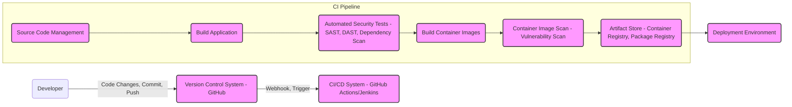

# BUSINESS POSTURE

- Business Priorities and Goals:
  - Goal: Provide a comprehensive error tracking and performance monitoring platform for software developers and organizations.
  - Goal: Enable faster identification, diagnosis, and resolution of software issues, leading to improved software quality and user experience.
  - Goal: Offer both cloud-hosted and self-hosted solutions to cater to diverse customer needs and compliance requirements.
  - Priority: Reliability and availability of the Sentry platform to ensure continuous monitoring and issue detection.
  - Priority: Data security and privacy to protect sensitive application data and customer information.
  - Priority: Scalability to handle increasing volumes of error data and user traffic.

- Business Risks:
  - Risk: Data breaches or unauthorized access to sensitive error data, leading to reputational damage and legal liabilities.
  - Risk: Service disruptions or outages impacting users' ability to monitor their applications, resulting in potential business losses for customers.
  - Risk: Performance bottlenecks or scalability limitations hindering the platform's ability to handle large volumes of data, affecting user experience.
  - Risk: Compliance violations related to data privacy regulations (e.g., GDPR, HIPAA) if data handling and security practices are inadequate.
  - Risk: Vendor lock-in if customers become overly reliant on the Sentry platform and face difficulties migrating to alternative solutions.

# SECURITY POSTURE

- Existing Security Controls:
  - security control: HTTPS encryption for web traffic to protect data in transit. Implemented at load balancer/web server level.
  - security control: Authentication and authorization mechanisms to control access to the Sentry platform. Implemented within Sentry application.
  - security control: Input validation to prevent common web vulnerabilities like cross-site scripting (XSS) and SQL injection. Implemented within Sentry application code.
  - security control: Regular security audits and penetration testing to identify and address vulnerabilities. Described in Sentry's security documentation (if available publicly).
  - security control: Secure software development lifecycle (SSDLC) practices, including code reviews and security testing. Implemented by Sentry development teams.
  - security control: Containerization and orchestration (e.g., Docker, Kubernetes) for deployment isolation and management. Implemented in deployment infrastructure.

- Accepted Risks:
  - accepted risk: Potential for vulnerabilities in third-party dependencies used by Sentry. Mitigated by dependency scanning and updates.
  - accepted risk: Risk of insider threats, mitigated by access controls, monitoring, and background checks (depending on Sentry's internal policies).
  - accepted risk: Complexity of managing a large-scale distributed system, potentially leading to misconfigurations or security oversights. Mitigated by automation and security best practices.

- Recommended Security Controls:
  - security control: Implement a Web Application Firewall (WAF) to protect against common web attacks.
  - security control: Employ a Security Information and Event Management (SIEM) system for security monitoring and incident response.
  - security control: Implement database encryption at rest to protect stored error data.
  - security control: Conduct regular vulnerability scanning of infrastructure and containers.
  - security control: Implement robust logging and monitoring of security-related events.
  - security control: Establish a formal incident response plan to handle security incidents effectively.
  - security control: Implement multi-factor authentication (MFA) for user accounts.
  - security control: Regularly update and patch all software components and dependencies.
  - security control: Implement static and dynamic application security testing (SAST/DAST) in the CI/CD pipeline.

- Security Requirements:
  - Authentication:
    - Requirement: Secure user authentication mechanisms (e.g., username/password, SSO, API keys).
    - Requirement: Support for strong password policies and password reset functionality.
    - Requirement: Option for multi-factor authentication (MFA) for enhanced security.
  - Authorization:
    - Requirement: Role-based access control (RBAC) to manage user permissions and access to different features and data.
    - Requirement: Granular authorization policies to control access to specific projects, teams, and data within Sentry.
    - Requirement: Audit logging of authorization decisions and access attempts.
  - Input Validation:
    - Requirement: Comprehensive input validation on all user-supplied data to prevent injection attacks (XSS, SQL injection, command injection, etc.).
    - Requirement: Input sanitization and encoding to mitigate XSS vulnerabilities.
    - Requirement: Rate limiting to prevent abuse and denial-of-service attacks.
  - Cryptography:
    - Requirement: Use of strong encryption algorithms for data in transit (HTTPS/TLS).
    - Requirement: Encryption of sensitive data at rest (e.g., database encryption).
    - Requirement: Secure storage and management of cryptographic keys.
    - Requirement: Hashing of passwords using strong one-way hash functions.

# DESIGN

## C4 CONTEXT

```mermaid
graph LR
    subgraph "Sentry System"
        S(Sentry)
    end
    U(Developers) -->|Uses to monitor applications and track errors| S
    O(Operations Teams) -->|Uses to monitor system health and performance| S
    AM(Applications Monitored) -->|Sends error and performance data| S
    N(Notification Systems) <--|Sends alerts and notifications| S
    E(External Integrations) <--|Integrates for data enrichment and workflow automation| S
    S --> DB(Databases)
    style S fill:#f9f,stroke:#333,stroke-width:2px
```

- Context Diagram Elements:
  - Element:
    - Name: Developers
    - Type: User
    - Description: Software developers who use Sentry to monitor their applications, track errors, and improve code quality.
    - Responsibilities: Integrate Sentry SDKs into their applications, configure error reporting, and use the Sentry UI to analyze errors.
    - Security controls: Authentication to access Sentry, authorization based on project roles.
  - Element:
    - Name: Operations Teams
    - Type: User
    - Description: Operations and SRE teams who use Sentry to monitor the health and performance of the Sentry system itself and potentially the monitored applications' infrastructure.
    - Responsibilities: Monitor Sentry system performance, manage Sentry infrastructure (if self-hosted), and potentially use Sentry for infrastructure monitoring.
    - Security controls: Authentication to access Sentry, authorization based on system administration roles.
  - Element:
    - Name: Applications Monitored
    - Type: Software System
    - Description: External applications (web applications, mobile apps, backend services, etc.) that are instrumented with Sentry SDKs to send error and performance data to Sentry.
    - Responsibilities: Generate and transmit error and performance events to the Sentry system.
    - Security controls: API keys or DSN (Data Source Name) for authentication when sending data to Sentry.
  - Element:
    - Name: Notification Systems
    - Type: Software System
    - Description: External systems (e.g., email, Slack, PagerDuty) that Sentry integrates with to send alerts and notifications about new errors or performance issues.
    - Responsibilities: Receive and deliver notifications from Sentry to users.
    - Security controls: API keys or webhooks for secure integration with Sentry.
  - Element:
    - Name: External Integrations
    - Type: Software System
    - Description: Other external services and platforms that Sentry integrates with for data enrichment, workflow automation, or extending functionality (e.g., issue tracking systems like Jira, source code repositories like GitHub).
    - Responsibilities: Exchange data with Sentry to enhance error context and streamline workflows.
    - Security controls: API keys, OAuth, or other authentication mechanisms for secure integration with Sentry.
  - Element:
    - Name: Databases
    - Type: Data Store
    - Description: Databases used by Sentry to store error data, user information, configuration settings, and other persistent data.
    - Responsibilities: Persist and retrieve data for the Sentry system.
    - Security controls: Access controls, encryption at rest, regular backups.
  - Element:
    - Name: Sentry
    - Type: Software System
    - Description: The Sentry error tracking and performance monitoring platform itself.
    - Responsibilities: Receive, process, store, and analyze error and performance data; provide a user interface for error analysis and management; send notifications; integrate with external systems.
    - Security controls: Authentication, authorization, input validation, data encryption, security logging, vulnerability management.

## C4 CONTAINER

```mermaid
graph LR
    subgraph "Sentry System"
        WUI(Web UI)
        API(API Service)
        IP(Ingestion Processor)
        EP(Event Processor)
        DS(Data Store)
        NQS(Notification Queue Service)
        NWS(Notification Worker Service)
        WUI --> API
        API --> IP
        IP --> EP
        EP --> DS
        EP --> NQS
        NQS --> NWS
    end
    U(Developers) --> WUI
    O(Operations Teams) --> WUI
    AM(Applications Monitored) --> API
    N(Notification Systems) <-- NWS
    E(External Integrations) <-- API
    DS --> DB(Databases)
    style WUI fill:#f9f,stroke:#333,stroke-width:2px
    style API fill:#f9f,stroke:#333,stroke-width:2px
    style IP fill:#f9f,stroke:#333,stroke-width:2px
    style EP fill:#f9f,stroke:#333,stroke-width:2px
    style DS fill:#f9f,stroke:#333,stroke-width:2px
    style NQS fill:#f9f,stroke:#333,stroke-width:2px
    style NWS fill:#f9f,stroke:#333,stroke-width:2px
```

- Container Diagram Elements:
  - Element:
    - Name: Web UI
    - Type: Web Application
    - Description: The user interface for developers and operations teams to interact with Sentry, view errors, manage projects, and configure settings. Built using web technologies (e.g., React, Python/Django).
    - Responsibilities: Present error data, provide user management features, handle user authentication and authorization, interact with the API Service.
    - Security controls: HTTPS, session management, input validation, output encoding, authentication and authorization mechanisms, rate limiting.
  - Element:
    - Name: API Service
    - Type: Web Application
    - Description: RESTful API that handles requests from the Web UI, Sentry SDKs, and external integrations. Built using API framework (e.g., Python/Django REST Framework).
    - Responsibilities: Authenticate and authorize requests, receive and process error data from SDKs, serve data to the Web UI, integrate with external systems.
    - Security controls: API authentication (API keys, DSN), authorization, input validation, rate limiting, output encoding, secure API design principles.
  - Element:
    - Name: Ingestion Processor
    - Type: Message Queue Consumer
    - Description: Asynchronously processes incoming error events from the API Service. Uses a message queue (e.g., Kafka, Redis) to handle high volumes of events.
    - Responsibilities: Validate and sanitize incoming error data, enrich error events, queue events for further processing.
    - Security controls: Input validation, data sanitization, secure communication with message queue.
  - Element:
    - Name: Event Processor
    - Type: Worker Service
    - Description: Processes queued error events from the Ingestion Processor. Performs tasks like grouping errors, symbolication, and storing data in the Data Store.
    - Responsibilities: Error grouping and deduplication, symbolication, data enrichment, data storage, trigger notifications.
    - Security controls: Secure data processing, access control to data store, secure communication with message queue.
  - Element:
    - Name: Data Store
    - Type: Database
    - Description: Persistent storage for error data, user information, project settings, and other Sentry data. Likely uses a combination of databases (e.g., PostgreSQL, ClickHouse).
    - Responsibilities: Store and retrieve all persistent data for Sentry.
    - Security controls: Database access controls, encryption at rest, regular backups, database hardening.
  - Element:
    - Name: Notification Queue Service
    - Type: Message Queue
    - Description: Message queue used to decouple event processing from notification sending.
    - Responsibilities: Queue notification tasks for the Notification Worker Service.
    - Security controls: Access control to the message queue, secure communication.
  - Element:
    - Name: Notification Worker Service
    - Type: Worker Service
    - Description: Processes notification tasks from the Notification Queue Service and sends alerts to configured notification systems (e.g., email, Slack).
    - Responsibilities: Send notifications to external systems based on error events.
    - Security controls: Secure communication with notification systems, rate limiting to prevent notification spam.

## DEPLOYMENT

- Deployment Options:
  - Cloud-hosted Sentry (Sentry SaaS): Deployed and managed by Sentry.io in their cloud infrastructure (e.g., AWS, GCP).
  - Self-hosted Sentry (On-Premise): Deployed and managed by customers in their own infrastructure (cloud or on-premise data centers).

- Detailed Deployment (Cloud-hosted Sentry - Example):

```mermaid
graph LR
    subgraph "Sentry Cloud Infrastructure (AWS/GCP)"
        LB(Load Balancer)
        subgraph "Web Servers"
            WS1(Web Server 1)
            WS2(Web Server 2)
        end
        subgraph "API Servers"
            AS1(API Server 1)
            AS2(API Server 2)
        end
        subgraph "Ingestion Processors"
            IP1(Ingestion Processor 1)
            IP2(Ingestion Processor 2)
        end
        subgraph "Event Processors"
            EP1(Event Processor 1)
            EP2(Event Processor 2)
        end
        subgraph "Data Stores"
            DB_PG(PostgreSQL Cluster)
            DB_CH(ClickHouse Cluster)
        end
        subgraph "Message Queues"
            MQ_Kafka(Kafka Cluster)
            MQ_Redis(Redis Cluster)
        end
        subgraph "Notification Workers"
            NW1(Notification Worker 1)
            NW2(Notification Worker 2)
        end
        LB --> WS1 & WS2
        LB --> AS1 & AS2
        WS1 & WS2 --> API Servers
        AS1 & AS2 --> IP Processors
        IP1 & IP2 --> MQ_Kafka
        MQ_Kafka --> EP Processors
        EP1 & EP2 --> DB_PG & DB_CH
        EP1 & EP2 --> MQ_Redis
        MQ_Redis --> NW Workers
    end
    U(Developers) --> LB
    O(Operations Teams) --> LB
    AM(Applications Monitored) --> LB
    N(Notification Systems) <-- NW Workers
    E(External Integrations) <-- LB
    style LB fill:#f9f,stroke:#333,stroke-width:2px
    style WS1 fill:#f9f,stroke:#333,stroke-width:2px
    style WS2 fill:#f9f,stroke:#333,stroke-width:2px
    style AS1 fill:#f9f,stroke:#333,stroke-width:2px
    style AS2 fill:#f9f,stroke:#333,stroke-width:2px
    style IP1 fill:#f9f,stroke:#333,stroke-width:2px
    style IP2 fill:#f9f,stroke:#333,stroke-width:2px
    style EP1 fill:#f9f,stroke:#333,stroke-width:2px
    style EP2 fill:#f9f,stroke:#333,stroke-width:2px
    style DB_PG fill:#f9f,stroke:#333,stroke-width:2px
    style DB_CH fill:#f9f,stroke:#333,stroke-width:2px
    style MQ_Kafka fill:#f9f,stroke:#333,stroke-width:2px
    style MQ_Redis fill:#f9f,stroke:#333,stroke-width:2px
    style NW1 fill:#f9f,stroke:#333,stroke-width:2px
    style NW2 fill:#f9f,stroke:#333,stroke-width:2px
```

- Deployment Diagram Elements:
  - Element:
    - Name: Load Balancer (LB)
    - Type: Infrastructure Component
    - Description: Distributes incoming traffic across Web Servers and API Servers for high availability and scalability.
    - Responsibilities: Traffic distribution, SSL termination, health checks.
    - Security controls: DDoS protection, rate limiting, TLS/SSL configuration, access control.
  - Element:
    - Name: Web Servers (WS1, WS2)
    - Type: Compute Instance
    - Description: Instances running the Web UI container.
    - Responsibilities: Serve the Web UI application, handle user requests.
    - Security controls: Hardened OS, security patching, container security, access control.
  - Element:
    - Name: API Servers (AS1, AS2)
    - Type: Compute Instance
    - Description: Instances running the API Service container.
    - Responsibilities: Serve the API, handle requests from SDKs and Web UI.
    - Security controls: Hardened OS, security patching, container security, access control, API security best practices.
  - Element:
    - Name: Ingestion Processors (IP1, IP2)
    - Type: Compute Instance
    - Description: Instances running the Ingestion Processor container.
    - Responsibilities: Process incoming error events, queue events.
    - Security controls: Hardened OS, security patching, container security, access control, secure communication with message queue.
  - Element:
    - Name: Event Processors (EP1, EP2)
    - Type: Compute Instance
    - Description: Instances running the Event Processor container.
    - Responsibilities: Process queued events, store data, trigger notifications.
    - Security controls: Hardened OS, security patching, container security, access control, secure communication with message queue and data stores.
  - Element:
    - Name: PostgreSQL Cluster (DB_PG)
    - Type: Database Cluster
    - Description: PostgreSQL database cluster for storing relational data.
    - Responsibilities: Persistent storage of relational data.
    - Security controls: Database access controls, encryption at rest, regular backups, database hardening, monitoring.
  - Element:
    - Name: ClickHouse Cluster (DB_CH)
    - Type: Database Cluster
    - Description: ClickHouse database cluster for storing time-series error event data.
    - Responsibilities: Persistent storage of event data for efficient querying and analysis.
    - Security controls: Database access controls, encryption at rest, regular backups, database hardening, monitoring.
  - Element:
    - Name: Kafka Cluster (MQ_Kafka)
    - Type: Message Queue Cluster
    - Description: Kafka cluster for asynchronous message queuing of error events.
    - Responsibilities: Reliable and scalable message queuing for event processing.
    - Security controls: Access control to message queue, secure communication, data encryption in transit (if configured).
  - Element:
    - Name: Redis Cluster (MQ_Redis)
    - Type: Message Queue Cluster
    - Description: Redis cluster for message queuing of notification tasks.
    - Responsibilities: Reliable message queuing for notification processing.
    - Security controls: Access control to message queue, secure communication.
  - Element:
    - Name: Notification Workers (NW1, NW2)
    - Type: Compute Instance
    - Description: Instances running the Notification Worker container.
    - Responsibilities: Send notifications to external systems.
    - Security controls: Hardened OS, security patching, container security, access control, secure communication with notification systems, rate limiting.

## BUILD



- Build Process Elements:
  - Element:
    - Name: Developer
    - Type: Human Role
    - Description: Software developers writing and modifying code for Sentry.
    - Responsibilities: Write code, commit changes to VCS, follow secure coding practices.
    - Security controls: Code reviews, security training, access control to development environment.
  - Element:
    - Name: Version Control System (VCS - GitHub)
    - Type: Software System
    - Description: Git repository hosted on GitHub for managing source code.
    - Responsibilities: Source code storage, version control, collaboration.
    - Security controls: Access control, branch protection, audit logging, secure configuration.
  - Element:
    - Name: CI/CD System (GitHub Actions/Jenkins)
    - Type: Automation System
    - Description: Continuous Integration and Continuous Delivery system for automating build, test, and deployment processes.
    - Responsibilities: Automate build pipeline, run tests, build artifacts, deploy to environments.
    - Security controls: Access control, secure pipeline configuration, secret management, audit logging.
  - Element:
    - Name: Source Code Management (SCM)
    - Type: CI Pipeline Stage
    - Description: Stage in CI pipeline to checkout source code from VCS.
    - Responsibilities: Retrieve latest code version for build.
    - Security controls: Secure access to VCS, integrity checks.
  - Element:
    - Name: Build Application
    - Type: CI Pipeline Stage
    - Description: Stage in CI pipeline to compile code, build executables and packages.
    - Responsibilities: Compile code, package application, create build artifacts.
    - Security controls: Secure build environment, dependency management, build process hardening.
  - Element:
    - Name: Automated Security Tests (SAST, DAST, Dependency Scan)
    - Type: CI Pipeline Stage
    - Description: Stage in CI pipeline to perform static and dynamic application security testing and dependency vulnerability scanning.
    - Responsibilities: Identify security vulnerabilities in code and dependencies.
    - Security controls: SAST/DAST tools configuration, dependency scanning tools, vulnerability reporting, fail build on critical vulnerabilities.
  - Element:
    - Name: Build Container Images
    - Type: CI Pipeline Stage
    - Description: Stage in CI pipeline to build container images (Docker images).
    - Responsibilities: Create container images for application components.
    - Security controls: Base image selection, minimal image creation, container security best practices.
  - Element:
    - Name: Container Image Scan (Vulnerability Scan)
    - Type: CI Pipeline Stage
    - Description: Stage in CI pipeline to scan container images for vulnerabilities.
    - Responsibilities: Identify vulnerabilities in container images.
    - Security controls: Container image scanning tools, vulnerability reporting, fail build on critical vulnerabilities.
  - Element:
    - Name: Artifact Store (Container Registry, Package Registry)
    - Type: Artifact Repository
    - Description: Repository for storing build artifacts, container images, and packages.
    - Responsibilities: Secure storage and distribution of build artifacts.
    - Security controls: Access control, vulnerability scanning of stored artifacts, secure storage.
  - Element:
    - Name: Deployment Environment
    - Type: Target Environment
    - Description: Target environment where Sentry is deployed (e.g., cloud infrastructure, on-premise servers).
    - Responsibilities: Run and operate Sentry application.
    - Security controls: Infrastructure security, application security, runtime security controls.

# RISK ASSESSMENT

- Critical Business Processes:
  - Process: Error tracking and monitoring for customer applications.
  - Process: Performance monitoring for customer applications.
  - Process: Alerting and notification of critical errors and performance issues.
  - Process: Data analysis and reporting on error trends and application health.
  - Process: User authentication and authorization to access Sentry platform.

- Data Sensitivity:
  - Data: Error event data (stack traces, error messages, user context, request details).
    - Sensitivity: Potentially high, may contain PII (Personally Identifiable Information), application secrets, or sensitive business logic depending on application and configuration.
  - Data: Performance data (transactions, spans, metrics).
    - Sensitivity: Medium, may reveal application performance characteristics and usage patterns.
  - Data: User account information (usernames, emails, roles).
    - Sensitivity: High, PII, requires strong protection.
  - Data: Project configuration and settings.
    - Sensitivity: Medium, may contain sensitive configuration details.
  - Data: API keys and DSNs.
    - Sensitivity: High, credentials for accessing Sentry API and sending data.

# QUESTIONS & ASSUMPTIONS

- Questions:
  - What specific databases are used for different types of data in Sentry (e.g., PostgreSQL, ClickHouse, Redis)?
  - What message queue technologies are used for internal communication (e.g., Kafka, Redis)?
  - What are the specific authentication and authorization mechanisms used for API access and user interface access?
  - What are the details of Sentry's data retention policies and data deletion mechanisms?
  - What specific SAST/DAST and dependency scanning tools are used in the CI/CD pipeline?
  - What are the details of Sentry's incident response plan and security monitoring capabilities?

- Assumptions:
  - Assumption: Sentry is designed as a distributed system with microservices architecture.
  - Assumption: Sentry uses message queues for asynchronous processing of events and notifications.
  - Assumption: Sentry stores data in multiple database systems optimized for different data types.
  - Assumption: Sentry prioritizes data security and privacy due to the sensitive nature of error and performance data.
  - Assumption: Sentry has a mature software development lifecycle with security integrated into the process.
  - Assumption: The provided GitHub repository represents the core Sentry platform, and the design document is based on a general understanding of such systems.