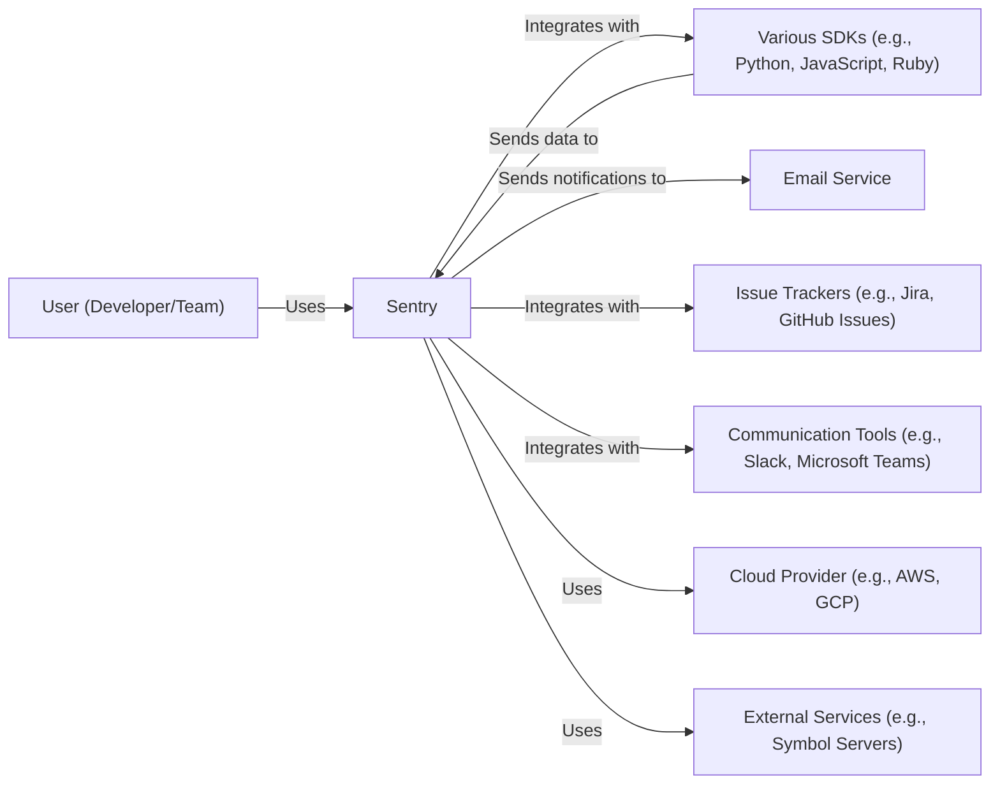
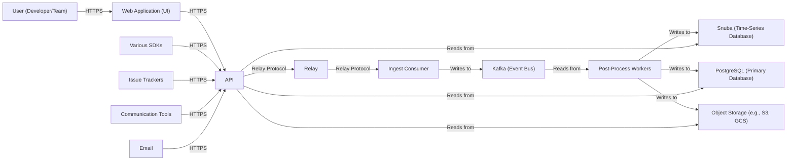
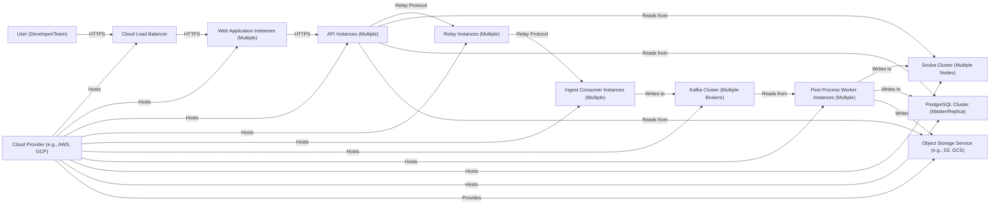
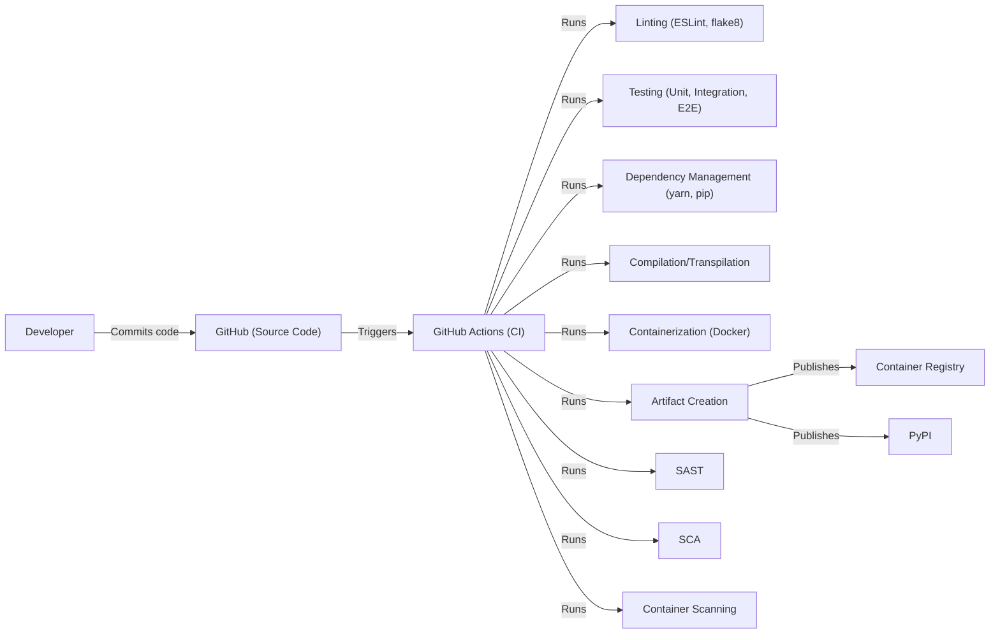

Okay, let's create a design document for Sentry, based on the provided GitHub repository.

# BUSINESS POSTURE

Sentry is an established, widely-used error tracking and performance monitoring platform. It's a critical tool for many organizations, ranging from startups to large enterprises.  The primary business goals are:

*   Provide a reliable and scalable service for tracking errors and performance issues in software applications.
*   Enable developers to quickly identify, diagnose, and resolve issues, improving software quality and user experience.
*   Offer a platform that integrates with a wide variety of programming languages, frameworks, and development tools.
*   Maintain customer trust by ensuring the security and privacy of sensitive data.
*   Provide different tiers of service, including a free tier for small projects and paid tiers for larger organizations with more advanced needs.

The most important business risks that need to be addressed are:

*   Service Outages: Any downtime or performance degradation of the Sentry platform directly impacts customers' ability to monitor their applications, potentially leading to delayed issue resolution and negative user experiences.
*   Data Breaches: Sentry handles sensitive data, including error details, stack traces, and potentially user information. A data breach could expose this information, leading to reputational damage, legal liabilities, and loss of customer trust.
*   Data Loss: Loss of customer data, whether due to hardware failure, software bugs, or malicious attacks, would be catastrophic for Sentry and its users.
*   Scalability Issues: As Sentry's user base grows, the platform must be able to scale to handle increasing volumes of data and traffic without impacting performance or reliability.
*   Compliance Violations: Sentry must comply with relevant data privacy regulations (e.g., GDPR, CCPA) and industry standards. Failure to do so could result in fines, legal action, and reputational damage.
*   Compromised Customer Credentials: If customer accounts are compromised, attackers could gain access to sensitive data or disrupt the service for other users.

# SECURITY POSTURE

Sentry likely employs a comprehensive set of security controls, given its role and the sensitivity of the data it handles. Based on the repository and common practices, we can infer the following:

*   security control: Secure Software Development Lifecycle (SSDLC): Sentry's development process likely includes security considerations at each stage, from design and coding to testing and deployment. This includes practices like code reviews, security testing, and vulnerability management. (Evidenced by the presence of security-related documentation, testing infrastructure, and dependency management tools in the repository).
*   security control: Input Validation: Sentry must rigorously validate all incoming data to prevent injection attacks and other vulnerabilities. This includes sanitizing user input, validating API requests, and handling data from various sources securely. (Evidenced by the use of frameworks and libraries that provide input validation features, and likely custom validation logic).
*   security control: Authentication and Authorization: Sentry implements robust authentication mechanisms to verify user identities and authorization controls to restrict access to sensitive data and functionality based on user roles and permissions. (Evidenced by the presence of authentication-related code and configuration files).
*   security control: Encryption: Sentry likely encrypts data both in transit (using TLS/SSL) and at rest (using database encryption and potentially other encryption mechanisms). (Evidenced by configuration files and code related to HTTPS and encryption libraries).
*   security control: Regular Security Audits and Penetration Testing: Sentry likely undergoes regular security audits and penetration testing to identify and address potential vulnerabilities. (Inferred from industry best practices and Sentry's position as a security-focused company).
*   security control: Incident Response Plan: Sentry has a documented incident response plan to handle security incidents effectively and minimize their impact. (Inferred from industry best practices and Sentry's position as a security-focused company).
*   security control: Data Backup and Recovery: Sentry implements robust data backup and recovery procedures to ensure data availability and prevent data loss. (Inferred from industry best practices and the use of cloud infrastructure).
*   security control: Monitoring and Alerting: Sentry continuously monitors its systems and infrastructure for security threats and anomalies, and has alerting mechanisms in place to notify administrators of potential issues. (Inferred from the nature of the Sentry service and its use of monitoring tools).
*   security control: Compliance with Regulations: Sentry is designed to comply with relevant data privacy regulations and industry standards. (Evidenced by documentation and features related to GDPR, CCPA, and other regulations).
*   security control: Access Control: Access to production systems and sensitive data is strictly controlled and limited to authorized personnel. (Inferred from industry best practices).
*   security control: Dependency Management: Sentry uses dependency management tools to track and update third-party libraries, reducing the risk of vulnerabilities introduced through dependencies. (Evidenced by the presence of dependency management files in the repository).
*   security control: Rate Limiting: Sentry likely implements rate limiting to protect against denial-of-service attacks and abuse. (Inferred from industry best practices and the nature of the service).
*   security control: Web Application Firewall (WAF): A WAF is likely used to protect against common web application attacks. (Inferred from industry best practices).
*   accepted risk: Given the nature of error tracking, Sentry inherently handles potentially sensitive data within error reports. While mitigation's are in place (data scrubbing, encryption), there's an accepted risk that some sensitive data may be present in error reports. This is mitigated by user education and data minimization practices.
*   accepted risk: Sentry relies on third-party services and libraries. While efforts are made to vet these dependencies, there's an accepted risk of vulnerabilities in these external components. This is mitigated by regular updates and security scanning.

Recommended Security Controls (High Priority):

*   Implement a robust secrets management solution to securely store and manage API keys, database credentials, and other sensitive information.
*   Enhance data scrubbing capabilities to automatically identify and remove sensitive data from error reports before they are stored.
*   Implement a comprehensive vulnerability disclosure program to encourage responsible reporting of security vulnerabilities.
*   Consider implementing end-to-end encryption for sensitive data within error reports, providing an additional layer of protection.

Security Requirements:

*   Authentication:
    *   Support for strong passwords and multi-factor authentication (MFA).
    *   Secure session management, including protection against session hijacking and fixation.
    *   Integration with common identity providers (e.g., SAML, OAuth).
*   Authorization:
    *   Role-based access control (RBAC) to restrict access to data and functionality based on user roles.
    *   Fine-grained permissions to control access at the project and resource level.
    *   Audit logging of all user actions and access attempts.
*   Input Validation:
    *   Strict validation of all user input to prevent injection attacks (e.g., XSS, SQL injection).
    *   Validation of data received from external sources, including SDKs and integrations.
    *   Data sanitization to remove or encode potentially harmful characters.
*   Cryptography:
    *   Use of strong, industry-standard encryption algorithms (e.g., AES, RSA).
    *   Secure key management practices, including regular key rotation.
    *   Encryption of data in transit using TLS/SSL.
    *   Encryption of data at rest using appropriate encryption mechanisms.
*   Data Loss Prevention:
    *   Implement data loss prevention (DLP) measures to prevent sensitive data from leaving the Sentry platform without authorization.

# DESIGN

## C4 CONTEXT

Element Descriptions:

*   Element:
    *   Name: User (Developer/Team)
    *   Type: Person
    *   Description: Developers or teams using Sentry to monitor their applications.
    *   Responsibilities: Configure Sentry SDKs, view error reports, manage projects, and resolve issues.
    *   Security controls: Authentication (MFA, strong passwords), authorization (RBAC), session management.

*   Element:
    *   Name: Sentry
    *   Type: Software System
    *   Description: The Sentry error tracking and performance monitoring platform.
    *   Responsibilities: Collect, process, store, and display error and performance data. Provide user interface, API, and integrations.
    *   Security controls: Input validation, encryption, access control, monitoring, alerting, incident response, compliance.

*   Element:
    *   Name: Various SDKs (e.g., Python, JavaScript, Ruby)
    *   Type: Software System
    *   Description: Client libraries used to integrate applications with Sentry.
    *   Responsibilities: Capture errors and performance data within applications and send it to the Sentry platform.
    *   Security controls: Secure communication (TLS), data sanitization, minimal data collection.

*   Element:
    *   Name: Email Service
    *   Type: External System
    *   Description: A third-party service used to send email notifications.
    *   Responsibilities: Deliver email notifications to users.
    *   Security controls: Secure communication (TLS), sender authentication (SPF, DKIM, DMARC).

*   Element:
    *   Name: Issue Trackers (e.g., Jira, GitHub Issues)
    *   Type: External System
    *   Description: Third-party issue tracking systems used to manage and track issues.
    *   Responsibilities: Store and manage issue information.
    *   Security controls: API authentication, access control.

*   Element:
    *   Name: Communication Tools (e.g., Slack, Microsoft Teams)
    *   Type: External System
    *   Description: Third-party communication platforms used for notifications and collaboration.
    *   Responsibilities: Deliver notifications and facilitate communication.
    *   Security controls: API authentication, access control.

*   Element:
    *   Name: Cloud Provider (e.g., AWS, GCP)
    *   Type: External System
    *   Description: The cloud infrastructure provider used to host the Sentry platform.
    *   Responsibilities: Provide compute, storage, networking, and other infrastructure services.
    *   Security controls: Physical security, network security, access control, compliance certifications.

*   Element:
    *   Name: External Services (e.g., Symbol Servers)
    *   Type: External System
    *   Description: External services used by Sentry for specific functionalities, such as symbol servers for stack trace deobfuscation.
    *   Responsibilities: Provide specific services as required.
    *   Security controls: Secure communication, API authentication.

## C4 CONTAINER

Element Descriptions:

*   Element:
    *   Name: Web Application (UI)
    *   Type: Web Application
    *   Description: The user interface for interacting with Sentry.
    *   Responsibilities: Provide a user-friendly interface for viewing error reports, managing projects, configuring settings, etc.
    *   Security controls: Authentication, authorization, session management, input validation, XSS protection.

*   Element:
    *   Name: API
    *   Type: API Application
    *   Description: The backend API for the Sentry platform.
    *   Responsibilities: Handle requests from the web application, SDKs, and integrations. Provide access to data and functionality.
    *   Security controls: Authentication, authorization, input validation, rate limiting, API security best practices.

*   Element:
    *   Name: Relay
    *   Type: Application
    *   Description: An intermediary service that receives data from SDKs and forwards it to the ingest consumer.  It performs preprocessing and filtering.
    *   Responsibilities: Receive, validate, preprocess, and forward event data.
    *   Security controls: Input validation, rate limiting, TLS encryption.

*   Element:
    *   Name: Ingest Consumer
    *   Type: Application
    *   Description: Consumes events from Relay and writes them to the event bus (Kafka).
    *   Responsibilities: Consume event data and write it to Kafka.
    *   Security controls: Authentication, authorization.

*   Element:
    *   Name: Kafka (Event Bus)
    *   Type: Message Queue
    *   Description: A distributed event streaming platform used to handle the high volume of incoming events.
    *   Responsibilities: Store and stream event data.
    *   Security controls: Authentication, authorization, encryption.

*   Element:
    *   Name: Post-Process Workers
    *   Type: Application
    *   Description: Workers that consume events from Kafka and perform various processing tasks.
    *   Responsibilities: Process event data, enrich it, and store it in the appropriate databases.
    *   Security controls: Authentication, authorization, data sanitization.

*   Element:
    *   Name: Snuba (Time-Series Database)
    *   Type: Database
    *   Description: A time-series database used to store aggregated event data for querying and analysis.
    *   Responsibilities: Store and query time-series data.
    *   Security controls: Authentication, authorization, encryption at rest.

*   Element:
    *   Name: PostgreSQL (Primary Database)
    *   Type: Database
    *   Description: The primary relational database used to store user data, project configuration, and other metadata.
    *   Responsibilities: Store and manage relational data.
    *   Security controls: Authentication, authorization, encryption at rest, access control.

*   Element:
    *   Name: Object Storage (e.g., S3, GCS)
    *   Type: Object Storage
    *   Description: Object storage used to store large files, such as source maps and debug symbols.
    *   Responsibilities: Store and retrieve large files.
    *   Security controls: Authentication, authorization, encryption at rest, access control.

*   Element:
    *   Name: Various SDKs
    *   Type: Software System
    *   Description: Client libraries used to integrate applications with Sentry.
    *   Responsibilities: Capture errors and performance data within applications and send it to the Sentry platform.
    *   Security controls: Secure communication (TLS), data sanitization, minimal data collection.

*   Element:
    *   Name: Issue Trackers
    *   Type: External System
    *   Description: Third-party issue tracking systems used to manage and track issues.
    *   Responsibilities: Store and manage issue information.
    *   Security controls: API authentication, access control.

*   Element:
    *   Name: Communication Tools
    *   Type: External System
    *   Description: Third-party communication platforms used for notifications and collaboration.
    *   Responsibilities: Deliver notifications and facilitate communication.
    *   Security controls: API authentication, access control.

*   Element:
    *   Name: Email
    *   Type: External System
    *   Description: A third-party service used to send email notifications.
    *   Responsibilities: Deliver email notifications to users.
    *   Security controls: Secure communication (TLS), sender authentication (SPF, DKIM, DMARC).

## DEPLOYMENT

Sentry is a complex application with multiple deployment options. Here are a few possibilities:

1.  **Self-Hosted (On-Premise):** Customers can deploy Sentry on their own infrastructure, using Docker Compose or Kubernetes. This provides maximum control over data and infrastructure but requires more operational overhead.
2.  **Sentry-Hosted (SaaS):** Sentry offers a fully managed SaaS solution, where they handle the infrastructure, scaling, and maintenance. This is the easiest option for most customers.
3.  **Hybrid:** A combination of self-hosted and Sentry-hosted components is possible, although less common.

We'll describe the **Sentry-Hosted (SaaS)** deployment model in detail, as it's the most common and relevant for understanding Sentry's overall architecture.

Element Descriptions:

*   Element:
    *   Name: User (Developer/Team)
    *   Type: Person
    *   Description: Developers or teams using Sentry to monitor their applications.
    *   Responsibilities: Configure Sentry SDKs, view error reports, manage projects, and resolve issues.
    *   Security controls: Authentication (MFA, strong passwords), authorization (RBAC), session management.

*   Element:
    *   Name: Cloud Load Balancer
    *   Type: Load Balancer
    *   Description: Distributes incoming traffic across multiple instances of the web application and API.
    *   Responsibilities: Load balancing, SSL termination.
    *   Security controls: DDoS protection, WAF integration.

*   Element:
    *   Name: Web Application Instances (Multiple)
    *   Type: Web Application Instance
    *   Description: Multiple instances of the Sentry web application, running in containers or virtual machines.
    *   Responsibilities: Serve the user interface.
    *   Security controls: OS hardening, container security, regular patching.

*   Element:
    *   Name: API Instances (Multiple)
    *   Type: API Application Instance
    *   Description: Multiple instances of the Sentry API, running in containers or virtual machines.
    *   Responsibilities: Handle API requests.
    *   Security controls: OS hardening, container security, regular patching.

*   Element:
    *   Name: Relay Instances (Multiple)
    *   Type: Application Instance
    *   Description: Multiple instances of the Relay service.
    *   Responsibilities: Receive and preprocess event data.
    *   Security controls: OS hardening, container security, regular patching.

*   Element:
    *   Name: Ingest Consumer Instances (Multiple)
    *   Type: Application Instance
    *   Description: Multiple instances of the Ingest Consumer.
    *   Responsibilities: Consume events and write to Kafka.
    *   Security controls: OS hardening, container security, regular patching.

*   Element:
    *   Name: Kafka Cluster (Multiple Brokers)
    *   Type: Message Queue Cluster
    *   Description: A cluster of Kafka brokers for high availability and scalability.
    *   Responsibilities: Store and stream event data.
    *   Security controls: Network security, authentication, authorization, encryption.

*   Element:
    *   Name: Post-Process Worker Instances (Multiple)
    *   Type: Application Instance
    *   Description: Multiple instances of the post-processing workers.
    *   Responsibilities: Process events and store data.
    *   Security controls: OS hardening, container security, regular patching.

*   Element:
    *   Name: Snuba Cluster (Multiple Nodes)
    *   Type: Database Cluster
    *   Description: A cluster of Snuba nodes for high availability and scalability.
    *   Responsibilities: Store and query time-series data.
    *   Security controls: Network security, authentication, authorization, encryption at rest.

*   Element:
    *   Name: PostgreSQL Cluster (Master/Replica)
    *   Type: Database Cluster
    *   Description: A PostgreSQL cluster with a master node for writes and replica nodes for reads.
    *   Responsibilities: Store and manage relational data.
    *   Security controls: Network security, authentication, authorization, encryption at rest, access control.

*   Element:
    *   Name: Object Storage Service (e.g., S3, GCS)
    *   Type: Object Storage Service
    *   Description: A managed object storage service provided by the cloud provider.
    *   Responsibilities: Store and retrieve large files.
    *   Security controls: Access control, encryption at rest, versioning.

*   Element:
    *   Name: Cloud Provider (e.g., AWS, GCP)
    *   Type: Cloud Provider
    *   Description: The underlying cloud infrastructure provider.
    *   Responsibilities: Provide compute, storage, networking, and other infrastructure services.
    *   Security controls: Physical security, network security, access control, compliance certifications.

## BUILD

Sentry's build process is complex and involves multiple steps and tools. Based on the repository, we can infer the following:

1.  **Development:** Developers write code and commit changes to the Git repository (GitHub).
2.  **Continuous Integration (CI):** Sentry uses GitHub Actions for CI.  Workflows are triggered on pull requests and pushes to specific branches.
3.  **Build Steps:**
    *   **Linting:** Code is checked for style and potential errors using linters (e.g., ESLint, flake8).
    *   **Testing:** Unit tests, integration tests, and end-to-end tests are run to ensure code quality and functionality.
    *   **Dependency Management:** Dependencies are managed using tools like `yarn` and `pip`.
    *   **Compilation/Transpilation:** Code is compiled or transpiled as needed (e.g., TypeScript to JavaScript).
    *   **Containerization:** Docker is used to build container images for various services.
    *   **Artifact Creation:** Build artifacts (e.g., container images, Python packages) are created.
4.  **Artifact Publishing:**
    *   Container images are pushed to a container registry (e.g., Docker Hub, GitHub Container Registry).
    *   Python packages are published to PyPI.
5.  **Security Checks:**
    *   **Static Application Security Testing (SAST):** SAST tools are likely used to scan the codebase for vulnerabilities.
    *   **Software Composition Analysis (SCA):** SCA tools are used to identify vulnerabilities in third-party dependencies.
    *   **Container Scanning:** Container images are scanned for vulnerabilities.

# RISK ASSESSMENT

*   **Critical Business Processes:**
    *   Event Ingestion: The ability to reliably receive and process error and performance data from customer applications.
    *   Data Storage and Retrieval: The ability to store and retrieve event data efficiently and securely.
    *   User Interface and API: The ability for users to access and interact with the Sentry platform.
    *   Alerting and Notifications: The ability to notify users of critical issues in a timely manner.
    *   Integrations: The ability to integrate with other tools and services in the development workflow.

*   **Data Sensitivity:**
    *   Error Data: Contains stack traces, source code snippets, environment variables, and potentially user data.  Sensitivity: **High**
    *   Performance Data: Contains performance metrics, transaction traces, and potentially user data. Sensitivity: **Medium**
    *   User Data: Contains user account information, email addresses, API keys, and project settings. Sensitivity: **High**
    *   Project Configuration: Contains project settings, integrations, and team member information. Sensitivity: **Medium**
    *   Billing Information: Contains payment details and subscription information. Sensitivity: **High**

# QUESTIONS & ASSUMPTIONS

*   **Questions:**
    *   What specific SAST, DAST and SCA tools are used in the build pipeline?
    *   What are the specific data retention policies for different types of data?
    *   What are the specific disaster recovery procedures and RTO/RPO objectives?
    *   What are the specific procedures for handling security incidents and data breaches?
    *   What level of penetration testing is conducted, and how frequently?
    *   Are there any specific compliance requirements (e.g., HIPAA, PCI DSS) that need to be considered beyond GDPR and CCPA?
    *   What is the process for managing and rotating secrets (e.g., API keys, database credentials)?
    *   What specific measures are in place to protect against insider threats?
    *   What is the process for onboarding and offboarding employees with access to sensitive systems?
    *   How is the supply chain security of third-party dependencies managed and monitored?

*   **Assumptions:**
    *   BUSINESS POSTURE: Sentry prioritizes security and reliability due to the nature of its service and the sensitivity of the data it handles.
    *   SECURITY POSTURE: Sentry employs a defense-in-depth security strategy with multiple layers of security controls.
    *   DESIGN: The architecture is designed for scalability, high availability, and fault tolerance. The deployment model is primarily SaaS-based, with self-hosting options available. The build process is automated and includes security checks.
    *   Sentry uses industry-standard security practices and technologies.
    *   Sentry has a dedicated security team responsible for maintaining and improving the security of the platform.
    *   Regular security audits and penetration testing are conducted.
    *   Sentry complies with relevant data privacy regulations and industry standards.
    *   There is an incident response plan in place to handle security incidents.
    *   Data is backed up regularly and can be restored in case of data loss.
    *   Access to production systems is strictly controlled and monitored.
    *   Third-party dependencies are regularly updated and scanned for vulnerabilities.
    *   Rate limiting is implemented to protect against abuse and denial-of-service attacks.