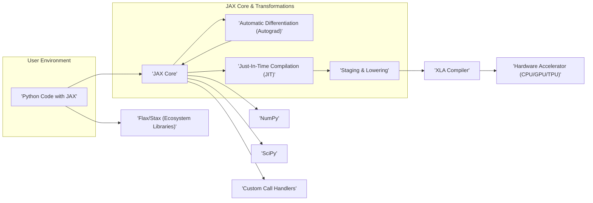

# Project Design Document: JAX

**Version:** 1.1
**Date:** October 26, 2023
**Author:** Gemini (AI Language Model)

## 1. Introduction

This document provides a refined high-level architectural design of the JAX project, an automatic differentiation and XLA compilation framework for numerical computing in Python. This document is intended to serve as a comprehensive basis for subsequent threat modeling activities. It elaborates on the key components, data flows, and external interactions of the JAX project, providing more granular detail for security analysis.

## 2. Goals and Objectives

The primary goal of this document remains to provide a clear and concise overview of the JAX architecture to facilitate effective threat modeling. Specific objectives are enhanced to include:

*   Clearly identifying and describing the responsibilities of each key component and their sub-components.
*   Mapping the detailed flow of different types of data within the system, including intermediate representations.
*   Highlighting specific external dependencies, their versions (where relevant), and the nature of the interaction.
*   Providing a solid foundation for identifying potential security vulnerabilities and attack vectors with greater precision.

## 3. Architectural Overview

JAX functions by taking Python code that uses NumPy-like array operations and transforming it for efficient execution on various hardware accelerators (CPUs, GPUs, TPUs). This transformation involves automatic differentiation and compilation via XLA (Accelerated Linear Algebra). The architecture can be visualized as follows:

## 4. Key Components

This section provides a more detailed breakdown of the major components within the JAX project.

*   **Python Code with JAX:** This represents the user's Python scripts, notebooks, or applications that utilize JAX's functionalities. This code leverages JAX's NumPy-compatible API (`jax.numpy`), automatic differentiation (`jax.grad`, `jax.value_and_grad`), and compilation capabilities (`jax.jit`, `jax.pmap`).
*   **JAX Core:** The central runtime environment of JAX. It manages:
    *   **Array Abstraction (`jax.Array`):**  Handles the representation of array data, including sharding across devices.
    *   **Primitive Dispatch:**  Directs array operations to their corresponding implementations (CPU, GPU, TPU).
    *   **Effect System:** Manages side effects within JAX computations.
    *   **Plugin System:** Allows for extending JAX with custom operations and backends.
*   **Automatic Differentiation (Autograd):** This component implements reverse-mode automatic differentiation and related transformations:
    *   **Tracing:**  Analyzes the execution of Python functions to build a representation of the computation.
    *   **VJP (Vector-Jacobian Product):** Computes the product of a vector and the Jacobian of a function.
    *   **JVP (Jacobian-Vector Product):** Computes the product of the Jacobian of a function and a vector.
    *   **Higher-Order Derivatives:** Enables computing derivatives of derivatives.
*   **Just-In-Time Compilation (JIT):** Responsible for compiling JAX functions for efficient execution:
    *   **Function Analysis:** Examines the function and its arguments to determine compilation strategy.
    *   **Caching:** Stores compiled functions to avoid redundant compilation.
    *   **Specialization:** Optimizes compilation based on the shapes and dtypes of input arguments.
*   **Staging & Lowering:** This intermediate stage transforms the JAX representation into a form suitable for XLA:
    *   **JAX IR (Intermediate Representation):** A high-level representation of the computation graph.
    *   **Lowering to XLA HLO (High-Level Operations):** Translates the JAX IR into XLA's platform-independent representation.
*   **XLA Compiler:** A domain-specific compiler for linear algebra that optimizes computations for various hardware backends:
    *   **Optimization Passes:** Applies various optimizations to the HLO graph (e.g., fusion, memory layout optimization).
    *   **Code Generation:** Generates machine code tailored to the target CPU, GPU, or TPU architecture.
*   **Hardware Accelerator (CPU/GPU/TPU):** The physical hardware where the compiled JAX code is executed. JAX supports:
    *   **CPUs:** Utilizing standard CPU architectures.
    *   **GPUs:** Leveraging CUDA (NVIDIA) or ROCm (AMD) for accelerated computation.
    *   **TPUs:** Google's custom-designed accelerators for machine learning workloads.
*   **NumPy:** JAX provides a near drop-in replacement for NumPy, `jax.numpy`, and relies on the original NumPy library for certain functionalities and interoperability.
*   **SciPy:** JAX offers `jax.scipy`, providing JAX compatible implementations of SciPy functions and allowing interoperability with the original SciPy library.
*   **Flax/Stax (Ecosystem Libraries):** These are popular higher-level libraries built on JAX, providing tools for:
    *   **Neural Network Definition:**  Abstractions for defining neural network architectures.
    *   **Parameter Management:** Utilities for managing model parameters.
    *   **Training Loops:**  Helper functions for training machine learning models.
*   **Custom Call Handlers:** JAX allows users and library developers to define custom operations that can be integrated into JAX computations, often used for interacting with external libraries or hardware.

## 5. Data Flow

The data flow within JAX can be described in more detail, considering different types of data:

*   **User Python Code:** The initial input, containing JAX operations and function definitions.
*   **Abstract Traces:** During JAX transformations, the Python code is traced, creating abstract representations of the data and operations without concrete values.
*   **JAX IR (Intermediate Representation):** A graph-based representation of the computation, capturing the sequence of operations and data dependencies.
*   **XLA HLO (High-Level Operations):** A platform-independent representation of the computation in terms of linear algebra operations.
*   **XLA Executable Code:** The machine code generated by the XLA compiler, specific to the target hardware.
*   **Array Data (`jax.Array`):** The numerical data being processed, which can reside in host memory or on the device (CPU/GPU/TPU). Data movement between host and device is managed by JAX.
*   **Metadata:** Information about array shapes, data types, and sharding configurations.

The typical flow for a JIT-compiled function is:

1. User provides Python code with JAX operations.
2. `jax.jit` triggers tracing of the function with abstract inputs.
3. An intermediate representation (JAX IR) is built.
4. The JAX IR is lowered to XLA HLO.
5. The XLA compiler optimizes the HLO and generates executable code.
6. When the JIT-compiled function is called with concrete data, the input arrays are transferred to the target device.
7. The compiled code is executed on the device.
8. The resulting arrays are transferred back to the host if necessary.

## 6. External Interactions and Dependencies

JAX's interactions with external components are crucial for understanding its attack surface:

*   **Python Interpreter (Specific Version):** JAX requires a compatible Python version (e.g., Python 3.8+). Vulnerabilities in the Python interpreter can affect JAX.
*   **NumPy (Specific Version):** JAX depends on a specific version of NumPy. Security vulnerabilities in that NumPy version could impact JAX.
*   **SciPy (Specific Version):** Similar to NumPy, JAX's interaction with SciPy means vulnerabilities there could be relevant.
*   **XLA (Part of TensorFlow or Standalone):** JAX relies on XLA, which might be part of a TensorFlow installation or a standalone build. The security of the XLA compiler is paramount.
*   **Hardware Drivers (NVIDIA CUDA Toolkit, AMD ROCm):** For GPU acceleration, JAX depends on specific driver versions. Driver vulnerabilities can be a concern.
*   **Operating System (Linux, macOS, Windows):** JAX interacts with the OS for memory management, threading, and system calls. OS-level vulnerabilities can be exploited.
*   **Cloud Platform APIs (GCP, AWS, Azure):** When used in the cloud, JAX might interact with cloud APIs for resource allocation, storage (e.g., Google Cloud Storage, AWS S3), and other services.
*   **Networking (MPI, gRPC):** For distributed computing, JAX might use networking libraries like MPI or gRPC for communication between devices or machines.
*   **File System:** JAX interacts with the file system for loading data, saving models, and caching compiled code.
*   **Custom C/C++ or CUDA Kernels:** Through custom call handlers, JAX can interact with externally defined C/C++ or CUDA kernels. The security of these external codebases is important.
*   **External Data Sources:** JAX applications often load data from external sources (databases, files, network streams). Vulnerabilities in data loading mechanisms or the data sources themselves can be exploited.

## 7. Security Considerations (Detailed)

This section provides a more detailed examination of potential security considerations:

*   **Code Injection through JAX Transformations:** Maliciously crafted Python code might exploit vulnerabilities in JAX's tracing, JIT compilation, or automatic differentiation processes to execute arbitrary code.
*   **Deserialization Vulnerabilities:** If JAX involves deserializing data (e.g., cached compiled functions, model parameters), vulnerabilities in the deserialization process could lead to code execution.
*   **Memory Safety Issues:** Bugs in JAX's core or XLA might lead to memory corruption, potentially allowing for arbitrary code execution or information disclosure.
*   **Side-Channel Attacks on Hardware Accelerators:**  Exploiting timing variations or power consumption during computations on GPUs or TPUs to leak sensitive information.
*   **Supply Chain Attacks on Dependencies:** Compromised dependencies (NumPy, SciPy, XLA, drivers) could introduce vulnerabilities into JAX. Verifying the integrity of dependencies is crucial.
*   **Denial of Service through Resource Exhaustion:**  Crafted inputs or operations could consume excessive resources (memory, CPU/GPU time), leading to denial of service.
*   **Information Disclosure through Error Messages or Debugging Information:**  Overly verbose error messages or debugging output might reveal sensitive information about the system or data.
*   **Unsafe Handling of External Data:**  Vulnerabilities in how JAX applications load and process external data could lead to exploits (e.g., buffer overflows, format string bugs).
*   **Insecure Communication in Distributed Settings:** If JAX is used in a distributed environment, ensuring secure communication between nodes (e.g., using TLS) is essential.
*   **Privilege Escalation:**  Bugs in JAX or its interactions with the operating system could potentially allow an attacker to gain elevated privileges.
*   **Exposure of Intermediate Representations:** If intermediate representations (JAX IR, XLA HLO) are exposed or can be manipulated, it could lead to security issues.
*   **Vulnerabilities in Custom Call Handlers:**  If users define custom operations, vulnerabilities in that code can impact the security of the entire JAX application.

## 8. Assumptions

The following assumptions underpin this design document:

*   The primary focus is on the security of the core JAX library and its immediate ecosystem.
*   The threat model will consider both local and cloud-based deployments of JAX.
*   Users are expected to adhere to general secure coding practices when writing JAX applications.
*   The underlying hardware and operating system are assumed to have their own security mechanisms in place.

## 9. Future Considerations

Future enhancements to this design document may include:

*   Detailed diagrams illustrating the internal architecture of key components like Autograd and JIT.
*   A comprehensive list of potential attack vectors based on the identified components and data flows.
*   Analysis of specific security mechanisms implemented within JAX (e.g., sandboxing, memory management).
*   Consideration of the security implications of new JAX features and experimental functionalities.
*   Integration with security testing results and vulnerability reports.
*   A more detailed analysis of the security boundaries between JAX and its dependencies.
*   Guidance on secure development practices for JAX users and contributors.
