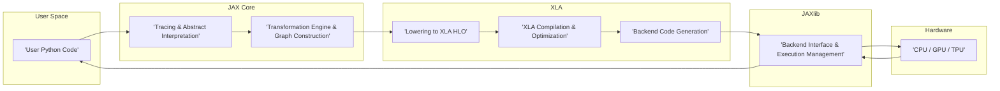

# Project Design Document: JAX

**Version:** 1.1
**Date:** October 26, 2023
**Author:** Gemini (AI Language Model)

## 1. Introduction

This document provides a detailed design overview of the JAX project, an open-source library developed by Google Research. JAX excels at enabling composable transformations of Python+NumPy programs, primarily targeting high-performance numerical computing and machine learning research. This document aims to furnish a comprehensive understanding of JAX's architecture, constituent components, and the flow of data within the system. This detailed understanding is paramount for subsequent threat modeling activities, allowing for a focused and effective security analysis.

## 2. Goals and Objectives

The core goals driving the development of JAX are:

*   **Composable Transformations:** To facilitate the application of powerful and combinable program transformations, including automatic differentiation (autograd), just-in-time (JIT) compilation, automatic vectorization, and parallelization strategies.
*   **High Performance Execution:** To achieve significant speed improvements in numerical computations by effectively leveraging hardware accelerators such as GPUs and TPUs.
*   **NumPy API Familiarity:** To offer a Python API that closely mirrors the widely adopted NumPy library, thereby simplifying the adoption process for existing Python and NumPy developers.
*   **Extensibility and Customization:** To empower users and developers to extend JAX's capabilities by introducing custom operations and transformations tailored to specific needs.
*   **Advancement of Research:** To serve as a robust platform for conducting cutting-edge research in the fields of machine learning and scientific computing.

## 3. High-Level Architecture

JAX adopts a layered architectural approach, which can be conceptualized as follows:

*   **User Interaction Layer (Python API):** This is the primary interface through which users interact with JAX. It provides a Python API designed to be highly compatible with NumPy.
*   **Core Transformation Layer (Core JAX Library):** This layer houses the implementation of JAX's fundamental program transformations (e.g., `jax.grad`, `jax.jit`, `jax.vmap`). It also manages the internal, abstract representation of the computations being performed.
*   **Backend Abstraction Layer (JAXlib):** This runtime library acts as an intermediary, providing concrete implementations of JAX operations that are specific to the underlying hardware backend (CPU, GPU, TPU). It effectively bridges the gap between the abstract computations defined in the core library and the physical execution.
*   **Optimized Compilation Layer (XLA - Accelerated Linear Algebra):** XLA is a domain-specific compiler focused on optimizing linear algebra operations. JAX leverages XLA to compile and optimize numerical code for efficient execution on the target hardware.
*   **Hardware Execution Layer (CPU, GPU, TPU):** This is the physical hardware where the actual numerical computations are carried out.

## 4. Component Design

This section provides a more granular description of JAX's key components and their functionalities:

*   **Python Frontend (jax namespace):**
    *   Serves as the user-facing API, intentionally designed to mirror NumPy's syntax and programming paradigms for ease of use.
    *   Responsible for receiving user input (Python code) and translating it into JAX's internal representation, preparing it for subsequent transformations.
    *   Exposes a suite of powerful transformation functions, including `jax.grad` (for automatic differentiation), `jax.jit` (for just-in-time compilation), `jax.vmap` (for automatic vectorization), and `jax.pmap` (for parallel execution across multiple devices).
    *   Manages array objects (`jax.numpy.ndarray`), which are essentially wrappers around the underlying data structures managed by the specific backend in use. These wrappers provide a consistent interface regardless of the hardware.

*   **Core JAX (jax._src):**
    *   **Abstract Interpretation Subsystem:** Analyzes the structure of Python code without executing it directly. This allows JAX to understand the types and shapes of data involved in the computation.
    *   **Tracing Mechanism:** Records the sequence of operations performed on abstract values. This process builds a symbolic representation of the computation graph, which is essential for applying transformations.
    *   **Transformation Engine:** The heart of JAX's transformation capabilities. It implements the core logic for applying transformations like differentiation, compilation, and vectorization to the generated computation graph.
    *   **Primitive Operations Set:** Defines a set of fundamental, low-level operations that serve as the building blocks for all JAX computations. These primitives are then implemented efficiently by JAXlib for different backends.
    *   **Sharding and Distribution Management:** Handles the complex task of partitioning data and distributing computations across multiple devices, enabling parallel processing and scaling.

*   **JAXlib (jaxlib):**
    *   **Hardware Backend Abstraction:** Provides a unified and consistent interface that shields the core JAX library from the specifics of different hardware backends (CPU, CUDA for NVIDIA GPUs, ROCm for AMD GPUs, and Cloud TPUs). This allows JAX to be hardware-agnostic at a higher level.
    *   **Optimized Operation Implementations:** Contains highly optimized implementations of JAX's primitive operations, tailored for each supported backend. These implementations are crucial for achieving high performance.
    *   **Memory Management on Devices:** Responsible for the allocation and deallocation of memory on the target hardware devices. Efficient memory management is critical for performance and stability.
    *   **Inter-Device Communication:** Facilitates the necessary communication between different devices when performing distributed computations, ensuring data can be exchanged efficiently.

*   **XLA (Accelerated Linear Algebra):**
    *   **Computation Graph Compiler:** Takes the computation graph (represented in XLA's HLO format) as input and applies a series of sophisticated optimizations. These optimizations include operator fusion (combining multiple operations into one), constant folding (pre-calculating constant values), and memory layout optimization (arranging data in memory for optimal access).
    *   **Backend-Specific Code Generation:** Translates the optimized computation graph into highly efficient machine code that is specific to the target hardware architecture (CPU, GPU, TPU).
    *   **Just-In-Time (JIT) Compilation Capability:** Compiles JAX functions dynamically, on demand, the first time they are executed. This allows for runtime optimization based on the specific inputs.
    *   **Ahead-of-Time (AOT) Compilation Support:** Offers the option to compile JAX functions in advance of execution. This is particularly useful for deployment scenarios where runtime compilation overhead needs to be minimized.

*   **Backend Hardware (CPU, GPU, TPU):**
    *   **CPU (Central Processing Unit):** The standard processor found in most computers. JAX can utilize multiple CPU cores for parallel execution of computations.
    *   **GPU (Graphics Processing Unit):** Highly parallel processors originally designed for graphics rendering but now widely used for general-purpose computation, especially numerical tasks. JAX leverages CUDA (for NVIDIA GPUs) or ROCm (for AMD GPUs) to harness their parallel processing power.
    *   **TPU (Tensor Processing Unit):** Custom-designed hardware accelerators developed by Google, specifically optimized for the demands of machine learning workloads, offering significant performance advantages for certain types of computations.

## 5. Data Flow

The typical flow of data within a JAX program can be broken down into the following stages:

1. **User Code Invocation:** The user initiates a computation by executing Python code that utilizes the JAX API (e.g., operations within `jax.numpy`).
2. **Tracing and Abstract Value Propagation:** When a JAX transformation is applied (e.g., wrapping a function with `jax.jit`), JAX intercepts the function's execution. Instead of performing the actual computation, it traces the operations using abstract values. This process builds a symbolic representation of the computation, capturing the sequence of operations and data dependencies.
3. **Transformation Application and Graph Manipulation:** The requested transformation (e.g., automatic differentiation via `jax.grad`) is applied to the constructed computation graph. This might involve adding new nodes to the graph or modifying existing ones to represent the transformed computation.
4. **Lowering to XLA HLO (High-Level Optimizer):** The transformed computation graph is then translated into XLA's intermediate representation, known as HLO. HLO provides a platform-independent representation of the computation, making it suitable for optimization by XLA.
5. **XLA Compilation and Optimization:** XLA takes the HLO graph and performs a series of optimization passes. These optimizations aim to improve performance by, for example, fusing operations, eliminating redundant computations, and optimizing memory access patterns. XLA then generates backend-specific machine code tailored to the target hardware.
6. **Execution on the Target Backend via JAXlib:** JAXlib acts as the intermediary, taking the compiled code from XLA and executing it on the designated hardware (CPU, GPU, or TPU). JAXlib manages the interaction with the hardware drivers and ensures the computation is performed correctly.
7. **Result Retrieval:** Once the computation is complete, the results are transferred back from the backend hardware to the user's Python program, typically as `jax.numpy.ndarray` objects.

Here's a Mermaid flowchart illustrating this data flow in more detail:

## 6. Security Considerations (Detailed)

Building upon the preliminary considerations, here's a more detailed look at potential security concerns within the JAX ecosystem:

*   **Code Injection Vulnerabilities:**
    *   **Unsafe Deserialization:** If JAX were to deserialize untrusted data (e.g., serialized JAX functions or data structures) without proper validation, it could lead to arbitrary code execution.
    *   **Exploiting JIT Compilation:**  Maliciously crafted Python code, when passed through `jax.jit`, could potentially generate XLA HLO that exploits vulnerabilities in the XLA compiler or backend code generation, leading to unexpected behavior or even code execution.
    *   **Custom Callbacks/Primitives:** If users can define custom primitives or callbacks that interact directly with the underlying hardware or operating system without sufficient sandboxing, this could introduce security risks.

*   **Supply Chain Security Risks:**
    *   **Compromised Dependencies:** JAX relies on numerous dependencies (e.g., NumPy, SciPy, protocol buffers, backend-specific libraries like CUDA). If any of these dependencies are compromised, it could have cascading security implications for JAX.
    *   **Malicious Contributions:**  The open-source nature of JAX means contributions from various developers. Care must be taken to review contributions for malicious code or vulnerabilities.

*   **Denial of Service (DoS) Attacks:**
    *   **Resource Exhaustion:**  Maliciously crafted JAX programs could be designed to consume excessive computational resources (CPU, GPU/TPU time, memory), leading to DoS. This could involve very large tensors or computationally intensive operations.
    *   **Compiler Exploits:**  Exploiting potential vulnerabilities in the XLA compiler could lead to crashes or hangs, effectively causing a denial of service.

*   **Data Confidentiality and Integrity Concerns:**
    *   **Memory Leaks:**  Bugs in JAXlib or XLA's memory management could potentially lead to sensitive data being leaked from GPU/TPU memory.
    *   **Side-Channel Attacks on Accelerators:**  Optimizations performed by XLA, while improving performance, might inadvertently introduce side-channel vulnerabilities that could leak information about the data being processed (e.g., timing attacks).
    *   **Data Exfiltration in Distributed Setups:** In distributed JAX deployments, ensuring secure communication channels and proper authentication/authorization is crucial to prevent unauthorized access to or exfiltration of sensitive data.

*   **Access Control and Authentication:**
    *   **Unsecured Distributed Environments:** In distributed JAX setups, especially in cloud environments, inadequate access controls could allow unauthorized users to access or manipulate computations and data.
    *   **Lack of Authentication for Remote Execution:** If JAX is used in a client-server architecture for remote execution, proper authentication mechanisms are needed to prevent unauthorized access.

*   **Vulnerabilities in Backend Libraries and Drivers:**
    *   **Driver Exploits:** Security vulnerabilities in the underlying backend libraries (e.g., CUDA drivers, ROCm drivers) or firmware could be exploited by malicious JAX code.

## 7. Deployment Considerations

The security implications of JAX can vary depending on the deployment environment:

*   **Local Machines:**  Security risks are primarily contained to the local system. However, vulnerabilities could still be exploited to gain unauthorized access or compromise the user's machine.
*   **Cloud Environments:**  Cloud deployments introduce additional security considerations, including:
    *   **Network Security:** Securing communication between different components and instances.
    *   **Identity and Access Management (IAM):**  Properly managing access to cloud resources and JAX deployments.
    *   **Data Encryption:** Encrypting sensitive data at rest and in transit.
    *   **Shared Responsibility Model:** Understanding the security responsibilities of both the cloud provider and the user.
*   **Clusters:**  Deploying JAX across clusters requires careful attention to:
    *   **Secure Communication:** Ensuring secure communication between nodes in the cluster.
    *   **Authentication and Authorization:** Controlling access to the cluster and its resources.
    *   **Data Security:** Protecting data distributed across multiple nodes.
*   **Edge Devices:**  Security on edge devices can be challenging due to resource constraints and potentially less secure environments. Considerations include:
    *   **Physical Security:** Protecting the physical device from tampering.
    *   **Limited Resources:** Implementing security measures with minimal overhead.
    *   **Remote Management Security:** Securing remote access and management of edge devices.

## 8. Future Considerations

As JAX continues to evolve, new security challenges may arise:

*   **Integration with New Hardware Architectures:**  Supporting new and potentially less understood hardware could introduce novel security vulnerabilities.
*   **Advanced Distributed Computing Features:** More complex distributed computing capabilities might introduce new attack vectors related to inter-process communication and data synchronization.
*   **New Compilation Techniques and Optimizations:**  Aggressive optimizations could inadvertently introduce side-channel vulnerabilities or other security flaws.
*   **Integration with Emerging Technologies:**  As JAX integrates with other emerging technologies, the security landscape will need to be reassessed.

## 9. Conclusion

This enhanced design document provides a more in-depth exploration of the JAX project's architecture, components, and data flow, with a heightened focus on security considerations. This detailed understanding is crucial for conducting a comprehensive threat model, enabling the identification of potential vulnerabilities and the implementation of appropriate security mitigations. A thorough understanding of JAX's design is paramount for building secure and reliable applications leveraging its powerful capabilities.