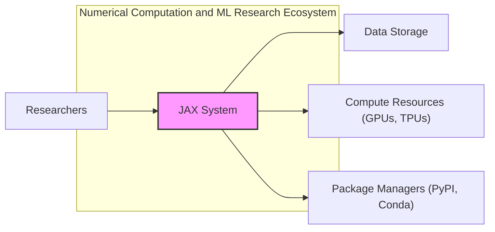
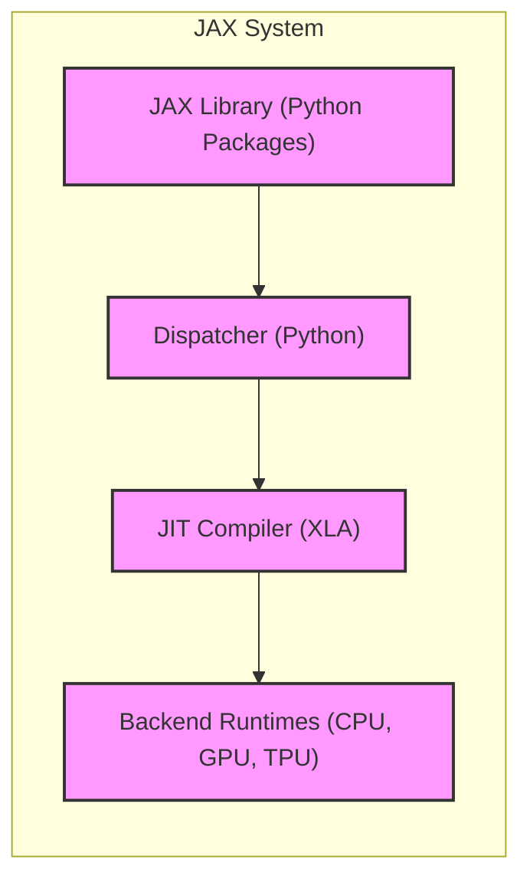
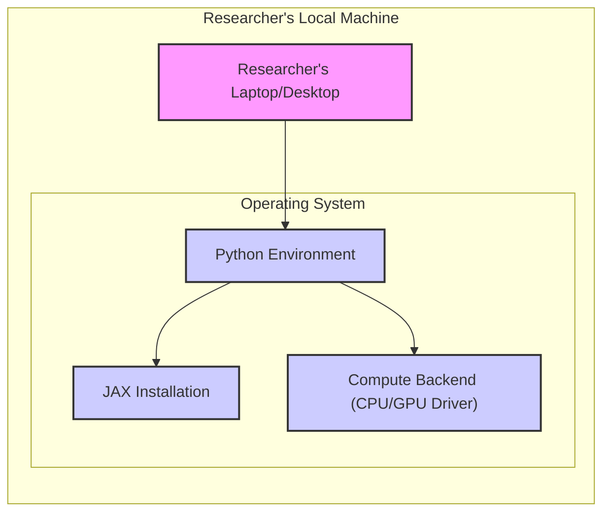

# BUSINESS POSTURE

This project, JAX, aims to provide a system for high-performance numerical computing and machine learning research. It focuses on enabling researchers and developers to write numerical programs that can be automatically differentiated, compiled, and executed on various hardware accelerators like GPUs and TPUs.

Business Priorities and Goals:
- Enable cutting-edge machine learning research and development.
- Provide high performance numerical computation capabilities.
- Support multiple hardware platforms (CPU, GPU, TPU).
- Foster an open and collaborative research environment.
- Maintain a user-friendly and flexible API for researchers.

Business Risks:
- Reputational damage due to security vulnerabilities in a widely used research tool.
- Disruption of research activities due to system instability or security breaches.
- Potential misuse of JAX for malicious purposes if security is compromised.
- Loss of trust from the research community if security is not adequately addressed.

# SECURITY POSTURE

Security Controls:
- security control: Code hosted on GitHub, leveraging GitHub's access control and security features. Implemented in: GitHub repository settings.
- security control: Open source project, benefiting from community review and scrutiny. Implemented in: Open source nature of the project.
- security control: Use of standard Python packaging and distribution mechanisms (PyPI, Conda). Implemented in: Build and release process.

Accepted Risks:
- accepted risk: Vulnerabilities inherent in open source software may be publicly disclosed before patches are available.
- accepted risk: Reliance on external dependencies (Python packages) introduces supply chain risks.
- accepted risk: Security is not the primary focus of research-oriented projects, potentially leading to less rigorous security practices compared to production systems.

Recommended Security Controls:
- security control: Implement automated vulnerability scanning for dependencies and codebase.
- security control: Establish a clear process for reporting and handling security vulnerabilities.
- security control: Conduct regular security code reviews, especially for critical components.
- security control: Implement Software Bill of Materials (SBOM) for dependencies.
- security control: Security awareness training for core contributors, focusing on secure coding practices and supply chain security.

Security Requirements:
- Authentication:
    - Requirement: Access to the GitHub repository for contributions should be controlled via GitHub's authentication mechanisms.
    - Requirement: For internal infrastructure used for building and testing, access should be authenticated and authorized.
- Authorization:
    - Requirement: GitHub repository permissions should be configured to follow the principle of least privilege for contributors and maintainers.
    - Requirement: Access to internal build and test infrastructure should be role-based and authorized.
- Input Validation:
    - Requirement: JAX code should be robust against unexpected or malicious inputs, especially when interacting with external data sources or user-provided code.
    - Requirement: Input validation should be performed at API boundaries to prevent injection attacks and unexpected behavior.
- Cryptography:
    - Requirement: If JAX is used to process or store sensitive data, appropriate cryptographic measures should be employed to protect data at rest and in transit.
    - Requirement: Ensure that any cryptographic libraries used by JAX are up-to-date and securely configured.

# DESIGN

## C4 CONTEXT

Context Diagram Elements:

- Element:
    - Name: JAX System
    - Type: Software System
    - Description: JAX is a Python library for high-performance numerical computing and machine learning research. It enables automatic differentiation, compilation to XLA, and execution on CPUs, GPUs, and TPUs.
    - Responsibilities:
        - Provides APIs for numerical computation and machine learning.
        - Compiles Python code to optimized machine code using XLA.
        - Executes computations on various hardware backends.
    - Security controls:
        - Input validation at API boundaries.
        - Dependency management to ensure secure libraries.
        - Code review process for contributions.

- Element:
    - Name: Researchers
    - Type: Person
    - Description: Users of JAX, including machine learning researchers, scientists, and developers who use JAX to build and run numerical computations and machine learning models.
    - Responsibilities:
        - Write Python code using JAX APIs.
        - Provide input data for computations.
        - Interpret and utilize the results of computations.
    - Security controls:
        - Authentication to access development environments and data.
        - Authorization to access specific datasets and compute resources.
        - Secure coding practices when using JAX APIs.

- Element:
    - Name: Data Storage
    - Type: External System
    - Description: Systems used to store datasets that are processed by JAX. This could include cloud storage, local file systems, databases, etc.
    - Responsibilities:
        - Store and provide access to datasets used in JAX computations.
        - Ensure data integrity and availability.
        - Implement data access controls.
    - Security controls:
        - Access control mechanisms (authentication and authorization).
        - Data encryption at rest and in transit.
        - Data backup and recovery procedures.

- Element:
    - Name: Compute Resources (GPUs, TPUs)
    - Type: External System
    - Description: Hardware infrastructure used to execute JAX computations, including GPUs, TPUs, and CPUs, potentially in cloud environments or on-premise clusters.
    - Responsibilities:
        - Provide computational resources for JAX execution.
        - Ensure availability and performance of compute resources.
        - Implement security controls for the compute environment.
    - Security controls:
        - Access control to compute resources.
        - Secure configuration of compute instances.
        - Monitoring and logging of resource usage.

- Element:
    - Name: Package Managers (PyPI, Conda)
    - Type: External System
    - Description: Package repositories used to distribute and install JAX and its dependencies.
    - Responsibilities:
        - Host and distribute JAX packages.
        - Ensure package integrity and availability.
        - Provide package management tools.
    - Security controls:
        - Package signing and verification.
        - Vulnerability scanning of packages.
        - Repository access controls.

## C4 CONTAINER

Container Diagram Elements:

- Element:
    - Name: JAX Library (Python Packages)
    - Type: Container - Python Library
    - Description: The core JAX library, distributed as Python packages. It provides the user-facing APIs for numerical computation, automatic differentiation, and JIT compilation.
    - Responsibilities:
        - Expose Python APIs for users.
        - Implement core numerical operations and transformations.
        - Dispatch computations to the JIT compiler.
    - Security controls:
        - Input validation at API boundaries.
        - Secure coding practices in Python code.
        - Dependency management for Python packages.

- Element:
    - Name: JIT Compiler (XLA)
    - Type: Container - Compiler
    - Description: The XLA (Accelerated Linear Algebra) compiler is responsible for just-in-time compilation of JAX computations into optimized machine code for different backends.
    - Responsibilities:
        - Compile JAX computations to machine code.
        - Optimize computations for target hardware.
        - Manage memory and execution on backends.
    - Security controls:
        - Secure compilation process.
        - Input validation of compilation inputs.
        - Protection against compiler vulnerabilities.

- Element:
    - Name: Dispatcher (Python)
    - Type: Container - Python Code
    - Description: Python code within JAX that handles the dispatching of computations from the user-facing API to the JIT compiler and backend runtimes.
    - Responsibilities:
        - Receive computation requests from the JAX library.
        - Orchestrate compilation and execution.
        - Manage data transfer between components.
    - Security controls:
        - Secure dispatching logic.
        - Input validation of dispatch requests.
        - Error handling and security logging.

- Element:
    - Name: Backend Runtimes (CPU, GPU, TPU)
    - Type: Container - Runtime Environment
    - Description: Runtime environments for executing compiled JAX code on different hardware backends (CPU, GPU, TPU). These are often provided by hardware vendors or specialized libraries.
    - Responsibilities:
        - Execute compiled machine code.
        - Manage hardware resources (memory, compute units).
        - Provide low-level interfaces to hardware.
    - Security controls:
        - Secure runtime environment configuration.
        - Access control to hardware resources.
        - Monitoring and logging of runtime activities.

## DEPLOYMENT

Deployment Architecture: Researcher's Local Machine and Cloud Environment

Detailed Deployment: Researcher's Local Machine

Deployment Diagram Elements (Researcher's Local Machine):

- Element:
    - Name: Researcher's Laptop/Desktop
    - Type: Infrastructure - Physical Machine
    - Description: The physical computer used by a researcher to develop and run JAX code.
    - Responsibilities:
        - Host the operating system and software environment.
        - Provide compute resources (CPU, GPU).
        - Store code and data.
    - Security controls:
        - Operating system security controls (firewall, antivirus).
        - User account management and access control.
        - Physical security of the machine.

- Element:
    - Name: Operating System
    - Type: Infrastructure - Operating System
    - Description: The operating system (e.g., Linux, macOS, Windows) installed on the researcher's machine.
    - Responsibilities:
        - Manage system resources.
        - Provide a platform for running software.
        - Implement operating system level security controls.
    - Security controls:
        - OS hardening and security updates.
        - Firewall and intrusion detection systems.
        - User and process isolation.

- Element:
    - Name: Python Environment
    - Type: Infrastructure - Software Environment
    - Description: A Python environment (e.g., virtual environment, Conda environment) where JAX and its dependencies are installed.
    - Responsibilities:
        - Provide a runtime environment for Python code.
        - Manage Python packages and dependencies.
        - Isolate project dependencies.
    - Security controls:
        - Dependency management and vulnerability scanning.
        - Secure configuration of the Python environment.
        - Access control to the environment.

- Element:
    - Name: JAX Installation
    - Type: Software - Application
    - Description: The installed JAX Python packages within the Python environment.
    - Responsibilities:
        - Provide JAX functionality to the researcher's code.
        - Interact with the compute backend.
    - Security controls:
        - Software integrity verification (package signing).
        - Regular updates to the latest secure version.

- Element:
    - Name: Compute Backend (CPU/GPU Driver)
    - Type: Infrastructure - Driver/Library
    - Description: Drivers and libraries that enable JAX to utilize the CPU or GPU for computation.
    - Responsibilities:
        - Provide low-level access to hardware compute resources.
        - Execute compiled code on the hardware.
    - Security controls:
        - Driver/library security updates.
        - Secure configuration of drivers.
        - Access control to hardware resources via drivers.

## BUILD

```mermaid
flowchart LR
    A["Developer"] --> B("Code Changes")
    B --> C["GitHub Repository"]
    C --> D["GitHub Actions CI"]
    D --> E["Build & Test"]
    E --> F["Security Checks (SAST, Dependency Scan)"]
    F --> G["Build Artifacts (PyPI, Conda Packages)"]
    G --> H["Package Repositories (PyPI, Conda)"]

    style A fill:#ccf,stroke:#333,stroke-width:2px
    style B fill:#ccf,stroke:#333,stroke-width:2px
    style C fill:#ccf,stroke:#333,stroke-width:2px
    style D fill:#ccf,stroke:#333,stroke-width:2px
    style E fill:#ccf,stroke:#333,stroke-width:2px
    style F fill:#ccf,stroke:#333,stroke-width:2px
    style G fill:#ccf,stroke:#333,stroke-width:2px
    style H fill:#ccf,stroke:#333,stroke-width:2px
```

Build Process Description:

1. Developer: Developers write code and make changes.
2. Code Changes: Code changes are committed and pushed to the GitHub repository.
3. GitHub Repository: The central repository hosting the JAX source code.
4. GitHub Actions CI: GitHub Actions is used for Continuous Integration and Continuous Delivery.
5. Build & Test: Automated build and test processes are triggered by code changes. This includes compilation, unit tests, and integration tests.
6. Security Checks (SAST, Dependency Scan): Automated security checks are performed, including Static Application Security Testing (SAST) to identify potential vulnerabilities in the code and dependency scanning to identify vulnerable dependencies.
7. Build Artifacts (PyPI, Conda Packages): If build and security checks are successful, build artifacts are created, such as Python packages for PyPI and Conda.
8. Package Repositories (PyPI, Conda): Build artifacts are published to package repositories like PyPI and Conda, making them available for users to download and install.

Build Process Security Controls:

- security control: GitHub Actions CI: Automated build pipeline ensures consistent and repeatable builds. Implemented in: GitHub Actions workflows.
- security control: Automated Testing: Unit and integration tests help ensure code quality and reduce the risk of introducing vulnerabilities. Implemented in: GitHub Actions workflows.
- security control: Static Application Security Testing (SAST): SAST tools can be integrated into the CI pipeline to automatically scan the codebase for potential security vulnerabilities. Recommended control.
- security control: Dependency Scanning: Dependency scanning tools can be used to identify known vulnerabilities in third-party libraries used by JAX. Recommended control.
- security control: Code Review: Code review process on GitHub helps to identify potential security issues before code is merged. Implemented in: GitHub pull request process.
- security control: Secure Build Environment: Ensure the CI environment is securely configured and isolated to prevent tampering with the build process. Recommended control.
- security control: Software Bill of Materials (SBOM) generation: Generate SBOM for build artifacts to track dependencies and facilitate vulnerability management. Recommended control.
- security control: Package Signing: Sign build artifacts (PyPI, Conda packages) to ensure integrity and authenticity. Recommended control.

# RISK ASSESSMENT

Critical Business Processes:
- Development and distribution of the JAX library.
- Enabling machine learning and numerical computation research.
- Maintaining the integrity and reliability of the JAX system.

Data to Protect:
- JAX source code: Sensitivity: High (intellectual property, potential vulnerabilities).
- Build artifacts (packages): Sensitivity: Medium (integrity and availability for users).
- Internal build and test infrastructure: Sensitivity: Medium (confidentiality and integrity of build process).
- Research data processed by JAX (in user environments): Sensitivity: Variable (depending on the research domain, could be highly sensitive personal or confidential data).

Data Sensitivity:
- JAX source code is publicly available on GitHub, but modifications and internal development processes should be protected.
- Build artifacts need to be protected from tampering to ensure users download legitimate and secure packages.
- Research data processed by JAX is the responsibility of the researchers and their organizations, but JAX should be designed to facilitate secure data processing practices.

# QUESTIONS & ASSUMPTIONS

BUSINESS POSTURE Questions:
- Is JAX primarily intended for research purposes, or is it also used in production systems?
- What are the typical use cases for JAX, and what types of data are commonly processed?
- Are there any specific compliance requirements or industry standards that JAX needs to adhere to?

BUSINESS POSTURE Assumptions:
- JAX is primarily used for research and development, but may also be adopted in some production environments.
- Users process a wide variety of numerical data, including potentially sensitive research data.
- Security is important for maintaining trust and preventing misuse, but performance and research functionality are primary drivers.

SECURITY POSTURE Questions:
- Are there any existing security incident response plans or procedures for JAX?
- What is the process for reporting and handling security vulnerabilities in JAX?
- Are there any specific security requirements from organizations or institutions using JAX?

SECURITY POSTURE Assumptions:
- Security is currently addressed through standard open source development practices and GitHub security features.
- There is no formal security incident response plan in place.
- Security vulnerability reporting and handling is likely ad-hoc and community-driven.

DESIGN Questions:
- What are the typical deployment environments for JAX beyond local machines (e.g., cloud platforms, HPC clusters)?
- Are there any specific security considerations for deploying JAX in different environments?
- What are the key dependencies of JAX, and are there any known security concerns related to these dependencies?

DESIGN Assumptions:
- JAX is deployed in diverse environments, including local machines, cloud environments, and HPC clusters.
- Deployment security is largely the responsibility of the users and their infrastructure providers.
- JAX relies on standard Python libraries and potentially some native libraries, and dependency management is crucial for security.