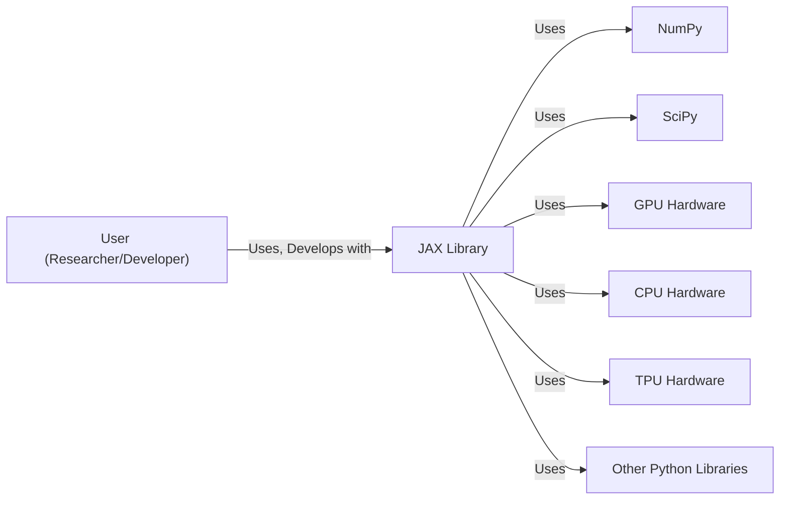
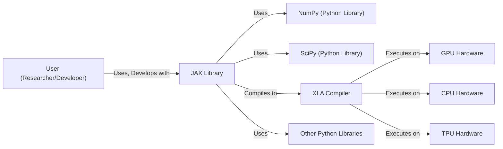
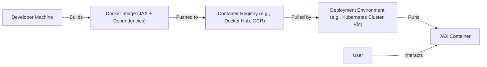
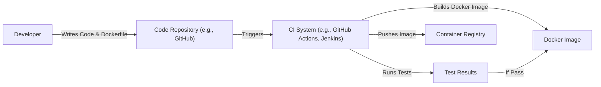

Okay, let's create a design document for the JAX project, keeping in mind its purpose and potential security considerations.

# BUSINESS POSTURE

JAX is a Google-developed, open-source project focused on high-performance numerical computation and machine learning research.  It's designed to accelerate research and development in these fields.  Given its open-source nature and target audience (researchers and developers), the business priorities and goals can be summarized as:

*   Priorities:
    *   Enable rapid prototyping and experimentation with numerical computation and machine learning models.
    *   Provide high performance and scalability for computationally intensive tasks.
    *   Foster a strong community of users and contributors.
    *   Maintain compatibility with existing tools and libraries (like NumPy).
    *   Facilitate the development of new machine learning algorithms and techniques.

*   Goals:
    *   Become a leading framework for numerical computation and machine learning research.
    *   Attract a large and active user base.
    *   Drive innovation in the field of machine learning.
    *   Provide a platform for reproducible research.

*   Business Risks:
    *   Malicious Code Injection: Given that JAX executes user-provided code, the biggest risk is the potential for malicious code injection.  A compromised JAX installation or a malicious JAX program could lead to data breaches, system compromise, or unauthorized resource usage.
    *   Supply Chain Attacks: Dependencies of JAX could be compromised, leading to the introduction of vulnerabilities into the JAX ecosystem.
    *   Denial of Service (DoS):  Large or computationally expensive JAX programs could be used to consume excessive resources, leading to a denial of service for other users or systems.
    *   Data Poisoning: In a machine learning context, manipulated input data could lead to incorrect model training and flawed results.
    *   Model Inversion/Extraction: Sensitive data used to train models within JAX could potentially be extracted or inferred by malicious actors.
    *   Reproducibility Issues: While JAX aims for reproducibility, subtle differences in environments or configurations could lead to inconsistent results, impacting the reliability of research findings.

# SECURITY POSTURE

JAX, being a library, relies heavily on the security practices of the user and the environment in which it's deployed.  It doesn't have built-in security features in the same way a web application or a database would.  The security posture is largely defined by how it's used and integrated.

*   Existing Security Controls:
    *   security control: Open Source Codebase: The code is publicly available for review and scrutiny, allowing for community-driven identification and patching of vulnerabilities. (Described in: GitHub repository)
    *   security control: Dependency Management: JAX uses standard Python package management tools (pip) which can be used with tools to manage and audit dependencies for known vulnerabilities. (Described in: setup.py and requirements.txt files in the GitHub repository)
    *   security control: Testing: JAX has an extensive test suite to ensure the correctness and stability of the code. (Described in: tests/ directory in the GitHub repository)
    *   security control: Community Engagement: Google's security team and the broader open-source community contribute to identifying and addressing security concerns. (Described in: GitHub Issues and Pull Requests)

*   Accepted Risks:
    *   accepted risk: User-Provided Code Execution: JAX is designed to execute arbitrary user-provided code. This is inherent to its functionality and is an accepted risk. Mitigation relies on user awareness and secure coding practices.
    *   accepted risk: Limited Built-in Security Features: JAX, as a library, does not have extensive built-in security features like authentication or authorization. It relies on the security of the surrounding environment.
    *   accepted risk: Dependence on External Libraries: JAX depends on other libraries (like NumPy, SciPy), and vulnerabilities in these dependencies could impact JAX's security.

*   Recommended Security Controls:
    *   security control: Integrate with Static Analysis Tools: Encourage users to integrate JAX projects with static analysis tools (e.g., Bandit, Pysa) to identify potential security vulnerabilities in their code.
    *   security control: Sandboxing: For high-risk environments, consider running JAX code within sandboxed environments (e.g., containers, virtual machines) to limit the impact of potential exploits.
    *   security control: Input Validation: While JAX itself doesn't handle user input directly, users should implement rigorous input validation in their applications to prevent data poisoning and other injection attacks.
    *   security control: Resource Limits: Implement mechanisms to limit the resources (CPU, memory, GPU) that JAX programs can consume to prevent denial-of-service attacks.
    *   security control: Software Bill of Materials (SBOM): Generate and maintain an SBOM for JAX and its dependencies to improve vulnerability management.

*   Security Requirements:
    *   Authentication: Not directly applicable to JAX as a library. Authentication would be handled by the application or system using JAX.
    *   Authorization: Not directly applicable to JAX. Authorization would be handled by the application or system using JAX.
    *   Input Validation: Crucial for users of JAX to implement. JAX programs should validate all input data to prevent data poisoning, code injection, and other attacks. This is the responsibility of the user, not the library itself.
    *   Cryptography: JAX may utilize cryptographic libraries for certain operations (e.g., random number generation). The security of these operations depends on the correct usage and configuration of the underlying cryptographic libraries. Users should ensure they are using secure cryptographic practices if their JAX programs involve sensitive data or operations.

# DESIGN

## C4 CONTEXT

*   Elements Description:
    *   User (Researcher/Developer):
        1.  Name: User (Researcher/Developer)
        2.  Type: Person
        3.  Description: Individuals who write and execute JAX code for numerical computation and machine learning tasks.
        4.  Responsibilities: Writing JAX code, managing data, configuring the JAX environment, ensuring the security of their code and data.
        5.  Security controls: Input validation, secure coding practices, awareness of potential security risks.

    *   JAX Library:
        1.  Name: JAX Library
        2.  Type: Software System
        3.  Description: The core JAX library, providing the functionality for numerical computation, automatic differentiation, and compilation to different hardware backends.
        4.  Responsibilities: Providing numerical computation functions, automatic differentiation, XLA compilation, hardware abstraction.
        5.  Security controls: Open-source codebase, dependency management, testing, community engagement.

    *   NumPy:
        1.  Name: NumPy
        2.  Type: Software System
        3.  Description: A fundamental library for numerical computation in Python, providing array objects and mathematical functions. JAX is designed to be largely compatible with NumPy.
        4.  Responsibilities: Providing array objects and mathematical functions.
        5.  Security controls: Relies on its own security posture and community vigilance.

    *   SciPy:
        1.  Name: SciPy
        2.  Type: Software System
        3.  Description: A library built on top of NumPy, providing additional scientific computing functionality (e.g., optimization, signal processing).
        4.  Responsibilities: Providing scientific computing functions.
        5.  Security controls: Relies on its own security posture and community vigilance.

    *   GPU Hardware:
        1.  Name: GPU Hardware
        2.  Type: Hardware
        3.  Description: Graphics Processing Units, used for accelerating numerical computations.
        4.  Responsibilities: Executing compiled JAX code.
        5.  Security controls: Hardware-level security features, driver security.

    *   CPU Hardware:
        1.  Name: CPU Hardware
        2.  Type: Hardware
        3.  Description: Central Processing Units, used for general-purpose computation.
        4.  Responsibilities: Executing compiled JAX code.
        5.  Security controls: Hardware-level security features, operating system security.

    *   TPU Hardware:
        1.  Name: TPU Hardware
        2.  Type: Hardware
        3.  Description: Tensor Processing Units, specialized hardware accelerators designed by Google for machine learning workloads.
        4.  Responsibilities: Executing compiled JAX code.
        5.  Security controls: Hardware-level security features, Google Cloud security.

    *   Other Python Libraries:
        1.  Name: Other Python Libraries
        2.  Type: Software System
        3.  Description: Other Python libraries that may be used in conjunction with JAX.
        4.  Responsibilities: Varies depending on the library.
        5.  Security controls: Relies on their own security posture and community vigilance.

## C4 CONTAINER

In the case of JAX, the container diagram is essentially an extension of the context diagram, as JAX itself is a library and doesn't have internal "containers" in the traditional sense. The "containers" are the external components it interacts with.

*   Elements Description:
    *   User (Researcher/Developer): Same as in the Context Diagram.
    *   JAX Library: Same as in the Context Diagram.
    *   NumPy (Python Library): Same as in the Context Diagram.
    *   SciPy (Python Library): Same as in the Context Diagram.
    *   Other Python Libraries: Same as in the Context Diagram.
    *   XLA Compiler:
        1.  Name: XLA Compiler
        2.  Type: Software Component
        3.  Description: The XLA (Accelerated Linear Algebra) compiler, which compiles JAX code into optimized machine code for different hardware backends.
        4.  Responsibilities: Compiling JAX code, optimizing for target hardware.
        5.  Security controls: Code reviews, testing, Google's internal security practices.
    *   GPU Hardware: Same as in the Context Diagram.
    *   CPU Hardware: Same as in the Context Diagram.
    *   TPU Hardware: Same as in the Context Diagram.

## DEPLOYMENT

JAX, as a library, is typically deployed as part of a larger Python environment.  There are several deployment scenarios:

1.  **Local Development Environment:**  Installed directly on a developer's machine using pip.
2.  **Cloud-Based Virtual Machines:**  Installed on virtual machines (e.g., Google Compute Engine, AWS EC2) using pip.
3.  **Cloud-Based Notebook Environments:**  Used within managed notebook environments (e.g., Google Colab, Jupyter Notebooks on cloud platforms).
4.  **Containerized Environments:**  Packaged within Docker containers for portability and reproducibility.
5.  **High-Performance Computing (HPC) Clusters:**  Installed on HPC clusters for large-scale computations.

We'll describe the **Containerized Environment** deployment in detail, as it offers good security and reproducibility:

*   Elements Description:
    *   Developer Machine:
        1.  Name: Developer Machine
        2.  Type: Hardware/Software
        3.  Description: The machine where the developer writes and tests JAX code.
        4.  Responsibilities: Code development, building the Docker image.
        5.  Security controls: Standard development environment security practices.

    *   Docker Image (JAX + Dependencies):
        1.  Name: Docker Image (JAX + Dependencies)
        2.  Type: Software Artifact
        3.  Description: A self-contained package containing JAX, its dependencies, and the user's code.
        4.  Responsibilities: Providing a consistent and reproducible runtime environment for JAX.
        5.  Security controls: Use of minimal base images, regular security scanning of the image, dependency management.

    *   Container Registry (e.g., Docker Hub, GCR):
        1.  Name: Container Registry
        2.  Type: Software System
        3.  Description: A repository for storing and managing Docker images.
        4.  Responsibilities: Storing and serving Docker images.
        5.  Security controls: Access control, image scanning, vulnerability management.

    *   Deployment Environment (e.g., Kubernetes Cluster, VM):
        1.  Name: Deployment Environment
        2.  Type: Infrastructure
        3.  Description: The environment where the JAX container is deployed and run.
        4.  Responsibilities: Providing the resources (CPU, memory, GPU) for running the JAX container.
        5.  Security controls: Network security, access control, resource limits, monitoring.

    *   JAX Container:
        1. Name: JAX Container
        2. Type: Software Component
        3. Description: Running instance of Docker Image.
        4. Responsibilities: Executing JAX code.
        5. Security controls: Sandboxing, resource limits.

    * User:
        1. Name: User
        2. Type: Person
        3. Description: Individuals who write and execute JAX code for numerical computation and machine learning tasks.
        4. Responsibilities: Writing JAX code, managing data, configuring the JAX environment, ensuring the security of their code and data.
        5. Security controls: Input validation, secure coding practices, awareness of potential security risks.

## BUILD

The build process for JAX itself (as a library) involves compiling C++ code and creating Python wheels.  For users of JAX, the "build" process typically involves creating a Python environment and installing JAX and its dependencies. We'll focus on the user perspective, assuming a containerized deployment.

*   Security Controls in the Build Process:
    *   Code Repository: Use of a secure code repository (e.g., GitHub, GitLab) with access control and versioning.
    *   CI System:  Automated build and testing using a CI system (e.g., GitHub Actions, Jenkins).
    *   Dependency Management:  Using tools like pip to manage dependencies and specify versions.
    *   Static Analysis:  Integrating static analysis tools (e.g., Bandit, Pysa) into the CI pipeline to scan for vulnerabilities.
    *   Container Image Scanning:  Scanning the Docker image for vulnerabilities before pushing it to the container registry.
    *   Software Bill of Materials (SBOM): Generating an SBOM during the build process.

# RISK ASSESSMENT

*   Critical Business Processes:
    *   Rapid Prototyping and Experimentation: JAX enables researchers and developers to quickly prototype and experiment with new ideas.  Disruptions to this process would slow down innovation.
    *   Model Training: JAX is used to train machine learning models.  Compromised models or training data could lead to incorrect results or security breaches.
    *   Reproducible Research: JAX aims to facilitate reproducible research.  Failures in reproducibility could damage the credibility of research findings.

*   Data Sensitivity:
    *   User-Provided Data: The sensitivity of data used with JAX varies greatly depending on the application.  It could range from publicly available datasets to highly sensitive personal or proprietary data.
    *   Model Weights: Trained model weights can be considered sensitive, as they may contain information about the training data or represent valuable intellectual property.
    *   Intermediate Computations: Intermediate data generated during JAX computations could potentially leak information about the input data or model.

# QUESTIONS & ASSUMPTIONS

*   Questions:
    *   What specific types of data will be used with JAX in this particular context? (This is crucial for determining the appropriate security measures.)
    *   What is the expected scale of deployment? (Local machine, small cluster, large-scale HPC?)
    *   Are there any specific regulatory or compliance requirements that need to be considered?
    *   What level of user expertise is assumed? (Are users expected to be security-conscious developers, or less experienced researchers?)
    *   What is acceptable downtime?

*   Assumptions:
    *   BUSINESS POSTURE: We assume a research-oriented environment with a moderate risk appetite, prioritizing innovation and speed over extremely strict security controls.
    *   SECURITY POSTURE: We assume users are responsible for securing their own code and data, and that JAX is used within a reasonably secure environment (e.g., a protected network, a containerized environment with resource limits).
    *   DESIGN: We assume a containerized deployment model for reproducibility and security. We assume the use of a CI/CD pipeline for building and deploying JAX applications.