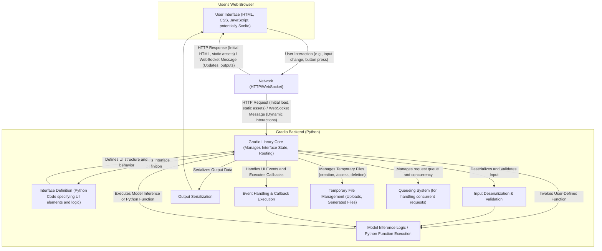

# Project Design Document: Gradio

**Version:** 1.1
**Date:** October 26, 2023
**Prepared By:** Gemini AI Assistant

## 1. Introduction

This document provides an enhanced design specification for the Gradio project, a Python library enabling developers to construct customizable web user interfaces (UIs) for their machine learning models and arbitrary Python functions. This detailed design serves as a critical foundation for subsequent threat modeling exercises, offering a comprehensive understanding of the system's architecture, components, and data flow. The focus is on providing sufficient detail to identify potential security vulnerabilities.

## 2. Project Goals

* **Simplified UI Creation:** Empower developers to create interactive web interfaces for their code with minimal web development expertise.
* **Accelerated Prototyping and Sharing:** Facilitate rapid iteration and easy sharing of model interfaces for testing, demonstration, and collaborative purposes.
* **Flexible Customization:** Offer a wide range of configurable UI components and layout options to tailor the interface to specific needs.
* **Seamless Integration:** Ensure smooth interoperability with prevalent machine learning frameworks (e.g., TensorFlow, PyTorch, scikit-learn) and general Python functions.
* **Enhanced Accessibility:** Democratize access to machine learning models by providing intuitive interfaces for users without technical backgrounds.

## 3. System Architecture

Gradio employs a client-server architecture where the Gradio Python library acts as the backend server and the user's web browser hosts the frontend client. Communication occurs primarily over HTTP and WebSockets.

### 3.1. Detailed Component Responsibilities

* **User Interface (Frontend):**
    * Renders the interactive UI within the user's web browser using a combination of HTML, CSS, and JavaScript. Gradio internally utilizes Svelte for its component framework.
    * Provides interactive elements (e.g., text boxes, image uploaders, sliders, buttons) for user input and displays model outputs or function results.
    * Communicates with the Gradio backend via standard HTTP requests for initial page load and static assets, and uses WebSockets for real-time, bidirectional communication during user interactions.
* **Gradio Library Core (Backend):**
    * Serves as the central orchestrator, managing the state of the Gradio interface and routing requests.
    * Interprets the Python-based interface definition to dynamically generate the frontend UI.
    * Handles incoming HTTP and WebSocket requests from the frontend.
    * Manages the queue of incoming requests, especially important for handling concurrent user interactions.
* **Interface Definition (Python Code):**
    * Python code written by the developer using the Gradio library's API to declaratively define the structure and behavior of the UI.
    * Specifies input and output components, their types, and any associated configuration.
    * Links input components to the user-defined Python function or model inference logic.
* **Model Inference Logic / Python Function Execution:**
    * Represents the user's core logic, which can be a machine learning model's inference function or any arbitrary Python function.
    * Receives processed input data from the Gradio backend.
    * Executes the logic and returns the output to the Gradio backend.
* **Input Deserialization & Validation:**
    * Responsible for converting user input received from the frontend (typically as strings or files) into Python data types suitable for the user-defined function.
    * Performs validation on the input data to ensure it conforms to the expected format and constraints, mitigating potential errors and security vulnerabilities.
* **Output Serialization:**
    * Converts the output from the user-defined function (Python objects) into a format suitable for transmission to the frontend (e.g., JSON, base64 encoded images).
* **Event Handling & Callback Execution:**
    * Manages user interactions with the UI elements (e.g., button clicks, form submissions).
    * Executes corresponding Python callback functions defined in the interface definition in response to these events.
* **Temporary File Management:**
    * Provides temporary storage for files uploaded by the user or generated by the backend during the session.
    * Manages the lifecycle of these files, including creation, access, and deletion, with considerations for security and resource management.
* **Queueing System:**
    * Implements a mechanism to handle concurrent requests from multiple users or rapid interactions from a single user.
    * Prevents the backend from being overwhelmed and ensures fair processing of requests.

### 3.2. Enhanced Data Flow Description

1. **User Initiates Interaction:** The user interacts with a UI element in their web browser (e.g., types text into a `Textbox`, uploads an image to an `Image` component, clicks a `Button`).
2. **Frontend Sends Request:** The browser sends an HTTP request (for initial loads or static assets) or a WebSocket message (for dynamic interactions and data submission) to the Gradio backend. This message includes the user's input data, the ID of the interacting component, and the triggered event.
3. **Backend Receives and Routes:** The Gradio library core receives the request. For WebSocket messages, it identifies the associated interface element and the corresponding action or callback function.
4. **Input Processing and Validation:** The backend deserializes the input data from the request (e.g., converting a string from a textbox). It then applies validation rules defined for the input component to ensure data integrity and security (e.g., checking file types, data ranges).
5. **Function/Model Invocation:** The Gradio backend invokes the user-defined Python function or model inference logic, passing the processed and validated input data as arguments.
6. **Core Logic Execution:** The user's Python function or machine learning model performs its computation or task.
7. **Output Processing and Serialization:** The output from the user's function is processed and serialized into a format suitable for transmission to the frontend (e.g., converting a NumPy array to a JSON list, encoding an image to base64).
8. **Backend Sends Response:** The Gradio backend sends an HTTP response (for initial loads) or a WebSocket message containing the processed output data back to the user's browser.
9. **Frontend Updates UI:** The browser receives the response and updates the corresponding UI elements to display the output to the user. This might involve updating text, displaying images, rendering charts, or triggering other visual changes.
10. **Temporary File Handling (if applicable):** If the interaction involves file uploads, the backend manages the temporary storage of these files. Similarly, if the backend generates files, it manages their temporary storage and provides mechanisms for the frontend to access or download them.

## 4. Key Components in Detail

### 4.1. Gradio Library Core

* **Implementation Details:**
    * Primarily implemented in Python.
    * Leverages the FastAPI framework for handling HTTP requests and WebSockets, providing performance and modern features.
    * Manages the internal state of the Gradio interface, including the values of input and output components.
    * Implements routing logic to direct incoming requests to the appropriate handlers.
    * Integrates with a queueing system (likely using Celery or a similar library for asynchronous task processing) to manage concurrent requests.
    * Handles security aspects like input sanitization (to some extent) and provides mechanisms for developers to implement further security measures.
* **Security Considerations:**
    * Vulnerabilities in FastAPI or its dependencies could impact Gradio.
    * Improper handling of WebSocket connections could lead to denial-of-service or information disclosure.
    * The queueing system needs to be secured to prevent unauthorized task execution.

### 4.2. Interface Definition (Python Code)

* **Implementation Details:**
    * Developers use Gradio's Python API (e.g., `gr.Interface`, `gr.Blocks`) to define the UI.
    * This definition is essentially a declarative specification of the UI elements, their properties, and the associated Python functions.
    * Gradio uses this definition to dynamically generate the frontend code.
* **Security Considerations:**
    * Malicious code injected into the interface definition could lead to security vulnerabilities.
    * Improperly configured input/output components could expose sensitive information or create attack vectors.

### 4.3. Model Inference Logic / Python Function

* **Implementation Details:**
    * This is the user's code and can be any valid Python function or a method of a machine learning model.
    * Gradio provides a standardized way to pass input data to this function and receive output.
* **Security Considerations:**
    * This component is a primary target for attacks. Vulnerabilities in the model or the function itself (e.g., code injection flaws) can be exploited through the Gradio interface.
    * It's crucial to sanitize inputs and validate outputs within this logic.

### 4.4. Frontend (User Interface)

* **Implementation Details:**
    * Built using standard web technologies (HTML, CSS, JavaScript) with Svelte as the primary JavaScript framework for component management.
    * Handles user interactions and communicates with the backend via asynchronous requests and WebSockets.
    * Renders UI elements based on the definition provided by the backend.
* **Security Considerations:**
    * Susceptible to standard web vulnerabilities like Cross-Site Scripting (XSS) if user-provided data is not properly sanitized on the backend before being rendered.
    * Potential for vulnerabilities in the Svelte framework or its dependencies.
    * Improper handling of sensitive data on the frontend (e.g., storing API keys in local storage).

### 4.5. Temporary File Management

* **Implementation Details:**
    * Gradio provides mechanisms for handling file uploads and temporary storage.
    * Files are typically stored in a temporary directory on the server's filesystem.
    * Gradio likely implements some form of cleanup mechanism to remove temporary files after a certain period or when the session ends.
* **Security Considerations:**
    * Improperly secured temporary file storage can lead to unauthorized access, modification, or deletion of files.
    * Vulnerabilities in the file upload handling could allow attackers to upload malicious files.
    * Lack of proper cleanup could lead to disk space exhaustion.

## 5. Deployment Options and Security Implications

* **Local Execution (via `python app.py`):**
    * **Security Implications:** Generally lower risk as it's typically only accessible on the local machine. However, if the machine is compromised, the Gradio application is also vulnerable. Sharing the local URL can expose it if not done carefully.
* **Sharing via Public URL (using `share=True`):**
    * **Security Implications:** Relies on Gradio's infrastructure security. The temporary public URL provides basic authentication but is not suitable for sensitive data or long-term use. Data transmitted is likely over HTTPS, but the security of the Gradio-managed backend is paramount.
* **Deployment on Cloud Platforms (e.g., Heroku, AWS, GCP, Azure):**
    * **Security Implications:** Security depends on the chosen platform's security measures and the developer's configuration. Requires careful configuration of network access, firewalls, authentication, and authorization. Containerization (e.g., Docker) can add a layer of isolation but also introduces its own security considerations. HTTPS should be enforced.
* **Embedding in Existing Web Applications:**
    * **Security Implications:** Inherits the security posture of the parent web application. Requires careful consideration of potential conflicts and vulnerabilities introduced by the Gradio component. Authentication and authorization should be integrated with the existing application's mechanisms.

## 6. Security Considerations (Detailed)

This section expands on the preliminary security considerations, providing more specific examples and context for threat modeling.

* **Input Validation and Sanitization:**
    * **Threat:** Injection attacks (e.g., Cross-Site Scripting (XSS), SQL Injection if the backend interacts with a database, Command Injection if the backend executes shell commands based on input).
    * **Mitigation:** Implement robust input validation on the backend to ensure data conforms to expected types and formats. Sanitize user-provided data before rendering it on the frontend to prevent XSS. Avoid constructing dynamic queries or commands based on user input without proper escaping.
* **Authentication and Authorization:**
    * **Threat:** Unauthorized access to the Gradio interface and its functionalities, potentially leading to data breaches or misuse of the underlying model.
    * **Mitigation:** Implement authentication mechanisms to verify user identities. Implement authorization controls to restrict access to specific features or data based on user roles or permissions. For deployed applications, consider using standard authentication protocols like OAuth 2.0 or SAML.
* **Data Privacy and Confidentiality:**
    * **Threat:** Exposure of sensitive data handled by the Gradio application, both in transit and at rest (e.g., user-uploaded data, model outputs).
    * **Mitigation:** Enforce HTTPS for all communication. Implement encryption for data at rest if persistent storage is used. Be mindful of data retention policies and ensure compliance with relevant privacy regulations.
* **Dependency Management:**
    * **Threat:** Vulnerabilities in third-party libraries used by Gradio (e.g., FastAPI, Svelte, other Python packages).
    * **Mitigation:** Regularly update Gradio and its dependencies to patch known vulnerabilities. Use dependency scanning tools to identify potential security risks.
* **Code Injection (Beyond Input Validation):**
    * **Threat:** Attackers exploiting vulnerabilities to inject and execute arbitrary code on the server.
    * **Mitigation:** Follow secure coding practices. Avoid using `eval()` or similar functions on user-provided input. Implement proper error handling and logging to detect suspicious activity.
* **Denial of Service (DoS) and Rate Limiting:**
    * **Threat:** Attackers overwhelming the Gradio application with excessive requests, making it unavailable to legitimate users.
    * **Mitigation:** Implement rate limiting to restrict the number of requests from a single IP address or user within a given timeframe. Consider using a Content Delivery Network (CDN) to absorb some traffic.
* **Cross-Site Request Forgery (CSRF):**
    * **Threat:** Attackers tricking authenticated users into performing unintended actions on the Gradio application.
    * **Mitigation:** Implement CSRF protection mechanisms, such as synchronizer tokens, in the Gradio backend and frontend.
* **Secure File Handling:**
    * **Threat:** Malicious file uploads leading to code execution or other security breaches. Unauthorized access to or modification of temporary files.
    * **Mitigation:** Implement strict file type validation and sanitization for uploaded files. Store temporary files in a secure location with appropriate access controls. Implement mechanisms to prevent path traversal vulnerabilities. Regularly clean up temporary files.

## 7. Assumptions and Constraints

* **Assumption:** Developers using Gradio have a basic understanding of web security principles and are responsible for implementing appropriate security measures in their model inference logic and interface definitions.
* **Assumption:** The underlying operating system and infrastructure where Gradio is deployed are reasonably secure.
* **Constraint:** Gradio's focus on ease of use might limit the default security features, requiring developers to explicitly implement additional security measures for production deployments.
* **Constraint:** The security of publicly shared interfaces via `share=True` is primarily managed by the Gradio team's infrastructure.

## 8. Future Considerations

* **Built-in Authentication and Authorization Modules:** Providing more integrated and configurable authentication and authorization options within the Gradio library itself.
* **Enhanced Security Auditing and Logging:** Implementing more comprehensive logging of user actions and system events for security monitoring and incident response.
* **Improved Rate Limiting and DoS Protection:** Integrating more robust mechanisms to prevent abuse and denial-of-service attacks.
* **Security-Focused Documentation and Best Practices:** Providing clearer guidance and examples for developers on how to secure their Gradio applications.

This enhanced design document provides a more detailed and security-focused view of the Gradio project, serving as a valuable resource for subsequent threat modeling activities.