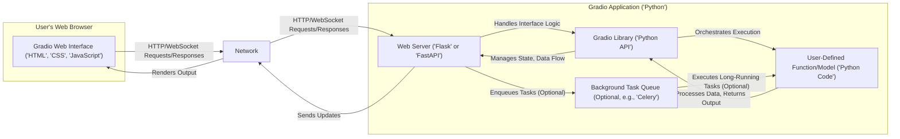
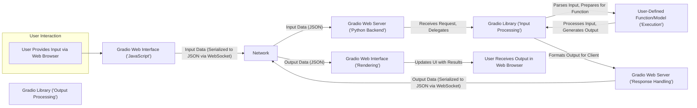

## Project Design Document: Gradio (Improved)

**1. Introduction**

This document provides an enhanced architectural overview of the Gradio project, an open-source Python library designed to facilitate the rapid creation of customizable web interfaces for machine learning models and general Python functions. This detailed design serves as a crucial artifact for subsequent threat modeling exercises.

**2. Project Goals**

*   To empower users to swiftly develop and share interactive demonstrations of their machine learning models and arbitrary Python functions with minimal coding effort.
*   To offer an intuitive and user-friendly interface creation experience, abstracting away complex web development intricacies.
*   To provide a high degree of flexibility and customization options, enabling the construction of diverse and tailored interface types.
*   To seamlessly support a wide array of input and output modalities, encompassing text, images, audio, video streams, tabular data, and more.
*   To streamline the deployment and sharing process of created interfaces across various environments.
*   To foster a collaborative environment for showcasing and testing machine learning models and Python-based applications.

**3. Project Scope**

This design document concentrates on the fundamental architecture and core functionalities of the Gradio library, specifically covering:

*   The client-side web interface components responsible for user interaction.
*   The Python backend infrastructure that manages interface logic, data processing, and the execution of user-defined functions/models.
*   The communication protocols and mechanisms facilitating interaction between the client and the backend.
*   Common deployment paradigms, including local hosting scenarios and deployment on cloud platforms.
*   The core Gradio API and its primary abstractions (e.g., `Interface`, `Blocks`).

This document explicitly excludes:

*   The internal implementation details of specific machine learning models or individual Python functions integrated with Gradio.
*   Fine-grained implementation specifics of individual Gradio library components.
*   Detailed configurations and management aspects of specific cloud platforms beyond general architectural considerations.
*   The intricate workings of the underlying Python interpreter, operating system, or supporting web frameworks.
*   Specific details of Gradio integrations with third-party libraries beyond their general function (e.g., the specifics of how a particular image processing library is used).

**4. High-Level Architecture**

**Description:**

*   Users interact with the Gradio interface through a standard web browser.
*   The user interface is dynamically rendered using standard web technologies: HTML for structure, CSS for styling, and JavaScript for interactivity.
*   The core application logic resides within a Python backend process.
*   The Gradio library provides a high-level Python API for defining and managing the user interface and its interactions with backend logic.
*   User-defined Python functions or pre-trained machine learning models are integrated as the core processing units within the Gradio application.
*   A Python-based web server, typically leveraging frameworks like Flask or FastAPI, handles incoming HTTP requests and manages WebSocket connections for real-time communication.
*   Optionally, for long-running or asynchronous tasks, a background task queue (such as Celery) can be integrated to prevent blocking the main application thread.

**5. Key Components**

*   **Gradio Web Interface (Client-Side):**
    *   Implemented using a combination of HTML for structural elements, CSS for visual styling, and JavaScript for dynamic behavior and communication.
    *   The structure and behavior of the interface are dynamically generated based on the interface definition provided in the Python backend.
    *   Responsible for capturing user input from various UI components (text boxes, sliders, file uploads, etc.) and displaying output data.
    *   Manages asynchronous communication with the Python backend using HTTP requests for initial page loads and WebSocket connections for real-time interactions and data streaming.
    *   Offers a library of pre-built, customizable UI components (e.g., `Textbox`, `Image`, `Audio`, `DataFrame`) that can be easily composed to build complex interfaces.

*   **Gradio Library (Python):**
    *   Provides the primary Python API for defining the structure and behavior of Gradio interfaces.
    *   Acts as an intermediary, mapping user interactions in the web interface to the execution of corresponding Python functions or model predictions.
    *   Handles the serialization and deserialization of data exchanged between the client-side and server-side, typically using JSON for structured data.
    *   Offers different interface abstractions, notably `Interface` for simpler, function-centric interfaces and `Blocks` for more complex, multi-step workflows and custom layouts.
    *   Provides built-in features for managing queuing of requests, implementing basic authentication, applying custom themes, and handling events.

*   **User-Defined Function/Model (Python):**
    *   Represents the core business logic or machine learning model that the Gradio interface exposes.
    *   Can be any standard Python function or a callable object, including instances of machine learning models from libraries like scikit-learn, TensorFlow, or PyTorch.
    *   Accepts input data processed and passed by the Gradio library and returns output data to be displayed in the interface.
    *   The input and output types of this function/model are key factors in determining the appropriate Gradio UI components to use.

*   **Web Server (Python - Flask or FastAPI):**
    *   Serves as the foundation for hosting the Gradio application, handling incoming network requests and managing the application lifecycle.
    *   Flask is a lightweight WSGI web framework, while FastAPI is a more modern, high-performance framework built on top of Starlette and Pydantic, often preferred for its automatic data validation and API documentation.
    *   Responsible for routing HTTP requests to the appropriate Gradio handlers and managing WebSocket connections for bidirectional communication.
    *   Handles static file serving for the client-side web interface assets (HTML, CSS, JavaScript).

*   **Background Task Queue (Optional - e.g., Celery):**
    *   An optional component that can be integrated for handling long-running or computationally intensive tasks asynchronously.
    *   Allows the main Gradio application to remain responsive while these tasks are processed in the background.
    *   Commonly used with message brokers like Redis or RabbitMQ to manage the task queue.
    *   When a user interaction triggers a long-running process, the Gradio backend can enqueue a task in the background queue, and the results can be communicated back to the user interface upon completion.

**6. Data Flow (Detailed)**

**Description:**

1. The user interacts with the Gradio web interface by providing input through various UI components (e.g., typing text, uploading an image).
2. Client-side JavaScript within the web interface captures the user's input.
3. The input data is serialized into JSON format and sent to the Python backend via a WebSocket connection for real-time interaction or via an HTTP request for initial submissions.
4. The web server receives the incoming request and delegates it to the appropriate handler within the Gradio application.
5. The Gradio library processes the incoming data, performing any necessary transformations or validations, and prepares it for the user-defined function or model.
6. The user-defined function or model is executed with the processed input data.
7. The function/model generates output data as a result of its processing.
8. The Gradio library receives the output data, formats it according to the defined interface, and prepares it for transmission back to the client.
9. The web server serializes the output data (typically to JSON) and sends it back to the client-side web interface via the WebSocket connection.
10. The client-side JavaScript receives the output data and updates the user interface to display the results to the user.

**7. Security Considerations (Detailed for Threat Modeling)**

*   **Input Validation and Sanitization:**
    *   **Threat:** Malicious users could inject code (e.g., cross-site scripting - XSS) or manipulate data to cause unexpected behavior or security breaches.
    *   **Considerations:** Implement robust server-side validation and sanitization of all user inputs. Utilize libraries designed for sanitizing HTML and other potentially dangerous input types. Be cautious with interpreting user-provided code or commands.

*   **Authentication and Authorization:**
    *   **Threat:** Unauthorized access to the Gradio application or its functionalities, potentially leading to data breaches or misuse of resources.
    *   **Considerations:** Implement secure authentication mechanisms (e.g., username/password, OAuth 2.0) to verify user identities. Enforce authorization policies to control access to specific features or data based on user roles or permissions.

*   **Code Injection Vulnerabilities:**
    *   **Threat:** If the Gradio application allows users to provide code snippets or configuration that is executed on the server, vulnerabilities could allow attackers to execute arbitrary code on the server.
    *   **Considerations:** Avoid allowing users to directly provide executable code. If necessary, use sandboxing techniques or containerization to isolate the execution environment and limit potential damage. Carefully review and sanitize any user-provided configuration files.

*   **Data Privacy and Security:**
    *   **Threat:** Sensitive data processed or displayed through the Gradio interface could be exposed or compromised.
    *   **Considerations:** Implement appropriate data encryption techniques (both in transit using HTTPS and at rest if persistent storage is involved). Adhere to relevant data privacy regulations (e.g., GDPR, CCPA). Avoid logging or storing sensitive user data unnecessarily.

*   **Dependency Management and Supply Chain Security:**
    *   **Threat:** Vulnerabilities in the Gradio library's dependencies could be exploited by attackers.
    *   **Considerations:** Regularly update dependencies to their latest secure versions. Utilize tools for scanning dependencies for known vulnerabilities. Be mindful of the security posture of third-party libraries used by Gradio.

*   **Network Security:**
    *   **Threat:** Unsecured network communication could allow attackers to eavesdrop on data transmitted between the client and server or perform man-in-the-middle attacks.
    *   **Considerations:** Enforce the use of HTTPS for all communication to ensure encryption and authentication. Properly configure firewalls and network security groups to restrict access to the Gradio application.

*   **Denial of Service (DoS) and Distributed Denial of Service (DDoS):**
    *   **Threat:** Attackers could overwhelm the Gradio application with excessive requests, making it unavailable to legitimate users.
    *   **Considerations:** Implement rate limiting to restrict the number of requests from a single source. Consider using a Content Delivery Network (CDN) to distribute traffic and mitigate DDoS attacks. Implement proper resource management and scaling strategies.

*   **Cross-Site Request Forgery (CSRF):**
    *   **Threat:** Attackers could trick authenticated users into performing unintended actions on the Gradio application.
    *   **Considerations:** Implement CSRF protection mechanisms, such as synchronizer tokens, to verify the origin of requests.

*   **WebSocket Security:**
    *   **Threat:** Vulnerabilities in the WebSocket implementation or lack of proper security measures could lead to unauthorized access or manipulation of real-time communication.
    *   **Considerations:** Ensure that WebSocket connections are established over secure protocols (WSS). Implement appropriate authentication and authorization checks for WebSocket messages.

**8. Technologies Used**

*   **Core Programming Language:** Python
*   **Primary Web Frameworks:** Flask, FastAPI
*   **Frontend Technologies:** HTML5, CSS3, JavaScript
*   **Real-time Communication Protocol:** WebSocket
*   **Data Serialization Format:** JSON
*   **Optional Background Task Queue:** Celery
*   **Optional Message Brokers (for Celery):** Redis, RabbitMQ
*   **Potential Machine Learning Libraries:** scikit-learn, TensorFlow, PyTorch, Hugging Face Transformers (depending on the use case)

**9. Deployment Model (Expanded)**

*   **Local Hosting (Development and Personal Use):**
    *   Gradio applications can be easily run on a developer's local machine for testing and experimentation.
    *   Typically involves running the Python script that defines and launches the Gradio interface.
    *   Accessibility is limited to the local network unless port forwarding or other network configurations are set up.

*   **Cloud Platforms (Scalable and Public Access):**
    *   **Hugging Face Spaces:** A platform specifically designed for hosting Gradio and Streamlit applications, offering simplified deployment and sharing. Provides infrastructure and handles scaling.
    *   **Traditional Cloud Providers (AWS, Google Cloud, Azure):** Offers more flexibility and control over the deployment environment.
        *   **Virtual Machines (VMs):** Deploying the Gradio application on a virtual machine instance. Requires manual configuration and management of the server environment.
        *   **Containers (Docker):** Containerizing the Gradio application using Docker allows for consistent deployment across different environments. Can be orchestrated using Kubernetes for scalability.
        *   **Serverless Functions (e.g., AWS Lambda, Google Cloud Functions):**  Potentially suitable for simpler Gradio applications with well-defined input and output, but may have limitations on execution time and resource usage. Requires careful consideration of the serverless environment's constraints.

This improved design document provides a more comprehensive and detailed overview of the Gradio project's architecture, incorporating additional information relevant for thorough threat modeling activities.
