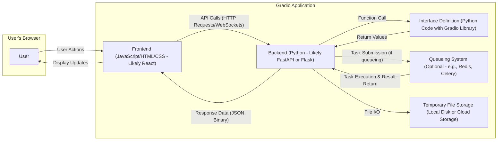
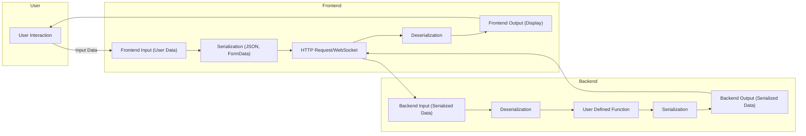

## Project Design Document: Gradio (Improved)

**1. Introduction**

This document provides an enhanced architectural design of the Gradio project (as represented by the repository: https://github.com/gradio-app/gradio). This detailed design will serve as a robust foundation for subsequent threat modeling activities. Gradio is an open-source Python library enabling developers to rapidly create customizable web UI components for their machine learning models, APIs, or arbitrary Python functions. This document elaborates on the key components, data flows, and architectural considerations of Gradio, providing a deeper understanding for security analysis.

**2. Goals and Objectives**

The primary goals of Gradio are to:

*   Offer a straightforward and intuitive method for developers to build web interfaces for their Python code without extensive web development knowledge.
*   Provide a diverse set of pre-built, reusable UI components (e.g., text input, image display, audio recorders, sliders).
*   Facilitate effortless sharing and deployment of interactive interfaces, making models and functions accessible.
*   Support a wide array of input and output data types commonly encountered in machine learning, data science, and general Python applications.
*   Be highly extensible and customizable, allowing developers to tailor the UI and functionality to specific project requirements.

**3. System Architecture**

Gradio's architecture is structured into distinct layers that interact to deliver the user experience:

*   **Frontend (User Interface):** The client-side application, rendered in the user's web browser, responsible for user interaction and display.
*   **Backend (Python Server):** The server-side application, written in Python, which handles requests, executes user-defined functions, and manages application logic.
*   **Interface Definition:** The Python code written by the developer that specifies the input and output components and the core function to be executed.

**4. Data Flow (Detailed)**

The data flow within a Gradio application involves a series of steps, with data transformations occurring at various stages:

1. **User Interaction & Input Serialization:** The user interacts with frontend components. The frontend serializes the input data (e.g., text, image data as base64, numerical values) into a format suitable for transmission (typically JSON for structured data, or FormData for files).
2. **Frontend Request to Backend:** The frontend sends an HTTP request (POST for most interactions, GET for initial page load, or WebSocket messages for persistent connections and streaming) to the backend API endpoints. This request includes the serialized input data.
3. **Backend Request Handling & Deserialization:** The backend receives the request. The web framework (e.g., FastAPI) handles routing and deserializes the input data from the request body.
4. **Function Execution with Input Data:** The backend calls the user-defined Python function specified in the interface definition, passing the deserialized input data as arguments. Gradio handles the mapping of input component values to function arguments.
5. **Output Generation & Serialization:** The Python function processes the input and returns the output data. Gradio then serializes this output data into a format suitable for transmission back to the frontend (again, typically JSON or binary data).
6. **Backend Response to Frontend:** The backend sends an HTTP response (or WebSocket message) back to the frontend, containing the serialized output data and appropriate headers (e.g., Content-Type).
7. **Frontend Response Handling & UI Update:** The frontend receives the response. It deserializes the output data and updates the corresponding UI components to display the results to the user. This might involve updating text fields, displaying images, rendering charts, etc.

**5. Key Components (Detailed)**

*   **Frontend (JavaScript/HTML/CSS - Likely React):**
    *   Primarily implemented using JavaScript frameworks, with React being a likely choice due to its component-based architecture and efficient UI updates.
    *   Utilizes HTML for structuring the UI and CSS for styling.
    *   Manages UI state, handles user events (clicks, typing, etc.), and dynamically updates the DOM based on backend responses.
    *   Communicates with the backend using asynchronous HTTP requests (via `fetch` or libraries like `axios`) and potentially WebSockets for real-time bidirectional communication.
    *   Handles the rendering of various Gradio UI components (e.g., `Textbox`, `Image`, `Slider`), often leveraging pre-built React components.
    *   Responsible for client-side input validation (for immediate feedback) and file handling (uploading and downloading).

*   **Backend (Python - Likely FastAPI or Flask):**
    *   The core server-side logic, typically built using asynchronous Python web frameworks like FastAPI (due to its performance and automatic data validation) or Flask (for simpler applications).
    *   Exposes API endpoints that the frontend interacts with. These endpoints handle receiving input data, calling the user-defined function, and returning the results.
    *   Manages request routing, authentication (if implemented), and middleware for tasks like logging and security.
    *   Uses the Gradio library to define the interface and handle the execution of the user's Python code.
    *   Handles data serialization and deserialization using libraries like `pydantic` (with FastAPI) or `marshmallow`.
    *   May integrate with a queueing system (e.g., Redis with Celery) to handle long-running tasks or manage concurrency.
    *   Manages temporary file storage for uploaded files, ensuring secure access and cleanup.

*   **Interface Definition (Python Code with Gradio Library):**
    *   The developer's Python script where the Gradio interface is defined using the Gradio library's API.
    *   Specifies the input and output components using classes like `gr.Textbox()`, `gr.Image()`, `gr.Audio()`, etc., along with their configurations (e.g., labels, placeholder text).
    *   Defines the core Python function that will be executed when the user interacts with the interface. This function takes input values from the UI components as arguments and returns values that are displayed in the output components.
    *   Can include configuration options for the overall interface, such as the title, description, and examples.

*   **Queueing System (Optional - e.g., Redis, Celery):**
    *   An optional component used for asynchronous task processing. When enabled, user requests can be offloaded to a queue (e.g., Redis), and worker processes (e.g., Celery workers) can process these tasks in the background.
    *   Improves the responsiveness of the main backend process, especially for tasks that take a significant amount of time to complete.
    *   Requires a message broker (e.g., Redis, RabbitMQ) to manage the queue.

*   **Temporary File Storage (Local Disk or Cloud Storage):**
    *   Gradio requires a mechanism to temporarily store files uploaded by users. This could be the local filesystem of the server or a cloud storage service like AWS S3 or Google Cloud Storage.
    *   Security considerations are crucial here, including proper access controls, secure file naming conventions, and timely deletion of temporary files to prevent unauthorized access and storage exhaustion.

**6. Security Considerations (Expanded)**

Several security aspects are critical for Gradio applications and require careful consideration during development and deployment:

*   **Input Validation & Sanitization:**
    *   **Threat:** Injection attacks (e.g., command injection, SQL injection if the backend interacts with databases), cross-site scripting (XSS) if user input is directly rendered on the frontend without sanitization.
    *   **Mitigation:** Implement robust server-side validation of all user inputs, checking data types, formats, and ranges. Sanitize output data before rendering it on the frontend to prevent XSS. Use parameterized queries for database interactions.
*   **Output Sanitization:**
    *   **Threat:** Cross-site scripting (XSS) attacks if dynamically generated content from the backend is not properly escaped before being rendered in the user's browser.
    *   **Mitigation:** Employ appropriate escaping mechanisms provided by the frontend framework (e.g., React's JSX escaping) to prevent malicious scripts from being executed in the user's browser.
*   **Authentication and Authorization:**
    *   **Threat:** Unauthorized access to the application or specific functionalities, data breaches.
    *   **Mitigation:** Implement authentication mechanisms to verify user identities (e.g., username/password, OAuth). Implement authorization to control access to different parts of the application based on user roles or permissions.
*   **Rate Limiting:**
    *   **Threat:** Denial-of-service (DoS) attacks by overwhelming the server with excessive requests.
    *   **Mitigation:** Implement rate limiting on API endpoints to restrict the number of requests from a single IP address or user within a specific time window.
*   **File Handling Security:**
    *   **Threat:** Unauthorized access to uploaded files, malicious file uploads leading to code execution or data breaches, storage exhaustion.
    *   **Mitigation:** Validate file types and sizes on the server-side. Store uploaded files in a secure location with restricted access. Generate unique and unpredictable filenames. Implement mechanisms for timely deletion of temporary files. Scan uploaded files for malware if necessary.
*   **Dependency Management:**
    *   **Threat:** Vulnerabilities in third-party libraries used by Gradio or the user's application.
    *   **Mitigation:** Regularly update dependencies to the latest versions to patch known vulnerabilities. Use dependency scanning tools to identify potential security risks.
*   **Code Injection (User-Provided Python Code):**
    *   **Threat:** If Gradio is configured to allow users to provide arbitrary Python code that is executed on the server, this poses a significant security risk, potentially allowing attackers to execute arbitrary commands on the server.
    *   **Mitigation:**  **Avoid allowing arbitrary code execution if possible.** If it's necessary, implement strict sandboxing and security controls to limit the capabilities of the executed code. Carefully review and sanitize any user-provided code.
*   **WebSockets Security:**
    *   **Threat:** Insecure WebSocket connections can be intercepted, and data can be tampered with.
    *   **Mitigation:** Use secure WebSockets (WSS) to encrypt communication. Implement authentication and authorization for WebSocket connections.
*   **CORS (Cross-Origin Resource Sharing):**
    *   **Threat:** Unauthorized access to the Gradio API from different origins.
    *   **Mitigation:** Configure CORS headers appropriately to restrict which domains are allowed to make requests to the Gradio application's API.
*   **Secrets Management:**
    *   **Threat:** Exposure of sensitive information like API keys, database credentials, or encryption keys if hardcoded in the code or configuration files.
    *   **Mitigation:** Store sensitive information securely using environment variables, dedicated secrets management services (e.g., HashiCorp Vault, AWS Secrets Manager), or configuration management tools. Avoid hardcoding secrets in the codebase.

**7. Deployment Considerations**

The deployment environment significantly impacts the security posture of a Gradio application:

*   **Local Execution:** Primarily for development and testing, security risks are lower but still relevant (e.g., protecting access to the development machine).
*   **Cloud Platforms (Heroku, AWS, GCP, Azure):** Requires careful configuration of security groups, network access controls, and identity and access management (IAM) policies. Utilize platform-provided security features.
*   **Containerization (Docker):** Provides isolation but requires secure container image management and vulnerability scanning.
*   **Server Deployment (Bare Metal or VMs):** Requires manual configuration of firewalls, intrusion detection systems, and other security measures.

**8. Future Considerations**

*   **Built-in Security Features:** Explore integrating more built-in security features within the Gradio library, such as automatic input sanitization options or authentication middleware.
*   **Enhanced Logging and Monitoring:** Implement more comprehensive logging and monitoring capabilities for security auditing and incident response.
*   **Security Audits and Penetration Testing:** Conduct regular security audits and penetration testing to identify and address potential vulnerabilities.
*   **Improved Documentation on Security Best Practices:** Provide clearer guidance and documentation for developers on how to build secure Gradio applications.

This enhanced design document provides a more detailed and comprehensive understanding of the Gradio project's architecture, crucial for effective threat modeling. The expanded descriptions of components, data flows, and security considerations offer a solid foundation for identifying potential vulnerabilities and designing appropriate security controls.