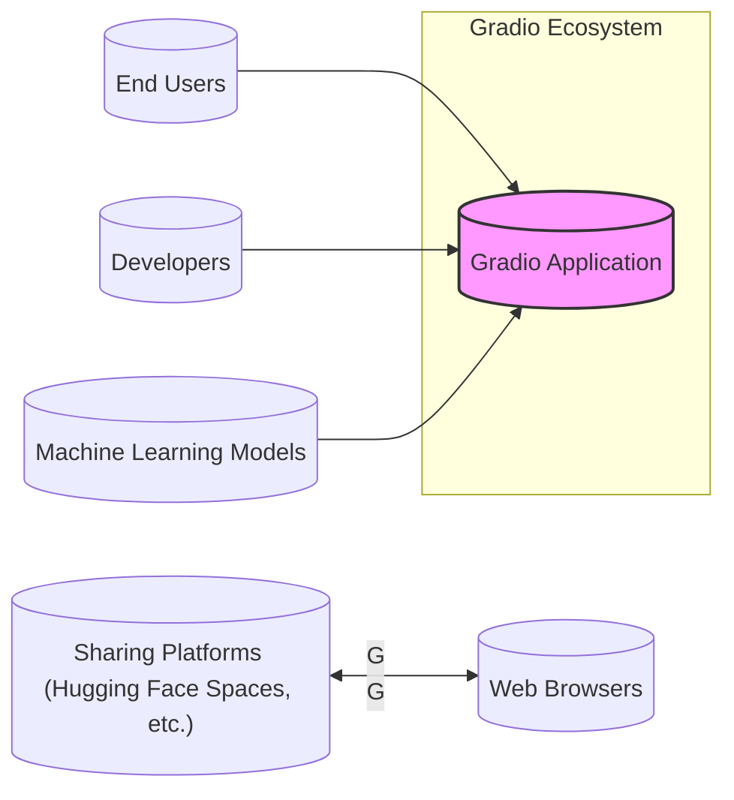
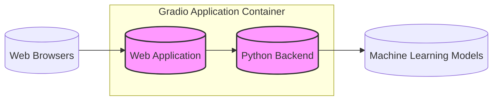
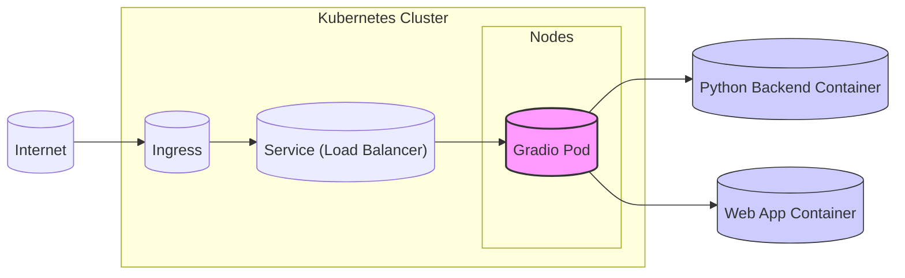
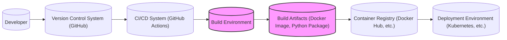

# BUSINESS POSTURE

- Business Priorities and Goals:
 - Democratize AI: Make machine learning models and AI accessible to a wider audience, including non-technical users.
 - Rapid Prototyping and Sharing: Enable developers to quickly create and share interactive demos of their models for testing, feedback, and showcasing.
 - Community Building: Foster a community around machine learning and AI by providing an easy-to-use tool for sharing and exploring models.
 - Model Exploration and Education: Facilitate the exploration and understanding of machine learning models through interactive interfaces.

- Business Risks:
 - Misuse of Models: Models deployed via Gradio could be misused for malicious purposes if not properly secured or if they produce harmful outputs.
 - Data Privacy: User data submitted to Gradio interfaces could be sensitive and needs to be handled securely to comply with privacy regulations.
 - Availability and Reliability: If Gradio applications are critical for certain workflows, their unavailability or unreliability could disrupt operations.
 - Intellectual Property: Models and data shared through Gradio could be subject to intellectual property risks if not properly managed.
 - Security Vulnerabilities: Vulnerabilities in the Gradio library or deployed applications could be exploited, leading to data breaches or system compromise.

# SECURITY POSTURE

- Existing Security Controls:
 - security control: Input Sanitization - Gradio likely performs some basic input sanitization to prevent common web vulnerabilities, but details are not explicitly documented in the provided repository. Implementation details would be in the Gradio library's code.
 - security control: Dependency Management - Gradio uses Python package management (pip) and likely has dependency management practices to keep libraries up to date. This is standard practice in Python development.
 - security control: HTTPS - Gradio applications when deployed online are typically served over HTTPS, ensuring encrypted communication. This is dependent on the deployment environment configuration.
 - accepted risk: Public Accessibility - By design, Gradio is intended to make models accessible, which inherently means some level of public accessibility is accepted. The level of control over who can access and use the models needs to be further defined.
 - accepted risk: Reliance on User-Provided Models - Gradio's security posture is heavily dependent on the security of the machine learning models provided by users. Gradio itself does not inherently validate or secure these models.

- Recommended Security Controls:
 - security control: Rate Limiting - Implement rate limiting to prevent abuse and denial-of-service attacks on Gradio interfaces.
 - security control: Authentication and Authorization - Add authentication and authorization mechanisms to control access to sensitive models or functionalities, especially for enterprise or production use cases.
 - security control: Content Security Policy (CSP) - Implement CSP headers to mitigate cross-site scripting (XSS) attacks.
 - security control: Regular Security Audits and Penetration Testing - Conduct regular security audits and penetration testing of Gradio library and deployed applications to identify and address vulnerabilities.
 - security control: Secure Deployment Practices - Provide and promote secure deployment guidelines, including containerization, network segmentation, and least privilege principles.

- Security Requirements:
 - Authentication:
  - Requirement: For sensitive applications, Gradio should support integration with authentication providers (e.g., OAuth 2.0, SAML) to verify user identities.
  - Requirement: For simpler use cases, basic authentication mechanisms might be sufficient, but should be carefully considered for security implications.
 - Authorization:
  - Requirement: Implement role-based access control (RBAC) to manage user permissions and restrict access to specific models or functionalities based on roles.
  - Requirement: Define clear authorization policies to control what actions authenticated users are allowed to perform.
 - Input Validation:
  - Requirement: Implement robust input validation on all user inputs to prevent injection attacks (e.g., command injection, SQL injection if applicable, cross-site scripting).
  - Requirement: Validate input data types, formats, and ranges to ensure data integrity and prevent unexpected behavior.
 - Cryptography:
  - Requirement: Use HTTPS for all communication to encrypt data in transit.
  - Requirement: If sensitive data is stored, it should be encrypted at rest using appropriate encryption algorithms and key management practices.
  - Requirement: For applications involving sensitive data processing, consider using cryptographic techniques to protect data confidentiality and integrity during processing.

# DESIGN

## C4 CONTEXT

- Context Diagram Elements:
 - Element:
  - Name: End Users
  - Type: Person
  - Description: Individuals who interact with Gradio applications to use machine learning models.
  - Responsibilities: Provide input to the Gradio application and consume the output from the machine learning model.
  - Security controls: Limited to browser security controls and user awareness of phishing and malicious links.
 - Element:
  - Name: Developers
  - Type: Person
  - Description: Software developers and machine learning engineers who use Gradio to build and deploy interactive interfaces for their models.
  - Responsibilities: Develop, configure, and deploy Gradio applications, integrate machine learning models, and manage application security.
  - Security controls: Responsible for implementing secure coding practices, managing dependencies, and configuring secure deployment environments.
 - Element:
  - Name: Machine Learning Models
  - Type: Software System
  - Description: The core AI/ML models that Gradio applications interface with. These models perform the actual machine learning tasks.
  - Responsibilities: Process input data and generate predictions or outputs as defined by their algorithms.
  - Security controls: Model security is primarily the responsibility of the model developer. Gradio needs to handle model outputs safely and prevent unintended model access or manipulation.
 - Element:
  - Name: Gradio Application
  - Type: Software System
  - Description: The Gradio application itself, built using the Gradio library, which provides the user interface and connects users to machine learning models.
  - Responsibilities: Provide a user-friendly interface, handle user input, interact with machine learning models, and display results.
  - Security controls: Input validation, output sanitization, session management, potentially authentication and authorization, and secure communication (HTTPS).
 - Element:
  - Name: Sharing Platforms (Hugging Face Spaces, etc.)
  - Type: Software System
  - Description: Platforms like Hugging Face Spaces where Gradio applications can be hosted and shared publicly.
  - Responsibilities: Host and serve Gradio applications, manage access and visibility, and provide infrastructure for running applications.
  - Security controls: Platform-level security controls, including infrastructure security, access management, and potentially application sandboxing or isolation.
 - Element:
  - Name: Web Browsers
  - Type: Software System
  - Description: The web browsers used by end users to access and interact with Gradio applications.
  - Responsibilities: Render the Gradio user interface, send user input to the application, and display results.
  - Security controls: Browser-based security controls, such as same-origin policy, content security policy enforcement, and protection against malicious scripts.

## C4 CONTAINER

- Container Diagram Elements:
 - Element:
  - Name: Web Application
  - Type: Container - Web Application
  - Description: The front-end component of the Gradio application, serving the user interface built with Gradio. This is typically implemented using HTML, CSS, and JavaScript, served by a web server.
  - Responsibilities: Handle user interactions, render the UI components, send requests to the Python backend, and display responses.
  - Security controls: Input validation on the client-side, output encoding to prevent XSS, implementation of Content Security Policy (CSP), secure handling of user sessions (if applicable).
 - Element:
  - Name: Python Backend
  - Type: Container - Application Server
  - Description: The back-end component of the Gradio application, written in Python and using the Gradio library. It handles the application logic, interacts with the machine learning models, and processes user requests.
  - Responsibilities: Receive requests from the web application, pre-process input data, invoke machine learning models, post-process model outputs, and send responses back to the web application.
  - Security controls: Input validation on the server-side, secure interaction with ML models, output sanitization, authorization checks, rate limiting, secure logging, and error handling.
 - Element:
  - Name: Machine Learning Models
  - Type: Container - Data Store / Execution Environment
  - Description: The actual machine learning models, which could be files on disk, services, or APIs. Gradio backend interacts with these models to perform inference.
  - Responsibilities: Load and execute machine learning models, perform predictions based on input data, and return results.
  - Security controls: Access control to model files or services, model input validation (within the model itself if possible), and protection against model manipulation or unauthorized access.

## DEPLOYMENT

- Deployment Options:
 - Local Deployment: Running Gradio application directly on a developer's machine for development and testing.
 - Cloud Deployment (Serverless): Deploying Gradio application as serverless functions (e.g., AWS Lambda, Google Cloud Functions, Azure Functions) for scalability and cost-efficiency.
 - Cloud Deployment (Containerized): Deploying Gradio application as Docker containers on cloud platforms (e.g., AWS ECS, Google Kubernetes Engine, Azure Kubernetes Service) for more control and scalability.
 - Platform-as-a-Service (PaaS): Using platforms like Hugging Face Spaces, Streamlit Cloud, or others that are specifically designed to host and share ML applications.

- Detailed Deployment (Containerized Cloud Deployment - Kubernetes):

- Deployment Diagram Elements:
 - Element:
  - Name: Kubernetes Cluster
  - Type: Infrastructure
  - Description: A Kubernetes cluster providing the container orchestration platform for deploying and managing the Gradio application.
  - Responsibilities: Container orchestration, scaling, load balancing, health monitoring, and resource management.
  - Security controls: Network policies, RBAC for cluster access, security updates, container runtime security, and infrastructure security hardening.
 - Element:
  - Name: Ingress
  - Type: Infrastructure - Load Balancer / Reverse Proxy
  - Description: Kubernetes Ingress controller that manages external access to the services within the cluster, typically acting as a reverse proxy and load balancer.
  - Responsibilities: Route external requests to the appropriate services, TLS termination, load balancing, and potentially web application firewall (WAF) functionality.
  - Security controls: TLS configuration, WAF rules, rate limiting, access control lists (ACLs), and security monitoring.
 - Element:
  - Name: Service (Load Balancer)
  - Type: Infrastructure - Load Balancer
  - Description: Kubernetes Service of type LoadBalancer, which exposes the Gradio application to the internet via a cloud provider's load balancer.
  - Responsibilities: Expose the application to external traffic, load balance requests across pods, and provide a stable external IP address.
  - Security controls: Cloud provider's load balancer security features, network security groups, and potentially integration with WAF.
 - Element:
  - Name: Gradio Pod
  - Type: Container - Pod
  - Description: A Kubernetes Pod encapsulating the containers for the Gradio Web Application and Python Backend.
  - Responsibilities: Run the Web Application and Python Backend containers, provide shared resources and networking within the pod.
  - Security controls: Pod security policies/admission controllers, resource limits, and container security context.
 - Element:
  - Name: Web App Container
  - Type: Container - Docker Container
  - Description: Docker container running the front-end Web Application component of Gradio.
  - Responsibilities: Serve the static web application files and handle client-side logic.
  - Security controls: Container image security scanning, minimal base image, and application-level security controls (CSP, input validation).
 - Element:
  - Name: Python Backend Container
  - Type: Container - Docker Container
  - Description: Docker container running the Python Backend component of Gradio, including the Gradio library and application logic.
  - Responsibilities: Execute the Python backend application, interact with ML models, and handle server-side logic.
  - Security controls: Container image security scanning, minimal base image, dependency management, application-level security controls (input validation, authorization).

## BUILD

- Build Process:
 - Developer commits code changes to a Version Control System (VCS) like GitHub.
 - A CI/CD system, such as GitHub Actions, is triggered by code changes.
 - The CI/CD system sets up a Build Environment, which includes necessary tools and dependencies (e.g., Python, Docker).
 - Within the Build Environment, the build process is executed:
  - Code is checked out from VCS.
  - Dependencies are installed.
  - Static analysis security testing (SAST) and linters are run to identify potential code issues.
  - Unit and integration tests are executed.
  - Docker images for Web App and Python Backend are built.
  - Python packages are built.
 - Build Artifacts, such as Docker images and Python packages, are created.
 - Docker images are pushed to a Container Registry (e.g., Docker Hub, cloud provider's registry).
 - Python packages are published to a package repository (e.g., PyPI, private repository).
 - Deployment Environment (e.g., Kubernetes cluster) pulls the latest Docker images from the Container Registry to deploy or update the Gradio application.

- Build Security Controls:
 - security control: Secure Coding Practices - Developers follow secure coding guidelines to minimize vulnerabilities in the code.
 - security control: Static Application Security Testing (SAST) - SAST tools are integrated into the CI/CD pipeline to automatically scan code for vulnerabilities during the build process.
 - security control: Dependency Scanning - Tools are used to scan dependencies for known vulnerabilities and ensure they are up to date.
 - security control: Container Image Scanning - Docker images are scanned for vulnerabilities before being pushed to the container registry.
 - security control: Code Review - Code changes are reviewed by other developers to identify potential security issues and improve code quality.
 - security control: Build Environment Security - The build environment is secured and hardened to prevent unauthorized access and tampering.
 - security control: Access Control to VCS and CI/CD - Access to the Version Control System and CI/CD system is restricted to authorized personnel.
 - security control: Artifact Signing - Build artifacts (e.g., Docker images, Python packages) can be digitally signed to ensure integrity and authenticity.

# RISK ASSESSMENT

- Critical Business Processes:
 - Demonstrating and showcasing machine learning models to potential users, clients, or stakeholders.
 - Rapid prototyping and testing of new machine learning models and applications.
 - Internal model exploration and validation by data science teams.
 - Educational purposes, allowing students and researchers to interact with and understand ML models.
 - Community engagement and contribution in the AI/ML field.

- Data Sensitivity and Protection:
 - Data processed by Gradio applications can vary greatly in sensitivity depending on the models and use cases.
 - Potential data types include:
  - Public Data: Datasets that are publicly available and not considered sensitive.
  - Internal Data: Data used within an organization, which may have some level of confidentiality.
  - Sensitive Personal Data (PII): Data that can identify individuals, requiring strict privacy controls (e.g., names, addresses, health information).
  - Confidential Business Data: Proprietary business information that needs to be protected from unauthorized access.
 - Data sensitivity level needs to be assessed for each specific Gradio application and use case.
 - Data protection measures should be implemented based on the sensitivity level, including:
  - Data encryption in transit and at rest.
  - Access control and authorization.
  - Data minimization and anonymization techniques.
  - Compliance with relevant data privacy regulations (e.g., GDPR, CCPA).

# QUESTIONS & ASSUMPTIONS

- Questions:
 - What is the intended deployment environment for Gradio applications (cloud, on-premises, hybrid)?
 - What is the sensitivity level of data that will be processed by Gradio applications?
 - Are there specific compliance requirements (e.g., HIPAA, PCI DSS) that need to be met?
 - What is the expected user base and traffic volume for Gradio applications?
 - Are there any specific authentication or authorization requirements for accessing Gradio applications?
 - What are the requirements for logging and monitoring Gradio applications?
 - Are there any existing security policies or guidelines that need to be followed?

- Assumptions:
 - Assumption: Gradio applications will be deployed in a cloud environment using containers and Kubernetes for scalability and manageability.
 - Assumption: HTTPS will be used for all communication to ensure data encryption in transit.
 - Assumption: Input validation and output sanitization will be implemented to mitigate common web vulnerabilities.
 - Assumption: Developers using Gradio are responsible for the security of their machine learning models and the data they process.
 - Assumption: Basic security controls like rate limiting and dependency management are considered essential for production deployments.