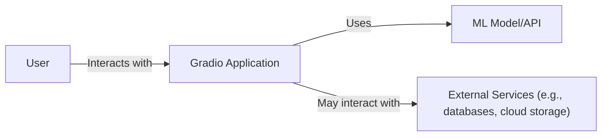
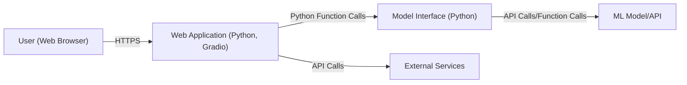
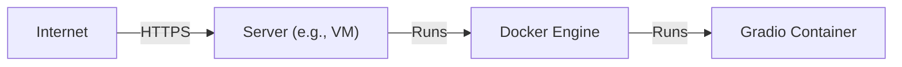
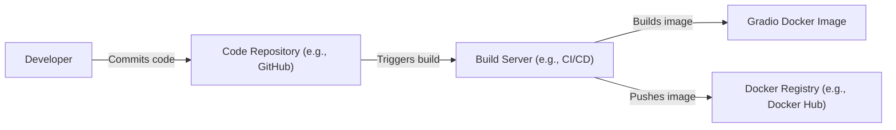

Okay, let's create a design document for the Gradio project.

# BUSINESS POSTURE

Gradio is an open-source Python library that allows developers to quickly create customizable UI components for their machine learning models, APIs, or any arbitrary Python function. It's designed to be the fastest way to demo, share, and even deploy machine learning models with a friendly web interface.

Priorities:

*   Ease of Use: Enable developers, even those with limited front-end experience, to rapidly create and share demos of their ML models.
*   Flexibility: Support a wide range of input and output types, allowing for diverse model interactions.
*   Shareability: Make it simple to share demos with others, either publicly or privately.
*   Customization: Allow for customization of the UI appearance and functionality.
*   Integration: Integrate smoothly with popular machine learning frameworks.
*   Open Source: Maintain a vibrant open-source community and encourage contributions.

Goals:

*   Become the standard tool for creating quick ML model demos.
*   Facilitate collaboration and feedback on ML models.
*   Lower the barrier to entry for showcasing ML work.
*   Enable rapid prototyping and iteration of ML-powered applications.

Business Risks:

*   Reputational Risk: Security vulnerabilities in Gradio could expose user data or allow malicious actors to misuse deployed models, damaging the project's reputation and user trust.
*   Operational Risk: Bugs or performance issues could hinder the usability of Gradio, frustrating users and limiting adoption.
*   Compliance Risk: Depending on how Gradio is used and deployed, there might be compliance requirements related to data privacy (e.g., GDPR, CCPA) that need to be considered.
*   Competition Risk: Other tools with similar functionality could emerge, challenging Gradio's market position.
*   Maintainability Risk: As an open-source project, maintaining the codebase and ensuring long-term sustainability can be challenging.

# SECURITY POSTURE

Existing Security Controls:

*   security control: Input Sanitization: Gradio performs some level of input sanitization to prevent common web vulnerabilities like Cross-Site Scripting (XSS). Described in Gradio documentation and implemented in the codebase.
*   security control: Dependency Management: Gradio uses package managers (like pip) to manage dependencies, but the security of these dependencies relies on the vigilance of the maintainers and the community. Described in `requirements.txt` and `pyproject.toml` files.
*   security control: Limited File Access: When handling file uploads, Gradio stores them in temporary directories with restricted access. Implemented in the codebase.
*   security control: Community Scrutiny: Being open-source, Gradio benefits from community scrutiny, which can help identify and address security vulnerabilities. Implemented by the open-source nature of the project on GitHub.

Accepted Risks:

*   accepted risk: Third-Party Dependency Vulnerabilities: Gradio relies on numerous third-party libraries, and vulnerabilities in these libraries could impact Gradio's security.
*   accepted risk: User-Provided Code Execution: Gradio's core functionality involves executing user-provided Python code, which inherently carries security risks if not handled carefully.
*   accepted risk: Limited Default Security Configuration: Gradio's default configuration may not be suitable for all deployment scenarios, and users are responsible for configuring it securely.
*   accepted risk: Denial of Service: Gradio applications, especially those exposed publicly, could be vulnerable to denial-of-service (DoS) attacks.

Recommended Security Controls:

*   security control: Implement Content Security Policy (CSP): A strong CSP can mitigate the impact of XSS vulnerabilities.
*   security control: Enforce Input Validation and Output Encoding: Rigorous input validation and output encoding are crucial for preventing XSS and other injection attacks.
*   security control: Implement Rate Limiting: Rate limiting can help prevent abuse and DoS attacks.
*   security control: Provide Secure Configuration Guidance: Offer clear and comprehensive documentation on how to securely configure and deploy Gradio applications.
*   security control: Conduct Regular Security Audits: Perform regular security audits and penetration testing to identify and address vulnerabilities.
*   security control: Implement a Dependency Scanning Process: Use automated tools to scan for known vulnerabilities in dependencies.
*   security control: Sandboxing: Explore sandboxing techniques to isolate the execution of user-provided code.

Security Requirements:

*   Authentication:
    *   Gradio should provide options for integrating with authentication systems to restrict access to applications.
    *   Support for common authentication mechanisms (e.g., OAuth 2.0, basic auth) should be considered.
*   Authorization:
    *   Gradio should allow for fine-grained control over who can access specific functions or data within an application.
    *   Role-based access control (RBAC) could be a useful feature.
*   Input Validation:
    *   All user inputs should be strictly validated to prevent injection attacks and ensure data integrity.
    *   Validation rules should be configurable based on the expected input type.
    *   Consider using a dedicated input validation library.
*   Cryptography:
    *   If Gradio handles sensitive data, it should be encrypted in transit (using HTTPS) and at rest (if stored).
    *   Use strong, industry-standard cryptographic algorithms and libraries.
    *   Proper key management practices should be followed.
*   Output Encoding:
    *   All data rendered in the UI should be properly encoded to prevent XSS vulnerabilities.
    *   The encoding method should be appropriate for the context (e.g., HTML encoding, JavaScript encoding).

# DESIGN

## C4 CONTEXT

Element Descriptions:

*   Element:
    *   Name: User
    *   Type: Person
    *   Description: A person who interacts with the Gradio application through a web browser.
    *   Responsibilities: Provides input to the ML model, views the model's output, and interacts with the UI.
    *   Security controls: Browser security settings, user authentication (if implemented).

*   Element:
    *   Name: Gradio Application
    *   Type: Software System
    *   Description: The web application created using the Gradio library. It provides the user interface and handles communication between the user and the ML model.
    *   Responsibilities: Renders the UI, handles user input, calls the ML model, displays the model's output.
    *   Security controls: Input sanitization, output encoding, rate limiting (recommended), authentication (optional), authorization (optional).

*   Element:
    *   Name: ML Model/API
    *   Type: Software System
    *   Description: The machine learning model or API that the Gradio application interacts with. This could be a local model or a remote API.
    *   Responsibilities: Performs the core machine learning task (e.g., image classification, text generation).
    *   Security controls: Depends on the specific model/API and its deployment environment.

*   Element:
    *   Name: External Services
    *   Type: Software System
    *   Description: Any external services that the Gradio application might interact with, such as databases, cloud storage, or other APIs.
    *   Responsibilities: Varies depending on the specific service.
    *   Security controls: Depends on the specific service and its security configuration.

## C4 CONTAINER

Element Descriptions:

*   Element:
    *   Name: User (Web Browser)
    *   Type: Person
    *   Description: The user's web browser, which renders the Gradio application's UI.
    *   Responsibilities: Sends HTTP requests to the web application, renders the HTML/CSS/JavaScript, executes JavaScript code.
    *   Security controls: Browser security settings, user authentication (if implemented).

*   Element:
    *   Name: Web Application (Python, Gradio)
    *   Type: Web Application
    *   Description: The main web application, built using Python and the Gradio library. It handles user requests, interacts with the model interface, and generates the UI.
    *   Responsibilities: Handles HTTP requests, renders the UI, manages user sessions, interacts with the model interface.
    *   Security controls: Input sanitization, output encoding, session management, rate limiting (recommended), authentication (optional), authorization (optional).

*   Element:
    *   Name: Model Interface (Python)
    *   Type: Component
    *   Description: A Python component that provides an abstraction layer between the web application and the ML model/API.
    *   Responsibilities: Defines the input and output types for the model, calls the model with the provided input, processes the model's output.
    *   Security controls: Input validation, output sanitization.

*   Element:
    *   Name: ML Model/API
    *   Type: Software System
    *   Description: The machine learning model or API.
    *   Responsibilities: Performs the core machine learning task.
    *   Security controls: Depends on the specific model/API and its deployment environment.

*   Element:
    *   Name: External Services
    *   Type: Software System
    *   Description: External services used by the web application.
    *   Responsibilities: Varies depending on the service.
    *   Security controls: Depends on the specific service.

## DEPLOYMENT

Possible Deployment Solutions:

1.  Local Development: Running the Gradio application locally on the developer's machine.
2.  Server Deployment: Deploying the Gradio application to a server (e.g., a virtual machine or a containerized environment) accessible over a network.
3.  Cloud Platform Deployment: Deploying the Gradio application to a cloud platform (e.g., AWS, Google Cloud, Azure) using services like AWS Lambda, Google Cloud Functions, or Azure Functions.
4.  Hugging Face Spaces: Deploying the Gradio application to Hugging Face Spaces, a platform specifically designed for hosting ML demos.

Chosen Solution (Server Deployment - Docker Container):

Element Descriptions:

*   Element:
    *   Name: Internet
    *   Type: External
    *   Description: The public internet.
    *   Responsibilities: Routes traffic to the server.
    *   Security controls: Network firewalls, intrusion detection/prevention systems.

*   Element:
    *   Name: Server (e.g., VM)
    *   Type: Infrastructure Node
    *   Description: A server (e.g., a virtual machine) that hosts the Docker Engine.
    *   Responsibilities: Provides the computing resources for running the Docker Engine.
    *   Security controls: Operating system security hardening, firewall, intrusion detection/prevention systems.

*   Element:
    *   Name: Docker Engine
    *   Type: Software
    *   Description: The Docker Engine, which manages and runs Docker containers.
    *   Responsibilities: Creates, runs, and manages Docker containers.
    *   Security controls: Docker security best practices, container isolation, resource limits.

*   Element:
    *   Name: Gradio Container
    *   Type: Container
    *   Description: A Docker container that contains the Gradio application and its dependencies.
    *   Responsibilities: Runs the Gradio application.
    *   Security controls: Container security best practices, minimal base image, vulnerability scanning.

## BUILD

The build process for a Gradio application typically involves the following steps:

1.  Development: The developer writes the Python code for the Gradio application, including the model interface and any custom UI components.
2.  Dependency Management: Dependencies are managed using a `requirements.txt` file or a `pyproject.toml` file (for tools like Poetry or Flit).
3.  Packaging (Optional): The application may be packaged into a distributable format (e.g., a Python wheel). This is more common for reusable Gradio components.
4.  Containerization (Optional): The application is often containerized using Docker. A `Dockerfile` is created that specifies the base image, dependencies, and commands to run the application.
5.  Testing: Unit tests and integration tests are written to ensure the application works as expected.
6.  Deployment: The application is deployed to the target environment (see Deployment section).

Build Process Diagram (with Docker):

Security Controls in Build Process:

*   security control: Code Review: All code changes should be reviewed by another developer to identify potential security vulnerabilities.
*   security control: Static Analysis: Static analysis tools (e.g., linters, SAST scanners) can be used to automatically detect potential security issues in the code. Examples include: Bandit, Pylint, SonarQube.
*   security control: Dependency Scanning: Tools like `pip-audit` or Dependabot can be used to scan for known vulnerabilities in dependencies.
*   security control: Container Security Scanning: Docker images should be scanned for vulnerabilities using tools like Trivy or Clair.
*   security control: Secure Build Environment: The build server should be configured securely, with limited access and appropriate security controls.

# RISK ASSESSMENT

Critical Business Processes:

*   Demonstration of ML models: The primary business process is enabling users to easily create and share demos of their ML models.
*   User Interaction: Allowing users to interact with the models through a web interface.
*   Data Processing: Processing user inputs and generating model outputs.

Data Sensitivity:

*   User Input Data: The sensitivity of user input data depends on the specific application. It could range from non-sensitive data (e.g., public image URLs) to highly sensitive data (e.g., personal information, medical records).
*   Model Output Data: The sensitivity of model output data also depends on the application and the model itself.
*   Model Weights and Code: In some cases, the model weights and code might be considered proprietary and sensitive.
*   Temporary Files: Gradio stores temporary files (e.g., uploaded images) which need to be protected.

# QUESTIONS & ASSUMPTIONS

Questions:

*   What are the specific types of ML models that Gradio will be used with? This will help determine the potential sensitivity of the data being processed.
*   What are the expected deployment environments? This will influence the security controls that need to be implemented.
*   What is the expected user base? This will help determine the scale and potential attack surface.
*   Are there any specific compliance requirements (e.g., GDPR, HIPAA) that need to be considered?
*   What level of security expertise is available within the Gradio development team?
*   What is the project's risk tolerance?

Assumptions:

*   BUSINESS POSTURE: The primary goal is to make ML model demo creation easy and accessible, even at the potential expense of some security features in the default configuration.
*   SECURITY POSTURE: Users are responsible for securing their own ML models and data. Gradio provides some basic security features, but it's not a fully hardened security platform.
*   DESIGN: The application will be primarily deployed using Docker containers, either locally or on a server. The most common use case is for demonstrating models, not for production deployments requiring high security.