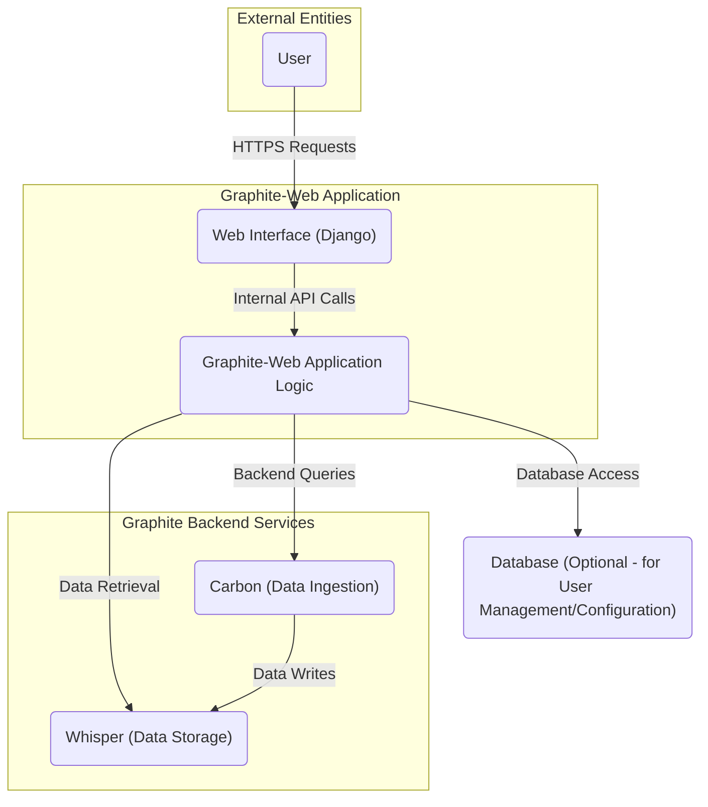
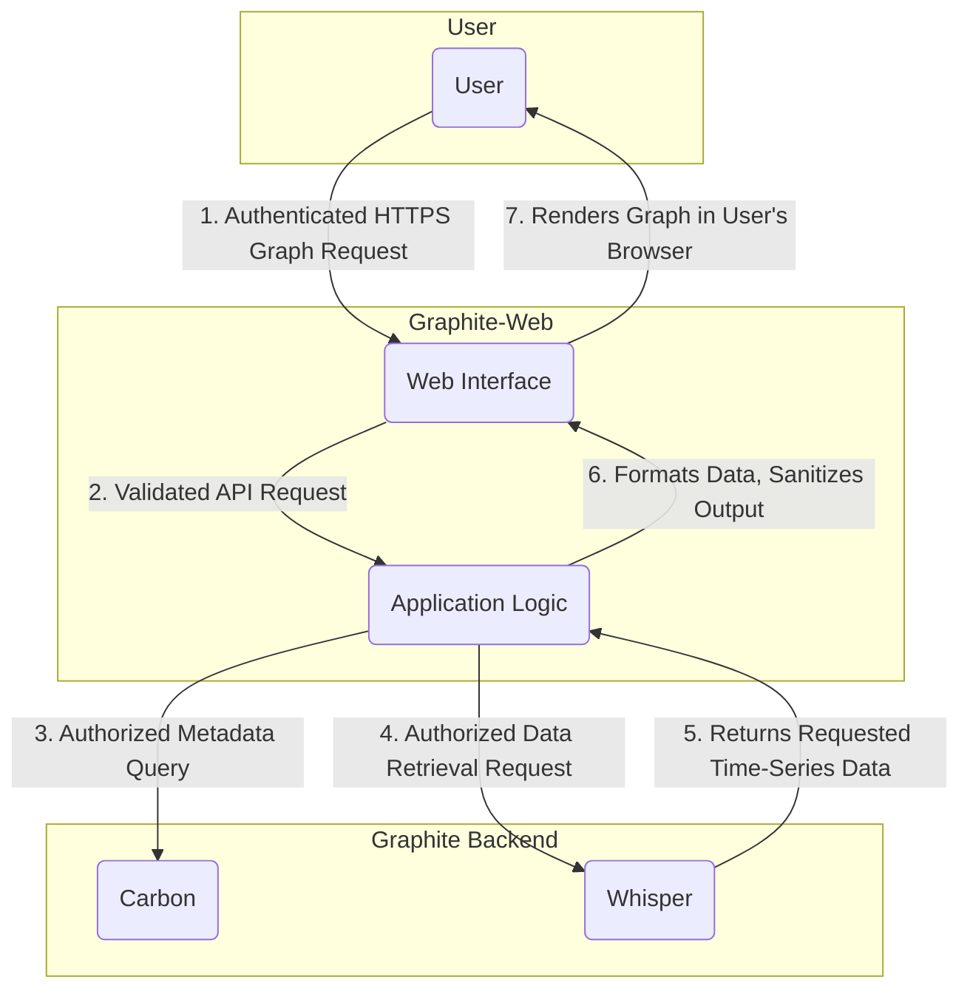

# Project Design Document: Graphite-Web

**Version:** 1.1
**Date:** October 26, 2023
**Author:** AI Software Architect

## 1. Introduction

This document provides a detailed architectural design for Graphite-Web, a crucial component of the Graphite monitoring tool suite. It is intended for stakeholders involved in the security analysis and development of the Graphite platform, particularly those responsible for threat modeling. This document outlines the system's components, their interactions, data flow, and deployment considerations to facilitate a comprehensive understanding of potential security vulnerabilities.

## 2. Goals and Objectives

The primary goals of Graphite-Web are to:

*   Provide a secure and intuitive web interface for visualizing time-series data collected by the Graphite system.
*   Enable users to create, manage, and share dashboards composed of various graph types, with appropriate access controls.
*   Offer robust functionalities for querying and exploring metrics, while preventing unauthorized data access.
*   Provide secure authentication and authorization mechanisms to strictly control access to data and features.
*   Integrate seamlessly and securely with other core Graphite components, specifically Carbon and Whisper.

## 3. High-Level Architecture

Graphite-Web serves as the presentation layer for the Graphite monitoring system, mediating user interactions and data retrieval from the backend.

**Components:**

*   **User:** An individual or automated system interacting with the Graphite-Web interface via a web browser or API calls.
*   **Web Interface (Django):** The front-end component, built using the Django web framework, responsible for:
    *   Presenting the user interface.
    *   Handling user authentication and session management.
    *   Receiving and validating user input.
    *   Making asynchronous requests to the Application Logic.
    *   Rendering visualizations based on data received.
*   **Graphite-Web Application Logic:** The core Python application that:
    *   Receives and processes requests from the Web Interface.
    *   Enforces authentication and authorization policies.
    *   Parses user queries and translates them into backend requests.
    *   Queries Carbon for metric metadata (e.g., available metrics, tags).
    *   Queries Whisper for time-series data.
    *   Formats and prepares data for rendering by the Web Interface.
    *   Manages dashboard definitions and user preferences (if a database is used).
*   **Carbon (Data Ingestion):** A separate suite of services responsible for receiving, processing, and storing time-series data. Graphite-Web interacts with Carbon primarily for metadata retrieval and, in some configurations, for querying cached data.
*   **Whisper (Data Storage):** The time-series database component where metric data is persistently stored in a fixed-size database format. Graphite-Web queries Whisper to retrieve the raw data necessary for graph generation.
*   **Database (Optional - for User Management/Configuration):** A relational database (e.g., PostgreSQL, MySQL) used to store:
    *   User accounts and associated credentials.
    *   User roles and permissions.
    *   Dashboard definitions and sharing configurations.
    *   Other persistent settings for Graphite-Web.

## 4. Detailed Component Breakdown

### 4.1. Web Interface (Django)

*   **Functionality:**
    *   Presents the user interface for interacting with Graphite, including dashboards, graph explorers, and user settings.
    *   Handles user authentication (login, logout) and session management (using cookies or other mechanisms).
    *   Receives user input through forms and URL parameters, requiring thorough validation to prevent injection attacks.
    *   Makes asynchronous API calls to the Graphite-Web Application Logic to fetch data and perform actions.
    *   Renders dynamic web pages displaying graphs and dashboards using JavaScript charting libraries.
    *   Implements client-side logic for user interactions and data presentation.
*   **Key Technologies:**
    *   Python (Django Framework with templating engine)
    *   HTML (for structuring content)
    *   CSS (for styling)
    *   JavaScript (for dynamic behavior and AJAX requests)
    *   JavaScript charting libraries (e.g., Flot, Rickshaw, Chart.js)
*   **Security Considerations:**
    *   Susceptible to Cross-Site Scripting (XSS) attacks if user-provided data is not properly sanitized before rendering.
    *   Requires protection against Cross-Site Request Forgery (CSRF) attacks.
    *   Session hijacking is a risk if session management is not implemented securely (e.g., using HTTPS, secure cookies).
    *   Vulnerable to clickjacking if proper frame options are not set.
*   **Inputs:**
    *   User login credentials (username/password, potentially API keys).
    *   User requests for graphs, dashboards, and metric exploration (via forms, URLs).
    *   Data received from the Graphite-Web Application Logic (JSON or similar format).
*   **Outputs:**
    *   Rendered HTML, CSS, and JavaScript sent to the user's browser.
    *   API requests (typically AJAX) to the Graphite-Web Application Logic.

### 4.2. Graphite-Web Application Logic

*   **Functionality:**
    *   Acts as the central processing unit for Graphite-Web, handling requests from the Web Interface.
    *   Authenticates users based on provided credentials or API keys.
    *   Authorizes user actions based on roles and permissions, controlling access to specific metrics and dashboards.
    *   Parses user queries, validating input to prevent injection attacks (e.g., Graphite functions injection).
    *   Constructs and executes queries against Carbon and Whisper.
    *   Retrieves and processes data from the backend, potentially applying transformations or aggregations.
    *   Formats data into a structure suitable for rendering by the Web Interface.
    *   Manages dashboard definitions, user preferences, and permissions if a database backend is used.
*   **Key Technologies:**
    *   Python
    *   Django Framework
    *   Graphite API (internal Python API for interacting with Carbon and Whisper)
    *   Potentially other Python libraries for data manipulation and processing.
*   **Security Considerations:**
    *   Vulnerable to authentication bypass if not implemented correctly.
    *   Susceptible to authorization flaws leading to unauthorized access to data or functionalities.
    *   Can be targeted by injection attacks if user-provided data is not sanitized before being used in backend queries.
    *   Requires secure handling of user credentials and API keys.
*   **Inputs:**
    *   Requests from the Web Interface (including user credentials, query parameters, dashboard definitions).
    *   Configuration settings (database connection details, backend URLs).
*   **Outputs:**
    *   Data formatted for the Web Interface (JSON or similar).
    *   Queries to Carbon and Whisper.
    *   Updates to the database (if used).
    *   Authentication and authorization responses.

### 4.3. Carbon (Data Ingestion)

*   **Functionality:**
    *   Receives time-series data points from various sources (e.g., applications, servers).
    *   Processes and optionally aggregates data.
    *   Writes data to Whisper database files.
    *   Provides endpoints for querying metric metadata (e.g., finding available metrics).
    *   `carbon-cache` can also serve as a query endpoint for recently received data.
*   **Key Technologies:**
    *   Python (Twisted framework for asynchronous networking)
*   **Security Considerations:**
    *   Vulnerable to denial-of-service (DoS) attacks if it receives a large volume of invalid or malicious data.
    *   Unauthorized access to Carbon's listening ports could allow injection of arbitrary metrics.
    *   Security of inter-component communication within the Carbon suite is important.
*   **Inputs:**
    *   Time-series data points (metric name, value, timestamp) over various protocols (e.g., plaintext, pickle).
    *   Metadata queries from Graphite-Web.
*   **Outputs:**
    *   Data written to Whisper databases.
    *   Metadata about available metrics (returned to Graphite-Web).
*   **Sub-components relevant to Graphite-Web interaction:**
    *   **carbon-cache:** Caches incoming data before writing to Whisper, and can be queried by Graphite-Web for recent data.
    *   **carbon-relay:** Relays data to multiple Carbon instances, potentially introducing points for interception or tampering.
    *   **carbon-aggregator:** Aggregates metrics before writing to Whisper, requiring secure configuration to prevent unauthorized aggregation.

### 4.4. Whisper (Data Storage)

*   **Functionality:**
    *   Stores time-series data in fixed-size database files (`.wsp`).
    *   Provides efficient retrieval of historical data based on time ranges.
*   **Key Technologies:**
    *   Python
    *   Custom file format (.wsp)
*   **Security Considerations:**
    *   Data confidentiality is a concern if the underlying file system is not properly secured.
    *   Unauthorized access to Whisper files could allow for data modification or deletion.
    *   Integrity of the data stored in Whisper is crucial for accurate monitoring.
*   **Inputs:**
    *   Time-series data from Carbon.
    *   Read requests from Graphite-Web.
*   **Outputs:**
    *   Time-series data queried by Graphite-Web.

### 4.5. Database (Optional - for User Management/Configuration)

*   **Functionality:**
    *   Stores user accounts, hashed passwords, and roles.
    *   Stores dashboard definitions, including layout, graphs, and permissions.
    *   May store other persistent settings for Graphite-Web.
*   **Key Technologies:**
    *   Relational Database Management System (RDBMS) such as PostgreSQL, MySQL, or SQLite.
    *   Django ORM (Object-Relational Mapper) for database interactions.
*   **Security Considerations:**
    *   Requires secure configuration and access controls to prevent unauthorized access to sensitive data (user credentials, dashboard definitions).
    *   Vulnerable to SQL injection attacks if proper input sanitization is not implemented in the Application Logic.
    *   Secure storage of database credentials is essential.
*   **Inputs:**
    *   User credentials and configuration data from the Web Interface and Application Logic.
*   **Outputs:**
    *   User authentication and authorization information.
    *   Dashboard definitions and configurations.

## 5. Data Flow

The typical data flow for displaying a graph in Graphite-Web, highlighting security considerations, is as follows:

**Detailed Steps with Security Focus:**

1. **Authenticated HTTPS Graph Request:** The user, after successful authentication, sends a request for a graph over HTTPS. This ensures confidentiality and integrity of the request.
2. **Validated API Request:** The Web Interface validates the request format and parameters before forwarding it to the Application Logic. This helps prevent malformed requests.
3. **Authorized Metadata Query:** The Application Logic, after verifying the user's authorization to access the requested metrics, queries Carbon for metadata. Access control policies are enforced here.
4. **Authorized Data Retrieval Request:** The Application Logic, again verifying authorization, requests the actual time-series data from Whisper.
5. **Returns Requested Time-Series Data:** Whisper retrieves the data and returns it to the Application Logic. Access to Whisper files should be restricted at the operating system level.
6. **Formats Data, Sanitizes Output:** The Application Logic formats the retrieved data and sanitizes it to prevent potential XSS vulnerabilities before sending it to the Web Interface.
7. **Renders Graph in User's Browser:** The Web Interface renders the graph using JavaScript. Client-side security measures (e.g., Content Security Policy) can further mitigate XSS risks.

## 6. Deployment Architecture

Graphite-Web can be deployed in various configurations, each with its own security implications:

*   **Single Server Deployment:** All components reside on a single server.
    *   **Security Considerations:** Increased attack surface on a single host. Compromise of the server grants access to all components. Proper firewalling and OS-level security are crucial.
*   **Distributed Deployment:** Components are deployed on separate servers.
    *   **Security Considerations:** Requires secure communication channels between components. Network segmentation and firewalls are essential. Authentication and authorization between services need to be robust.
*   **Cloud-Based Deployment:** Leveraging cloud services like AWS, Azure, or GCP.
    *   **Security Considerations:** Relies on the security of the cloud provider's infrastructure. Proper configuration of cloud security services (e.g., security groups, IAM roles) is critical.
*   **Containerized Deployment (Docker, Kubernetes):** Components are packaged in containers and orchestrated.
    *   **Security Considerations:** Container image security and vulnerability scanning are important. Secure configuration of the container orchestration platform is crucial. Network policies can control inter-container communication.

## 7. Key Technologies

*   **Programming Languages:** Python
*   **Web Framework:** Django (with built-in security features)
*   **Time-Series Database:** Whisper (file-based storage)
*   **Networking Framework (Carbon):** Twisted (asynchronous event-driven networking)
*   **Frontend Technologies:** HTML, CSS, JavaScript
*   **Charting Libraries:** Flot, Rickshaw, Chart.js, etc.
*   **Database (Optional):** PostgreSQL, MySQL, SQLite (requires secure configuration)

## 8. Security Considerations (Expanded)

This section expands on the initial security considerations, providing more specific examples:

*   **Authentication and Authorization:**
    *   **Threats:** Brute-force attacks, credential stuffing, session hijacking, authorization bypass.
    *   **Mitigations:** Strong password policies, multi-factor authentication (if supported), secure session management (HTTPS, secure cookies), role-based access control, regular security audits.
*   **Input Validation:**
    *   **Threats:** Cross-Site Scripting (XSS), SQL Injection (if database is used), Graphite function injection.
    *   **Mitigations:** Server-side input validation and sanitization, parameterized queries for database interactions, escaping output before rendering in the web interface, using a Content Security Policy (CSP).
*   **Session Management:**
    *   **Threats:** Session fixation, session hijacking.
    *   **Mitigations:** Using HTTPS, setting secure and HttpOnly flags on session cookies, regenerating session IDs after login, implementing session timeouts.
*   **Data Security (Whisper):**
    *   **Threats:** Unauthorized access to metric data, data tampering.
    *   **Mitigations:** Restricting file system permissions on Whisper data directories, encryption at rest (if supported by the underlying infrastructure), regular backups.
*   **Communication Security:**
    *   **Threats:** Man-in-the-middle attacks, eavesdropping.
    *   **Mitigations:** Enforcing HTTPS for all communication with the web interface, considering TLS for inter-component communication within the Graphite suite.
*   **Dependency Management:**
    *   **Threats:** Exploiting known vulnerabilities in third-party libraries.
    *   **Mitigations:** Regularly updating dependencies, using vulnerability scanning tools.
*   **Access Control to Backend Components (Carbon, Whisper):**
    *   **Threats:** Unauthorized data injection, data modification, data deletion.
    *   **Mitigations:** Firewall rules to restrict access to Carbon and Whisper ports, authentication and authorization for inter-component communication (if available).
*   **Configuration Management:**
    *   **Threats:** Exposure of sensitive configuration details (e.g., database credentials).
    *   **Mitigations:** Storing configuration files securely, using environment variables or dedicated secret management tools for sensitive information.

## 9. Assumptions and Constraints

*   It is assumed that the underlying operating system and network infrastructure are configured with basic security best practices.
*   This design focuses on the core architecture of Graphite-Web and its direct interactions with Carbon and Whisper. External integrations and plugins are not detailed here.
*   The specific implementation details of authentication and authorization mechanisms may vary depending on the Graphite-Web configuration and deployment.
*   Performance and scalability requirements are considered but are not the primary focus of this security-oriented design document.

## 10. Future Considerations

*   **Enhanced Security Features:** Implementing more advanced security features such as rate limiting, intrusion detection/prevention system (IDS/IPS) integration, and security logging and monitoring.
*   **Modernized Authentication/Authorization:** Exploring integration with modern authentication protocols like OAuth 2.0 or SAML.
*   **Improved Input Sanitization:** Implementing more robust input sanitization techniques to prevent a wider range of injection attacks.
*   **Regular Security Audits and Penetration Testing:** Conducting periodic security assessments to identify and address potential vulnerabilities.
*   **Security Hardening Guides:** Developing comprehensive security hardening guides for different deployment scenarios.
