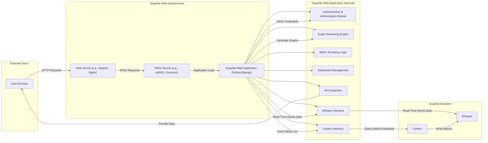

# Project Design Document: Graphite-Web

**Project:** Graphite-Web

**Version:** 1.1

**Date:** October 26, 2023

**Author:** AI Software Architect

## 1. Introduction

This document provides an enhanced and more detailed design overview of the Graphite-Web project, a crucial component of the Graphite monitoring platform. This document is specifically crafted to serve as a comprehensive reference for understanding the system's architecture, internal components, and data flow, with a strong focus on facilitating effective threat modeling.

## 2. Project Overview

Graphite is a powerful suite of open-source tools designed for real-time graphing and monitoring of time-series data. Graphite-Web serves as the primary web application interface, enabling users to visualize metrics, browse data, and manage dashboards. It interacts closely with other core Graphite components, notably Carbon (the metric ingestion service) and Whisper (the time-series database). This document delves deeper into the internal workings of Graphite-Web to provide a clearer picture for security analysis.

## 3. System Architecture

The following diagram provides a more detailed illustration of the architecture of Graphite-Web, highlighting its internal components and interactions with external entities and other Graphite services.

## 4. Component Descriptions

This section provides a detailed breakdown of the key components within and interacting with Graphite-Web.

*   **User Browser:** The client-side application, typically a web browser, used by end-users to access and interact with the Graphite-Web interface.
*   **Web Server (e.g., Apache, Nginx):** The front-end web server responsible for handling incoming HTTP requests.
    *   Handles SSL/TLS termination, providing secure communication.
    *   May provide initial authentication or authorization layers.
    *   Serves static content (HTML, CSS, JavaScript files).
    *   Proxies requests to the WSGI server.
*   **WSGI Server (e.g., uWSGI, Gunicorn):**  A server that implements the Web Server Gateway Interface (WSGI) specification, acting as an intermediary between the web server and the Django application.
    *   Manages the execution of the Python/Django application.
    *   Handles request routing and concurrency.
*   **Graphite-Web Application (Python/Django):** The core application logic built using the Django web framework.
    *   **Authentication & Authorization Module:** Manages user authentication (verifying identity) and authorization (granting access to resources).
        *   Handles user login and logout.
        *   Manages user roles and permissions.
        *   May integrate with external authentication providers (e.g., LDAP).
    *   **Graph Rendering Engine:** Processes user requests for graphs, retrieves data, and generates graph images.
        *   Handles different graph types and rendering options.
        *   Utilizes libraries for image generation.
    *   **Metric Browsing Logic:** Provides the functionality for users to explore the available metrics and their hierarchical structure.
        *   Queries Carbon for metric metadata.
        *   Presents the metric tree to the user.
    *   **Dashboard Management:** Allows users to create, edit, and manage custom dashboards containing multiple graphs.
        *   Stores dashboard configurations.
        *   Handles dashboard sharing and permissions.
    *   **API Endpoints:** Exposes RESTful APIs for programmatic access to metrics, graph data, and other functionalities.
        *   Allows external systems to interact with Graphite-Web.
        *   Requires proper authentication and authorization.
    *   **Whisper Interface:**  Handles the interaction with the Whisper database for reading time-series data.
        *   Manages file access and data retrieval from Whisper files.
        *   Optimizes data retrieval for graph rendering.
    *   **Carbon Interface:** Manages communication with the Carbon service to retrieve metric metadata.
        *   Typically uses network protocols (e.g., TCP).
        *   Retrieves lists of available metrics and their structure.
*   **Carbon:** The data ingestion service responsible for receiving and processing metrics from various sources.
    *   Listens for incoming metrics over various protocols (e.g., plaintext, pickle).
    *   Performs aggregation and relaying of metrics.
    *   Writes received metrics to Whisper database files.
*   **Whisper:** The time-series database format used by Graphite for efficient storage and retrieval of numerical data over time.
    *   Stores data in fixed-size, pre-allocated database files.
    *   Optimized for time-series data with roll-up and retention policies.

## 5. Data Flow (Detailed Graph Rendering)

The following steps detail the data flow involved in rendering a graph in Graphite-Web:

1. A user initiates a graph request through the web browser, specifying the metrics and rendering options.
2. The web browser sends an HTTP request to the web server (e.g., Nginx).
3. The web server forwards the request to the WSGI server (e.g., uWSGI).
4. The WSGI server passes the request to the Django application.
5. The Django application's routing mechanism directs the request to the appropriate view function.
6. The view function invokes the **Authentication & Authorization Module** to verify the user's identity and permissions.
7. The view function utilizes the **Metric Browsing Logic** (if needed) to validate the requested metric names against available metrics from Carbon.
8. The view function calls the **Whisper Interface** to retrieve the raw time-series data for the specified metrics and time range from the Whisper database files.
9. The view function uses the **Graph Rendering Engine** to process the retrieved data and generate the graph image based on the user's specified options.
10. The view function may interact with the **Dashboard Management** module if the request is for a dashboard, fetching the dashboard configuration.
11. The generated graph image (or data for client-side rendering via the **API Endpoints**) is sent back to the WSGI server.
12. The WSGI server sends the response back to the web server.
13. The web server sends the HTTP response, including the graph image, back to the user's browser.
14. The user's browser renders the graph.

## 6. Key Technologies

*   **Programming Languages:** Python
*   **Web Framework:** Django
*   **WSGI Servers:** uWSGI, Gunicorn
*   **Web Servers:** Apache, Nginx
*   **Front-end Technologies:** HTML, CSS, JavaScript
*   **Time-Series Database:** Whisper
*   **Data Ingestion:** Carbon
*   **Graphing Libraries (Server-side):**  (Libraries used within Python for image generation)
*   **Graphing Libraries (Client-side):** Flot, Rickshaw, Chart.js (examples)
*   **Communication Protocols:** HTTP, TCP

## 7. Deployment Model

Graphite-Web deployments can vary in complexity and scale. Common models include:

*   **Standalone Deployment:** All core Graphite components (Carbon, Whisper, Graphite-Web, and supporting services) are installed and run on a single server.
    *   Simpler to set up but limited in scalability and resilience.
*   **Distributed Deployment:** Components are distributed across multiple servers, allowing for horizontal scaling and improved fault tolerance.
    *   **Separation of Concerns:** Web servers and Graphite-Web application servers are often separated from the Carbon and Whisper storage backend.
    *   **Load Balancing:** Load balancers distribute incoming traffic across multiple instances of Graphite-Web application servers for increased capacity and availability.
    *   **Dedicated Storage:** Whisper data may be stored on dedicated storage systems for performance and capacity.
    *   **Containerization (e.g., Docker, Kubernetes):**  Graphite-Web and its dependencies can be containerized for easier deployment, management, and scaling. Orchestration platforms like Kubernetes can manage the deployment and scaling of containerized Graphite components.
*   **Cloud-Based Deployments:** Leveraging cloud services for infrastructure, such as virtual machines, managed databases, and load balancers.
    *   Offers scalability, reliability, and reduced operational overhead.

## 8. Security Considerations (Detailed)

This section expands on the security considerations for Graphite-Web, providing more specific examples and potential threats.

*   **Authentication and Authorization:**
    *   **Threats:** Brute-force attacks on login forms, credential stuffing, unauthorized access due to weak passwords or insecure authentication mechanisms, privilege escalation.
    *   **Mitigations:** Enforce strong password policies, implement multi-factor authentication (MFA), rate limiting on login attempts, regularly audit user accounts and permissions, integrate with robust identity providers.
*   **Input Validation:**
    *   **Threats:** Cross-site scripting (XSS) attacks through user-supplied input in graph titles or dashboard descriptions, SQL injection if Graphite-Web interacts with other databases, command injection if user input is used in system commands.
    *   **Mitigations:** Sanitize and validate all user inputs on both the client-side and server-side, use parameterized queries for database interactions, avoid executing arbitrary system commands based on user input, implement Content Security Policy (CSP).
*   **Session Management:**
    *   **Threats:** Session hijacking through stolen session cookies, session fixation attacks.
    *   **Mitigations:** Use secure, HTTP-only, and SameSite cookies, regenerate session IDs upon login, implement session timeouts, protect against cross-site tracing (CST).
*   **Cross-Site Request Forgery (CSRF) Protection:**
    *   **Threats:** Malicious websites or emails tricking authenticated users into performing unintended actions on Graphite-Web.
    *   **Mitigations:** Implement CSRF tokens in forms and AJAX requests, utilize the `Origin` and `Referer` headers for validation.
*   **Secure Communication (HTTPS):**
    *   **Threats:** Man-in-the-middle attacks intercepting sensitive data transmitted between the user's browser and the server.
    *   **Mitigations:** Enforce HTTPS for all communication, use strong TLS configurations, ensure proper certificate management.
*   **Access Control to Whisper Files:**
    *   **Threats:** Unauthorized access to raw metric data by malicious actors or compromised processes.
    *   **Mitigations:** Restrict file system permissions on Whisper database files to only the necessary processes (Carbon and Graphite-Web), consider encrypting Whisper data at rest.
*   **Dependency Management:**
    *   **Threats:** Vulnerabilities in third-party libraries and frameworks used by Graphite-Web.
    *   **Mitigations:** Regularly update dependencies to the latest stable versions, use vulnerability scanning tools to identify and address known vulnerabilities.
*   **Rate Limiting:**
    *   **Threats:** Denial-of-service (DoS) attacks overwhelming the server with excessive requests.
    *   **Mitigations:** Implement rate limiting on API endpoints and other critical functionalities.
*   **Security Headers:**
    *   **Threats:** Various web-based attacks exploiting missing or misconfigured security headers.
    *   **Mitigations:** Configure security headers such as `Strict-Transport-Security`, `X-Content-Type-Options`, `X-Frame-Options`, and `X-XSS-Protection`.
*   **Error Handling and Logging:**
    *   **Threats:** Information leakage through verbose error messages, insufficient logging hindering security investigations.
    *   **Mitigations:** Implement proper error handling that doesn't reveal sensitive information, maintain comprehensive audit logs of user activity and system events.

This enhanced design document provides a more granular understanding of Graphite-Web's architecture and security considerations, serving as a solid foundation for conducting thorough threat modeling exercises.