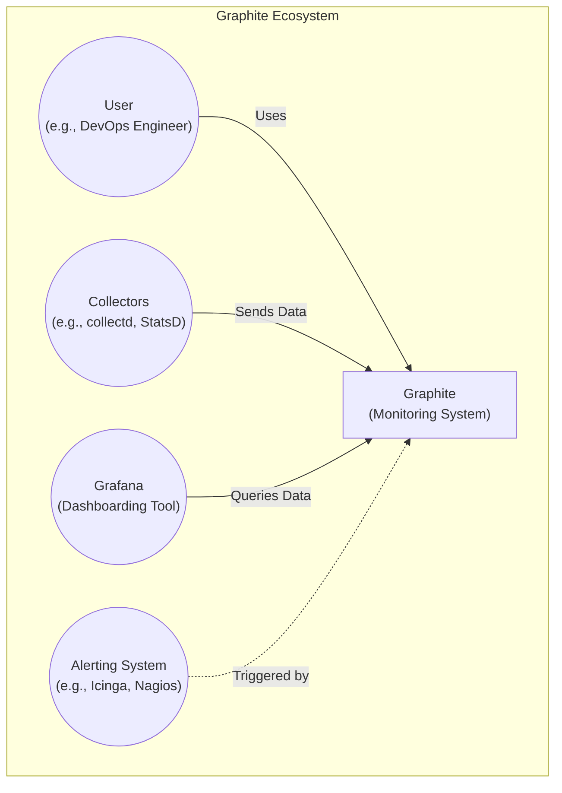
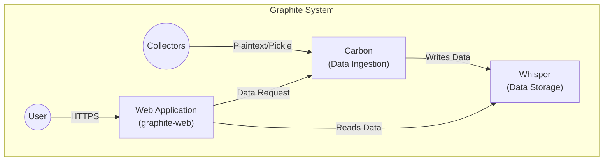
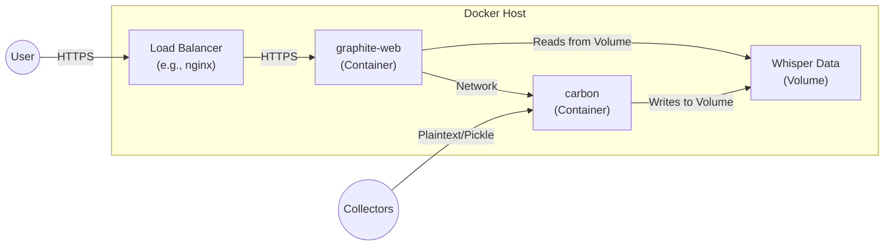
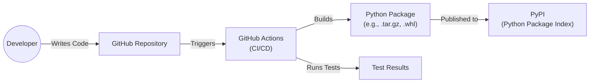

Okay, let's create a design document for the Graphite project, focusing on aspects relevant for threat modeling.

# BUSINESS POSTURE

Graphite is an open-source project focused on providing a highly scalable, real-time graphing system.  It's designed to handle numeric time-series data.  The primary business goals appear to be:

*   Provide a reliable and performant monitoring solution: Graphite is used to visualize metrics, so uptime and accurate data representation are critical.  Users rely on it to make operational decisions.
*   Maintain an active open-source community:  The project's success depends on community contributions and adoption.  This implies a need for ease of use, good documentation, and responsiveness to community needs.
*   Support a wide range of integrations: Graphite's value is increased by its ability to receive data from various sources (collectors) and integrate with other systems (like Grafana for dashboards).

Based on these goals, the most important business risks are:

*   Data Loss or Corruption:  Loss of monitoring data can lead to missed alerts and inability to diagnose issues. Corruption can lead to incorrect decisions.
*   Performance Degradation or Unavailability:  If Graphite becomes slow or unavailable, it disrupts the monitoring workflow and can impact the systems being monitored.
*   Security Vulnerabilities:  Exploitable vulnerabilities could lead to data breaches, system compromise, or denial-of-service attacks.  This is particularly important if Graphite is exposed to the public internet.
*   Lack of Community Adoption/Contribution: If the project stagnates, it may become obsolete or lose relevance.
*   Integration Failures: If Graphite cannot reliably receive data from collectors or integrate with dashboarding tools, its usefulness is significantly diminished.

# SECURITY POSTURE

Based on the provided GitHub repository, the following security controls and accepted risks are identified. Note that this is an assessment based on the repository *contents*, not a full security audit.

*   security control: Input validation: The repository contains code related to parsing and processing data from various sources. The extent and effectiveness of input validation are not immediately clear from a cursory review but are assumed to be present to some degree. Location: Various parsing functions within the codebase.
*   security control: Limited attack surface: Graphite's core components (carbon, whisper, webapp) have well-defined roles, which helps limit the potential impact of a vulnerability in any single component. Location: Architectural design.
*   accepted risk: Limited built-in authentication/authorization: Graphite itself has very basic authentication. It typically relies on external systems (e.g., a reverse proxy with authentication) or network-level controls for access control. This is a common deployment pattern, but it's an accepted risk that must be addressed at the deployment level.
*   accepted risk: Potential for denial-of-service: Graphite is designed for high throughput, but it's still susceptible to denial-of-service attacks if overwhelmed with data or malicious requests. Mitigation is expected to be handled at the infrastructure level (e.g., rate limiting, load balancing).
*   accepted risk: Dependency vulnerabilities: Like any software project, Graphite depends on external libraries. These dependencies may have vulnerabilities that could impact Graphite's security. Location: requirements.txt, package.json, etc.

Recommended Security Controls (High Priority):

*   Implement robust input sanitization and validation across all data input paths (carbon, webapp API). This should include checks for data type, length, and allowed characters.
*   Conduct regular security audits and penetration testing, especially on the web application component.
*   Establish a clear process for managing and updating dependencies, including vulnerability scanning and timely patching.
*   Provide detailed documentation on secure deployment configurations, including recommendations for authentication, authorization, and network security.
*   Implement monitoring and alerting for security-relevant events, such as failed login attempts, unusual data patterns, and system errors.

Security Requirements:

*   Authentication:
    *   The system SHOULD allow integration with external authentication providers (e.g., LDAP, OAuth).
    *   The system SHOULD support basic username/password authentication for local accounts (with secure password storage).
    *   The system SHOULD enforce password complexity requirements.
*   Authorization:
    *   The system SHOULD provide a mechanism to control access to specific metrics or data views.
    *   The system SHOULD support role-based access control (RBAC) to define different levels of access for users.
*   Input Validation:
    *   The system MUST validate all input data from external sources (carbon, webapp API).
    *   The system MUST sanitize data to prevent injection attacks (e.g., cross-site scripting, SQL injection).
    *   The system MUST enforce data type and length restrictions.
*   Cryptography:
    *   The system SHOULD use secure communication protocols (e.g., HTTPS) for all data transmission.
    *   The system SHOULD encrypt sensitive data at rest (if applicable).
    *   The system SHOULD use strong cryptographic algorithms and key management practices.

# DESIGN

## C4 CONTEXT

Element Descriptions:

*   Element:
    *   Name: User
    *   Type: Person
    *   Description: A person who interacts with Graphite to view metrics, create dashboards, or configure the system.
    *   Responsibilities: Viewing metrics, creating dashboards, configuring Graphite, setting up alerts.
    *   Security controls: Authentication and authorization provided by external systems (e.g., reverse proxy, Grafana).

*   Element:
    *   Name: Graphite
    *   Type: Software System
    *   Description: The core Graphite monitoring system, responsible for storing and retrieving time-series data.
    *   Responsibilities: Storing time-series data, providing an API for querying data, rendering graphs.
    *   Security controls: Input validation, limited attack surface.

*   Element:
    *   Name: Collectors
    *   Type: Software System
    *   Description: Agents or services that collect metrics from various sources and send them to Graphite.
    *   Responsibilities: Collecting metrics, sending data to Graphite.
    *   Security controls: Authentication to Graphite (if configured), secure communication (if configured).

*   Element:
    *   Name: Grafana
    *   Type: Software System
    *   Description: A popular dashboarding tool that can query data from Graphite and display it in various visualizations.
    *   Responsibilities: Querying data from Graphite, displaying dashboards, user authentication and authorization.
    *   Security controls: Authentication and authorization, secure communication with Graphite.

*   Element:
    *   Name: Alerting System
    *   Type: Software System
    *   Description: A system that monitors metrics and triggers alerts based on predefined rules. Can be integrated with Graphite.
    *   Responsibilities: Monitoring metrics, triggering alerts.
    *   Security controls: Authentication to Graphite (if configured), secure communication (if configured).

## C4 CONTAINER

Element Descriptions:

*   Element:
    *   Name: Web Application (graphite-web)
    *   Type: Web Application
    *   Description: Provides the web interface for interacting with Graphite, rendering graphs, and accessing the API.
    *   Responsibilities: Rendering graphs, providing an API, handling user requests.
    *   Security controls: Input validation, session management (if implemented).

*   Element:
    *   Name: Carbon (Data Ingestion)
    *   Type: Application
    *   Description: Receives data from collectors and writes it to the Whisper database.
    *   Responsibilities: Receiving data, writing data to Whisper.
    *   Security controls: Input validation.

*   Element:
    *   Name: Whisper (Data Storage)
    *   Type: Database
    *   Description: A fixed-size database designed for storing time-series data.
    *   Responsibilities: Storing time-series data, providing data retrieval.
    *   Security controls: File system permissions (typically).

## DEPLOYMENT

Graphite can be deployed in various ways, including:

1.  Single-server deployment: All components (carbon, whisper, webapp) are installed on a single machine. This is suitable for small-scale deployments or testing.
2.  Multi-server deployment: Components are distributed across multiple machines. This provides better scalability and resilience.
3.  Containerized deployment: Components are packaged as Docker containers and deployed using an orchestration platform like Kubernetes. This offers the most flexibility and scalability.
4.  Cloud-based deployment: Using cloud services like AWS, GCP, or Azure to host the components. This can leverage managed services for databases, load balancing, and other infrastructure needs.

We'll describe a containerized deployment using Docker Compose for simplicity and reproducibility. This is a common approach for modern deployments.

Element Descriptions:

*   Element:
    *   Name: graphite-web (Container)
    *   Type: Docker Container
    *   Description: Runs the graphite-web application.
    *   Responsibilities: Serving the web interface, handling API requests.
    *   Security controls: Container isolation, network security policies.

*   Element:
    *   Name: carbon (Container)
    *   Type: Docker Container
    *   Description: Runs the carbon-cache service.
    *   Responsibilities: Receiving data from collectors, writing to Whisper.
    *   Security controls: Container isolation, network security policies.

*   Element:
    *   Name: Whisper Data (Volume)
    *   Type: Docker Volume
    *   Description: Provides persistent storage for the Whisper database.
    *   Responsibilities: Storing time-series data.
    *   Security controls: File system permissions within the container.

*   Element:
    *   Name: Load Balancer (e.g., nginx)
    *   Type: Software/Container
    *   Description: Distributes incoming traffic across multiple instances of the web application.
    *   Responsibilities: Load balancing, SSL termination.
    *   Security controls: SSL/TLS configuration, access control lists.

*   Element:
    *   Name: User
    *   Type: Person
    *   Description: A person who interacts with Graphite to view metrics.
    *   Responsibilities: Accessing the web interface.
    *   Security controls: Authentication and authorization provided by the load balancer or an external system.

*   Element:
    *   Name: Collectors
    *   Type: Software System
    *   Description: Agents or services that collect metrics.
    *   Responsibilities: Sending data to Carbon.
    *   Security controls: Authentication to Carbon (if configured).

## BUILD

Graphite's build process is relatively straightforward, primarily involving Python packaging.

Security Controls in Build Process:

*   security control: Code review: Pull requests on GitHub are typically reviewed before being merged, providing a basic level of code review. Location: GitHub pull request process.
*   security control: Automated testing: The repository includes unit tests that are run as part of the build process. Location: GitHub Actions workflows.
*   security control: Dependency management: Dependencies are listed in `requirements.txt` or similar files, allowing for tracking and potential vulnerability scanning. Location: `requirements.txt`, `setup.py`.

Recommended improvements:

*   Integrate SAST (Static Application Security Testing) tools into the GitHub Actions workflow to scan for potential vulnerabilities in the code.
*   Use a dependency vulnerability scanner (e.g., `pip-audit`, `safety`) to check for known vulnerabilities in dependencies during the build process.
*   Consider signing releases to ensure the integrity of the distributed packages.

# RISK ASSESSMENT

*   Critical Business Processes:
    *   Real-time monitoring of systems and applications.
    *   Historical data analysis for capacity planning and troubleshooting.
    *   Alerting on critical events.

*   Data We Are Trying to Protect:
    *   Time-series metric data: This data can include sensitive information about system performance, resource utilization, and application behavior.
    *   Configuration data: Graphite configuration files may contain credentials or other sensitive information.

*   Data Sensitivity:
    *   Metric data: Sensitivity varies depending on the specific metrics being collected. Some metrics may be publicly available (e.g., website traffic), while others may be highly confidential (e.g., internal system performance data).
    *   Configuration data: Generally considered highly sensitive.

# QUESTIONS & ASSUMPTIONS

*   Questions:
    *   What are the specific compliance requirements (if any) for the deployment environment (e.g., PCI DSS, HIPAA)?
    *   What is the expected scale of the deployment (number of metrics, data retention period)?
    *   What are the existing security policies and procedures for the organization deploying Graphite?
    *   Are there any specific threat models or attack scenarios that are of particular concern?
    *   What level of access will different users have to the Graphite system?
    *   What are the specific collectors that will be used, and what are their security characteristics?
    *   Will Graphite be exposed to the public internet, or will it be deployed within a private network?
    *   What is the process for handling security incidents and vulnerabilities?

*   Assumptions:
    *   BUSINESS POSTURE: The primary goal is to provide a reliable and performant monitoring solution. The organization has a moderate risk appetite, willing to accept some risks (like basic built-in authentication) in favor of ease of use and flexibility.
    *   SECURITY POSTURE: The organization has basic security controls in place (e.g., firewalls, network segmentation). The deployment will leverage external systems for authentication and authorization.
    *   DESIGN: The deployment will use a containerized approach (e.g., Docker Compose) for ease of deployment and management. A load balancer will be used to provide high availability and SSL termination.
    *   The organization has a process for managing and updating software dependencies.
    *   The organization has a basic understanding of security best practices.
    *   The deployment environment is reasonably secure.
    *   The collectors are configured securely and are sending data over a secure channel (if required).
    *   The Graphite data is not considered highly sensitive (e.g., no PII or financial data).
    *   The organization has a process for monitoring and responding to security alerts.