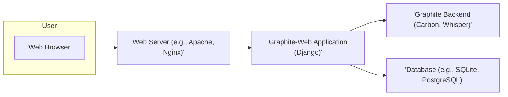
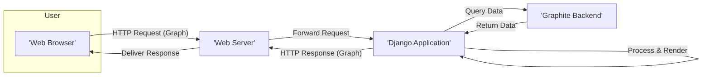

# Project Design Document: Graphite-Web

**Version:** 1.1
**Date:** October 26, 2023
**Author:** Gemini (AI Language Model)
**Project:** Graphite-Web Analysis for Threat Modeling

## 1. Introduction

This document provides a detailed design overview of the Graphite-Web project, specifically tailored for subsequent threat modeling activities. It outlines the system's architecture, key components, data flows, and interactions. This document aims to provide a comprehensive understanding of the system's structure and functionality to facilitate the identification of potential security vulnerabilities. The information is based on the publicly available source code repository: [https://github.com/graphite-project/graphite-web](https://github.com/graphite-project/graphite-web).

## 2. Goals and Objectives

The primary goal of this document is to provide a clear and concise description of the Graphite-Web system architecture for threat modeling purposes. The objectives include:

*   Identifying the major components of the Graphite-Web application.
*   Describing the interactions and data flow between these components.
*   Highlighting key technologies and dependencies.
*   Providing a foundation for identifying potential threat vectors and vulnerabilities.

## 3. System Overview

Graphite-Web is a web application that provides a user interface for visualizing time-series data collected and stored by the Graphite backend (primarily Carbon and Whisper). It allows users to create graphs, dashboards, and manage their data.

### 3.1. High-Level Architecture

*   **User:** Interacts with the system through a web browser.
*   **Web Server:**  Handles incoming HTTP requests and serves static content. It acts as a reverse proxy, forwarding requests to the Graphite-Web application.
*   **Graphite-Web Application:** The core of the web interface, built using the Django framework. It handles user authentication, authorization, graph rendering, dashboard management, and API endpoints.
*   **Graphite Backend:** Consists of Carbon (the data ingestion service) and Whisper (the time-series database). Graphite-Web queries this backend for data.
*   **Database:** Stores user accounts, dashboards, saved graphs, and other application-specific data.

## 4. Detailed Design

This section delves into the key components of the Graphite-Web application.

### 4.1. Components

*   **Web Interface (Frontend):**
    *   Description: Implemented using HTML, CSS, and JavaScript.
    *   Responsibilities: Rendering graphs, dashboards, and user interface elements in the browser. Handling user interactions and sending requests to the backend. Utilizes libraries like jQuery and potentially others for dynamic behavior and UI elements.

*   **Django Application:**
    *   Description: The core backend logic of Graphite-Web, built using the Django framework.
    *   Responsibilities: Handling routing of HTTP requests. Managing user authentication and authorization. Implementing the API endpoints for data retrieval and manipulation. Interacting with the Graphite backend to fetch time-series data. Interacting with the database for storing application data.

*   **Rendering Engine:**
    *   Description: Responsible for generating graph images based on user queries and data retrieved from the backend.
    *   Responsibilities: Processing data and applying rendering logic to create visual representations of the time-series data.

*   **Dashboard Management:**
    *   Description: Allows users to create, edit, and manage dashboards containing multiple graphs.
    *   Responsibilities: Storing dashboard configurations in the database. Providing UI for dashboard creation and modification.

*   **User Management:**
    *   Description: Handles user accounts and their associated data.
    *   Responsibilities: Handling user registration, login, and password management. Managing user permissions and access control.

*   **API Endpoints:**
    *   Description: Provides programmatic access to Graphite-Web functionality.
    *   Responsibilities: Used for retrieving data, rendering graphs, and managing dashboards. Examples include endpoints for fetching graph data in JSON or other formats.

### 4.2. Data Flow

The typical data flow for rendering a graph involves the following steps:

1. **User Request:** A user interacts with the web interface (e.g., clicks "Render Graph").
2. **Browser Request:** The browser sends an HTTP request to the web server.
3. **Web Server Forwarding:** The web server forwards the request to the Graphite-Web application.
4. **Django Routing:** The Django application routes the request to the appropriate view.
5. **Authentication/Authorization:** The application verifies the user's identity and permissions.
6. **Data Query:** The application constructs a query based on the user's request and sends it to the Graphite backend (Carbon or Whisper).
7. **Data Retrieval:** The Graphite backend retrieves the requested time-series data.
8. **Data Processing:** The Graphite-Web application processes the retrieved data.
9. **Rendering:** The rendering engine generates the graph image.
10. **Response Generation:** The Django application generates an HTTP response containing the graph image or data.
11. **Web Server Delivery:** The web server sends the response back to the user's browser.
12. **Browser Rendering:** The browser displays the graph to the user.

### 4.3. Key Technologies and Dependencies

*   **Programming Language:** Python
*   **Web Framework:** Django
*   **Template Engine:** Django Templates
*   **JavaScript Libraries:** jQuery (and potentially others)
*   **Database:** Typically SQLite (default), but supports PostgreSQL, MySQL, etc.
*   **Web Server:** Apache with mod_wsgi or Nginx with uWSGI
*   **Graphite Backend:** Carbon (data ingestion), Whisper (time-series database)

## 5. Security Considerations (For Threat Modeling)

This section highlights areas that should be considered during threat modeling, categorized for clarity.

### 5.1. Authentication and Authorization

*   **Authentication Mechanisms:** How are users authenticated? (e.g., username/password, LDAP integration).
*   **Authorization Controls:** How are permissions managed and enforced to control access to different functionalities and data?
*   **Session Management:** Are there vulnerabilities related to session fixation, hijacking, or insecure cookie handling?
*   **Password Policies:** Are there strong password requirements and enforcement mechanisms?

### 5.2. Input Validation and Data Sanitization

*   **Client-Side Validation:** Is input validation performed on the client-side to prevent malformed requests?
*   **Server-Side Validation:** How is user input validated on the server-side to prevent injection attacks (e.g., XSS, SQL injection, command injection)?
*   **Graph Parameter Sanitization:** Are graph parameters and queries properly sanitized to prevent malicious data from being processed?

### 5.3. Data Security and Privacy

*   **Data Storage Security:** How is sensitive data (e.g., user credentials, API keys, dashboard configurations) stored securely in the database? Is encryption at rest used?
*   **Data Transmission Security:** Is data encrypted in transit using HTTPS to prevent eavesdropping and man-in-the-middle attacks?
*   **Data Leakage Prevention:** Are there measures in place to prevent unintentional data leakage through error messages or insecure logging?

### 5.4. Web Application Security

*   **Cross-Site Scripting (XSS):** Are there any areas where user-supplied data is rendered without proper sanitization, potentially leading to XSS vulnerabilities?
*   **Cross-Site Request Forgery (CSRF):** Are there mechanisms in place (e.g., CSRF tokens) to prevent CSRF attacks?
*   **API Security:** How are API endpoints authenticated and authorized? Are there rate limiting or other mechanisms to prevent abuse?

### 5.5. Dependency Management

*   **Third-Party Vulnerabilities:** Are the Python packages and JavaScript libraries used by Graphite-Web regularly scanned for known vulnerabilities and updated?
*   **Supply Chain Security:** Are the sources of dependencies trusted and secure?

### 5.6. Availability and Denial of Service

*   **Rate Limiting:** Are there mechanisms to limit the number of requests from a single user or IP address to prevent denial-of-service attacks?
*   **Resource Management:** Are resources (e.g., CPU, memory) managed effectively to prevent resource exhaustion?

### 5.7. Configuration Security

*   **Secure Defaults:** Are the default configurations secure, or do they need to be hardened?
*   **Sensitive Data in Configuration:** Are sensitive configuration parameters (e.g., database credentials, API keys) stored securely and not exposed in version control?

## 6. Deployment Considerations

*   Graphite-Web is typically deployed behind a web server like Apache or Nginx, which handles TLS termination.
*   Configuration files (`settings.py`) contain sensitive information and should have restricted access.
*   The database connection details need to be protected, and appropriate database access controls should be in place.
*   Regular security updates and patching of the operating system, web server, and Graphite-Web application are crucial for maintaining a secure deployment.

## 7. Dependencies

*   Python (programming language)
*   Django (web framework)
*   Django Templates (template engine)
*   jQuery (JavaScript library)
*   Potentially other JavaScript libraries
*   SQLite, PostgreSQL, or MySQL (database system)
*   Apache with mod_wsgi or Nginx with uWSGI (web server)
*   Graphite Backend components:
    *   Carbon (data ingestion service)
    *   Whisper (time-series database)
*   Python packages as specified in `requirements.txt`

## 8. Future Considerations

*   Potential integration with modern frontend frameworks (e.g., React, Vue.js) for enhanced user experience.
*   Enhanced API capabilities and security features, such as more granular permissions and authentication methods.
*   Improved user interface and user experience based on user feedback and evolving web standards.
*   More robust authentication and authorization mechanisms, potentially including multi-factor authentication.

This document provides a foundational understanding of the Graphite-Web project's design, specifically tailored for threat modeling. It serves as a starting point for a more in-depth analysis of potential security weaknesses within each component and data flow.