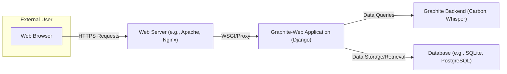
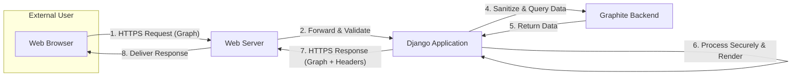

# Project Design Document: Graphite-Web

**Version:** 1.1
**Date:** October 26, 2023
**Author:** Gemini (AI Language Model)
**Project:** Graphite-Web Analysis for Threat Modeling

## 1. Introduction

This document provides an enhanced design overview of the Graphite-Web project, specifically tailored for subsequent threat modeling activities. It builds upon the previous version by providing more detailed descriptions of the system's architecture, key components, data flows, and interactions, with a stronger focus on security implications. This document aims to provide a comprehensive understanding of the system's structure and functionality to facilitate the identification of potential security vulnerabilities and threat vectors. The information is based on the publicly available source code repository: [https://github.com/graphite-project/graphite-web](https://github.com/graphite-project/graphite-web).

## 2. Goals and Objectives

The primary goal of this document is to provide a clear, concise, and enhanced description of the Graphite-Web system architecture specifically for threat modeling purposes. The objectives include:

*   Clearly identifying and describing the major components of the Graphite-Web application and their security boundaries.
*   Detailing the interactions and data flow between these components, highlighting potential points of vulnerability.
*   Emphasizing key technologies and dependencies with a focus on their security implications.
*   Providing a robust foundation for identifying potential threat vectors, attack surfaces, and vulnerabilities.

## 3. System Overview

Graphite-Web is a web application that provides a user interface for visualizing time-series data collected and stored by the Graphite backend (primarily Carbon and Whisper). It allows users to create graphs, dashboards, and manage their data. Understanding the boundaries between Graphite-Web and its dependencies is crucial for effective threat modeling.

### 3.1. High-Level Architecture

*   **External User:** Interacts with the system through a web browser, typically over HTTPS.
*   **Web Server:**  Acts as the entry point for user requests. It handles TLS termination, static content serving, and reverse proxies requests to the Graphite-Web application. Security configurations here are critical.
*   **Graphite-Web Application:** The core of the web interface, built using the Django framework. It's responsible for application logic, user authentication, authorization, graph rendering, dashboard management, and API endpoints. This is a primary focus for threat modeling.
*   **Graphite Backend:** Consists of Carbon (the data ingestion service) and Whisper (the time-series database). Graphite-Web queries this backend for data visualization. While external to Graphite-Web, interactions need consideration.
*   **Database:** Stores application-specific data such as user accounts, dashboards, and saved graph configurations. Securing access to this database is paramount.

## 4. Detailed Design

This section provides a more granular view of the key components within the Graphite-Web application, highlighting their responsibilities and potential security considerations.

### 4.1. Components

*   **Web Interface (Frontend):**
    *   Implemented using HTML, CSS, and JavaScript, often relying on frameworks and libraries.
    *   Responsibilities include rendering the user interface, handling user interactions, and making asynchronous requests to the backend.
    *   Security Considerations: Vulnerable to XSS attacks if not properly coded. Client-side logic can be manipulated. Ensure proper input sanitization on the backend for data displayed here.

*   **Django Application (Backend):**
    *   The core application logic, handling routing, authentication, authorization, and data processing.
    *   Responsibilities include:
        *   Receiving and processing user requests.
        *   Authenticating and authorizing users.
        *   Interacting with the rendering engine.
        *   Managing dashboards and user preferences.
        *   Providing API endpoints.
        *   Interacting with the database.
        *   Querying the Graphite Backend.
    *   Security Considerations:  Susceptible to various web application vulnerabilities like SQL injection (if database interactions are not properly handled), authentication bypass, authorization flaws, and insecure session management.

*   **Rendering Engine:**
    *   Responsible for generating graph images based on user-defined parameters and data retrieved from the Graphite backend.
    *   Responsibilities include:
        *   Interpreting user graph requests.
        *   Fetching data from the Graphite backend.
        *   Applying rendering logic to create graph images (e.g., using libraries like Pillow).
    *   Security Considerations: Potential for resource exhaustion if rendering requests are not properly controlled. Vulnerabilities in rendering libraries could be exploited. Input validation of rendering parameters is crucial.

*   **Dashboard Management Module:**
    *   Allows users to create, edit, and organize dashboards.
    *   Responsibilities include:
        *   Storing and retrieving dashboard configurations from the database.
        *   Managing user access to dashboards.
    *   Security Considerations:  Authorization flaws could allow unauthorized access or modification of dashboards. Stored dashboard configurations might contain sensitive information.

*   **User Management Module:**
    *   Handles user accounts, authentication, and authorization.
    *   Responsibilities include:
        *   User registration and login.
        *   Password management (hashing, storage).
        *   Role-based access control (if implemented).
    *   Security Considerations: Critical for overall security. Vulnerabilities here can lead to unauthorized access to the entire system. Secure password hashing and protection against brute-force attacks are essential.

*   **API Endpoints:**
    *   Provide programmatic access to Graphite-Web functionality.
    *   Responsibilities include:
        *   Allowing external systems to retrieve data, render graphs, and manage dashboards.
        *   Providing data in various formats (e.g., JSON).
    *   Security Considerations: Require robust authentication and authorization mechanisms. Vulnerable to API abuse, data injection, and exposure of sensitive information if not properly secured. Rate limiting is important to prevent DoS.

### 4.2. Data Flow

The typical data flow for rendering a graph with a focus on security touchpoints:

1. **User Request (Authenticated):** An authenticated user interacts with the web interface, initiating a request to render a graph. Authentication status is a key security factor.
2. **Browser Request (HTTPS):** The browser sends an HTTPS request to the web server. HTTPS ensures confidentiality and integrity of the communication.
3. **Web Server Forwarding (Validated):** The web server validates the request (e.g., checks for basic anomalies) and forwards it to the Graphite-Web application.
4. **Django Routing and Authorization:** The Django application routes the request to the appropriate view and verifies the user's authorization to access the requested data and functionality.
5. **Data Query Construction (Sanitized):** The application constructs a query for the Graphite backend. Crucially, user-provided parameters must be sanitized to prevent injection attacks.
6. **Data Retrieval (Internal Network):** The application sends the query to the Graphite backend, ideally over a secure internal network.
7. **Data Processing (Securely Handled):** The Graphite-Web application processes the retrieved data. Ensure sensitive data is handled securely and not exposed unnecessarily.
8. **Rendering (Controlled Resources):** The rendering engine generates the graph image. Resource limits should be in place to prevent DoS.
9. **Response Generation (Secure Headers):** The Django application generates an HTTP response containing the graph image, including appropriate security headers (e.g., Content-Security-Policy, X-Frame-Options).
10. **Web Server Delivery (HTTPS):** The web server sends the HTTPS response back to the user's browser.
11. **Browser Rendering (Sandboxed):** The browser renders the graph within its security sandbox.

### 4.3. Key Technologies and Dependencies (Security Implications)

*   **Programming Language: Python:**  Known vulnerabilities in Python or its libraries can impact Graphite-Web. Keeping Python updated is important.
*   **Web Framework: Django:** Django provides built-in security features, but developers must use them correctly. Outdated Django versions can have known vulnerabilities.
*   **Template Engine: Django Templates:**  Requires careful handling of user-provided data to prevent XSS. Auto-escaping should be enabled and understood.
*   **JavaScript Libraries (e.g., jQuery):**  Vulnerabilities in these libraries can be exploited. Keeping them updated is crucial. Be aware of supply chain risks.
*   **Database (e.g., SQLite, PostgreSQL):**  Properly configuring database access, using parameterized queries, and keeping the database software updated are essential for security.
*   **Web Server (e.g., Apache, Nginx):**  Web server configuration plays a vital role in security (e.g., TLS configuration, header settings).
*   **Graphite Backend (Carbon, Whisper):** While external, vulnerabilities in the backend could be exploited through Graphite-Web. Secure communication between Graphite-Web and the backend is important.

## 5. Security Considerations (Enhanced for Threat Modeling)

This section provides a more structured breakdown of potential security threats, categorized for easier threat modeling.

*   **Authentication and Authorization:**
    *   **Threats:** Brute-force attacks, credential stuffing, session hijacking, privilege escalation, insecure password storage, lack of multi-factor authentication.
    *   **Mitigations:** Strong password policies, rate limiting on login attempts, secure session management (HTTPOnly, Secure flags), robust authorization checks, consider implementing MFA.
*   **Input Validation and Data Sanitization:**
    *   **Threats:** Cross-Site Scripting (XSS), SQL Injection, Command Injection, Path Traversal.
    *   **Mitigations:**  Strict input validation on all user-provided data, output encoding/escaping, parameterized queries for database interactions, avoid direct execution of user-provided commands.
*   **Data Security and Privacy:**
    *   **Threats:** Data breaches, unauthorized access to sensitive data, insecure storage of credentials or API keys, exposure of metrics data.
    *   **Mitigations:** Encryption of sensitive data at rest and in transit (HTTPS), proper access controls to the database and configuration files, secure handling of API keys.
*   **Cross-Site Request Forgery (CSRF):**
    *   **Threats:** Malicious websites or emails tricking authenticated users into performing unintended actions.
    *   **Mitigations:**  Use of CSRF tokens (Django provides built-in support), proper header checks (Origin, Referer).
*   **API Security:**
    *   **Threats:** Unauthorized access to API endpoints, API abuse, data leakage through APIs.
    *   **Mitigations:**  Strong authentication and authorization for API endpoints (e.g., API keys, OAuth 2.0), rate limiting, input validation on API requests, secure API design principles.
*   **Dependency Vulnerabilities:**
    *   **Threats:** Exploitation of known vulnerabilities in third-party libraries and frameworks.
    *   **Mitigations:** Regularly update dependencies, use vulnerability scanning tools, monitor security advisories.
*   **Denial of Service (DoS):**
    *   **Threats:** Overwhelming the application with requests, resource exhaustion through expensive graph rendering.
    *   **Mitigations:** Rate limiting, input validation to prevent overly complex queries, resource limits on rendering processes, use of CDNs for static content.
*   **Configuration Security:**
    *   **Threats:** Exposure of sensitive configuration parameters (database credentials, API keys), insecure default configurations.
    *   **Mitigations:** Secure storage of configuration files, avoid storing secrets in code, follow security best practices for web server and application configuration.

## 6. Deployment Considerations (Security Focused)

*   **Secure Hosting Environment:** Deploy Graphite-Web in a secure environment with proper network segmentation and access controls.
*   **HTTPS Enforcement:**  Enforce HTTPS for all communication to protect data in transit. Ensure proper TLS configuration.
*   **Web Server Hardening:**  Harden the web server configuration (e.g., disable unnecessary modules, set appropriate security headers).
*   **Database Security:** Secure the database server, restrict access, and use strong authentication.
*   **Regular Security Updates:** Implement a process for regularly updating Graphite-Web, its dependencies, and the underlying operating system.
*   **Security Monitoring and Logging:** Implement logging and monitoring to detect and respond to security incidents.
*   **Principle of Least Privilege:** Grant only necessary permissions to users and processes.

## 7. Dependencies (Security Relevance)

*   **Python and its standard library:**  Security vulnerabilities in Python can directly impact Graphite-Web.
*   **Django web framework:**  Staying up-to-date with Django security releases is crucial.
*   **Various Python packages (specified in `requirements.txt`):** Each package represents a potential attack surface. Use tools like `pip check` or vulnerability scanners.
*   **JavaScript libraries (e.g., jQuery):**  Keep these libraries updated to patch known XSS vulnerabilities.
*   **Graphite backend components (Carbon, Whisper):** Secure communication and proper authentication between Graphite-Web and the backend are important.
*   **Database system (e.g., SQLite, PostgreSQL):**  The security of the database directly impacts the confidentiality and integrity of Graphite-Web's data.
*   **Web server (e.g., Apache, Nginx):**  The web server's security configuration is the first line of defense.

## 8. Future Considerations (Security Implications)

*   **Integration with modern authentication protocols (e.g., OAuth 2.0, SAML):**  Can improve security and integration with other systems.
*   **Enhanced input validation and sanitization libraries:**  Could reduce the risk of injection vulnerabilities.
*   **Content Security Policy (CSP) implementation:**  To mitigate XSS attacks.
*   **Regular security audits and penetration testing:**  To proactively identify vulnerabilities.

This enhanced document provides a more detailed and security-focused overview of the Graphite-Web project, making it more suitable for thorough threat modeling activities. By understanding the components, data flows, and potential vulnerabilities, security professionals can effectively identify and mitigate risks.
