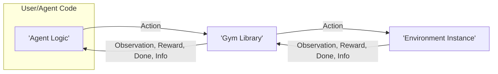
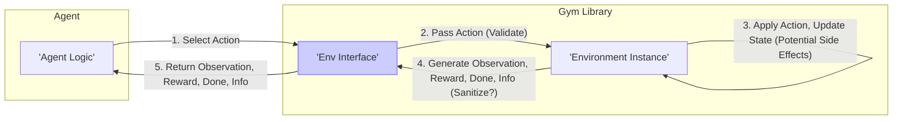

# Project Design Document: OpenAI Gym (Improved)

**Document Version:** 1.1
**Date:** October 26, 2023
**Prepared By:** AI Software Architect

## 1. Introduction

This document provides an enhanced design overview of the OpenAI Gym project, based on the repository at [https://github.com/openai/gym](https://github.com/openai/gym). This detailed design serves as a crucial foundation for subsequent threat modeling activities, offering a comprehensive understanding of the system's architecture, components, and data flow with a heightened focus on potential security implications.

### 1.1. Purpose

The primary purpose of this document is to:

*   Provide a clear and detailed description of the architecture and key components of the OpenAI Gym library.
*   Elaborate on the data flow and interactions within the system, highlighting potential security touchpoints.
*   Identify and initially categorize potential areas of interest for security analysis and threat modeling.
*   Serve as a definitive reference point for understanding the system's design from a security perspective.

### 1.2. Scope

This document focuses on the core functionalities and architecture of the OpenAI Gym library as a software component. It comprehensively covers the interaction between the library and its users (typically reinforcement learning agents), the structure of the provided environments, and the mechanisms for environment registration and management. It specifically addresses the boundaries and interfaces relevant to potential security vulnerabilities. This document does not delve into the implementation specifics of individual reinforcement learning algorithms that might utilize Gym, nor does it cover the internal workings of specific environment implementations unless directly relevant to the Gym library's security.

### 1.3. Goals

The goals of this enhanced design document are to:

*   Provide an exceptionally clear and concise description of the Gym architecture, suitable for security professionals.
*   Identify the major components and their responsibilities, with a focus on their security relevance.
*   Illustrate the flow of data and control within the system, explicitly marking potential security-sensitive data exchanges.
*   Highlight potential security considerations based on the design, providing an initial categorization of potential threats.

## 2. System Overview

OpenAI Gym is a foundational toolkit for the development and evaluation of reinforcement learning algorithms. It achieves this by providing a standardized interface to a diverse collection of environments, enabling researchers and developers to concentrate on algorithm design rather than the intricacies of individual environment implementations.

The central concept in Gym is the interaction between an "agent" and an "environment." The agent performs "actions" within the environment, and the environment responds with "observations," "rewards," and signals indicating the episode's status.

**Key Interactions:**

*   A user (implementing an agent) interacts with the Gym library to instantiate and manage environment instances.
*   The agent sends actions to the specific environment instance through the standardized Gym library interface.
*   The environment processes the received action, updates its internal state, and returns observations reflecting the new state, a reward signal, a "done" flag indicating episode termination, and potentially supplementary information.
*   This interaction loop continues until the environment signals the end of an episode.

## 3. Component Details

The OpenAI Gym library comprises several key components, each with distinct responsibilities and security considerations:

*   **Core Library (`gym` package):**
    *   Provides the fundamental classes and abstract interfaces (`Env`) for interacting with environments in a consistent manner.
    *   Manages the registration, discovery, and instantiation of available environments through the `registry`.
    *   Encapsulates the core logic for stepping through an environment (`step()`), resetting it to an initial state (`reset()`), and rendering its state for visualization (`render()`).
    *   Defines the `Space` abstract base class and concrete implementations for defining the structure and valid ranges of actions and observations.
    *   Security Relevance: This is the primary interface point and any vulnerabilities here could have wide-ranging impact. The environment registration process is a critical area for potential injection or malicious code execution.

*   **Environment Implementations:**
    *   Concrete classes that inherit from the `Env` base class and implement the specific logic for a particular task or simulation.
    *   Define the environment's state space, action space, the rules governing state transitions based on actions, and the reward function.
    *   Can be implemented directly within the Gym library, as part of external packages, or even by users.
    *   Security Relevance: Environments from untrusted sources pose a significant risk of malicious code execution or resource exploitation. The complexity and potential for external dependencies within environment implementations increase the attack surface.

*   **Spaces (`gym.spaces`):**
    *   Defines the structure and constraints for action and observation data. Includes types like `Discrete`, `Box`, `Tuple`, and `Dict`.
    *   Provides methods for validating whether given action or observation values conform to the defined space.
    *   Security Relevance: While seemingly simple, incorrect validation or assumptions about the structure of spaces could lead to unexpected behavior or vulnerabilities in environments or agents.

*   **Registry (`gym.envs.registration`):**
    *   A central mechanism for registering and retrieving available environments by name.
    *   Maintains a mapping of environment IDs to their corresponding implementation details (entry points).
    *   Security Relevance: The registry is a critical point of control. Vulnerabilities here could allow for the substitution of legitimate environments with malicious ones. The process of registering new environments needs careful scrutiny.

*   **Wrappers (`gym.wrappers`):**
    *   Classes that encapsulate and modify the behavior of existing environments without altering their core implementation.
    *   Provide a way to add common functionalities like frame stacking, reward scaling, observation preprocessing, or rendering modifications.
    *   Security Relevance: Wrappers from untrusted sources can introduce vulnerabilities or modify the environment's behavior in unexpected and potentially harmful ways.

*   **Utils (`gym.utils`):**
    *   Contains various utility functions used throughout the library, including seeding random number generators, managing rendering dependencies, and compatibility helpers.
    *   Security Relevance: While utilities might seem less critical, vulnerabilities in these functions could be exploited indirectly. For example, insecure random number generation could have implications for environment determinism and reproducibility.

## 4. Data Flow with Security Considerations

The primary data flow within Gym involves the exchange of information between the agent and the environment. Security considerations are paramount at each stage of this interaction:

**Detailed Data Flow and Security Notes:**

1. **Agent Selects Action:** The agent determines the next action based on its policy and the current observation. The action must conform to the environment's defined action space.
2. **Pass Action to Environment (Validation):** The Gym library's `step()` method receives the action. **Crucially, the library (or the environment) should validate that the action conforms to the defined action space to prevent unexpected behavior or potential exploits.**
3. **Apply Action and Update State (Potential Side Effects):** The environment instance receives the action and updates its internal state. **This is where untrusted environment code could have harmful side effects, such as accessing the file system, network, or consuming excessive resources.**
4. **Generate Feedback (Sanitization?):** The environment generates the next observation, reward, done flag, and info dictionary. **Consider whether the environment (or Gym) should sanitize or validate the data being returned to prevent information leakage or the transmission of malicious data.** The `info` dictionary is particularly susceptible to containing unexpected or sensitive information.
5. **Return Feedback to Agent:** The Gym library returns the feedback to the agent.

## 5. Security Considerations (Categorized)

Based on the design, several potential security considerations arise. We can categorize them for better understanding:

*   **Code Execution Risks:**
    *   **Malicious Environments:** Loading and executing code from untrusted environment implementations.
    *   **Pickling/Serialization Vulnerabilities:** Deserializing untrusted environment states or other objects.
    *   **Untrusted Wrappers:** Executing code within wrappers from unverified sources.
    *   **Registry Manipulation:**  Compromising the environment registry to point to malicious implementations.

*   **Data Integrity and Confidentiality Risks:**
    *   **Information Disclosure:** Environments inadvertently leaking sensitive information through observations or the `info` dictionary.
    *   **Action Spoofing:**  Although less likely within the core Gym framework, vulnerabilities in external integrations could allow for the injection of malicious actions.
    *   **Observation Tampering:**  Compromised environments could provide misleading observations to manipulate the agent's behavior.

*   **Availability Risks:**
    *   **Denial of Service (DoS):** Malicious environments consuming excessive resources (CPU, memory, etc.).
    *   **Resource Exhaustion:**  Poorly implemented environments leading to resource leaks.

*   **Dependency Management Risks:**
    *   **Vulnerable Dependencies:**  The Gym library or its dependencies having known security vulnerabilities.
    *   **Supply Chain Attacks:**  Compromised dependencies introducing malicious code.

*   **Interface and Validation Risks:**
    *   **Insufficient Input Validation:** Lack of proper validation of actions or environment parameters.
    *   **Boundary Violations:**  Exploiting weaknesses in the interface between the Gym library and external environments.

## 6. Assumptions and Constraints

*   It is assumed that the user running the Gym library has the necessary permissions to execute code within their environment.
*   The primary focus is on the security of the Gym library as a framework and the immediate risks associated with interacting with environments. Security considerations for the agents themselves are outside the scope.
*   This document reflects the general architecture of the core `gym` library. Specific forks or community extensions might have different architectures and security profiles. Notably, the transition to `gymnasium` and its potential security implications are relevant but not explicitly detailed here.
*   The security of the underlying operating system and hardware is assumed to be the responsibility of the user.

## 7. Future Considerations

*   **Sandboxing and Isolation:** Implementing robust mechanisms to isolate environment execution and limit their access to system resources. This could involve containerization or virtualization techniques.
*   **Environment Verification and Trust Mechanisms:** Developing methods for verifying the integrity and trustworthiness of environment implementations, potentially through digital signatures or community vetting processes.
*   **Security Audits and Vulnerability Scanning:** Regularly conducting security audits and vulnerability scans of the Gym library and its dependencies.
*   **Secure Environment Development Guidelines:** Providing clear guidelines and best practices for developers creating Gym environments to minimize security risks.
*   **Enhanced Input Validation and Sanitization:** Strengthening input validation within the Gym library and implementing sanitization of data returned by environments.
*   **Fine-grained Permissions:** Exploring the possibility of more granular permission controls for environments.

This enhanced document provides a more detailed and security-focused understanding of the OpenAI Gym project's design. The categorized security considerations will serve as a strong foundation for a comprehensive threat modeling exercise.
