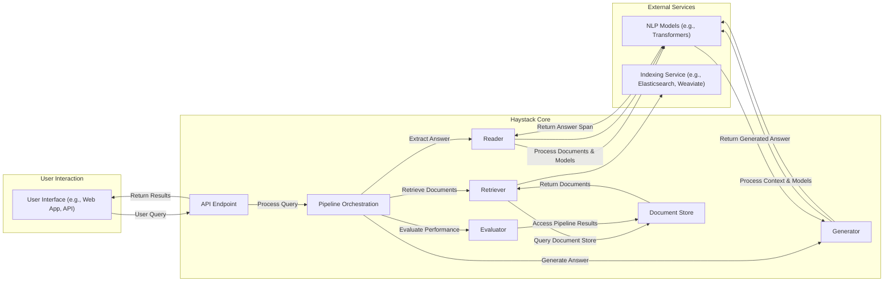

# Project Design Document: Haystack - An End-to-End NLP Framework

**Version:** 1.1
**Date:** October 26, 2023
**Author:** AI Architecture Expert

## 1. Introduction

This document provides a detailed design overview of the Haystack project, an open-source framework for building end-to-end question answering and search systems. This document aims to provide a comprehensive understanding of Haystack's architecture, components, and data flow, which will serve as the foundation for subsequent threat modeling activities. This version includes improved formatting and additional details for clarity.

## 2. Goals and Objectives

The primary goals of Haystack are to:

* Provide a modular and extensible framework for building NLP pipelines.
* Simplify the process of integrating various NLP models and components.
* Enable users to easily build custom question answering and search applications.
* Support a wide range of document formats and data sources.
* Offer tools for evaluating and improving the performance of NLP pipelines.

## 3. High-Level Architecture

Haystack's architecture is centered around the concept of **Pipelines**, which are directed acyclic graphs (DAGs) of interconnected **Nodes**. Each node performs a specific task in the NLP process.

## 4. Detailed Component Descriptions

This section describes the key components of the Haystack architecture:

*   **User Interface (e.g., Web App, API):**
    *   Provides a way for users to interact with the Haystack system.
    *   Can be a web application, a command-line interface, or an API endpoint.
    *   Responsible for receiving user queries and displaying results.

*   **API Endpoint:**
    *   Exposes Haystack functionalities through a programmatic interface (e.g., REST API).
    *   Allows external applications to integrate with Haystack.
    *   Handles request routing, authentication (if implemented), and response formatting.

*   **Pipeline Orchestration:**
    *   The core of Haystack, responsible for managing the execution of NLP pipelines.
    *   Defines the sequence of nodes and the flow of data between them.
    *   Handles error handling and logging within the pipeline.

*   **Document Store:**
    *   A database or indexing service used to store and manage the documents that Haystack searches over.
    *   Supports various backends like Elasticsearch, FAISS, Weaviate, and more.
    *   Provides functionalities for indexing, searching, and retrieving documents.

*   **Retriever:**
    *   Responsible for selecting relevant documents from the Document Store based on the user query.
    *   Implements different retrieval strategies, such as TF-IDF, BM25, or dense vector embeddings.
    *   Reduces the search space for the Reader component.

*   **Reader:**
    *   Extracts the answer to the question from the retrieved documents.
    *   Typically uses pre-trained transformer models (e.g., BERT, RoBERTa) for question answering.
    *   Identifies the most likely answer span within the context of the retrieved documents.

*   **Generator:**
    *   Generates an answer to the question based on the retrieved documents.
    *   Uses generative models (e.g., GPT-3, T5) to formulate a natural language answer.
    *   Provides a different approach to question answering compared to the Reader.

*   **Evaluator:**
    *   Provides tools for evaluating the performance of Haystack pipelines.
    *   Calculates metrics like accuracy, F1 score, and recall.
    *   Helps in comparing different models and pipeline configurations.

*   **NLP Models (e.g., Transformers):**
    *   Pre-trained or fine-tuned machine learning models used by the Retriever, Reader, and Generator components.
    *   Typically sourced from libraries like Hugging Face Transformers.
    *   Perform tasks like text embedding, question answering, and text generation.

*   **Indexing Service (e.g., Elasticsearch, Weaviate):**
    *   External services used as the backend for the Document Store.
    *   Provide efficient indexing and search capabilities.
    *   Manage the storage and retrieval of document data.

## 5. Component Summary

| Component              | Description                                                                                                | Key Functionality                                                                 |
| ---------------------- | ---------------------------------------------------------------------------------------------------------- | --------------------------------------------------------------------------------- |
| User Interface         | Provides user interaction with the system.                                                                 | Query submission, result display.                                                 |
| API Endpoint           | Exposes Haystack functionalities programmatically.                                                          | Request handling, authentication, response formatting.                             |
| Pipeline Orchestration | Manages the execution of NLP pipelines.                                                                   | Node sequencing, data flow management, error handling.                             |
| Document Store         | Stores and manages the documents for searching.                                                            | Indexing, searching, retrieving documents.                                        |
| Retriever              | Selects relevant documents based on the query.                                                              | Implementing various retrieval strategies (TF-IDF, BM25, embeddings).             |
| Reader                 | Extracts the answer from retrieved documents using QA models.                                               | Identifying answer spans within document context.                                |
| Generator              | Generates an answer based on retrieved documents using generative models.                                  | Formulating natural language answers.                                             |
| Evaluator              | Evaluates the performance of Haystack pipelines.                                                            | Calculating performance metrics (accuracy, F1, recall).                            |
| NLP Models             | Pre-trained ML models for various NLP tasks.                                                               | Text embedding, question answering, text generation.                               |
| Indexing Service       | External service providing indexing and search capabilities for the Document Store.                         | Efficient storage and retrieval of document data.                                |

## 6. Data Flow

The typical data flow within a Haystack pipeline follows these steps:

1. A user submits a **query** through the User Interface or API Endpoint.
2. The API Endpoint receives the query and passes it to the **Pipeline Orchestration** component.
3. The Pipeline Orchestration component initiates the pipeline execution.
4. The **Retriever** node receives the query and queries the **Document Store** to retrieve relevant documents.
5. The Document Store returns a set of potentially relevant documents to the Retriever.
6. The retrieved documents and the original query are passed to the **Reader** node.
7. The Reader uses pre-trained NLP models to identify the answer span within the documents.
8. Alternatively, or in addition to the Reader, the retrieved documents are passed to the **Generator** node.
9. The Generator uses generative NLP models to formulate an answer based on the context.
10. The **Evaluator** node can be used to assess the quality of the answers generated by the Reader or Generator.
11. The Pipeline Orchestration component collects the results (answers, documents, scores).
12. The results are returned to the API Endpoint.
13. The API Endpoint formats the results and sends them back to the User Interface.

## 7. Key Technologies and Dependencies

| Technology/Dependency        | Description                                                                 | Purpose within Haystack                                                                 |
| ---------------------------- | --------------------------------------------------------------------------- | --------------------------------------------------------------------------------------- |
| Python                       | Programming language.                                                         | Core development language for Haystack.                                                 |
| FastAPI                      | Web framework.                                                              | Building the API Endpoint.                                                              |
| Hugging Face Transformers    | Library for pre-trained NLP models.                                         | Providing models for Retriever, Reader, and Generator components.                       |
| Elasticsearch                | Search and analytics engine.                                                | Common backend for the Document Store.                                                  |
| FAISS                        | Library for efficient similarity search of dense vectors.                     | Backend option for the Document Store, particularly for embedding-based retrieval.      |
| Weaviate                     | Open-source vector database.                                                | Another backend option for the Document Store, optimized for vector search.             |
| SQL Databases (e.g., PostgreSQL, SQLite) | Relational databases.                                                     | Can be used as Document Stores for structured data.                                  |
| Ray (Optional)               | Framework for scaling Python applications.                                  | Enabling distributed processing for large-scale deployments.                            |
| Logging Libraries (e.g., `logging`) | Libraries for recording events and debugging.                             | Monitoring and troubleshooting the system.                                            |

## 8. Deployment Architecture

Haystack can be deployed in various ways, depending on the scale and requirements:

*   **Local Machine:** For development and testing purposes.
*   **Single Server:** Deploying all components on a single virtual machine or physical server.
*   **Containerized Environment (Docker, Kubernetes):** Packaging components into containers for easier deployment and scaling.
*   **Cloud Platforms (AWS, Azure, GCP):** Leveraging cloud services for infrastructure and scalability.

A typical containerized deployment might involve:

*   A container for the Haystack API and Pipeline Orchestration.
*   A container for the Document Store (e.g., Elasticsearch).
*   Potentially separate containers for resource-intensive components like Readers and Generators, especially when using GPUs.

## 9. Security Considerations (Pre-Threat Modeling)

Before conducting a formal threat model, it's important to identify potential areas of security concern:

*   **Input Validation:** Ensuring that user queries and document data are properly validated to prevent injection attacks (e.g., prompt injection).
*   **Authentication and Authorization:** Controlling access to the Haystack API and its functionalities.
*   **Data Privacy:** Protecting sensitive information stored in the Document Store and ensuring compliance with data privacy regulations.
*   **Model Security:** Ensuring the integrity and trustworthiness of the NLP models used. Potential for adversarial attacks on models.
*   **Dependency Management:** Keeping dependencies up-to-date to mitigate known vulnerabilities.
*   **Network Security:** Securing communication between different components and external services.
*   **Resource Exhaustion:** Protecting against denial-of-service attacks that could overload the system.
*   **Logging and Monitoring:** Implementing robust logging and monitoring to detect and respond to security incidents.
*   **Secure Storage:** Protecting sensitive configuration data and API keys.

## 10. Assumptions and Constraints

The following assumptions and constraints are relevant to this design:

*   The system relies on the security of the underlying infrastructure (e.g., operating system, network).
*   Pre-trained NLP models are assumed to be generally secure, but potential vulnerabilities exist.
*   The Document Store is assumed to have its own security mechanisms in place.
*   This design focuses on the core Haystack framework and does not cover specific implementation details of user interfaces or custom integrations.

## 11. Future Considerations

Potential future enhancements and considerations include:

*   Improved support for multi-tenancy.
*   More granular access control mechanisms.
*   Advanced monitoring and alerting capabilities.
*   Integration with more diverse data sources and NLP models.
*   Enhanced explainability and interpretability of results.

This document provides a comprehensive overview of the Haystack project's design. It will serve as a valuable resource for understanding the system's architecture and identifying potential security threats during the subsequent threat modeling process.
