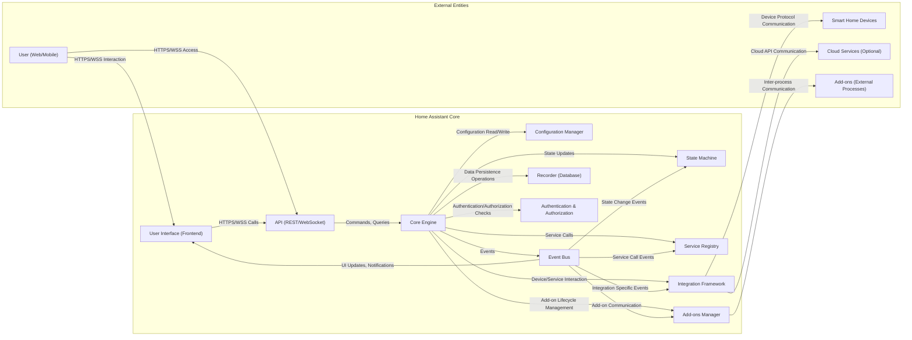

# Project Design Document: Home Assistant Core

**Version:** 1.1
**Date:** October 26, 2023
**Author:** AI Software Architect

## 1. Project Overview

This document provides a detailed architectural design of the Home Assistant Core project, focusing on aspects relevant to security and threat modeling. It outlines the key components, their interactions, data flows, and the overall system structure. This document serves as a foundation for subsequent threat modeling activities, enabling the identification of potential vulnerabilities and attack vectors.

Home Assistant Core is an open-source home automation platform prioritizing local control and user privacy. It empowers users to integrate and manage a diverse range of smart home devices and services, automate tasks through customizable scripts and scenes, and visualize collected data via a user-friendly interface.

## 2. Goals and Objectives

* **Provide a comprehensive and technically accurate architectural overview of Home Assistant Core.**
* **Clearly define the responsibilities and functionalities of key components within the system.**
* **Detail the primary data flows, including the types of data exchanged and communication protocols used.**
* **Establish a robust basis for identifying potential security vulnerabilities and attack surfaces during threat modeling sessions.**
* **Document the typical deployment models, key interfaces, and external dependencies.**

## 3. Target Audience

* Security engineers and architects tasked with performing threat modeling and security assessments.
* Software developers contributing to the Home Assistant Core codebase.
* DevOps engineers responsible for the deployment, maintenance, and security hardening of Home Assistant instances.

## 4. High-Level Architecture

Home Assistant Core employs a modular, event-driven architecture. The central Core Engine orchestrates various functionalities, including managing integrations, executing automations, serving the user interface, and handling system configuration. Communication between components largely relies on an internal Event Bus.

## 5. Key Components

* **User Interface (Frontend):**
    * A web-based interface built using technologies like JavaScript, HTML, and CSS, providing users with a visual way to interact with Home Assistant.
    * Communicates with the backend primarily through secure HTTPS for REST API calls and secure WebSockets (WSS) for real-time event streaming and bidirectional communication.
    * Responsible for rendering dashboards, displaying device states, and allowing users to trigger services and automations.

* **API (REST/WebSocket):**
    * Exposes a set of endpoints for programmatic interaction with Home Assistant.
    * The REST API utilizes standard HTTP methods (GET, POST, PUT, DELETE) for stateless operations like fetching entity states or triggering services.
    * The WebSocket API provides a persistent, bidirectional communication channel for real-time event notifications and control. Authentication is enforced for all API interactions.

* **Core Engine:**
    * The central orchestrator of Home Assistant, responsible for managing the system's logic and coordinating interactions between different components.
    * Handles the execution of automation rules, processing service calls, and managing the overall state of the home automation system.
    * Relies heavily on the Event Bus for asynchronous communication and the State Machine for tracking entity states.

* **Configuration Manager:**
    * Responsible for loading, validating, and managing the system's configuration, typically stored in YAML files.
    * Provides mechanisms for parsing configuration data, handling schema validation, and notifying other components of configuration changes.
    * Secure access to configuration files is crucial, as they may contain sensitive information.

* **Event Bus:**
    * A central, in-memory message bus facilitating asynchronous communication between components.
    * Components can publish events to the bus and subscribe to specific event types, enabling a loosely coupled architecture.
    * Events carry data representing state changes, service calls, and other significant occurrences within the system.

* **State Machine:**
    * Maintains the current and historical states of all entities (devices, sensors, etc.) managed by Home Assistant.
    * Provides an interface for querying and updating entity states. State changes are typically triggered by integrations or automations.
    * The Recorder component persists state history from the State Machine to the database.

* **Service Registry:**
    * A directory of available services provided by the Core Engine and various integrations.
    * Allows components to discover and invoke services provided by other parts of the system.
    * Service calls are often the mechanism through which automations and user interactions trigger actions.

* **Recorder (Database):**
    * Responsible for persisting state history, events, and other relevant data for long-term storage and analysis.
    * Supports various database backends, with SQLite being the default. Users can configure alternative databases like PostgreSQL or MySQL.
    * Data stored in the Recorder can be used for creating historical graphs, analyzing trends, and providing context for automations.

* **Authentication & Authorization:**
    * Manages user accounts, login sessions, and access control to protect the system from unauthorized access.
    * Implements various authentication methods, including username/password, long-lived access tokens, and integration-specific authentication mechanisms.
    * Enforces authorization policies to control which users or integrations can access specific resources or perform certain actions.

* **Integration Framework:**
    * Provides a standardized interface and set of tools for developers to create integrations with various smart home devices, services, and platforms.
    * Integrations are typically implemented as Python modules and handle device discovery, communication protocols, and data translation between Home Assistant's internal representation and the external device or service.

* **Add-ons Manager:**
    * Enables users to extend Home Assistant's functionality by installing pre-packaged applications and services known as add-ons.
    * Add-ons typically run as isolated processes, often within Docker containers, and communicate with the Core Engine via APIs and the Event Bus.
    * The Add-ons Manager handles the installation, configuration, and lifecycle management of add-ons.

## 6. Data Flow

A common scenario, such as a user turning on a light via the web interface, illustrates the typical data flow:

1. **User Initiates Action:** The user interacts with the web interface (Frontend) and clicks a button to turn on a light.
2. **API Request (HTTPS):** The Frontend sends an HTTPS request to the Home Assistant API, specifically to trigger the `light.turn_on` service for the target light entity. The request includes necessary authentication credentials.
3. **API Handling & Authentication:** The API component receives the request and forwards it to the Core Engine after successful authentication and authorization checks.
4. **Service Call Processing:** The Core Engine identifies the requested service (`light.turn_on`) and uses the Service Registry to locate the corresponding service handler, which resides within the relevant integration.
5. **Integration Interaction:** The Core Engine invokes the service handler within the integration responsible for the target light. The integration translates the service call into the specific commands required by the light device's communication protocol (e.g., Zigbee, Z-Wave, Wi-Fi).
6. **Device Communication:** The integration sends the command to the smart home device using the appropriate protocol.
7. **Device Response:** The smart home device responds to the command, confirming the action.
8. **State Update:** The integration receives the device's response and updates the state of the light entity in the State Machine (e.g., from "off" to "on").
9. **Event Emission:** The Core Engine emits a `state_changed` event on the Event Bus, indicating the change in the light's state. This event includes details about the entity and its new state.
10. **Frontend Update (WebSocket):** The Frontend, having an active WebSocket connection and subscribing to state change events, receives the `state_changed` event and updates the displayed state of the light in the user interface in real-time.
11. **Recorder Persistence:** The Recorder component, also subscribed to relevant events, receives the `state_changed` event and persists the state change information in the database.
12. **Automation Trigger (Optional):** If any automation rules are configured to trigger based on the light's state change, the Core Engine evaluates these rules and executes any matching automation logic, potentially triggering further service calls or actions.

## 7. Key Interactions and Interfaces

* **User Interface <-> API:** HTTPS for RESTful API calls, WSS for real-time bidirectional communication. Data format: JSON.
* **API <-> Core Engine:** Internal function calls and method invocations within the Python application.
* **Core Engine <-> Configuration Manager:** Access to configuration files (typically YAML) via file system operations and internal APIs for configuration management.
* **Core Engine <-> Event Bus:** In-memory message queuing using Python's `asyncio` framework. Events are typically represented as Python dictionaries.
* **Core Engine <-> State Machine:** Direct access to in-memory data structures and methods for reading and updating entity states.
* **Core Engine <-> Service Registry:** Internal lookup mechanisms to find and invoke service handlers.
* **Core Engine <-> Recorder:** Database interactions via an Object-Relational Mapper (ORM) like SQLAlchemy, abstracting database-specific details.
* **Core Engine <-> Authentication & Authorization:** Middleware components intercept API requests and internal function calls to enforce authentication and authorization policies.
* **Core Engine <-> Integration Framework:** Python API calls and data structures defined by the integration framework, allowing the Core to interact with device-specific logic.
* **Integration Framework <-> Smart Home Devices:** Communication occurs over various protocols, including but not limited to: HTTP(S), MQTT, Zigbee, Z-Wave, Bluetooth, and vendor-specific APIs. Data formats are protocol-dependent (e.g., JSON, XML, binary).
* **Core Engine <-> Add-ons Manager:** Internal APIs for managing the lifecycle of add-ons. Communication with running add-ons often occurs via inter-process communication mechanisms like gRPC or HTTP(S), with data typically exchanged in JSON or Protocol Buffers format.
* **Event Bus <-> Components:** Asynchronous message passing using the internal event bus. Event data is typically structured as Python dictionaries.

## 8. Deployment Model

Home Assistant Core offers flexible deployment options:

* **Python Virtual Environment:** Installation directly on a host operating system (e.g., Linux, macOS, Windows) within a virtual environment to manage dependencies.
* **Docker Container:** Deployment as a Docker container provides isolation, portability, and simplified management. Docker images are readily available on Docker Hub.
* **Home Assistant Operating System (HassOS):** A purpose-built, minimalist Linux distribution specifically designed for running Home Assistant. It simplifies setup and management for users.
* **Supervised Installation:** A method of installing Home Assistant Core alongside the Supervisor service on a generic Linux system, providing add-on management and other features.

The chosen deployment model significantly impacts the security considerations. For example, containerized deployments offer a degree of isolation, while direct installations might be more susceptible to OS-level vulnerabilities.

## 9. Security Considerations

This section outlines potential security considerations for Home Assistant Core, serving as a starting point for detailed threat modeling:

* **Authentication and Authorization Weaknesses:**
    * Use of default or weak user credentials.
    * Insufficient protection against brute-force attacks on login endpoints.
    * Inadequate session management, leading to potential session hijacking.
    * Granular access control limitations, potentially allowing unauthorized access to sensitive functionalities.
* **API Security Vulnerabilities:**
    * Lack of proper input validation, leading to injection attacks (e.g., command injection, cross-site scripting).
    * Insufficient rate limiting, making the API susceptible to denial-of-service attacks.
    * Exposure of sensitive information through API responses.
    * Cross-Origin Resource Sharing (CORS) misconfigurations potentially allowing unauthorized access from external websites.
* **Integration Security Risks:**
    * Vulnerabilities in third-party integration code, potentially exposing the system to exploits.
    * Insecure communication protocols used by integrations to interact with devices or cloud services (e.g., unencrypted HTTP).
    * Improper handling of sensitive data (API keys, credentials) within integration code.
    * Lack of proper error handling in integrations, potentially revealing sensitive information.
* **Data Privacy Concerns:**
    * Storage of sensitive personal data (e.g., location history, device usage patterns) in the Recorder database.
    * Lack of encryption for stored data, potentially exposing it in case of unauthorized access.
    * Inadequate mechanisms for users to control and delete their data.
    * Transmission of sensitive data over insecure channels.
* **Add-on Security Issues:**
    * Malicious or vulnerable add-ons potentially gaining unauthorized access to the host system or Home Assistant Core.
    * Insufficient isolation between add-ons and the core system.
    * Lack of proper verification and security auditing of add-ons.
    * Add-ons potentially bypassing authentication and authorization mechanisms.
* **Communication Security Deficiencies:**
    * Use of unencrypted protocols (e.g., HTTP) for communication between components or with external services.
    * Weak or outdated TLS/SSL configurations.
    * Lack of proper certificate validation.
* **Configuration Security Flaws:**
    * Storage of sensitive credentials (API keys, passwords) in plain text within configuration files.
    * Inadequate protection of configuration files from unauthorized access.
    * Potential for configuration injection vulnerabilities.
* **Software Supply Chain Risks:**
    * Vulnerabilities in third-party libraries and dependencies used by Home Assistant Core and its integrations.
    * Compromised package repositories or distribution channels.
* **Update Mechanism Vulnerabilities:**
    * Insecure update channels, potentially allowing for the distribution of malicious updates.
    * Lack of proper verification of update packages.

This detailed design document provides a comprehensive overview of the Home Assistant Core architecture, highlighting key components, data flows, and potential security considerations. This information will be instrumental in conducting thorough threat modeling exercises to identify and mitigate potential security risks.