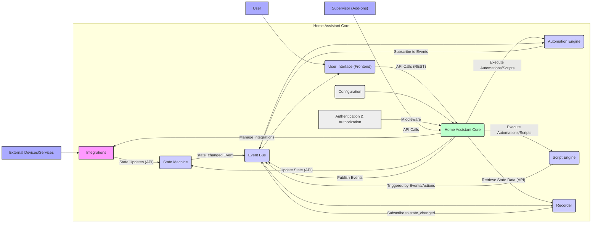
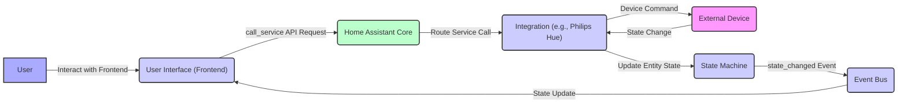

# Project Design Document: Home Assistant Core

**Version:** 1.1
**Date:** October 26, 2023
**Author:** Gemini (AI Language Model)

## 1. Introduction

This document provides an enhanced architectural design of the Home Assistant Core project, as found in the GitHub repository [https://github.com/home-assistant/core](https://github.com/home-assistant/core). Building upon the previous version, this document aims to provide a more granular and comprehensive understanding of the system's components, their interactions, and the overall architecture. This detailed information will serve as a robust foundation for subsequent threat modeling activities.

## 2. Project Overview

Home Assistant is an open-source home automation platform prioritizing local control and privacy. It empowers users to manage and monitor a diverse range of smart home devices and services from various vendors through a unified and customizable interface. The core of the system is a sophisticated Python-based application responsible for device management, automation execution, and user interaction handling.

## 3. System Architecture

The Home Assistant Core architecture is composed of several interconnected components, each with specific responsibilities, working in concert to deliver the platform's functionality.

### 3.1. Core Components

*   **Home Assistant Core:** The central orchestrator of the system, responsible for:
    *   **Integration Management:** Dynamically loading, unloading, and managing the lifecycle of integrations.
    *   **State Management:** Maintaining a real-time representation of the state of all entities, including attributes and last-updated timestamps. This is often an in-memory representation for performance.
    *   **Event Handling:**  Receiving, processing, and dispatching events throughout the system. It acts as a central hub for inter-component communication.
    *   **Automation and Script Execution:** Interpreting and executing automation rules and scripts based on triggers, conditions, and defined actions. This involves evaluating Jinja2 templates for dynamic behavior.
    *   **Service Registry:** Providing a registry of available services exposed by integrations and the core system, allowing components to invoke actions on entities.
    *   **API Gateway:** Exposing a RESTful API for the frontend, external applications, and internal components to interact with the system. This API handles authentication and authorization.
*   **Integrations:** Modular units that act as bridges to specific devices, services, or platforms. Key aspects include:
    *   **Protocol Abstraction:** Handling the specific communication protocols required by target devices or services (e.g., HTTP, MQTT, Zigbee, Z-Wave, vendor-specific APIs).
    *   **Data Translation:** Converting data from external sources into a standardized format understood by Home Assistant and vice versa.
    *   **Entity Discovery:** Discovering and registering new devices and services available on the network or through configured connections.
    *   **Service Provision:** Exposing services that can be called to control or interact with the integrated devices or services.
*   **Event Bus:** A publish-subscribe messaging system facilitating asynchronous communication between different parts of the system. It ensures loose coupling between components. Events carry information about state changes, user actions, and system events.
*   **State Machine:**  A logical representation of the current state of all managed entities. It stores the latest known state and attributes of each entity. Optimizations are often in place for efficient state retrieval and change detection.
*   **Automation Engine:** The rule-based engine responsible for executing predefined automation logic. It:
    *   **Listens for Events:** Subscribes to relevant events on the Event Bus.
    *   **Evaluates Triggers:** Determines if the conditions for an automation to fire are met based on incoming events.
    *   **Evaluates Conditions:**  Further refines the trigger by evaluating specific conditions (e.g., time of day, state of another entity).
    *   **Executes Actions:**  Performs the defined actions when triggers and conditions are satisfied, often involving calling services on integrations or the core system.
*   **Script Engine:** Provides a mechanism for defining and executing sequences of actions. Scripts can be:
    *   **Manually Triggered:** Initiated by user interaction in the frontend or through the API.
    *   **Triggered by Automations:**  Invoked as an action within an automation.
    *   **Reusable:**  Designed to perform specific tasks that can be called from multiple automations or other scripts.
*   **Recorder:**  The component responsible for persisting historical state data. Key features include:
    *   **Configurable Data Retention:** Allowing users to define how long historical data is stored.
    *   **Database Abstraction:** Supporting various database backends (e.g., SQLite, PostgreSQL, MariaDB) through an abstraction layer.
    *   **Data Purging and Management:**  Mechanisms for automatically removing old data to manage storage space.
*   **User Interface (Frontend):** A web-based interface providing users with a way to interact with Home Assistant. Key aspects include:
    *   **Dynamic Updates:**  Real-time updates of entity states and events using technologies like WebSockets.
    *   **Configuration Management:**  Interfaces for configuring integrations, automations, users, and other system settings.
    *   **Control Panels:**  Visual representations of devices and services, allowing users to control them.
    *   **Customization:**  Support for user-defined dashboards and themes.
*   **Configuration:**  The system's behavior is largely driven by configuration files, primarily in YAML format. This includes:
    *   **Integration Configuration:** Defining the parameters required to connect to specific devices and services.
    *   **Automation Definitions:** Specifying the triggers, conditions, and actions for automations.
    *   **User Management:** Defining user accounts and their associated permissions.
    *   **System Settings:** Configuring core system parameters.
*   **Add-ons (Supervisor):** While a separate project, the Supervisor significantly extends Home Assistant's capabilities by providing a managed environment for running additional services. This interaction is crucial to consider:
    *   **Add-on Management:**  Installing, updating, and managing the lifecycle of add-ons (e.g., Node-RED, MQTT broker, database servers).
    *   **Service Discovery:**  Facilitating communication and integration between Home Assistant Core and add-ons.
    *   **Security Isolation:** Providing a degree of isolation between add-ons and the core system.
*   **Authentication and Authorization:**  Securing access to the system. Key features include:
    *   **User Account Management:** Creating and managing user accounts with associated credentials.
    *   **Login Sessions:**  Managing user sessions and authentication tokens.
    *   **Access Control:**  Defining permissions and roles to control access to different parts of the system and specific entities.
    *   **Authentication Providers:** Supporting various authentication methods (e.g., local accounts, external authentication providers).

### 3.2. Component Interactions

The following list provides a more detailed explanation of how the core components interact:

*   **Integrations and State Updates:** Integrations actively poll devices or subscribe to device status updates. Upon receiving new data, they update the corresponding entity's state within the State Machine via the Home Assistant Core API.
*   **State Changes and Event Notifications:** When an entity's state changes in the State Machine, the State Machine immediately publishes a `state_changed` event onto the Event Bus. This event contains the old and new state of the entity.
*   **Automation Engine's Event Consumption:** The Automation Engine subscribes to specific events on the Event Bus based on the triggers defined in the automation rules. When a matching event occurs, the engine proceeds to evaluate the conditions.
*   **Script Execution Flow:** When an automation action calls a script, the Automation Engine passes control to the Script Engine, providing the necessary context and parameters. The Script Engine then executes the sequence of actions defined in the script.
*   **User Interface Interaction with the Core:** The Frontend communicates with the Home Assistant Core primarily through its RESTful API. This includes fetching entity states, sending service calls to control devices, and receiving real-time updates via WebSockets connected to the Event Bus.
*   **Recorder's Data Persistence:** The Recorder subscribes to `state_changed` events on the Event Bus. Upon receiving such an event, it stores the new state data in the configured database.
*   **Configuration Loading and Initialization:** At startup, the Home Assistant Core reads configuration files. This configuration is used to initialize integrations, set up the automation engine, define users, and configure other system parameters. Integrations use this configuration to establish connections with external devices and services.
*   **Supervisor's API Interactions:** The Supervisor communicates with the Home Assistant Core through a dedicated API, allowing it to manage add-ons, retrieve system information, and potentially influence core system behavior.
*   **Authentication and Authorization Middleware:** Every API request to the Home Assistant Core passes through authentication and authorization middleware, which verifies the user's identity and checks if they have the necessary permissions to perform the requested action.

## 4. Data Flow

Here are more detailed data flow scenarios within Home Assistant Core:

*   **Device State Update with Attribute Changes:**
    *   An "MQTT" integration receives a new temperature reading and humidity level from a sensor via an MQTT topic.
    *   The "MQTT" integration updates the corresponding sensor entity's state in the State Machine, including both the temperature and humidity attributes.
    *   The State Machine emits a `state_changed` event on the Event Bus, containing the updated state with both temperature and humidity.
    *   The Recorder stores the new state data, including both attributes.
    *   The Frontend, subscribed to state changes for this entity, receives the update and refreshes the displayed information.
*   **User Triggered Service Call:**
    *   A user clicks a "Turn On" button for a light entity in the Frontend.
    *   The Frontend sends a `call_service` API request to the Home Assistant Core, specifying the `light.turn_on` service and the target light entity.
    *   The Core's API gateway authenticates and authorizes the request.
    *   The Core routes the service call to the appropriate integration responsible for the light (e.g., "Philips Hue").
    *   The "Philips Hue" integration sends the "turn on" command to the Philips Hue bridge.
    *   The Philips Hue bridge turns on the light.
    *   The Philips Hue integration receives confirmation of the state change and updates the light entity's state in the State Machine.
    *   A `state_changed` event is emitted, and the Frontend is updated.
*   **Time-Based Automation:**
    *   An automation is configured to turn on a coffee maker at 7:00 AM every weekday.
    *   The Automation Engine has a time-based trigger configured for this time.
    *   At 7:00 AM on a weekday, the time trigger is met.
    *   The Automation Engine evaluates any conditions (e.g., if it's a weekday).
    *   If the conditions are met, the Automation Engine executes the action, which is to call the `switch.turn_on` service for the coffee maker entity.
    *   The Core routes the service call to the relevant integration.
    *   The integration sends the "turn on" command to the coffee maker.
    *   The coffee maker's state is updated, and events are propagated.

## 5. Deployment Model

The chosen deployment model has implications for security, resource usage, and management:

*   **Directly on an Operating System:**
    *   **Pros:** Direct access to system resources, potentially better performance for resource-intensive tasks.
    *   **Cons:** Requires manual dependency management, potential for conflicts with other software, more complex to manage and update. Security relies on the underlying OS configuration.
*   **Containerized (Docker):**
    *   **Pros:** Isolated environment, consistent deployment across different systems, easier to manage dependencies and updates. Security is enhanced through container isolation.
    *   **Cons:**  Slight performance overhead compared to direct installation, requires familiarity with Docker.
*   **Virtual Machine:**
    *   **Pros:**  Strong isolation from the host system, allows running Home Assistant OS or other operating systems specifically for Home Assistant.
    *   **Cons:** Higher resource overhead compared to containers or direct installation.
*   **Dedicated Appliance (Home Assistant OS):**
    *   **Pros:**  Optimized for running Home Assistant, includes the Supervisor for easy add-on management, simplified setup and updates. Security is a primary focus of the OS.
    *   **Cons:** Less flexibility for running other software on the same device.

## 6. Key Technologies

The core technologies remain the same, but with more context:

*   **Programming Language:** Python (leveraging its extensive ecosystem and libraries for networking, data processing, and more).
*   **Asynchronous Framework:** asyncio (enabling efficient handling of concurrent operations, crucial for managing numerous devices and integrations).
*   **Web Framework (Frontend):** Primarily JavaScript, HTML, and CSS, often utilizing frameworks like Lit (for building reusable web components and a reactive user interface).
*   **Configuration Language:** YAML (human-readable format for defining system behavior and settings).
*   **Messaging:** Internal event bus mechanism (often implemented using in-memory queues or similar techniques for speed and efficiency).
*   **Data Storage (Recorder):** Typically SQLite (for its simplicity and file-based nature, suitable for smaller installations), but configurable to use more robust database systems like PostgreSQL or MariaDB (for larger installations and better performance under heavy load).
*   **API:** RESTful API (using standard HTTP methods for communication) for interaction between components and external applications.
*   **Communication Protocols (Integrations):** Varies widely depending on the integrated device or service (e.g., HTTP for web services, MQTT for IoT devices, Zigbee and Z-Wave for local wireless protocols, vendor-specific APIs often using proprietary protocols).

## 7. Diagrams

### 7.1. High-Level Architecture Diagram

### 7.2. Data Flow Diagram (User Triggered Service Call)

## 8. Security Considerations (More Granular)

Expanding on the initial security considerations, here's a more detailed look:

*   **Authentication and Authorization:**
    *   **Weak Password Policies:**  Risk of unauthorized access if users choose weak passwords.
    *   **Insecure Session Management:** Vulnerabilities in how user sessions are handled could lead to session hijacking.
    *   **Insufficient Access Control:**  Overly permissive access controls could allow users to perform actions they shouldn't.
    *   **Lack of Multi-Factor Authentication (MFA):** Absence of MFA increases the risk of account compromise.
*   **Integration Security:**
    *   **Insecure API Communication:** Integrations communicating with external services over unencrypted channels (HTTP) expose data to interception.
    *   **Vulnerable Dependencies:** Integrations relying on outdated or vulnerable libraries can introduce security flaws.
    *   **Improper Input Validation:** Integrations not properly validating data received from external sources can be susceptible to injection attacks.
    *   **Exposure of API Keys/Secrets:**  Improper handling or storage of API keys and secrets within integration code or configuration.
*   **Data Privacy:**
    *   **Storage of Sensitive Data:** The Recorder stores historical data, which may include sensitive information about user activity and device usage.
    *   **Lack of Encryption at Rest:**  If the database used by the Recorder is not encrypted, stored data is vulnerable to unauthorized access.
    *   **Data Transmission without Encryption:**  Transmission of sensitive data between components or to external services without encryption.
*   **Communication Security:**
    *   **Unsecured Internal Communication:**  While often in-memory, if internal communication mechanisms are not properly secured, there's a risk of eavesdropping or tampering.
    *   **Lack of HTTPS:**  Frontend communication with the Core over HTTP exposes login credentials and other sensitive data.
*   **Configuration Security:**
    *   **World-Readable Configuration Files:** If configuration files containing sensitive information (e.g., API keys, passwords) are not properly protected, they can be accessed by unauthorized users.
    *   **Injection Vulnerabilities in Configuration Parsing:**  Potential for vulnerabilities if the YAML parsing process is not secure.
*   **Add-on Security:**
    *   **Vulnerabilities in Add-on Code:** Add-ons, being third-party applications, may contain security vulnerabilities.
    *   **Insufficient Isolation:**  Lack of proper isolation between add-ons and the core system could allow a compromised add-on to affect the entire Home Assistant instance.
*   **Frontend Security:**
    *   **Cross-Site Scripting (XSS):** Vulnerabilities in the Frontend that allow attackers to inject malicious scripts.
    *   **Cross-Site Request Forgery (CSRF):**  Attackers tricking authenticated users into performing unintended actions.
    *   **Insecure Content Delivery:** Serving static assets over HTTP.
*   **Update Security:**
    *   **Man-in-the-Middle Attacks:**  Risk of attackers intercepting and modifying update packages if not properly signed and delivered over secure channels.
    *   **Compromised Update Servers:**  If the update servers are compromised, malicious updates could be pushed to users.

## 9. Glossary

The glossary remains the same, defining key terms for clarity.

This improved design document provides a more in-depth understanding of the Home Assistant Core architecture, offering a stronger foundation for identifying and mitigating potential security threats. The added details about component interactions, data flow, and security considerations will be invaluable for the subsequent threat modeling process.