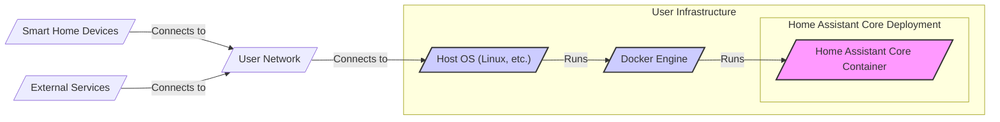

# BUSINESS POSTURE

- Business Priorities and Goals:
 - Provide a central, open-source platform for home automation.
 - Support a wide range of smart home devices and protocols.
 - Offer users local control and privacy for their smart home data.
 - Foster a vibrant community of users and developers.
 - Enable advanced automation and customization through scripting and integrations.

- Business Risks:
 - Security vulnerabilities in the platform could compromise user privacy and security.
 - Lack of reliability could disrupt critical home automation functions.
 - Compatibility issues with new devices or protocols could limit platform adoption.
 - Dependence on community contributions could lead to inconsistent quality or feature gaps.
 - Negative publicity from security breaches or privacy incidents could damage reputation.

# SECURITY POSTURE

- Existing Security Controls:
 - security control: HTTPS for web interface access (implementation location: web server configuration).
 - security control: User authentication (username/password, API keys) (implementation location: core application code).
 - security control: Authorization based on user roles and permissions (implementation location: core application code).
 - security control: Input validation on user inputs via web interface and APIs (implementation location: core application code).
 - security control: Code reviews by maintainers and community contributors (implementation location: GitHub pull request process).
 - security control: Static code analysis tools used in development (implementation location: CI/CD pipelines, if configured by developers).
 - security control: Dependency scanning for known vulnerabilities (implementation location: CI/CD pipelines, if configured by developers).
 - security control: Regular updates and security patches (implementation location: project release cycle and user update process).
 - accepted risk: Reliance on user responsibility for secure deployment environment (e.g., network security, operating system security).
 - accepted risk: Potential vulnerabilities in third-party integrations and custom components.

- Recommended Security Controls:
 - security control: Implement automated security testing (SAST, DAST) in CI/CD pipelines.
 - security control: Enhance input validation and sanitization to prevent injection attacks.
 - security control: Implement rate limiting and防禦 mechanisms against brute-force attacks.
 - security control: Provide guidance and tools for users to securely configure their deployments.
 - security control: Establish a formal security incident response plan.
 - security control: Conduct regular penetration testing or security audits.
 - security control: Implement Content Security Policy (CSP) and other browser security headers.
 - security control: Improve secrets management practices within the codebase and for user configurations.

- Security Requirements:
 - Authentication:
  - Requirement: Securely authenticate users accessing the web interface and APIs.
  - Requirement: Support strong password policies and multi-factor authentication (MFA) options.
  - Requirement: Implement secure session management to prevent session hijacking.
 - Authorization:
  - Requirement: Implement fine-grained authorization to control access to different features and entities based on user roles and permissions.
  - Requirement: Enforce least privilege principle for user access.
  - Requirement: Audit authorization decisions for security monitoring and incident response.
 - Input Validation:
  - Requirement: Validate all user inputs from web interface, APIs, and integrations to prevent injection attacks (e.g., SQL injection, command injection, cross-site scripting).
  - Requirement: Sanitize user inputs before processing and storing them.
  - Requirement: Implement input validation on both client-side and server-side.
 - Cryptography:
  - Requirement: Use strong cryptography for storing sensitive data (e.g., passwords, API keys).
  - Requirement: Securely manage cryptographic keys.
  - Requirement: Use TLS/SSL for all communication channels involving sensitive data.
  - Requirement: Implement secure communication protocols for integrations with external devices and services.

# DESIGN

- C4 CONTEXT

```mermaid
graph LR
    subgraph "Home Automation System"
        center "Home Assistant Core"
    end
    User[/"User"/] -- Uses --> center
    SmartHomeDevices[/"Smart Home Devices"/] -- Interacts with --> center
    ExternalServices[/"External Services (Cloud APIs, etc.)"/] -- Interacts with --> center
    Developer[/"Developer"/] -- Extends --> center

    style center fill:#f9f,stroke:#333,stroke-width:2px
```

- C4 CONTEXT Elements:
 - - Name: User
   - Type: Person
   - Description: End-users who interact with Home Assistant Core to control and monitor their smart home.
   - Responsibilities:
    - Configure and manage their smart home devices through Home Assistant Core.
    - Create and manage automations and dashboards.
    - Monitor the status of their smart home.
   - Security controls:
    - security control: Strong passwords or MFA for user accounts.
    - security control: User access control and permissions within Home Assistant Core.

 - - Name: Home Assistant Core
   - Type: Software System
   - Description: The central open-source home automation platform. It acts as a hub to control and automate smart home devices and integrate with external services.
   - Responsibilities:
    - Manage and control smart home devices.
    - Execute user-defined automations.
    - Provide a user interface for monitoring and control.
    - Integrate with external services and APIs.
    - Store and process smart home data.
   - Security controls:
    - security control: Authentication and authorization for user access.
    - security control: Input validation and sanitization.
    - security control: Secure storage of sensitive data.
    - security control: HTTPS for web interface.
    - security control: Regular security updates.

 - - Name: Smart Home Devices
   - Type: External System
   - Description: Physical devices in the user's home that are controlled and monitored by Home Assistant Core (e.g., lights, sensors, thermostats, cameras).
   - Responsibilities:
    - Execute commands from Home Assistant Core.
    - Report status and sensor data to Home Assistant Core.
    - Communicate using various smart home protocols (e.g., Zigbee, Z-Wave, Wi-Fi, Bluetooth).
   - Security controls:
    - security control: Device-specific security features (varies by device).
    - security control: Network security to protect communication between devices and Home Assistant Core.
    - security control: Secure pairing and onboarding processes.

 - - Name: External Services (Cloud APIs, etc.)
   - Type: External System
   - Description: Cloud-based services and APIs that Home Assistant Core integrates with to extend functionality (e.g., weather services, voice assistants, cloud storage).
   - Responsibilities:
    - Provide data and services to Home Assistant Core.
    - Authenticate and authorize Home Assistant Core's access.
    - Communicate over network APIs (e.g., REST, WebSockets).
   - Security controls:
    - security control: API authentication and authorization mechanisms (API keys, OAuth).
    - security control: Secure communication protocols (HTTPS).
    - security control: Data privacy and security policies of external service providers.

 - - Name: Developer
   - Type: Person
   - Description: Software developers who contribute to the Home Assistant Core project by developing integrations, custom components, and core features.
   - Responsibilities:
    - Develop and maintain integrations for new devices and services.
    - Contribute to the core codebase.
    - Participate in code reviews and testing.
   - Security controls:
    - security control: Code review process to identify and mitigate security vulnerabilities.
    - security control: Secure development practices.
    - security control: Access control to the codebase and development infrastructure (GitHub).

- C4 CONTAINER

```mermaid
graph LR
    subgraph "Home Assistant Core"
        WebUI[/"Web UI Container"/]
        API[/"API Container"/]
        AutomationEngine[/"Automation Engine Container"/]
        DeviceIntegration[/"Device Integration Container"/]
        EventBus[/"Event Bus Container"/]
        Configuration[/"Configuration Container"/]
        Database[/"Database Container"/]

        WebUI -- Uses API
        API -- Uses AutomationEngine
        API -- Uses DeviceIntegration
        AutomationEngine -- Uses EventBus
        DeviceIntegration -- Uses EventBus
        DeviceIntegration -- Uses Configuration
        API -- Uses Configuration
        AutomationEngine -- Uses Configuration
        EventBus -- Uses Database
        Configuration -- Uses Database
    end
    User[/"User"/] -- Uses --> WebUI
    User -- Uses --> API
    SmartHomeDevices[/"Smart Home Devices"/] -- Interacts with --> DeviceIntegration
    ExternalServices[/"External Services"/] -- Interacts with --> DeviceIntegration

    style WebUI fill:#f9f,stroke:#333,stroke-width:2px
    style API fill:#f9f,stroke:#333,stroke-width:2px
    style AutomationEngine fill:#f9f,stroke:#333,stroke-width:2px
    style DeviceIntegration fill:#f9f,stroke:#333,stroke-width:2px
    style EventBus fill:#f9f,stroke:#333,stroke-width:2px
    style Configuration fill:#f9f,stroke:#333,stroke-width:2px
    style Database fill:#f9f,stroke:#333,stroke-width:2px
```

- C4 CONTAINER Elements:
 - - Name: Web UI Container
   - Type: Web Application
   - Description: Provides the user interface for interacting with Home Assistant Core through a web browser.
   - Responsibilities:
    - Presenting dashboards and visualizations of smart home data.
    - Allowing users to control devices and manage automations.
    - Handling user authentication and authorization for web access.
   - Security controls:
    - security control: HTTPS for secure communication.
    - security control: Input validation on user inputs from the UI.
    - security control: Content Security Policy (CSP) to mitigate XSS attacks.
    - security control: Session management and protection against session hijacking.

 - - Name: API Container
   - Type: API Application
   - Description: Exposes a RESTful API for programmatic access to Home Assistant Core functionalities. Used by the Web UI, mobile apps, and external integrations.
   - Responsibilities:
    - Providing endpoints for device control, automation management, and data retrieval.
    - Handling API authentication and authorization (API keys, tokens).
    - Rate limiting to prevent abuse.
   - Security controls:
    - security control: API authentication and authorization mechanisms.
    - security control: Input validation on API requests.
    - security control: Rate limiting and防禦 mechanisms.
    - security control: Secure API documentation and access control.

 - - Name: Automation Engine Container
   - Type: Application Logic
   - Description: Processes and executes user-defined automations based on triggers and conditions.
   - Responsibilities:
    - Evaluating automation rules.
    - Triggering actions based on events and conditions.
    - Managing automation workflows.
   - Security controls:
    - security control: Secure processing of automation logic to prevent unintended actions.
    - security control: Authorization checks before executing sensitive actions.
    - security control: Logging and auditing of automation executions.

 - - Name: Device Integration Container
   - Type: Integration Component
   - Description: Manages communication and integration with various smart home devices and protocols. Includes different integration modules for Zigbee, Z-Wave, Wi-Fi devices, etc.
   - Responsibilities:
    - Discovering and onboarding new devices.
    - Translating commands and data between Home Assistant Core and devices.
    - Handling device communication protocols.
   - Security controls:
    - security control: Secure device pairing and onboarding processes.
    - security control: Secure communication with devices (where protocols allow).
    - security control: Input validation of data received from devices.
    - security control: Isolation of integration modules to limit the impact of vulnerabilities.

 - - Name: Event Bus Container
   - Type: Message Broker
   - Description: A central component for inter-container communication within Home Assistant Core. Facilitates asynchronous communication between different parts of the system.
   - Responsibilities:
    - Routing events and messages between containers.
    - Decoupling components and enabling event-driven architecture.
   - Security controls:
    - security control: Access control to the event bus to prevent unauthorized message publishing or consumption.
    - security control: Message integrity and confidentiality (if required for sensitive data).

 - - Name: Configuration Container
   - Type: Data Store
   - Description: Manages the configuration of Home Assistant Core, including user settings, device configurations, and automation rules.
   - Responsibilities:
    - Storing and retrieving configuration data.
    - Providing configuration management APIs.
   - Security controls:
    - security control: Secure storage of configuration data, including sensitive information (e.g., API keys, passwords).
    - security control: Access control to configuration data.
    - security control: Backup and recovery mechanisms for configuration data.

 - - Name: Database Container
   - Type: Data Store
   - Description: Stores historical data, event logs, and potentially some configuration data for Home Assistant Core.
   - Responsibilities:
    - Persisting data for long-term storage and analysis.
    - Providing data query and retrieval capabilities.
   - Security controls:
    - security control: Secure database configuration and access control.
    - security control: Encryption of sensitive data at rest (if required).
    - security control: Regular database backups.

- DEPLOYMENT

- Deployment Solution: Docker Container Deployment on User-Managed Infrastructure



- DEPLOYMENT Elements:
 - - Name: Host OS (Linux, etc.)
   - Type: Infrastructure - Operating System
   - Description: The operating system running on the user's hardware (e.g., Linux, Raspberry Pi OS). Provides the base environment for Docker and Home Assistant Core.
   - Responsibilities:
    - Providing system resources (CPU, memory, storage).
    - Managing network connectivity.
    - Providing OS-level security features.
   - Security controls:
    - security control: Regular OS updates and patching.
    - security control: Host-based firewall.
    - security control: Secure OS configuration (e.g., disabling unnecessary services, strong passwords).

 - - Name: Docker Engine
   - Type: Infrastructure - Container Runtime
   - Description: The container runtime environment used to run the Home Assistant Core Docker container.
   - Responsibilities:
    - Managing container lifecycle (creation, start, stop, deletion).
    - Providing container isolation and resource management.
    - Handling container networking and storage.
   - Security controls:
    - security control: Docker security best practices (e.g., using least privilege containers, image scanning).
    - security control: Docker daemon configuration and access control.
    - security control: Container image security scanning and vulnerability management.

 - - Name: Home Assistant Core Container
   - Type: Software Container
   - Description: A Docker container encapsulating all the components of Home Assistant Core (Web UI, API, Automation Engine, etc.).
   - Responsibilities:
    - Running the Home Assistant Core application.
    - Exposing ports for web access and device communication.
    - Managing application-level security controls.
   - Security controls:
    - security control: Application-level security controls as described in previous sections (authentication, authorization, input validation, etc.).
    - security control: Container image built from trusted base images and regularly updated.
    - security control: Container resource limits to prevent resource exhaustion.

 - - Name: User Network
   - Type: Network Infrastructure
   - Description: The user's home network, typically a private network behind a router/firewall. Connects Home Assistant Core, smart home devices, and external services.
   - Responsibilities:
    - Providing network connectivity for Home Assistant Core and devices.
    - Protecting the home network from external threats.
   - Security controls:
    - security control: Firewall to protect the network from external access.
    - security control: Wi-Fi security (WPA2/WPA3 encryption).
    - security control: Network segmentation (optional, for isolating smart home devices).

- BUILD

```mermaid
graph LR
    Developer[/"Developer"/] --> CodeChanges[/"Code Changes"/]
    CodeChanges --> GitHub[/"GitHub Repository"/]
    GitHub --> CI[/"CI System (GitHub Actions)"/]
    CI --> BuildProcess[/"Build Process (Automated)"/]
    BuildProcess --> SecurityChecks[/"Security Checks (SAST, Linters, Dependency Scan)"/]
    SecurityChecks --> BuildArtifacts[/"Build Artifacts (Docker Image, Python Package)"/]
    BuildArtifacts --> ContainerRegistry[/"Container Registry (Docker Hub)"/]
    BuildArtifacts --> PackageRegistry[/"Package Registry (PyPI)"/]

    style CI fill:#ccf,stroke:#333,stroke-width:2px
    style BuildProcess fill:#ccf,stroke:#333,stroke-width:2px
    style SecurityChecks fill:#ccf,stroke:#333,stroke-width:2px
    style BuildArtifacts fill:#ccf,stroke:#333,stroke-width:2px
    style ContainerRegistry fill:#ccf,stroke:#333,stroke-width:2px
    style PackageRegistry fill:#ccf,stroke:#333,stroke-width:2px
```



- BUILD Elements:
 - - Name: Developer
   - Type: Person
   - Description: Developers contributing code changes to the Home Assistant Core project.
   - Responsibilities:
    - Writing and testing code.
    - Submitting code changes via pull requests.
    - Participating in code reviews.
   - Security controls:
    - security control: Secure development practices.
    - security control: Code review process to identify security vulnerabilities.
    - security control: Access control to the codebase (GitHub).

 - - Name: GitHub Repository
   - Type: Code Repository
   - Description: The central repository for the Home Assistant Core source code, hosted on GitHub.
   - Responsibilities:
    - Storing and versioning the codebase.
    - Managing pull requests and code contributions.
    - Triggering CI/CD pipelines.
   - Security controls:
    - security control: Access control to the repository (authentication and authorization).
    - security control: Branch protection rules to enforce code review and security checks.
    - security control: Audit logging of repository activities.

 - - Name: CI System (GitHub Actions)
   - Type: Automation System
   - Description: The Continuous Integration system used to automate the build, test, and security check processes for Home Assistant Core. GitHub Actions is assumed as a common CI for GitHub projects.
   - Responsibilities:
    - Automating the build process.
    - Running automated tests.
    - Performing security checks (SAST, dependency scanning).
    - Publishing build artifacts.
   - Security controls:
    - security control: Secure CI/CD pipeline configuration.
    - security control: Access control to CI/CD workflows and secrets.
    - security control: Audit logging of CI/CD activities.

 - - Name: Build Process (Automated)
   - Type: Automation Process
   - Description: The automated process of compiling, packaging, and preparing Home Assistant Core for distribution.
   - Responsibilities:
    - Compiling code.
    - Building Docker images.
    - Creating Python packages.
    - Running unit and integration tests.
   - Security controls:
    - security control: Reproducible builds to ensure build integrity.
    - security control: Secure build environment.
    - security control: Minimizing dependencies and supply chain risks.

 - - Name: Security Checks (SAST, Linters, Dependency Scan)
   - Type: Security Tooling
   - Description: Automated security checks integrated into the build process to identify potential vulnerabilities. Includes Static Application Security Testing (SAST), linters, and dependency vulnerability scanning.
   - Responsibilities:
    - Identifying potential security flaws in the code.
    - Detecting vulnerable dependencies.
    - Enforcing code quality and security standards.
   - Security controls:
    - security control: Regularly updated security scanning tools and rulesets.
    - security control: Automated reporting and alerting on security findings.
    - security control: Integration of security findings into the development workflow.

 - - Name: Build Artifacts (Docker Image, Python Package)
   - Type: Software Artifacts
   - Description: The packaged outputs of the build process, including Docker images and Python packages, ready for distribution and deployment.
   - Responsibilities:
    - Providing deployable artifacts for users.
    - Ensuring artifact integrity and authenticity.
   - Security controls:
    - security control: Signing and verifying build artifacts.
    - security control: Secure storage of build artifacts.
    - security control: Vulnerability scanning of build artifacts before publication.

 - - Name: Container Registry (Docker Hub)
   - Type: Artifact Repository
   - Description: A public or private container registry (e.g., Docker Hub) used to store and distribute Docker images of Home Assistant Core.
   - Responsibilities:
    - Hosting Docker images.
    - Providing access control to images.
    - Image versioning and tagging.
   - Security controls:
    - security control: Access control to the container registry.
    - security control: Image scanning and vulnerability management in the registry.
    - security control: Secure image distribution (HTTPS).

 - - Name: Package Registry (PyPI)
   - Type: Artifact Repository
   - Description: The Python Package Index (PyPI) used to distribute Python packages for Home Assistant Core and its integrations.
   - Responsibilities:
    - Hosting Python packages.
    - Providing access to packages.
    - Package versioning.
   - Security controls:
    - security control: Account security for package publishers.
    - security control: Package signing and verification (if implemented).
    - security control: Monitoring for malicious packages.

# RISK ASSESSMENT

- Critical Business Processes:
 - Home Automation Control: Controlling lights, appliances, security systems, and other smart home devices. Disruption can lead to inconvenience, security risks (e.g., disabled security system), and potential property damage (e.g., malfunctioning heating system).
 - Automation Execution: Running scheduled automations and responding to triggers. Failure can lead to missed schedules, non-responsive smart home, and user dissatisfaction.
 - Data Collection and Storage: Collecting sensor data and user preferences. Compromise can lead to privacy breaches and misuse of personal information.
 - Remote Access: Allowing users to control their home remotely. Insecure remote access can lead to unauthorized control and security breaches.

- Data Sensitivity:
 - User Credentials: Usernames, passwords, API keys - Highly Sensitive. Compromise leads to account takeover and unauthorized access.
 - Personal Information: User names, locations, preferences - Sensitive. Compromise leads to privacy violations.
 - Smart Home Device Data: Sensor readings, device status, usage patterns - Sensitive to Confidential. Can reveal user habits and activities.
 - Automation Rules: User-defined automation logic - Sensitive to Integrity. Tampering can lead to unexpected and potentially harmful actions.
 - Configuration Data: System settings, integration configurations - Sensitive to Integrity and Availability. Corruption can disrupt system functionality.

# QUESTIONS & ASSUMPTIONS

- BUSINESS POSTURE Questions:
 - What is the acceptable downtime for the Home Assistant Core service?
 - What are the key performance indicators (KPIs) for success?
 - What is the budget allocated for security enhancements?

- BUSINESS POSTURE Assumptions:
 - The primary business goal is to provide a reliable and secure open-source home automation platform.
 - User privacy and security are high priorities.
 - The project relies on community contributions for development and maintenance.

- SECURITY POSTURE Questions:
 - Are there any specific compliance requirements (e.g., GDPR, CCPA) that need to be considered?
 - What is the current security maturity level of the project?
 - Are there any existing security policies or guidelines?
 - Is there a dedicated security team or point of contact?

- SECURITY POSTURE Assumptions:
 - Security is a shared responsibility between the project developers and the users deploying Home Assistant Core.
 - Users are expected to have some level of technical expertise to deploy and configure the system securely.
 - Open-source nature allows for community scrutiny and contribution to security.

- DESIGN Questions:
 - What are the expected scalability requirements for Home Assistant Core?
 - What are the performance requirements for different components?
 - Are there any specific technology constraints or preferences?
 - What are the long-term maintenance and upgrade strategies?

- DESIGN Assumptions:
 - Docker container deployment is a common and recommended deployment method.
 - The system is designed for local network deployment, with optional remote access.
 - The architecture is modular and event-driven for flexibility and extensibility.
 - GitHub Actions is used for CI/CD.