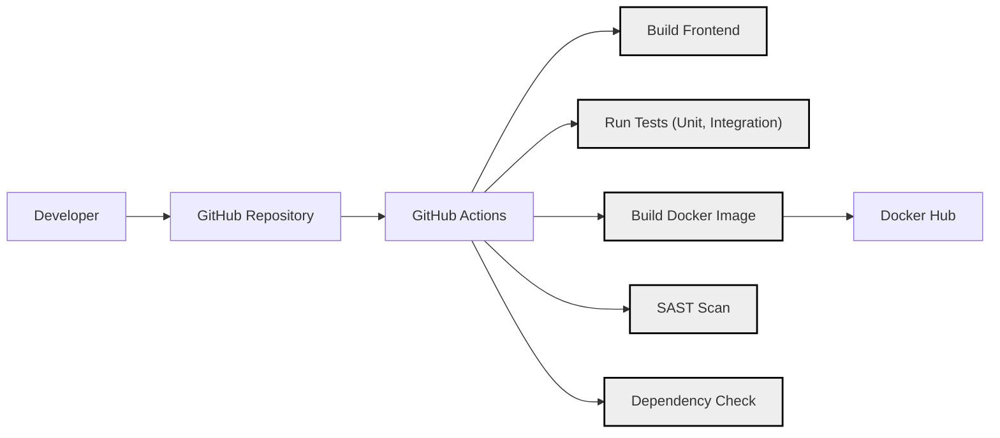

Okay, let's create a design document for the Home Assistant Core project.

# BUSINESS POSTURE

Home Assistant is an open-source home automation platform. Its primary business goals revolve around providing a free, flexible, privacy-focused, and locally-controlled alternative to commercial smart home systems. The project's success hinges on community contributions, ease of use, and broad compatibility with various smart home devices and services.

Business Priorities:

*   Maintain a vibrant and active open-source community.
*   Ensure ease of installation, configuration, and use for non-technical users.
*   Support a wide range of devices and services through integrations.
*   Prioritize user privacy and local control over cloud dependence.
*   Provide a stable and reliable platform for home automation.
*   Provide platform that is easy to extend and customize.

Business Risks:

*   Loss of community interest and contributions, leading to stagnation.
*   Complexity creep, making the platform difficult for non-technical users.
*   Inability to keep pace with the rapidly evolving smart home landscape.
*   Security vulnerabilities that could compromise user privacy or home security.
*   Reliance on third-party integrations that may become unavailable or unreliable.
*   Lack of resources to properly maintain and develop the platform.

# SECURITY POSTURE

Home Assistant has several built-in security features and follows some secure development practices. However, being an open-source project with a large number of community-developed integrations, the overall security posture is complex and depends heavily on user configuration and the security of individual integrations.

Existing Security Controls:

*   security control: Authentication: Home Assistant provides user authentication with password protection and supports multi-factor authentication (MFA). Described in the documentation and implemented in the codebase.
*   security control: Authorization: Role-Based Access Control (RBAC) is implemented, allowing administrators to define different levels of access for users. Described in the documentation and implemented in the codebase.
*   security control: HTTPS Support: Home Assistant can be configured to use HTTPS, encrypting communication between the user's browser and the server. Described in the documentation.
*   security control: Regular Updates: The project has a regular release cycle, including security updates. Managed through GitHub and the release process.
*   security control: Community Security Audits: Being open-source, the codebase is subject to scrutiny by the community, potentially identifying vulnerabilities.
*   security control: Integration Vetting (Limited): There's some level of review for integrations submitted to the official repository, but the process is not exhaustive. Managed through GitHub pull requests.
*   security control: API Security: The API uses token-based authentication. Described in the documentation and implemented in the codebase.

Accepted Risks:

*   accepted risk: Third-Party Integration Security: The security of third-party integrations is largely outside the control of the core Home Assistant project. Users are responsible for assessing the risks of using specific integrations.
*   accepted risk: Local Network Security: Home Assistant's security relies on the security of the user's local network. If the network is compromised, Home Assistant may also be compromised.
*   accepted risk: User Configuration Errors: Misconfiguration by the user can lead to security vulnerabilities.
*   accepted risk: Supply Chain Attacks: The project is vulnerable to supply chain attacks, where malicious code could be introduced into dependencies.

Recommended Security Controls:

*   Implement a robust Software Bill of Materials (SBOM) management system to track all dependencies and their vulnerabilities.
*   Integrate Static Application Security Testing (SAST) and Dynamic Application Security Testing (DAST) tools into the CI/CD pipeline.
*   Establish a formal vulnerability disclosure program and bug bounty program.
*   Provide more comprehensive security documentation and guidelines for users and integration developers.
*   Implement a sandboxing mechanism for integrations to limit their access to the core system.
*   Introduce code signing for official releases and integrations.

Security Requirements:

*   Authentication:
    *   Strong password policies should be enforced.
    *   MFA should be strongly encouraged and easily configurable.
    *   Session management should be secure, with appropriate timeouts and protection against session hijacking.
*   Authorization:
    *   RBAC should be granular and flexible, allowing for fine-grained control over user permissions.
    *   The principle of least privilege should be applied throughout the system.
*   Input Validation:
    *   All user inputs, including those from integrations, should be strictly validated to prevent injection attacks (e.g., XSS, SQL injection).
    *   Data sanitization should be performed where appropriate.
*   Cryptography:
    *   Strong, industry-standard cryptographic algorithms should be used for all sensitive data, including passwords and API keys.
    *   Cryptographic keys should be managed securely, following best practices.
    *   HTTPS should be the default, and users should be warned if they are using HTTP.

# DESIGN

## C4 CONTEXT

```mermaid
graph LR
    subgraph Home Assistant System
        HASS["Home Assistant Core"]
    end

    User["User"] --> HASS
    MobileApp["Mobile App"] --> HASS
    WebApp["Web App"] --> HASS
    ThirdPartyIntegrations["Third-Party Integrations"] <..> HASS
    CloudServices["Cloud Services (Optional)"] <..> HASS
    LocalDevices["Local Devices (e.g., Zigbee, Z-Wave)"] <..> HASS

    classDef system fill:#ddd,stroke:#000,stroke-width:2px;
    classDef person fill:#eee,stroke:#000,stroke-width:2px;
    classDef external fill:#fff,stroke:#000,stroke-width:1px,stroke-dasharray:5 5;

    class HASS system;
    class User,MobileApp,WebApp person
    class ThirdPartyIntegrations,CloudServices,LocalDevices external
```

C4 Context Element Descriptions:

*   1.  Name: User
    *   Type: Person
    *   Description: A person who interacts with Home Assistant to control and monitor their home.
    *   Responsibilities: Interacting with the Home Assistant UI, configuring automations, viewing dashboards.
    *   Security controls: Authentication, Authorization.

*   2.  Name: Mobile App
    *   Type: Person
    *   Description: The official Home Assistant mobile application.
    *   Responsibilities: Providing a mobile interface to interact with Home Assistant.
    *   Security controls: Authentication, Authorization, Secure communication with Home Assistant Core.

*   3.  Name: Web App
    *   Type: Person
    *   Description: The Home Assistant web application accessed through a browser.
    *   Responsibilities: Providing a web interface to interact with Home Assistant.
    *   Security controls: Authentication, Authorization, Secure communication with Home Assistant Core (HTTPS).

*   4.  Name: Home Assistant Core
    *   Type: System
    *   Description: The core Home Assistant application, responsible for managing integrations, automations, and the user interface.
    *   Responsibilities: Managing state, running automations, providing the user interface, communicating with integrations.
    *   Security controls: Authentication, Authorization, Input Validation, API Security.

*   5.  Name: Third-Party Integrations
    *   Type: External System
    *   Description: Community-developed or third-party integrations that extend Home Assistant's functionality.
    *   Responsibilities: Communicating with specific devices or services, providing data to Home Assistant.
    *   Security controls: Vary widely; rely on the security of the individual integration.

*   6.  Name: Cloud Services (Optional)
    *   Type: External System
    *   Description: Cloud-based services that some integrations may rely on (e.g., weather services, voice assistants).
    *   Responsibilities: Providing external services to Home Assistant integrations.
    *   Security controls: Rely on the security of the cloud service provider.

*   7.  Name: Local Devices (e.g., Zigbee, Z-Wave)
    *   Type: External System
    *   Description: Smart home devices that communicate directly with Home Assistant over local protocols.
    *   Responsibilities: Performing actions (e.g., turning on a light), reporting status.
    *   Security controls: Rely on the security of the local network and the device's protocol (e.g., Zigbee, Z-Wave security).

## C4 CONTAINER

```mermaid
graph LR
    subgraph Home Assistant Core
        Frontend["Frontend (Web Interface)"] --> Backend
        Backend["Backend (Python)"] --> Database
        Backend --> EventHandler["Event Handler"]
        EventHandler --> Integrations
        Integrations["Integrations (Python)"]
        Database["Database (SQLite)"]
    end

    User["User"] --> Frontend
    MobileApp["Mobile App"] --> Frontend
    WebApp["Web App"] --> Frontend
    ThirdPartyIntegrations["Third-Party Integrations"] <..> Integrations
    CloudServices["Cloud Services (Optional)"] <..> Integrations
    LocalDevices["Local Devices"] <..> Integrations

    classDef container fill:#eee,stroke:#000,stroke-width:2px;
    classDef external fill:#fff,stroke:#000,stroke-width:1px,stroke-dasharray:5 5;

    class Frontend,Backend,Database,EventHandler,Integrations container
    class ThirdPartyIntegrations,CloudServices,LocalDevices external
```

C4 Container Element Descriptions:

*   1.  Name: Frontend (Web Interface)
    *   Type: Container
    *   Description: The user interface, built with web technologies (HTML, CSS, JavaScript).
    *   Responsibilities: Displaying the Home Assistant UI, handling user interactions, communicating with the backend.
    *   Security controls: Authentication, Authorization, Input Validation (client-side), HTTPS.

*   2.  Name: Backend (Python)
    *   Type: Container
    *   Description: The core logic of Home Assistant, written in Python.
    *   Responsibilities: Managing state, running automations, handling API requests, communicating with integrations.
    *   Security controls: Authentication, Authorization, Input Validation (server-side), API Security.

*   3.  Name: Database (SQLite)
    *   Type: Container
    *   Description: Stores Home Assistant's configuration, state, and history data.
    *   Responsibilities: Persisting data, providing data access to the backend.
    *   Security controls: Access control (limited to the backend), data encryption (if configured).

*   4.  Name: Event Handler
    *   Type: Container
    *   Description: Manages events within Home Assistant, triggering automations and updates.
    *   Responsibilities: Receiving events from integrations, triggering automations based on events, updating state.
    *   Security controls: Input validation.

*   5.  Name: Integrations (Python)
    *   Type: Container
    *   Description: Python modules that connect Home Assistant to various devices and services.
    *   Responsibilities: Communicating with devices and services, translating data into a format understood by Home Assistant.
    *   Security controls: Vary widely; rely on the security of the individual integration and the communication protocol used.

## DEPLOYMENT

Home Assistant offers several deployment options:

*   Home Assistant Operating System (HassOS): A dedicated operating system image for Raspberry Pi and other devices.
*   Home Assistant Container: A Docker container image.
*   Home Assistant Supervised: A managed installation on top of a Debian Linux system.
*   Home Assistant Core: A manual installation in a Python virtual environment.

We'll describe the Home Assistant Container deployment, as it's a common and flexible option.

```mermaid
graph LR
    subgraph Docker Host
        HASSContainer["Home Assistant Container"]
        HASSContainer --> ConfigVolume["Configuration Volume"]
        HASSContainer --> Network["Host Network/Bridge Network"]
    end

    Internet["Internet"] <..> Network
    LocalNetwork["Local Network"] <..> Network

    classDef node fill:#ddd,stroke:#000,stroke-width:2px;
    classDef container fill:#eee,stroke:#000,stroke-width:2px;
    classDef external fill:#fff,stroke:#000,stroke-width:1px,stroke-dasharray:5 5;

    class DockerHost node
    class HASSContainer container
    class Internet,LocalNetwork external
```

Deployment Element Descriptions:

*   1.  Name: Docker Host
    *   Type: Node
    *   Description: The physical or virtual machine running Docker Engine.
    *   Responsibilities: Providing the runtime environment for Docker containers.
    *   Security controls: Operating system security, Docker Engine security, firewall.

*   2.  Name: Home Assistant Container
    *   Type: Container
    *   Description: The Docker container running the Home Assistant Core application.
    *   Responsibilities: Running the Home Assistant application.
    *   Security controls: Container isolation, resource limits, regular updates of the container image.

*   3.  Name: Configuration Volume
    *   Type: Volume
    *   Description: A persistent volume mounted into the container to store Home Assistant's configuration.
    *   Responsibilities: Persisting configuration data across container restarts.
    *   Security controls: Access control to the volume.

*   4.  Name: Host Network/Bridge Network
    *   Type: Network
    *   Description: The network configuration for the container. Host networking exposes the container directly to the host's network, while bridge networking creates a separate network namespace.
    *   Responsibilities: Providing network connectivity to the container.
    *   Security controls: Network segmentation (if using bridge networking), firewall rules.

*   5.  Name: Internet
    *   Type: External
    *   Description: External network.
    *   Responsibilities: N/A
    *   Security controls: N/A

*   6.  Name: Local Network
    *   Type: External
    *   Description: Local network.
    *   Responsibilities: N/A
    *   Security controls: N/A

## BUILD

Home Assistant's build process is managed through GitHub Actions. The process involves building the frontend, running tests, and creating Docker images.



Build Process Description:

1.  Developers push code changes to the GitHub repository.
2.  GitHub Actions triggers a workflow on code push or pull request.
3.  The workflow builds the frontend (JavaScript, CSS).
4.  The workflow runs unit and integration tests.
5.  A SAST scan is performed to identify potential security vulnerabilities in the code.
6.  A dependency check is performed to identify known vulnerabilities in project dependencies.
7.  If all checks pass, a Docker image is built.
8.  The Docker image is pushed to Docker Hub.

Security Controls in Build Process:

*   security control: Code Review: All code changes are reviewed by other developers before being merged.
*   security control: Automated Testing: Unit and integration tests help ensure code quality and prevent regressions.
*   security control: SAST Scanning: Static analysis helps identify potential vulnerabilities early in the development process.
*   security control: Dependency Checking: Tools like Dependabot (integrated with GitHub) identify known vulnerabilities in dependencies.
*   security control: Build Automation: GitHub Actions provides a consistent and reproducible build process.

# RISK ASSESSMENT

Critical Business Processes:

*   Home Automation Control: The core functionality of controlling and automating smart home devices.
*   Data Collection and Reporting: Gathering data from sensors and providing insights to the user.
*   User Interface and Experience: Providing a user-friendly interface for managing the home.
*   Integration Management: Adding, configuring, and managing integrations with various devices and services.

Data Sensitivity:

*   Personally Identifiable Information (PII): Usernames, passwords, location data (if used), IP addresses. Sensitivity: High
*   Home Configuration Data: Information about the user's home, devices, and automations. Sensitivity: Medium to High
*   Sensor Data: Data from sensors (e.g., temperature, humidity, motion). Sensitivity: Medium, depending on the specific sensor and its use.
*   Device Control Data: Commands sent to devices (e.g., turning on a light). Sensitivity: Medium
*   Usage Data: Information about how the user interacts with Home Assistant. Sensitivity: Low to Medium

# QUESTIONS & ASSUMPTIONS

Questions:

*   What is the specific threat model used by the Home Assistant security team (if any)?
*   What is the process for handling security vulnerabilities reported by external researchers?
*   Are there any plans to implement more robust sandboxing for integrations?
*   What are the specific security considerations for Home Assistant Cloud (Nabu Casa)?
*   Are penetration tests regularly performed?

Assumptions:

*   BUSINESS POSTURE: The primary user base consists of home users, not enterprise environments.
*   BUSINESS POSTURE: Users are willing to accept some level of risk in exchange for the flexibility and control offered by Home Assistant.
*   SECURITY POSTURE: Users are responsible for securing their local network.
*   SECURITY POSTURE: Users are responsible for keeping their Home Assistant installation up to date.
*   DESIGN: The majority of deployments will use either the Home Assistant Operating System or the Docker container image.
*   DESIGN: Most users will rely on a mix of local and cloud-based integrations.