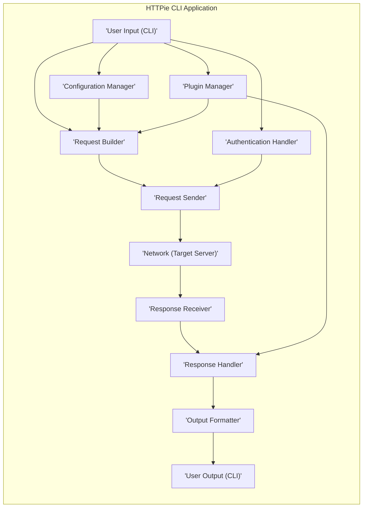
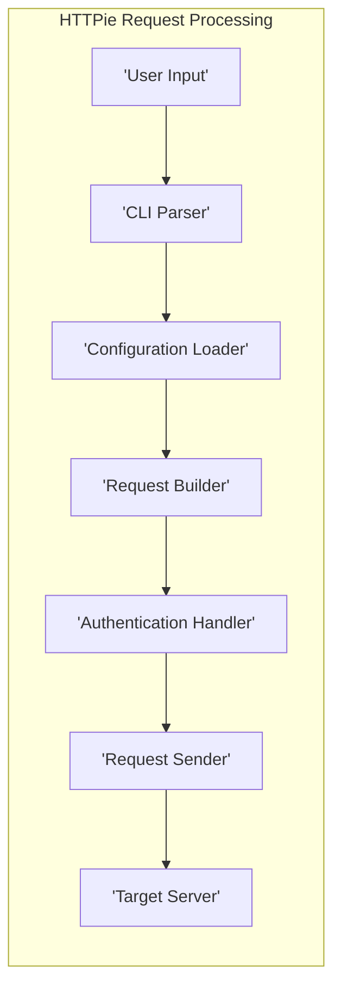
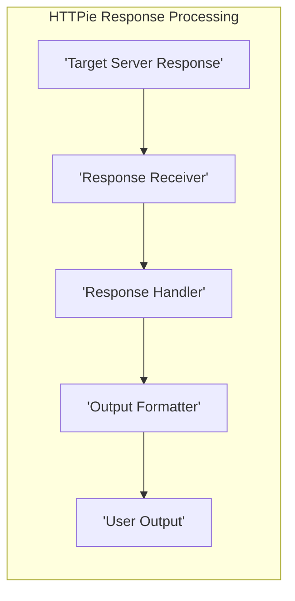
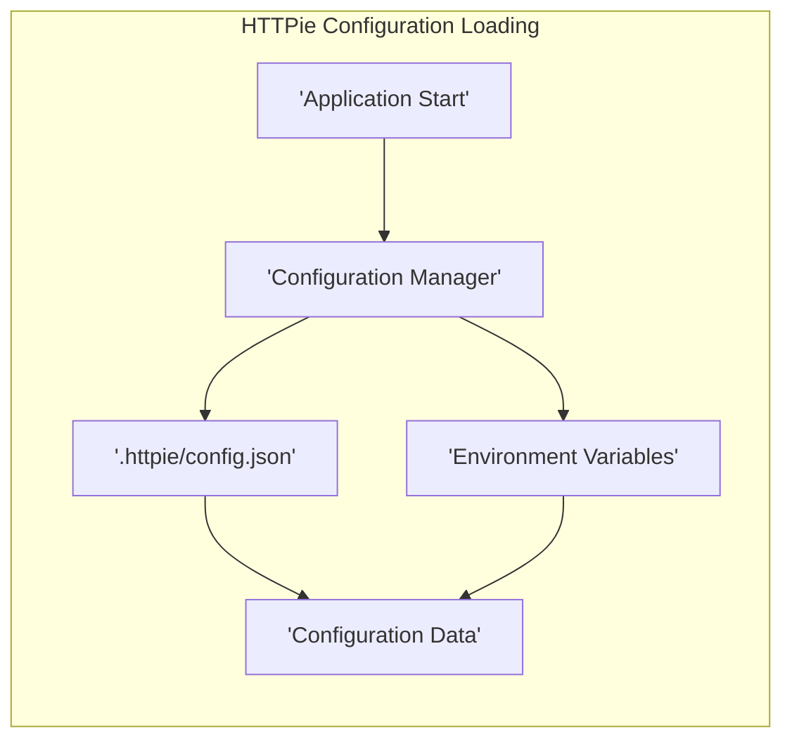

# Project Design Document: HTTPie CLI

**Version:** 1.1
**Date:** October 26, 2023
**Author:** AI Software Architect

## 1. Introduction

This document provides an enhanced design overview of the HTTPie CLI project (https://github.com/httpie/cli), intended to serve as a robust foundation for subsequent threat modeling activities. It details the key components, functionalities, data flows, and dependencies of the application with a strong focus on security implications. This document prioritizes clarity and precision, utilizing valid markdown formatting and mermaid syntax as requested.

## 2. Project Overview

HTTPie is a command-line HTTP client designed for user-friendliness. It simplifies interaction with web services through an intuitive syntax, formatted and colorized output, and built-in support for common web data formats like JSON. A thorough understanding of its architecture is essential for identifying and mitigating potential security vulnerabilities.

## 3. Goals

* Deliver a refined and comprehensive architectural overview of the HTTPie CLI.
* Clearly identify key components and articulate their interactions.
* Precisely describe data flow within the application, highlighting sensitive data paths.
* Emphasize potential areas of security concern to directly inform subsequent threat modeling efforts.

## 4. Scope

This document encompasses the core functionalities of the HTTPie CLI application, focusing on aspects relevant to security:

* Request construction and the handling of user-supplied data.
* The process of sending requests and receiving responses over the network.
* Management and usage of configuration settings, including sensitive data.
* Handling of various authentication methods and credential storage.
* The plugin architecture and its potential security implications.
* Mechanisms for user input and output, including file handling.

This document explicitly excludes:

* The internal workings of the Python interpreter beyond their direct impact on HTTPie's security.
* Fine-grained implementation details of underlying networking libraries (like `requests`) unless they present a direct security concern.
* The specific implementation details of individual, third-party plugins.

## 5. High-Level Architecture

The HTTPie CLI architecture involves several key interacting components:

* **User Interface (CLI):**  The entry point for user commands and input.
* **Request Builder:**  Responsible for constructing well-formed HTTP requests.
* **Request Sender:**  Handles the actual transmission of HTTP requests over the network.
* **Response Handler:**  Processes and interprets the HTTP response received from the server.
* **Output Formatter:**  Renders the processed response for user consumption.
* **Configuration Manager:**  Loads, stores, and manages application configuration.
* **Authentication Handler:**  Manages authentication credentials and applies them to requests.
* **Plugin Manager:**  Facilitates the loading and execution of external plugins.

## 6. Detailed Design

### 6.1. User Interface (CLI)

* **Responsibility:**  Receives, parses, and validates user input from the command line.
* **Functionality:**
    * Employs a library like `argparse` to interpret command-line arguments and options.
    * Translates user-provided flags, arguments, and data into actionable instructions.
    * Provides user feedback through help messages and error reporting for invalid input.
* **Security Considerations:**
    * **Input Validation:** Rigorous validation is crucial to prevent command injection and other input-based vulnerabilities. Maliciously crafted input could be used to execute arbitrary commands or bypass security checks.
    * **Argument Injection:** Care must be taken to prevent attackers from injecting malicious arguments that are later interpreted by the system or external programs.

### 6.2. Request Builder

* **Responsibility:**  Constructs the HTTP request object based on parsed user input and loaded configuration.
* **Functionality:**
    * Determines the HTTP method (GET, POST, PUT, DELETE, etc.).
    * Sets HTTP headers, including those provided by the user and default headers.
    * Encodes request body data in various formats (JSON, form data, raw data).
    * Handles file uploads, including reading file content.
    * Integrates authentication credentials into the request.
* **Security Considerations:**
    * **Data Encoding:** Improper encoding of request body data could lead to injection vulnerabilities on the server-side.
    * **Header Injection:** Allowing arbitrary user-controlled headers can lead to security bypasses or information disclosure.
    * **File Handling:**  Vulnerabilities can arise from insecure handling of file paths and the content of uploaded files. This includes path traversal and potential execution of malicious files.

### 6.3. Request Sender

* **Responsibility:**  Transmits the constructed HTTP request to the specified target server.
* **Functionality:**
    * Leverages a library like `requests` to manage network communication.
    * Handles connection management, timeouts, and potential retry mechanisms.
    * Implements TLS/SSL encryption for secure communication.
    * Supports the use of HTTP proxies.
* **Security Considerations:**
    * **SSRF (Server-Side Request Forgery):** Insufficient validation of the target URL could allow an attacker to force HTTPie to make requests to internal or unintended servers.
    * **TLS/SSL Vulnerabilities:** Improper configuration or handling of TLS certificates and hostname verification can lead to man-in-the-middle attacks.
    * **Proxy Security:**  Misconfigured or compromised proxies can expose sensitive data or introduce vulnerabilities.

### 6.4. Response Handler

* **Responsibility:**  Receives, processes, and interprets the HTTP response received from the target server.
* **Functionality:**
    * Parses response headers and the response body.
    * Checks the HTTP status code for success or errors.
    * Decodes the response body based on the `Content-Type` header.
    * Handles HTTP redirects.
* **Security Considerations:**
    * **Malicious Responses:**  The application must be resilient to maliciously crafted or malformed responses that could exploit parsing vulnerabilities.
    * **Header Handling:**  Careless processing of response headers could lead to vulnerabilities.
    * **Sensitive Data Exposure:**  Ensure sensitive data within the response body is handled appropriately and not inadvertently exposed.

### 6.5. Output Formatter

* **Responsibility:**  Formats the processed response for display to the user in a readable manner.
* **Functionality:**
    * Presents HTTP headers and the response body in a structured format.
    * Provides syntax highlighting for common content types like JSON and XML.
    * Supports different output modes (e.g., verbose, quiet, only headers).
* **Security Considerations:**
    * **Output Injection:**  Vulnerabilities can arise if the output formatting process allows for the injection of malicious code or escape sequences that could be interpreted by the user's terminal.
    * **Sensitive Data Leakage:** Ensure that sensitive information is not unintentionally included in the output, especially in verbose modes.

### 6.6. Configuration Manager

* **Responsibility:**  Loads, stores, and manages HTTPie's configuration settings.
* **Functionality:**
    * Reads configuration from files (e.g., `.httpie/config.json`).
    * Reads configuration from environment variables.
    * Manages settings such as default headers, authentication credentials, API tokens, and enabled plugins.
* **Security Considerations:**
    * **Secure Storage:** Sensitive configuration data, such as API keys and passwords, must be stored securely, ideally using encryption or platform-specific secure storage mechanisms.
    * **Configuration Injection:**  The application should be protected against attempts to inject malicious configurations that could alter its behavior or compromise security.
    * **Permissions:** Configuration files should have appropriate permissions to prevent unauthorized access or modification.

### 6.7. Authentication Handler

* **Responsibility:**  Manages authentication credentials and applies them to outgoing requests.
* **Functionality:**
    * Supports various authentication schemes, including Basic, Digest, OAuth, and potentially others.
    * Handles the storage of authentication credentials (which might be in the configuration file, a keyring, or provided at runtime).
    * Adds necessary authentication headers to requests.
* **Security Considerations:**
    * **Credential Storage:** Secure storage of user credentials is paramount. Avoid storing plaintext passwords. Consider using secure credential storage mechanisms provided by the operating system or dedicated libraries.
    * **Credential Leakage:** Prevent the unintentional leakage of credentials through logging, error messages, or insecure transmission.
    * **Protocol Vulnerabilities:** Ensure proper implementation of authentication protocols to avoid known vulnerabilities and bypasses.

### 6.8. Plugin Manager

* **Responsibility:**  Discovers, loads, and executes external plugins to extend HTTPie's functionality.
* **Functionality:**
    * Locates and loads plugins from designated directories or through package management systems.
    * Provides an API for plugins to interact with HTTPie's core functionalities.
* **Security Considerations:**
    * **Malicious Plugins:**  The plugin architecture introduces the risk of loading and executing malicious or vulnerable plugins that could compromise the security of HTTPie and the user's system.
    * **Plugin Permissions:**  Consider implementing a mechanism to restrict the capabilities and permissions of plugins to minimize the potential impact of a compromised plugin.
    * **Supply Chain Security:**  Ensure that plugins are obtained from trusted sources to mitigate the risk of supply chain attacks.

## 7. Data Flow Diagrams

### 7.1. Request Processing Flow

### 7.2. Response Processing Flow

### 7.3. Configuration Loading Flow

## 8. Security Considerations (Pre-Threat Modeling)

Building upon the detailed design, these are key security considerations for threat modeling:

* **Input Validation (CLI):**  Thoroughly validate all user-provided input to prevent injection attacks and ensure data integrity.
* **Credential Management (Authentication Handler, Configuration Manager):** Implement secure storage and handling of authentication credentials to prevent unauthorized access and leakage.
* **Plugin Security (Plugin Manager):**  Mitigate risks associated with loading and executing external plugins through secure loading mechanisms, permission controls, and validation.
* **Network Security (Request Sender):** Ensure secure communication with target servers through proper TLS/SSL configuration, hostname verification, and protection against SSRF.
* **Configuration Security (Configuration Manager):** Protect configuration files from unauthorized access, modification, and injection attacks.
* **Dependency Management:** Regularly review and update dependencies to address known vulnerabilities in third-party libraries.
* **Output Handling (Output Formatter):** Prevent vulnerabilities related to rendering potentially malicious content in the output and avoid unintentional disclosure of sensitive information.
* **File Handling (Request Builder):** Securely handle file uploads and avoid vulnerabilities like path traversal.

## 9. Dependencies

HTTPie relies on the following key dependencies, which should be considered during threat modeling:

* **Python:** The core language. Vulnerabilities in the Python interpreter itself could impact HTTPie.
* **`requests`:**  A critical dependency for making HTTP requests. Security vulnerabilities in `requests` could directly affect HTTPie's security.
* **`argparse` (or a similar library):** Used for command-line argument parsing. Vulnerabilities here could lead to command injection.
* **Potentially `Pygments` or similar:** For syntax highlighting. Vulnerabilities in these libraries could lead to output rendering issues or even code execution in some contexts.
* **Operating System:** The underlying OS provides core functionalities. OS-level vulnerabilities could be exploited.

## 10. Deployment

HTTPie is commonly deployed as a command-line tool installed on individual user machines or within development and testing environments. It can also be integrated into automated scripts and CI/CD pipelines. The deployment context can influence the attack surface and potential threats. For example, a shared server environment might introduce different risks compared to a local installation.

## 11. Future Considerations

Further enhancements to this design document could include:

* More granular details on error handling and logging mechanisms, including security logging considerations.
* Specific details on data sanitization and encoding practices within different components.
* A more detailed analysis of the plugin API and its security implications.
* Information on security testing methodologies employed for HTTPie.

This improved design document provides a more detailed and security-focused foundation for conducting a thorough threat model of the HTTPie CLI project. The enhanced descriptions of components, data flows, and security considerations aim to facilitate a more comprehensive identification of potential vulnerabilities and the development of effective mitigation strategies.