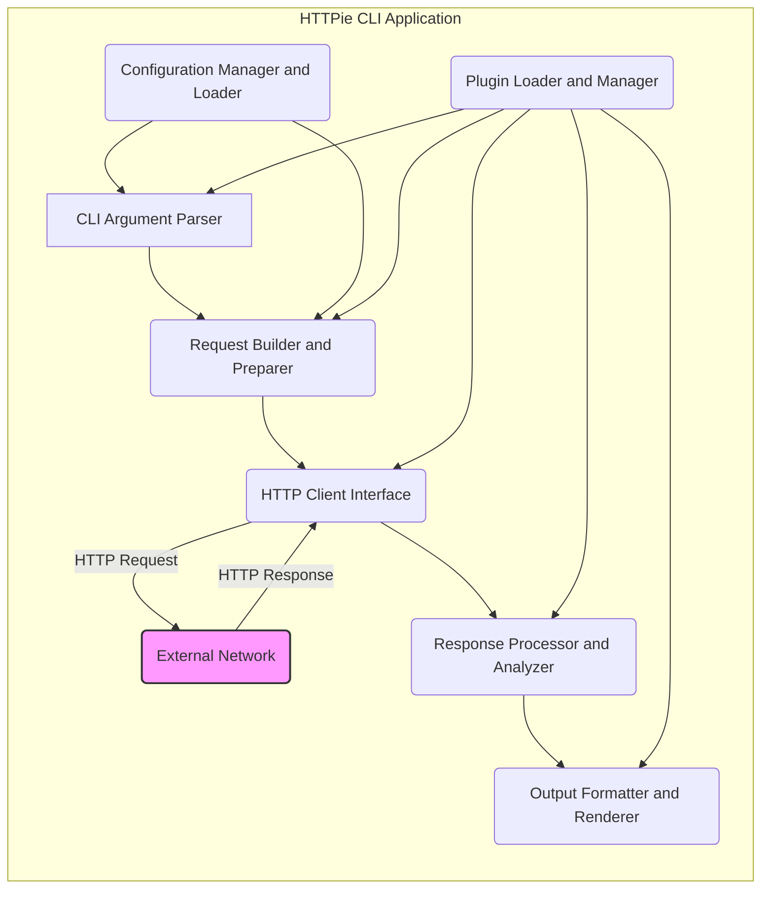
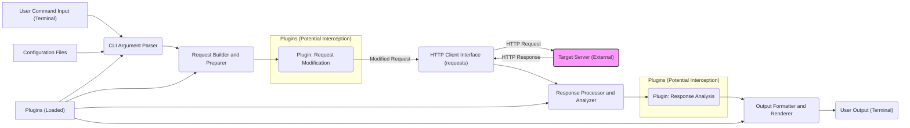

## Project Design Document: HTTPie CLI (Improved)

**1. Introduction**

This document provides an enhanced design overview of the HTTPie command-line HTTP client (referred to as "HTTPie" or "the application" throughout this document). This document is intended to serve as a robust foundation for future threat modeling activities. It outlines the key components, functionalities, and data flows within the application with a focus on security-relevant aspects.

**1.1. Project Overview**

HTTPie is a user-friendly, command-line HTTP client designed to make interacting with web services more intuitive and human-readable. It prioritizes ease of use with features like expressive syntax, formatted and colorized output, and built-in support for common HTTP functionalities.

**1.2. Goals of this Document**

*   Provide a comprehensive and detailed architectural overview of the HTTPie CLI, emphasizing security-relevant aspects.
*   Clearly identify key components, their responsibilities, and their interactions.
*   Thoroughly describe the primary functionalities and associated data flows, highlighting potential security implications.
*   Establish a clear and accurate understanding of the system's internal workings to facilitate effective threat modeling.

**2. System Architecture**

The HTTPie CLI application can be logically divided into the following interconnected components:

*   **Command-Line Interface (CLI) Argument Parser:** This is the entry point of the application. It's responsible for receiving and parsing the user's input from the command line. This includes identifying the HTTP method, target URL, request headers, data, authentication details, and various operational flags and options.
*   **Request Builder and Preparer:** Based on the parsed command-line arguments, this component constructs and prepares the HTTP request object. This involves:
    *   Setting the appropriate HTTP method (GET, POST, PUT, DELETE, etc.).
    *   Constructing the request URL.
    *   Adding specified headers.
    *   Encoding request data based on content type (e.g., JSON, form data).
    *   Handling file uploads by properly formatting multipart requests.
    *   Applying any configured authentication mechanisms.
*   **HTTP Client Interface:** This component acts as an abstraction layer over the underlying HTTP request library (primarily `requests`). It manages the actual transmission of the prepared HTTP request to the target server and the reception of the response. This includes handling:
    *   Establishing network connections.
    *   Managing TLS/SSL negotiation and certificate verification.
    *   Handling proxies if configured.
    *   Managing timeouts.
    *   Following redirects based on server responses.
*   **Response Processor and Analyzer:** Once the HTTP client receives a response from the server, this component processes and analyzes it. This involves:
    *   Parsing the HTTP status code.
    *   Extracting and storing response headers.
    *   Decoding the response body based on the `Content-Type` header.
    *   Potentially handling compressed responses.
*   **Output Formatter and Renderer:** This component is responsible for formatting the processed HTTP response into a user-friendly and readable format for display in the terminal. This includes:
    *   Colorizing output elements (status codes, headers, body).
    *   Presenting headers and body in a structured manner.
    *   Supporting different output formatting options (e.g., JSON pretty-printing, raw output).
*   **Configuration Manager and Loader:** This component handles the loading, management, and persistence of HTTPie's configuration settings. These settings can include:
    *   Default headers to include in every request.
    *   Authentication credentials for specific hosts.
    *   Proxy configurations.
    *   Output preferences.
    *   Plugin configurations.
*   **Plugin Loader and Manager:** HTTPie supports a plugin system that allows users to extend its functionality. This component is responsible for:
    *   Discovering and loading available plugins.
    *   Providing a mechanism for plugins to interact with HTTPie's core components.
    *   Managing plugin dependencies and potential conflicts.

**2.1. Component Interactions**

**3. Key Functionality**

The core functionality of HTTPie centers around facilitating the sending and receiving of HTTP requests and responses. Key functionalities include:

*   **Initiating HTTP Requests:**
    *   Support for all standard HTTP methods (GET, POST, PUT, DELETE, PATCH, OPTIONS, HEAD).
    *   Ability to specify arbitrary request headers via the command line.
    *   Flexible handling of request body data:
        *   Sending data as URL-encoded form data.
        *   Sending data as JSON.
        *   Sending raw data.
        *   Handling file uploads using multipart/form-data.
    *   Support for various authentication schemes:
        *   Basic Authentication.
        *   Digest Authentication.
        *   Token-based authentication (via headers).
        *   Extensibility for other authentication methods via plugins.
    *   Redirection handling (following HTTP redirects).
    *   Setting connection and read timeouts.
    *   Customizable User-Agent header.
*   **Managing Authentication Credentials:**
    *   Storing and retrieving credentials from configuration files.
    *   Providing mechanisms for secure credential input (e.g., prompting without echoing).
    *   Potentially integrating with system credential stores (depending on plugins).
*   **Processing and Displaying HTTP Responses:**
    *   Displaying the HTTP status code and reason phrase.
    *   Presenting response headers in a clear and organized manner.
    *   Formatting the response body based on its `Content-Type`:
        *   Pretty-printing JSON responses.
        *   Syntax highlighting for HTML and other text-based formats.
        *   Displaying raw content for binary data.
    *   Allowing users to save the response body to a file.
*   **Configuration and Customization:**
    *   Loading configuration settings from files (typically in the user's home directory).
    *   Setting default headers that are included in every request.
    *   Configuring proxy servers for outgoing requests.
    *   Customizing output formatting options.
    *   Managing and configuring plugins.
*   **Extensibility via Plugins:**
    *   Providing a well-defined API for plugin development.
    *   Allowing plugins to extend core functionality, such as adding new authentication methods, output formats, or request processing logic.

**4. Technology Stack**

*   **Primary Programming Language:** Python
*   **Core HTTP Request Library:** `requests` (responsible for making the actual HTTP requests and handling low-level network communication).
*   **Command-Line Argument Parsing:** `argparse` (or a similar library) for parsing and validating user input from the command line.
*   **Output Formatting and Styling:** Libraries for terminal output manipulation, such as `Pygments` for syntax highlighting and libraries for colorizing text.
*   **Configuration Management:** Standard Python libraries for file I/O and data serialization/deserialization (e.g., `json`, `yaml`, potentially `configparser`).
*   **Plugin System Implementation:** Likely utilizes Python's built-in import mechanisms and potentially a defined plugin interface or framework (e.g., using entry points).

**5. Deployment Model**

HTTPie is primarily deployed as a command-line tool installed directly on a user's local machine. Users interact with it through their terminal or command prompt.

*   **Installation Methods:** Typically installed using Python package managers like `pip`. It can also be packaged for various operating systems (e.g., via `apt`, `yum`, `brew`).
*   **Execution Environment:** Runs directly within the user's shell environment.
*   **Configuration Storage:** Configuration files are typically stored in a designated directory within the user's home directory (e.g., `.config/httpie`).

**6. Data Flow**

The typical data flow for an HTTP request initiated by HTTPie follows these steps:

1. **User Command Input:** The user enters a command in the terminal, specifying the target URL, HTTP method, headers, data, and any other relevant options.
2. **Command Parsing:** The CLI Argument Parser component parses the user's input, extracting and validating the provided arguments.
3. **Request Construction:** The Request Builder and Preparer component constructs the HTTP request object based on the parsed arguments, including setting the method, URL, headers, and body. Plugins might intercept and modify the request at this stage.
4. **HTTP Request Transmission:** The HTTP Client Interface utilizes the `requests` library to send the prepared HTTP request over the network to the target server. This involves establishing a connection, handling TLS/SSL, and potentially using configured proxies.
5. **HTTP Response Reception:** The HTTP Client Interface receives the HTTP response from the target server.
6. **Response Processing:** The Response Processor and Analyzer component parses the response, extracting the status code, headers, and body. Plugins might process or analyze the response at this stage.
7. **Output Formatting:** The Output Formatter and Renderer component formats the processed response data for display in the terminal, applying colorization and structure.
8. **Output Display:** The formatted response is displayed to the user in the terminal.

**6.1. Data Flow Diagram**

**7. Security Considerations (Detailed for Threat Modeling)**

This section expands on potential security considerations to provide a more detailed foundation for threat modeling activities.

*   **Command Injection:** Improper handling of user-supplied URLs, headers, or data could lead to command injection vulnerabilities if these inputs are directly used in system calls or shell commands (though less likely in HTTPie's core due to its use of libraries).
*   **HTTP Request Smuggling:** While HTTPie primarily uses the `requests` library, understanding how it constructs requests is important. Incorrect header construction or handling of transfer encodings could potentially lead to request smuggling if interacting with vulnerable backend servers.
*   **Server-Side Request Forgery (SSRF):** If HTTPie is used in an environment where it can be influenced to make requests to internal or restricted resources, SSRF vulnerabilities could arise. This is more relevant in scenarios where HTTPie's usage is automated or controlled by external factors.
*   **Insecure Credential Storage:** If authentication credentials are not stored securely in configuration files (e.g., plain text), they could be compromised. Proper encryption or use of system credential stores is crucial.
*   **Man-in-the-Middle (MITM) Attacks:** If HTTPS connections are not handled correctly (e.g., ignoring certificate validation errors), HTTPie could be vulnerable to MITM attacks, allowing attackers to intercept and modify communication.
*   **Dependency Vulnerabilities:** HTTPie relies on third-party libraries like `requests`. Vulnerabilities in these dependencies could directly impact HTTPie's security. Regular updates and security audits of dependencies are essential.
*   **Malicious Plugins:** The plugin system introduces a potential attack vector. Malicious plugins could:
    *   Exfiltrate sensitive data (credentials, request/response content).
    *   Perform unauthorized actions on the user's system.
    *   Introduce new vulnerabilities into HTTPie.
    *   Bypass security measures.
    Robust plugin sandboxing and security review processes are necessary.
*   **Output Redirection and Injection:** While primarily for display, if output formatting logic is flawed, it might be possible to inject malicious code or escape sequences into the terminal output, potentially leading to unintended consequences.
*   **Local File Inclusion/Exposure:** If HTTPie allows specifying local files as request bodies or for other purposes, vulnerabilities could arise if proper sanitization and access controls are not in place, potentially leading to the exposure of sensitive local files.
*   **Denial of Service (DoS):** While less likely to originate from HTTPie itself, improper handling of large responses or excessive redirects could potentially lead to resource exhaustion on the user's machine.

**8. Conclusion**

This improved design document provides a more detailed and security-focused overview of the HTTPie CLI application. It elaborates on the key components, their interactions, and the data flow, highlighting areas relevant to potential security vulnerabilities. The expanded security considerations section offers a more comprehensive starting point for conducting thorough threat modeling. This document serves as a valuable resource for security assessments, development planning, and ongoing maintenance of the HTTPie project.