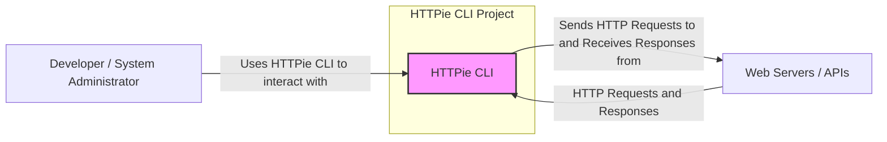
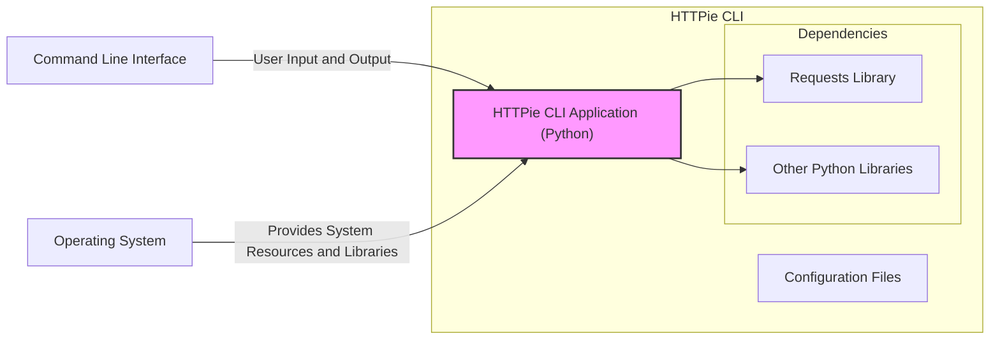
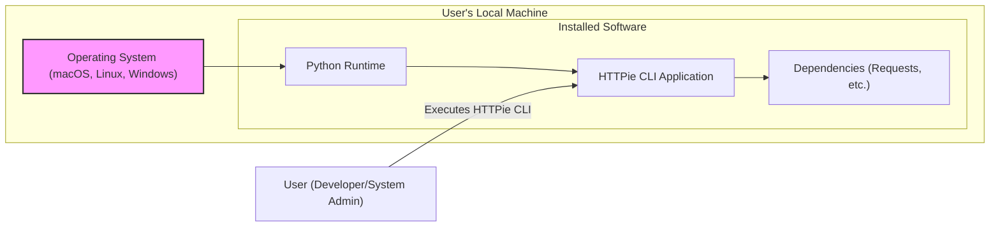

# BUSINESS POSTURE

- Business Priorities and Goals:
  - Provide a user-friendly command-line HTTP client that simplifies interaction with web services.
  - Enhance developer productivity by offering a more intuitive and feature-rich alternative to `curl`.
  - Maintain a widely adopted and actively developed open-source tool within the HTTPie project.
  - Support various HTTP methods, headers, data formats, and authentication schemes.
  - Ensure cross-platform compatibility (macOS, Linux, Windows).
- Business Risks:
  - Security vulnerabilities in HTTPie CLI could lead to exposure of sensitive data transmitted via HTTP requests.
  - Malicious actors could exploit vulnerabilities to compromise systems interacting with HTTPie CLI.
  - Reputational damage to the HTTPie project if the CLI tool is perceived as insecure.
  - Loss of user trust and adoption if security incidents occur.

# SECURITY POSTURE

- Existing Security Controls:
  - security control: HTTPS support for secure communication with web servers. Implemented via the `requests` library.
  - security control: Operating System level security features (e.g., process isolation, memory protection) of the environment where HTTPie CLI is executed.
  - security control: Dependency management using `pip` and `requirements.txt` to track and manage external libraries. Described in repository documentation and build scripts.
  - security control: Code review process through GitHub pull requests before merging changes into the main branch. Implemented via GitHub workflow.
- Accepted Risks:
  - accepted risk: Reliance on the security of underlying operating system and Python runtime environment.
  - accepted risk: Potential vulnerabilities in third-party libraries used by HTTPie CLI.
  - accepted risk: User misconfiguration or misuse of HTTPie CLI leading to insecure requests.
- Recommended Security Controls:
  - recommended security control: Implement input validation for URLs, headers, and request data to prevent injection attacks.
  - recommended security control: Secure handling of sensitive data such as API keys and authentication tokens, avoiding logging or displaying them unnecessarily.
  - recommended security control: Output sanitization to prevent information leakage or injection vulnerabilities when displaying responses.
  - recommended security control: Implement automated security scanning (SAST, dependency scanning) in the CI/CD pipeline.
  - recommended security control: Regularly update dependencies to patch known vulnerabilities.
- Security Requirements:
  - Authentication:
    - Requirement: Support various HTTP authentication methods (Basic, Bearer, Digest, etc.).
    - Requirement: Securely handle authentication credentials provided by users, avoiding storage in plain text in logs or configuration files.
    - Requirement: Allow users to manage and securely store authentication tokens or API keys if needed (consider integration with OS credential managers).
  - Authorization:
    - Requirement: HTTPie CLI itself does not implement authorization, but it must correctly handle and transmit authorization headers provided by users to web services.
    - Requirement: Ensure that HTTPie CLI does not bypass or weaken any authorization mechanisms implemented by target web services.
  - Input Validation:
    - Requirement: Validate user-provided URLs to prevent injection attacks (e.g., SSRF).
    - Requirement: Validate user-provided headers to prevent header injection vulnerabilities.
    - Requirement: Validate user-provided data to prevent injection attacks based on the content type (e.g., SQL injection if sending SQL queries, command injection if sending commands).
  - Cryptography:
    - Requirement: Enforce HTTPS by default for all requests where possible.
    - Requirement: Properly handle TLS/SSL certificates and ensure secure communication channels.
    - Requirement: Avoid implementing custom cryptography; rely on well-vetted libraries like `requests` and the Python standard library.

# DESIGN

## C4 CONTEXT

- Context Diagram Elements:
  - Element:
    - Name: Developer / System Administrator
    - Type: Person
    - Description: Users who utilize HTTPie CLI to send HTTP requests and inspect responses for development, testing, and system administration tasks.
    - Responsibilities: Using HTTPie CLI to interact with web services, providing necessary input like URLs, headers, and data.
    - Security controls: Responsible for securely handling sensitive data when using HTTPie CLI, such as not exposing API keys in public scripts.
  - Element:
    - Name: HTTPie CLI
    - Type: Software System
    - Description: Command-line HTTP client written in Python, designed for making HTTP requests to web servers and APIs.
    - Responsibilities: Constructing and sending HTTP requests based on user input, receiving and displaying HTTP responses, handling various HTTP features and authentication methods.
    - Security controls: Input validation, secure handling of credentials, output sanitization, HTTPS enforcement, dependency management.
  - Element:
    - Name: Web Servers / APIs
    - Type: Software System
    - Description: External web servers and APIs that HTTPie CLI interacts with by sending HTTP requests and receiving responses. These can be various types of web services, REST APIs, etc.
    - Responsibilities: Processing HTTP requests, providing HTTP responses, implementing their own security controls like authentication, authorization, and input validation.
    - Security controls: Web server security configurations, API authentication and authorization mechanisms, input validation on the server-side.

## C4 CONTAINER

- Container Diagram Elements:
  - Element:
    - Name: HTTPie CLI Application (Python)
    - Type: Application
    - Description: The core Python application that implements the HTTPie CLI functionality. It handles command-line argument parsing, request construction, response processing, and output formatting.
    - Responsibilities: Processing user commands, building HTTP requests, utilizing libraries for HTTP communication, displaying formatted responses, managing configuration.
    - Security controls: Input validation within the application logic, secure handling of credentials in memory, output sanitization before display, leveraging secure libraries.
  - Element:
    - Name: Requests Library
    - Type: Library
    - Description: A Python library used by HTTPie CLI to handle the low-level details of sending HTTP requests and receiving responses.
    - Responsibilities: Managing HTTP connections, handling TLS/SSL, sending requests, receiving responses, managing cookies and sessions.
    - Security controls: HTTPS implementation, TLS/SSL certificate verification, handling of secure connections, vulnerability patching by the library maintainers.
  - Element:
    - Name: Other Python Libraries
    - Type: Library
    - Description: Other Python libraries used by HTTPie CLI for various functionalities like JSON processing, syntax highlighting, and argument parsing.
    - Responsibilities: Providing specific functionalities to the HTTPie CLI application.
    - Security controls: Security depends on the specific libraries used; dependency scanning and regular updates are important.
  - Element:
    - Name: Configuration Files
    - Type: Configuration Data
    - Description: Files where HTTPie CLI stores user-specific configurations, such as default headers, profiles, and potentially session information.
    - Responsibilities: Persisting user preferences and settings.
    - Security controls: Secure storage of configuration files with appropriate permissions, avoiding storage of sensitive credentials in plain text within configuration files.
  - Element:
    - Name: Command Line Interface
    - Type: Interface
    - Description: The command-line interface through which users interact with HTTPie CLI, providing commands and receiving output.
    - Responsibilities: Accepting user input, displaying output from HTTPie CLI.
    - Security controls: Shell security, user access controls to the system.
  - Element:
    - Name: Operating System
    - Type: Infrastructure
    - Description: The underlying operating system (macOS, Linux, Windows) on which HTTPie CLI is executed, providing system resources and libraries.
    - Responsibilities: Providing runtime environment, system libraries, process isolation, memory management.
    - Security controls: OS-level security features, user access controls, system hardening.

## DEPLOYMENT

- Deployment Options:
  - Option 1: User's Local Machine (Common Deployment) - Users install HTTPie CLI on their personal computers using package managers like `pip`, `brew`, or `apt`.
  - Option 2: Containerized Deployment (e.g., Docker) - HTTPie CLI can be packaged into a Docker container for consistent execution across different environments.
  - Option 3: Server Environment (Less Common) - In some cases, HTTPie CLI might be used in server environments for scripting or automated tasks.

- Detailed Deployment (Option 1: User's Local Machine):

- Deployment Diagram Elements (Option 1: User's Local Machine):
  - Element:
    - Name: Operating System (macOS, Linux, Windows)
    - Type: Infrastructure
    - Description: The user's desktop or laptop operating system where HTTPie CLI is installed and executed.
    - Responsibilities: Providing the runtime environment, managing system resources, and providing basic security features.
    - Security controls: OS-level security features, user account controls, firewall, antivirus software (if applicable).
  - Element:
    - Name: Python Runtime
    - Type: Software
    - Description: The Python interpreter and standard library required to run the HTTPie CLI application.
    - Responsibilities: Executing Python code, providing core functionalities for HTTPie CLI.
    - Security controls: Keeping Python runtime updated with security patches, using virtual environments to isolate dependencies.
  - Element:
    - Name: HTTPie CLI Application
    - Type: Application
    - Description: The installed HTTPie CLI application files on the user's system, typically installed via `pip` or a system package manager.
    - Responsibilities: Providing the command-line HTTP client functionality.
    - Security controls: Software installation integrity (verified by package managers), application-level security controls.
  - Element:
    - Name: Dependencies (Requests, etc.)
    - Type: Libraries
    - Description: Python libraries that HTTPie CLI depends on, installed alongside the application.
    - Responsibilities: Providing specific functionalities required by HTTPie CLI.
    - Security controls: Dependency management, keeping dependencies updated, vulnerability scanning of dependencies.
  - Element:
    - Name: User (Developer/System Admin)
    - Type: Person
    - Description: The user who interacts with the deployed HTTPie CLI application on their local machine.
    - Responsibilities: Executing HTTPie CLI commands, managing their local environment.
    - Security controls: User awareness of security best practices, responsible use of command-line tools.

## BUILD

```mermaid
flowchart LR
    A["Developer"] -- "Code Changes, Commits, Pull Requests" --> B["GitHub Repository (Source Code)"]
    B -- "GitHub Actions Workflow (CI)" --> C["Build Environment (GitHub Actions Runners)"]
    C -- "Build Process (Linting, Testing, Packaging)" --> D["Build Artifacts (Distribution Packages)"]
    D -- "Publish to Package Registries (PyPI)" --> E["Package Registries (PyPI)"]
    E -- "Download and Install" --> F["User / System"]
    style C fill:#f9f,stroke:#333,stroke-width:2px
```

- Build Process Description:
  - Developer: Writes code, commits changes, and creates pull requests in the GitHub repository.
  - GitHub Repository (Source Code): Hosts the source code of HTTPie CLI, including Python files, tests, and build configurations.
  - GitHub Actions Workflow (CI): Automated CI/CD pipeline defined in GitHub Actions, triggered by code changes (pull requests, merges).
  - Build Environment (GitHub Actions Runners): Virtual machines or containers provided by GitHub Actions to execute the build process.
  - Build Process (Linting, Testing, Packaging):
    - Linting: Static code analysis to check for code style and potential issues.
    - Testing: Running unit tests and integration tests to ensure code functionality and quality.
    - Packaging: Creating distribution packages (e.g., wheels, source distributions) for different platforms.
  - Build Artifacts (Distribution Packages): Output of the build process, ready to be published and distributed.
  - Package Registries (PyPI): Python Package Index (PyPI) where HTTPie CLI packages are published for public access.
  - User / System: Users download and install HTTPie CLI packages from PyPI using `pip`.

- Build Security Controls:
  - security control: Source code hosted on GitHub with access control and version history. Implemented by GitHub platform.
  - security control: Code review process for pull requests before merging to main branch. Implemented via GitHub workflow.
  - security control: Automated linting and static analysis during build process to identify potential code quality and security issues. Implemented in GitHub Actions workflow.
  - security control: Automated unit and integration tests to ensure code functionality and prevent regressions. Implemented in GitHub Actions workflow.
  - security control: Dependency scanning during build process to identify known vulnerabilities in dependencies. Can be implemented using tools like `pip-audit` or GitHub Dependency Scanning.
  - security control: Secure build environment provided by GitHub Actions, with isolation and temporary runners. Implemented by GitHub Actions platform.
  - security control: Signing of packages (if implemented) to ensure integrity and authenticity of distribution packages.
  - security control: Publishing to trusted package registries like PyPI over HTTPS. Implemented by PyPI platform.

# RISK ASSESSMENT

- Critical Business Processes:
  - Secure interaction with web services and APIs is the primary critical process. This involves ensuring confidentiality, integrity, and availability of communication between users and web services via HTTPie CLI.
  - Maintaining the integrity and security of the HTTPie CLI software itself is crucial to prevent compromised versions from being distributed and used.
- Data Sensitivity:
  - Data transmitted via HTTPie CLI can include sensitive information such as:
    - Authentication credentials (API keys, tokens, usernames, passwords).
    - Personal data in request bodies or URLs.
    - Confidential business data exchanged with APIs.
    - Session cookies and other session-related data.
  - Sensitivity level depends on the specific use case and the data being handled. In many cases, data transmitted via HTTPie CLI should be considered confidential and require protection.

# QUESTIONS & ASSUMPTIONS

- Questions:
  - What is the intended user base's security awareness and maturity level? Are they primarily security-conscious developers or a broader range of users?
  - Are there specific compliance requirements (e.g., GDPR, HIPAA, PCI DSS) that HTTPie CLI needs to adhere to, or that its users need to consider when using it?
  - What are the most common use cases for HTTPie CLI in terms of data sensitivity and the types of web services it interacts with?
  - Are there any specific threat models or attack vectors that are considered high priority for HTTPie CLI?
  - What is the process for reporting and addressing security vulnerabilities in HTTPie CLI?

- Assumptions:
  - Users of HTTPie CLI are generally developers and system administrators who have some level of security awareness but may not be security experts.
  - HTTPie CLI is primarily used for development, testing, and debugging purposes, but it might also be used in some automated scripts or production-related tasks.
  - Users are responsible for using HTTPie CLI securely and handling sensitive data appropriately in their requests and configurations.
  - The open-source nature of HTTPie CLI allows for community scrutiny and contributions to security improvements.
  - The maintainers of HTTPie CLI are committed to addressing security vulnerabilities in a timely manner.