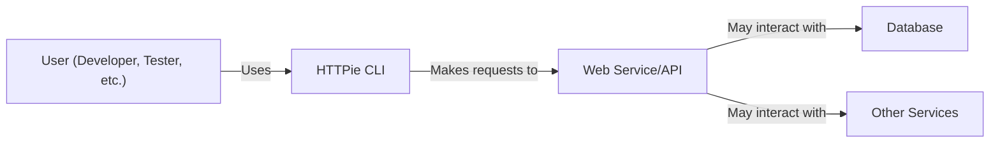
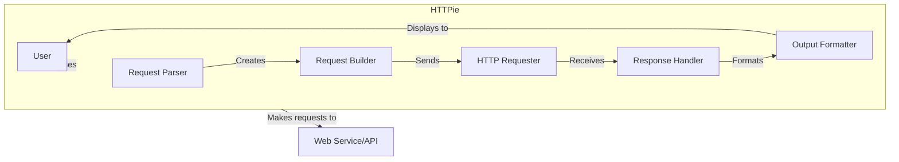
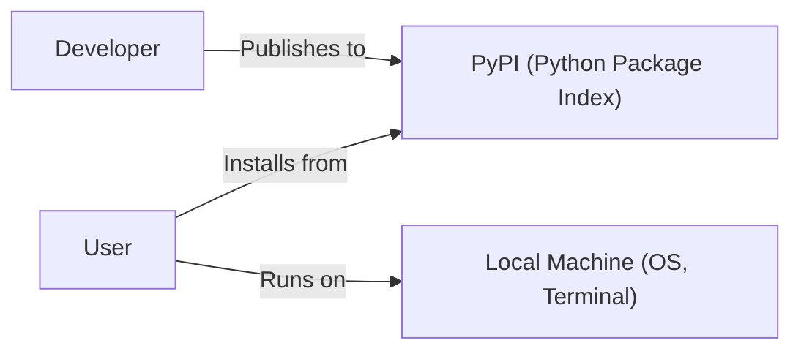
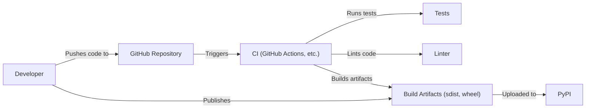

Okay, let's create a design document for the HTTPie CLI project, focusing on aspects relevant to threat modeling.

# BUSINESS POSTURE

HTTPie is a command-line HTTP client that simplifies interacting with web services.  It's designed to be user-friendly and intuitive, making API testing and debugging easier.  The project is open-source and widely used.

Priorities:

*   User Experience:  Maintain the ease of use and intuitive design that HTTPie is known for.
*   Accuracy: Ensure requests and responses are handled correctly, and data is presented accurately.
*   Community: Foster a strong and active open-source community.
*   Maintainability:  Keep the codebase clean, well-documented, and easy to contribute to.
*   Portability: Support a wide range of operating systems and environments.

Goals:

*   Provide a user-friendly command-line interface for interacting with HTTP services.
*   Simplify API testing and debugging.
*   Offer a modern alternative to traditional tools like `curl`.
*   Enable easy inspection of HTTP traffic.

Business Risks:

*   Reputational Damage:  Vulnerabilities or bugs that lead to incorrect data handling or security issues could damage the project's reputation and user trust.  This is particularly important as it's a tool used for interacting with potentially sensitive APIs.
*   Loss of User Base:  If the tool becomes unreliable or difficult to use, users may switch to alternatives.
*   Contribution Decline:  A poorly maintained or insecure codebase could discourage contributions from the open-source community.
*   Malicious Use: While HTTPie is a legitimate tool, it could be used for malicious purposes (e.g., scanning for vulnerabilities, launching attacks). While this isn't a direct risk to the project itself, it's a factor to consider.

# SECURITY POSTURE

Existing Security Controls:

*   security control: Code Reviews:  The project uses GitHub's pull request system, which inherently includes code review before merging changes. (Described in contribution guidelines on GitHub).
*   security control: Testing: The project has a comprehensive test suite, including unit and integration tests, to ensure functionality and prevent regressions. (Visible in the `tests/` directory on GitHub).
*   security control: Dependency Management:  Dependencies are managed using a package manager (likely `pip` with `requirements.txt` or `pyproject.toml`), allowing for updates and vulnerability patching. (Visible in project files on GitHub).
*   security control: Input Sanitization: HTTPie likely performs some level of input sanitization to prevent command injection or other injection vulnerabilities, given its nature as a command-line tool. (Needs further investigation in the codebase).
*   security control: Secure Defaults: HTTPie should be using secure defaults where applicable (e.g., preferring HTTPS, validating certificates by default). (Needs confirmation from codebase/documentation).
*   security control: Static Analysis: The project may be using static analysis tools, although this is not explicitly mentioned. (Needs confirmation).

Accepted Risks:

*   accepted risk: Third-Party Dependencies:  Like all projects, HTTPie relies on third-party libraries.  Vulnerabilities in these dependencies could pose a risk. This is mitigated by dependency management and regular updates.
*   accepted risk: User Misconfiguration:  Users could misconfigure HTTPie or use it insecurely (e.g., disabling certificate verification), leading to security issues. This is outside the direct control of the project.
*   accepted risk: Local Environment Security: The security of the user's local environment (operating system, terminal, etc.) is outside the scope of the HTTPie project itself.

Recommended Security Controls:

*   security control: Regular Security Audits: Conduct periodic security audits, both manual and automated, to identify potential vulnerabilities.
*   security control: SAST (Static Application Security Testing): Integrate SAST tools into the CI/CD pipeline to automatically scan for vulnerabilities during development.
*   security control: DAST (Dynamic Application Security Testing): While less applicable to a CLI tool, consider using DAST-like techniques to fuzz inputs and test for unexpected behavior.
*   security control: SCA (Software Composition Analysis): Use SCA tools to automatically identify and track vulnerabilities in third-party dependencies.
*   security control: Security Headers:  Ensure that HTTPie handles security-related HTTP headers correctly (e.g., HSTS, CSP) and potentially provides options for users to set them.
*   security control: Documentation: Clearly document security best practices for using HTTPie, including warnings about disabling security features.

Security Requirements:

*   Authentication:
    *   Support various authentication mechanisms (Basic, Digest, OAuth, API Keys, etc.).
    *   Securely store and manage credentials (e.g., avoid storing them in plain text).
    *   Provide clear guidance on how to use authentication securely.

*   Authorization:
    *   HTTPie itself doesn't handle authorization (this is the responsibility of the server), but it should correctly transmit authorization credentials provided by the user.

*   Input Validation:
    *   Sanitize user inputs to prevent command injection and other injection vulnerabilities.
    *   Validate URLs and other parameters to ensure they are well-formed.
    *   Handle potentially malicious input gracefully, without crashing or exposing sensitive information.

*   Cryptography:
    *   Use secure cryptographic libraries for HTTPS communication (TLS).
    *   Validate certificates by default.
    *   Provide options for users to customize TLS settings (e.g., specify trusted certificates) but with clear warnings about the security implications.
    *   If storing sensitive data (e.g., credentials), use appropriate encryption.

# DESIGN

## C4 CONTEXT

Element List:

*   Element:
    *   Name: User
    *   Type: Person
    *   Description: A person who uses HTTPie to interact with web services.
    *   Responsibilities: Provides input to HTTPie, interprets the output.
    *   Security controls: Uses strong passwords, keeps their system secure.

*   Element:
    *   Name: HTTPie CLI
    *   Type: Software System
    *   Description: The command-line HTTP client.
    *   Responsibilities: Parses user input, constructs and sends HTTP requests, receives and displays responses.
    *   Security controls: Input sanitization, secure defaults, dependency management, code reviews, testing.

*   Element:
    *   Name: Web Service/API
    *   Type: Software System
    *   Description: The web service or API that HTTPie interacts with.
    *   Responsibilities: Receives and processes requests from HTTPie, returns responses.
    *   Security controls: Authentication, authorization, input validation, rate limiting, etc. (responsibility of the web service itself).

*   Element:
    *   Name: Database
    *   Type: Software System
    *   Description: A database that the Web Service/API may interact with.
    *   Responsibilities: Storing and retrieving data.
    *   Security controls: Access control, encryption at rest and in transit, etc. (responsibility of the database and web service).
*   Element:
    *   Name: Other Services
    *   Type: Software System
    *   Description: Other services that Web Service/API may interact with.
    *   Responsibilities: Varies depending on the service.
    *   Security controls: Varies depending on the service.

## C4 CONTAINER

Since HTTPie is a CLI tool, the container diagram is essentially an extension of the context diagram.

Element List:

*   Element:
    *   Name: Request Parser
    *   Type: Component
    *   Description: Parses command-line arguments and options.
    *   Responsibilities: Interprets user input, validates syntax.
    *   Security controls: Input sanitization.

*   Element:
    *   Name: Request Builder
    *   Type: Component
    *   Description: Constructs the HTTP request based on parsed input.
    *   Responsibilities: Sets headers, body, method, etc.
    *   Security controls: Handles authentication credentials securely.

*   Element:
    *   Name: HTTP Requester
    *   Type: Component
    *   Description: Sends the HTTP request and receives the response.
    *   Responsibilities: Handles network communication, TLS.
    *   Security controls: Certificate validation, secure connection handling.

*   Element:
    *   Name: Response Handler
    *   Type: Component
    *   Description: Processes the HTTP response.
    *   Responsibilities: Parses headers, status code, body.
    *   Security controls: Handles potentially malicious responses safely.

*   Element:
    *   Name: Output Formatter
    *   Type: Component
    *   Description: Formats the response for display to the user.
    *   Responsibilities: Presents data in a user-friendly way.
    *   Security controls: Handles potentially malicious output safely (e.g., escaping HTML).
* Elements User and Web Service/API are described in C4 CONTEXT section.

## DEPLOYMENT

HTTPie is typically installed via package managers like `pip` (for Python packages) or system package managers (e.g., `apt`, `brew`). It can also be run from source.

Possible Deployment Solutions:

1.  Installation via `pip`: This is the most common method for Python packages.
2.  Installation via system package managers:  Distributions often package HTTPie for their users.
3.  Running from source:  Users can clone the repository and run HTTPie directly.
4.  Containers (Docker): HTTPie could be packaged in a Docker container for isolated execution.

Chosen Deployment Solution (pip):

Element List:

*   Element:
    *   Name: Developer
    *   Type: Person
    *   Description: The developer who publishes the package.
    *   Responsibilities: Builds and uploads the package to PyPI.
    *   Security controls: Uses strong passwords, two-factor authentication for PyPI account.

*   Element:
    *   Name: PyPI
    *   Type: Software System
    *   Description: The Python Package Index.
    *   Responsibilities: Hosts Python packages.
    *   Security controls: PyPI's own security measures (outside the scope of this document).

*   Element:
    *   Name: User
    *   Type: Person
    *   Description: The user who installs and runs HTTPie.
    *   Responsibilities: Installs HTTPie using `pip`.
    *   Security controls: Uses a secure environment, keeps their system up-to-date.

*   Element:
    *   Name: Local Machine
    *   Type: Infrastructure Node
    *   Description: The user's local machine (operating system, terminal).
    *   Responsibilities: Runs the HTTPie CLI.
    *   Security controls: Operating system security, user account security (outside the direct scope of HTTPie).

## BUILD

HTTPie's build process likely involves:

1.  Code is written and tested locally by developers.
2.  Changes are pushed to the GitHub repository.
3.  Continuous Integration (CI) runs (e.g., using GitHub Actions, Travis CI, or similar). This typically includes:
    *   Running the test suite.
    *   Linting the code.
    *   Potentially building documentation.
    *   Potentially creating release artifacts (e.g., source distributions, wheels).
4.  Release artifacts are published to PyPI.

Security Controls in Build Process:

*   security control: Code Reviews:  Mandatory code reviews before merging to the main branch.
*   security control: Automated Testing:  Comprehensive test suite run on every commit.
*   security control: Linting:  Static code analysis to enforce coding standards and identify potential issues.
*   security control: CI/CD:  Automated build and testing pipeline to ensure consistency and prevent manual errors.
*   security control: (Recommended) SAST: Integrate static application security testing tools into the CI pipeline.
*   security control: (Recommended) SCA: Integrate software composition analysis tools to track dependencies and vulnerabilities.

# RISK ASSESSMENT

Critical Business Processes:

*   Accurate HTTP communication: The core function of HTTPie is to send and receive HTTP requests and responses accurately. Any failure in this process is critical.
*   User-friendly interaction: HTTPie's ease of use is a key differentiator. Degradation of the user experience would be a significant risk.
*   Reliable operation: The tool must be reliable and stable, avoiding crashes or unexpected behavior.

Data Sensitivity:

*   Request Data:  May include sensitive information such as API keys, authentication tokens, and user data being sent to APIs. Sensitivity: HIGH
*   Response Data:  May include sensitive information returned from APIs, such as user data, financial information, or internal system details. Sensitivity: HIGH
*   Configuration Files: May store credentials or other sensitive information. Sensitivity: HIGH
*   No other data is stored or processed by the tool itself.

# QUESTIONS & ASSUMPTIONS

Questions:

*   What specific static analysis tools are currently used (if any)?
*   Are there any existing security audits or penetration testing reports?
*   What is the exact process for managing and updating dependencies?
*   What are the specific input validation mechanisms in place?
*   How are credentials (e.g., for authentication) handled and stored?
*   Is there a documented security policy or secure development lifecycle?
*   Is there a process for handling security vulnerabilities reported by users or researchers?

Assumptions:

*   BUSINESS POSTURE: Assumes a relatively high risk tolerance given it's an open-source project, but a strong emphasis on user trust and reputation.
*   SECURITY POSTURE: Assumes basic security practices are in place (code reviews, testing), but there's room for improvement with more advanced security tooling.
*   DESIGN: Assumes a relatively straightforward design typical of a CLI tool, with clear separation of concerns between parsing, request building, execution, and output formatting. Assumes deployment via `pip` as the primary method. Assumes a standard CI/CD pipeline is used for building and testing.