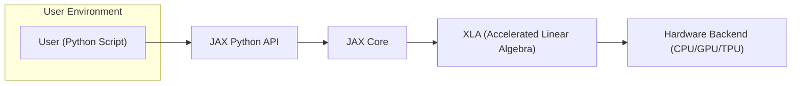

# Project Design Document: JAX for Threat Modeling

**Version:** 1.1
**Date:** October 26, 2023
**Author:** AI Software Architect

## 1. Introduction

This document provides a detailed architectural overview of the JAX project, as found on the GitHub repository [https://github.com/google/jax](https://github.com/google/jax). This document is specifically designed to facilitate subsequent threat modeling activities. It outlines the key components, data flows, and interactions within the JAX ecosystem, highlighting potential areas of interest for security analysis.

## 2. System Architecture

JAX is a Python library designed for high-performance numerical computing, particularly in machine learning research. It provides composable transformations of Python+NumPy programs, enabling automatic differentiation, just-in-time compilation to various hardware backends (CPU, GPU, TPU), and parallel execution.

### 2.1. High-Level Architecture Diagram

### 2.2. Component Descriptions

| Component                     | Description