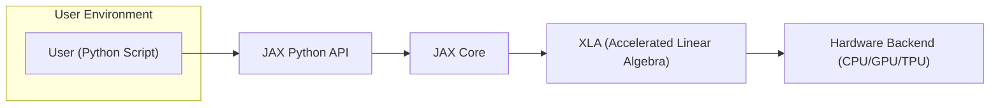
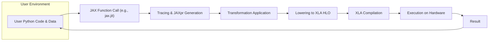

# Project Design Document: JAX for Threat Modeling

**Version:** 1.1
**Date:** October 26, 2023
**Author:** AI Software Architect

## 1. Introduction

This document provides an enhanced architectural overview of the JAX project, as found on the GitHub repository [https://github.com/google/jax](https://github.com/google/jax). This document is specifically tailored to facilitate thorough threat modeling activities. It details the key components, data flows, and interactions within the JAX ecosystem, with a strong emphasis on identifying potential areas of security concern and attack surfaces. This document aims to provide the necessary context for security professionals to effectively analyze and mitigate potential risks associated with JAX.

## 2. System Architecture

JAX is a powerful Python library enabling high-performance numerical computing, particularly within machine learning research. Its core strength lies in providing composable transformations of standard Python and NumPy programs. These transformations include automatic differentiation, just-in-time (JIT) compilation targeting diverse hardware backends (CPU, GPU, TPU), and mechanisms for parallel execution. Understanding this architecture is crucial for identifying potential vulnerabilities at different stages of computation.

### 2.1. High-Level Architecture Diagram

### 2.2. Component Descriptions

*   **User (Python Script):** Represents the end-user developing and executing Python code that leverages the JAX library. This code typically involves numerical computations using a syntax closely resembling NumPy, augmented by JAX's powerful transformation functions. This is the primary point of interaction and a potential source of malicious input.
*   **JAX Python API:** This serves as the primary programmatic interface for interacting with JAX. It exposes functions for array manipulation, linear algebra operations, random number generation, and, critically, the transformation functions such as `jax.grad` (automatic differentiation), `jax.jit` (JIT compilation), `jax.vmap` (vectorization), and `jax.pmap` (parallel execution). Vulnerabilities here could expose core functionalities.
*   **JAX Core:** This is the central processing unit of JAX, responsible for interpreting and transforming the user's Python code. Key functionalities include:
    *   **Tracing:**  The process of symbolically executing Python code to construct an intermediate representation known as JAXpr. This involves capturing the operations and data flow without executing the actual numerical computations initially. Flaws in the tracing logic could lead to misinterpretations of user code.
    *   **Transformation Logic:** Implements the core algorithms for applying transformations. This involves manipulating the JAXpr to represent the desired transformation (e.g., adding nodes for gradient calculations). Bugs in these transformation implementations could lead to incorrect or insecure code generation.
    *   **Lowering:** The process of converting the high-level JAXpr into a lower-level representation suitable for the XLA compiler. This involves platform-specific considerations and optimizations. Vulnerabilities could arise during this translation.
*   **XLA (Accelerated Linear Algebra):** A domain-specific compiler designed for optimizing linear algebra computations across various hardware backends. JAX relies heavily on XLA to compile the transformed JAXpr into highly efficient machine code. As a complex compiler, XLA itself is a potential target for vulnerabilities.
*   **Hardware Backend (CPU/GPU/TPU):** Represents the physical hardware where the compiled code is ultimately executed. JAX's ability to target different backends through XLA allows for performance optimization. The security of the interaction between XLA and these backends is crucial.

## 3. Data Flow

The typical data flow within a JAX application proceeds through these stages:

*   **User Input:** The user authors a Python script incorporating JAX functions and data structures, typically NumPy arrays or JAX arrays. This input can be a source of malicious data or code.
*   **Function Call & Transformation:** When a JAX transformation function (e.g., `jax.jit`) is applied to a user-defined function, JAX initiates the tracing process to understand the underlying computations.
*   **Tracing and JAXpr Generation:** JAX's tracer symbolically executes the user's function, recording the operations performed on abstract values. This results in the creation of a JAXpr, a graph-based representation of the computation. The integrity of this process is vital.
*   **Transformation Application:** Based on the specific transformation requested (e.g., `jax.grad`), JAX manipulates the JAXpr to incorporate the necessary modifications (e.g., adding nodes for gradient calculations). Errors in this step could lead to unexpected behavior.
*   **Lowering to XLA HLO:** The transformed JAXpr is then translated into XLA's High-Level Optimizer (HLO) representation. HLO is a platform-independent representation of the computation, facilitating optimization before backend-specific compilation.
*   **XLA Compilation:** XLA takes the HLO and compiles it into optimized machine code tailored to the target hardware backend (CPU, GPU, or TPU). This involves numerous optimization passes that could potentially introduce or mask vulnerabilities.
*   **Execution on Hardware:** The compiled machine code is executed on the designated hardware backend, processing the actual numerical data. The security of this execution environment is paramount.
*   **Result Return:** The results of the computation are returned to the user's Python script.

### 3.1. Data Flow Diagram

## 4. Key Components for Threat Modeling

These components are particularly critical for threat modeling due to their direct involvement in processing user input, performing transformations, and interacting with the underlying hardware, making them potential points of vulnerability:

*   **JAX Python API:** As the primary entry point for user interaction, vulnerabilities within the API could allow for malicious code injection, arbitrary code execution, or information disclosure. Input validation and sanitization at this level are crucial.
*   **JAX Core (Tracer):** The tracing mechanism interprets user-provided Python code and converts it into an internal representation (JAXpr). Flaws in the tracer's logic could lead to misinterpretations of the code, allowing malicious code to bypass security checks or cause unexpected behavior during compilation or execution.
*   **JAX Core (Transformation Logic):** Bugs or vulnerabilities in the implementation of transformations like `jax.jit` or `jax.grad` could lead to the generation of incorrect or insecure compiled code. This could result in unexpected behavior, data corruption, or even exploitable vulnerabilities at the hardware level.
*   **XLA Compiler:** As a complex compiler, XLA itself may contain vulnerabilities that could be exploited by carefully crafted JAX code designed to trigger specific compiler bugs. This could lead to arbitrary code execution within the compilation process or on the target hardware.
*   **Hardware Backend Interface:** The interface between XLA and the specific hardware backend (CPU, GPU, TPU) represents a potential attack surface. Vulnerabilities in the drivers or the communication protocols could be exploited to gain unauthorized access or control over the hardware. Trust boundaries at this level need careful consideration.
*   **Dependencies (e.g., NumPy, LLVM):** JAX relies on external libraries like NumPy and LLVM. Security vulnerabilities in these dependencies could indirectly affect JAX, potentially allowing attackers to exploit known flaws in these underlying components.

## 5. Security Considerations

Based on the architecture and data flow, several key security considerations emerge:

*   **Code Injection Vulnerabilities:**  If user-provided code or data can manipulate the tracing or compilation process in unintended ways, it could lead to code injection vulnerabilities, allowing attackers to execute arbitrary code within the JAX environment or on the underlying hardware.
*   **Data Poisoning Attacks:** Malicious actors might attempt to inject crafted data designed to cause incorrect computations, manipulate the training of machine learning models, or compromise the integrity of the results produced by JAX applications.
*   **Denial of Service (DoS) Potential:** Carefully crafted JAX programs could be designed to consume excessive computational resources (CPU, memory, GPU/TPU time) during tracing, compilation, or execution, leading to denial-of-service attacks that disrupt the availability of JAX applications.
*   **Information Disclosure Risks:** Vulnerabilities in the compilation or execution process could potentially leak sensitive information, such as intermediate computation results, model parameters, or even data from the underlying system.
*   **Supply Chain Security Concerns:** The security of JAX's dependencies (e.g., XLA, NumPy, LLVM) is paramount. Compromised dependencies could introduce vulnerabilities that are difficult to detect and exploit. Regular security audits and dependency management are essential.
*   **Trust Boundary Violations:** The boundary between the Python environment and the compiled code executed by XLA represents a critical trust boundary. Improper handling of data or control flow across this boundary could introduce vulnerabilities, allowing attackers to bypass security mechanisms.
*   **Hardware Security Implications:** The security of the underlying hardware (CPU, GPU, TPU) and its associated drivers directly impacts the overall security of JAX applications. Exploiting hardware vulnerabilities could compromise the integrity and confidentiality of JAX computations.

## 6. Potential Threats (More Specific Examples)

This section provides a more concrete list of potential threats, linking them to specific architectural elements and providing examples:

*   **Malicious Python Code Exploiting JAX Transformations:** A user could craft Python code that, when processed by JAX transformations like `jax.jit`, leads to the generation of machine code with unintended side effects or vulnerabilities on the target hardware. For example, exploiting a bug in the JIT compilation of a specific numerical operation.
*   **Exploiting Vulnerabilities in XLA Compilation:** An attacker could craft specific JAX programs designed to trigger known or zero-day vulnerabilities within the XLA compiler. This could lead to arbitrary code execution during the compilation process, potentially compromising the build environment or the target system.
*   **Data Injection Attacks Targeting JAX Computations:** Injecting carefully crafted numerical data that exploits numerical instability or vulnerabilities in JAX's or XLA's handling of specific data types. This could lead to incorrect model training, biased results, or even system crashes.
*   **Resource Exhaustion through JAX Program Construction:** Creating JAX programs with extremely complex computation graphs that consume excessive memory or CPU time during the tracing or compilation phases, effectively causing a denial of service.
*   **Side-Channel Attacks on Hardware through JAX Execution:** Exploiting timing differences, power consumption variations, or other side channels during the execution of JAX code on specific hardware to infer sensitive information about the computation or the data being processed.
*   **Compromised Dependencies Introducing Vulnerabilities:** If a dependency like NumPy or LLVM has a known vulnerability, and JAX uses the vulnerable functionality, an attacker could exploit this vulnerability through JAX. Regular dependency updates and security scanning are crucial.
*   **Exploiting Weaknesses in Custom XLA Operations:** If a user defines custom operations that are integrated with XLA, vulnerabilities in these custom operations could be exploited to bypass JAX's security mechanisms.

## 7. Technologies Used

*   **Python:** The primary programming language for JAX development and user interaction.
*   **NumPy:**  A fundamental dependency for array manipulation and numerical operations.
*   **XLA (Accelerated Linear Algebra):** The core compiler infrastructure for optimizing JAX computations.
*   **Protocol Buffers:** Likely used for internal communication and data serialization within XLA and potentially between JAX components.
*   **LLVM:** XLA is built upon the LLVM compiler infrastructure, inheriting its strengths and potential vulnerabilities.
*   **CUDA/ROCm/TPU SDKs:**  Used for interacting with specific hardware accelerators (NVIDIA GPUs, AMD GPUs, Google TPUs). The security of these SDKs is also relevant.

## 8. Deployment Considerations

The security implications of deploying JAX applications vary depending on the environment:

*   **Local Machines:** Running JAX applications locally exposes them to the security posture of the user's machine. Malware or compromised user accounts could potentially interact with and exploit JAX applications.
*   **Cloud Environments (e.g., Google Cloud, AWS, Azure):** Deploying JAX in the cloud introduces concerns about network security, access control, and the security of the cloud provider's infrastructure. Proper configuration of security groups, IAM roles, and network policies is essential.
*   **Edge Devices:** Deploying JAX on edge devices, which may have limited resources and physical security, presents unique challenges. Secure boot, device authentication, and secure communication protocols become critical.
*   **Web Services:** Exposing JAX applications as web services introduces vulnerabilities related to web application security, such as injection attacks, cross-site scripting (XSS), and authentication/authorization issues.

Understanding the specific deployment context is crucial for tailoring threat modeling efforts and implementing appropriate security controls.

This enhanced document provides a more detailed and security-focused overview of the JAX architecture. It serves as a valuable resource for conducting thorough threat modeling exercises and identifying potential vulnerabilities within the JAX ecosystem.