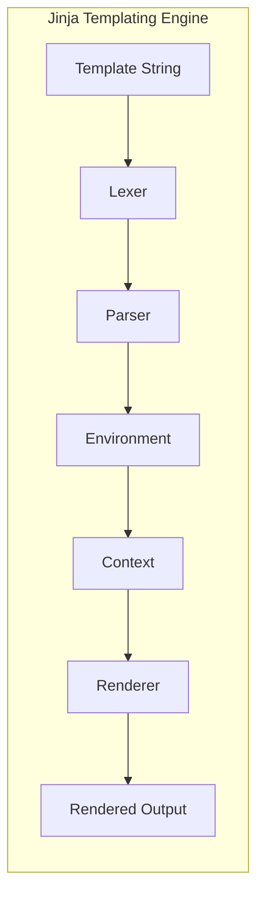

## Project Design Document: Jinja Templating Engine

**1. Introduction**

This document outlines the design of the Jinja templating engine, a flexible and powerful template language for Python. It aims to provide a clear understanding of the system's architecture, components, and data flow, which will be crucial for subsequent threat modeling activities. This document focuses on the core functionality of Jinja as a templating engine and does not delve into specific integrations with web frameworks or other external libraries.

**2. Goals and Objectives**

The primary goals of Jinja are:

* Separation of Concerns: Enable developers to separate application logic from presentation logic.
* Readability and Maintainability: Provide a syntax that is easy to read and understand, facilitating easier maintenance of templates.
* Extensibility: Allow developers to extend the template language with custom filters, tests, and globals.
* Security: Provide mechanisms to mitigate common security vulnerabilities associated with template rendering.
* Performance: Offer efficient template rendering capabilities.

**3. System Architecture**

The core of Jinja can be broken down into several key components that work together to process templates and generate output.

**3.1. High-Level Architecture**

**3.2. Component Description**

* **Lexer:**
    * **Responsibility:**  Tokenizes the input template string, breaking it down into a stream of meaningful units (tokens) like variables, literals, operators, and control flow keywords.
    * **Input:** Template String
    * **Output:** Stream of Tokens
* **Parser:**
    * **Responsibility:**  Consumes the stream of tokens from the lexer and constructs an Abstract Syntax Tree (AST). The AST represents the hierarchical structure of the template and the relationships between its elements.
    * **Input:** Stream of Tokens
    * **Output:** Abstract Syntax Tree (AST)
* **Environment:**
    * **Responsibility:**  A central registry and configuration point for Jinja. It manages template loading, caching, and provides access to filters, tests, globals, and other configuration settings. It also plays a role in the compilation of templates.
    * **Input:** Configuration settings, template loader
    * **Output:** Compiled templates (cached), access to filters, tests, globals
* **Context:**
    * **Responsibility:**  A dictionary-like object that holds the data passed to the template during rendering. This data is used to populate variables and evaluate expressions within the template.
    * **Input:** User-provided data (variables, objects, etc.)
    * **Output:**  Data accessible during template rendering
* **Renderer:**
    * **Responsibility:**  Traverses the AST, evaluates expressions and control structures based on the provided context, and generates the final output string. It interacts with the context to retrieve data and applies filters and tests as defined in the template.
    * **Input:** Abstract Syntax Tree (AST), Context
    * **Output:** Rendered Output String

**4. Data Flow**

The process of rendering a Jinja template involves the following data flow:

* **Template Loading:** The Jinja `Environment` uses a configured `TemplateLoader` to locate and load the template string from a specified source (e.g., filesystem, database, in-memory string).
* **Lexing:** The `Lexer` processes the loaded template string, breaking it down into a stream of tokens.
* **Parsing:** The `Parser` consumes the token stream and constructs the Abstract Syntax Tree (AST), representing the template's structure.
* **Compilation (Implicit):**  The `Environment` often implicitly compiles the AST into an internal representation (e.g., bytecode) for more efficient rendering. This step might be cached for subsequent uses of the same template.
* **Context Preparation:** The application code provides data (variables, objects, etc.) which is organized into a `Context` object. This context is passed to the `render` function.
* **Rendering:** The `Renderer` takes the compiled template (or AST) and the `Context` as input. It iterates through the template structure, evaluating expressions, accessing data from the context, applying filters, and generating the final output string.

**5. Security Considerations**

Jinja incorporates several features and considerations related to security:

* **Sandboxed Execution:** Jinja templates are executed in a sandboxed environment, limiting access to potentially dangerous Python built-in functions and modules. This helps mitigate the risk of arbitrary code execution through template injection.
* **Autoescaping:** Jinja provides autoescaping functionality to automatically escape HTML characters in variables when rendering for HTML contexts. This is a crucial defense against Cross-Site Scripting (XSS) vulnerabilities. The escaping strategy can be configured (e.g., HTML, XML, JavaScript).
* **Whitespace Control:** Jinja offers mechanisms to control whitespace handling in templates. While not directly a security feature, consistent whitespace management can improve readability and reduce the likelihood of subtle errors that might have security implications in specific contexts.
* **Template Inheritance:**  Template inheritance promotes code reuse and consistency. By defining a base template with secure defaults, developers can reduce the risk of introducing vulnerabilities in individual templates.
* **Filters and Tests:**
    * **Built-in:** Jinja provides a set of built-in filters and tests that are generally considered safe.
    * **Custom:**  Developers can create custom filters and tests. However, poorly written custom filters or tests can introduce security vulnerabilities if they perform unsafe operations or expose sensitive information.
* **Server-Side Template Injection (SSTI):**
    * **Mitigation:** Jinja's sandboxed environment is the primary defense against SSTI. It restricts access to dangerous functions and attributes.
    * **Risk:** If user-controlled input is directly embedded into a template string without proper sanitization, attackers might still be able to exploit vulnerabilities within the sandboxed environment or through the available filters and tests. Careful handling of user input and avoiding direct template string manipulation are crucial.
* **Information Disclosure:**  Careless use of template features or exposing too much data in the context can lead to unintended information disclosure. Developers should be mindful of what data is being rendered in templates.
* **Denial of Service (DoS):**  Complex or deeply nested templates, or templates with computationally expensive filters, could potentially be used to cause a denial of service by consuming excessive server resources.

**6. Assumptions and Constraints**

* **Python Environment:** Jinja is designed to operate within a Python environment.
* **Template Syntax:** Templates are written according to the Jinja template syntax rules.
* **User-Provided Data:** The security of the rendered output heavily depends on the trustworthiness and proper sanitization of the data provided in the context by the application. Jinja's autoescaping helps, but it's not a complete solution.
* **Configuration:** Security-related settings like autoescaping are configurable. The effectiveness of these features relies on proper configuration by the developer.
* **Template Loaders:** The security of the template loading process depends on the implementation of the `TemplateLoader` being used. For example, loading templates from untrusted sources could introduce risks.

**7. Future Considerations (Out of Scope for Initial Threat Model)**

While not directly relevant for the initial threat model focusing on the core engine, future considerations might include:

* **Integration with specific web frameworks (e.g., Flask, Django):** These integrations introduce additional layers of complexity and potential attack surfaces that would need separate threat modeling.
* **Asynchronous rendering:**  Future versions might explore asynchronous rendering capabilities, which could introduce new concurrency-related security considerations.
* **Advanced security features:**  Potential enhancements to the sandboxing mechanism, more granular control over permissions within the template environment, or tighter integration with Content Security Policy (CSP) mechanisms.
