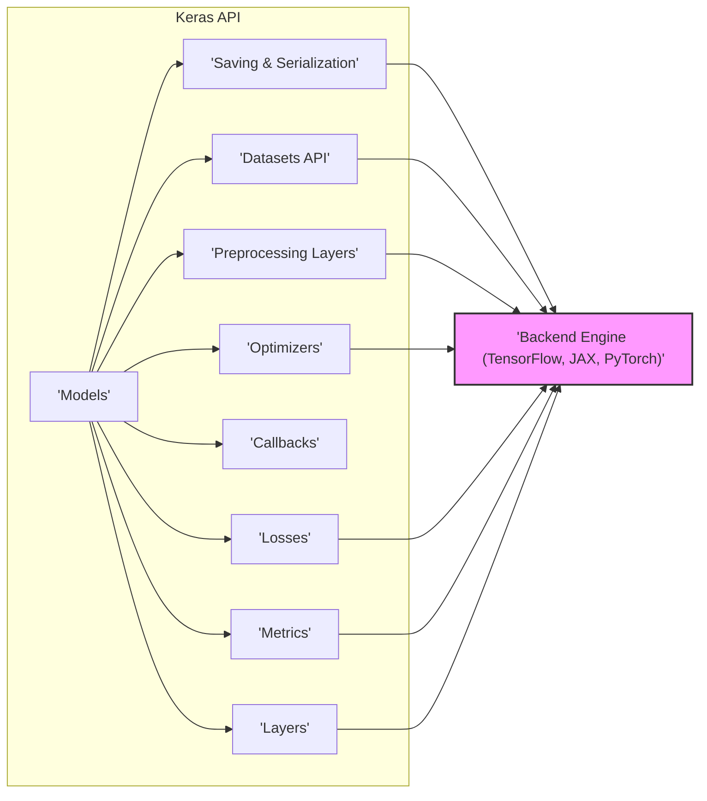
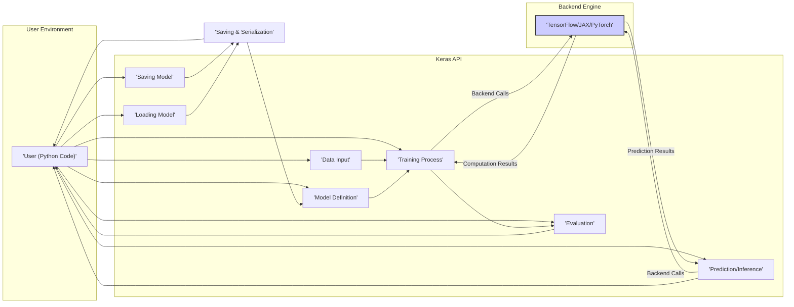

# Project Design Document: Keras

**Version:** 1.1
**Date:** October 26, 2023
**Author:** AI Software Architect

## 1. Introduction

This document provides a refined high-level architectural design of the Keras library, focusing on aspects relevant for threat modeling. It outlines the key components, their interactions, and data flows within the system. This document will serve as the foundation for subsequent threat modeling activities.

## 2. Goals

*   Provide a clear and concise overview of the Keras architecture.
*   Identify key components and their responsibilities.
*   Describe the data flow within the Keras library.
*   Highlight potential areas of interest for security analysis, including trust boundaries.

## 3. Scope

This document covers the core architectural design of the Keras library as represented in the provided GitHub repository. It focuses on the logical components and their interactions, rather than the specific implementation details of individual functions or classes. The scope includes:

*   The core Keras API and its main modules.
*   The interaction between Keras and its backend engines (TensorFlow, JAX, PyTorch).
*   The lifecycle of a Keras model (definition, training, evaluation, inference, saving, and loading).

This document does *not* cover:

*   The internal implementation details of the backend engines.
*   Specific details of individual Keras layers or optimizers beyond their general function.
*   The Keras Tuner or other related projects.
*   Detailed deployment aspects of Keras models, although general deployment contexts are considered.

## 4. Target Audience

This document is intended for:

*   Security engineers and architects involved in threat modeling the Keras library or systems utilizing Keras.
*   Software architects and developers seeking a high-level understanding of the Keras architecture with a security focus.

## 5. Architectural Overview

Keras is a high-level neural networks API, written in Python and capable of running on top of various lower-level backends such as TensorFlow, JAX, and PyTorch. It provides a user-friendly interface for building, training, evaluating, and deploying machine learning models.

The core of Keras can be viewed as an abstraction layer that simplifies the process of working with neural networks, regardless of the underlying computational backend. Users interact with the Keras API to define model architectures, configure training processes, and perform inference. Keras then translates these high-level operations into the specific instructions required by the chosen backend. This abstraction introduces a trust boundary between the Keras API and the backend engine.

## 6. Component Diagram

**Components:**

*   **Keras API:** The primary interface for users to interact with Keras. This component operates within the user's Python environment.
    *   **Models:** Represent the neural network architecture, defining the flow of data through layers.
    *   **Layers:** The building blocks of neural networks, performing specific transformations on input data.
    *   **Optimizers:** Algorithms used to update the model's weights during training.
    *   **Losses:** Functions used to measure the difference between predicted and actual values.
    *   **Metrics:** Functions used to evaluate the performance of the model.
    *   **Callbacks:** Functions that can be applied at different stages of the training process (e.g., saving checkpoints, early stopping).
    *   **Datasets API:** Provides utilities for handling and processing data.
    *   **Preprocessing Layers:** Layers that perform data preprocessing operations within the model.
    *   **Saving & Serialization:** Mechanisms for saving and loading model architectures and weights.
*   **Backend Engine (TensorFlow, JAX, PyTorch):** The underlying computational framework that performs the actual numerical computations. This component represents a trust boundary, as Keras relies on its correct and secure operation.

## 7. Data Flow Diagram

**Data Flow Description:**

1. **Model Definition:** The user defines the model architecture using the Keras API (Layers, Models). This happens within the user's Python environment.
2. **Data Input:** The user provides training, validation, and test data to the Keras API. This data originates from the user's environment.
3. **Training Process:**
    *   Keras orchestrates the training process, feeding data to the model.
    *   Keras translates the high-level training operations into backend-specific instructions.
    *   **Trust Boundary:** Keras makes calls to the Backend Engine to perform computations.
    *   The Backend Engine performs the actual computations (forward and backward passes).
    *   Model weights are updated based on the optimizer and loss function within the Backend Engine.
    *   Computation results are returned to Keras.
4. **Evaluation:** The user evaluates the trained model using evaluation data. Keras uses the Backend Engine to compute metrics.
5. **Prediction/Inference:** The user provides new data to the trained model for prediction.
    *   **Trust Boundary:** Keras makes calls to the Backend Engine for inference.
    *   The Backend Engine performs the inference.
    *   Prediction results are returned to Keras.
6. **Saving Model:** The user can save the trained model's architecture and weights using Keras's saving mechanisms. This often involves serialization within the Keras API.
7. **Loading Model:** The user can load a previously saved model, reconstructing its architecture and weights. This involves deserialization within the Keras API.

## 8. Trust Boundaries

The primary trust boundary within the Keras architecture lies between the **Keras API** and the **Backend Engine**.

*   **Keras API:**  Operates within the user's Python environment. It is responsible for orchestrating model building, training, and inference by making calls to the backend.
*   **Backend Engine (TensorFlow, JAX, PyTorch):**  A separate computational framework that Keras relies upon. Keras trusts the backend to perform computations correctly and securely. Vulnerabilities within the backend could potentially be exploited through Keras.

Another implicit trust boundary exists between the **User's Code/Data** and the **Keras API**. Keras assumes that the user provides valid and safe data and model definitions.

## 9. Security Considerations (Areas for Threat Modeling)

Based on the architecture, data flow, and identified trust boundaries, the following areas are potential points of interest for threat modeling:

*   **Serialization and Deserialization of Models:**
    *   **Risk:** Maliciously crafted model files could potentially execute arbitrary code during the loading process (deserialization vulnerabilities). This is a significant concern as model files can be shared or obtained from untrusted sources.
    *   **Considerations:** What serialization formats are supported (e.g., HDF5, SavedModel)? How are these formats parsed? Are there known vulnerabilities associated with these formats? Does Keras implement any safeguards against malicious payloads during deserialization?
*   **Interaction with Backend Engines:**
    *   **Risk:** Vulnerabilities in the backend engines (TensorFlow, JAX, PyTorch) could be exploited through Keras. Keras relies on the security of these underlying frameworks.
    *   **Considerations:** How does Keras interact with the backend API? Are the calls made by Keras to the backend secure? Does Keras properly handle errors or exceptions returned by the backend? Are there any known vulnerabilities in the specific backend versions supported by Keras?
*   **Custom Layers and Callbacks:**
    *   **Risk:** User-defined custom layers or callbacks execute within the Keras environment and could contain malicious code, potentially leading to code execution or information disclosure.
    *   **Considerations:** How are custom layers and callbacks implemented and executed? Does Keras provide any mechanisms for sandboxing or validating custom code? What permissions do custom layers and callbacks have within the Keras environment?
*   **Data Input and Preprocessing:**
    *   **Risk:** Malicious or malformed input data could potentially cause unexpected behavior, denial-of-service, or even vulnerabilities within Keras or the backend.
    *   **Considerations:** How is input data validated and sanitized by Keras? Are there vulnerabilities in the built-in preprocessing layers that could be exploited with crafted input? How does Keras handle different data types and formats?
*   **Dependency Management:**
    *   **Risk:** Vulnerabilities in Keras's dependencies (including the backend engines and other Python packages) could be exploited if not properly managed and updated.
    *   **Considerations:** How are dependencies managed? Does the Keras project utilize dependency pinning? Are there processes for vulnerability scanning and updating dependencies?
*   **Code Injection through Model Definition:**
    *   **Risk:** In scenarios where model definitions are dynamically generated or loaded from untrusted sources (e.g., through configuration files or network requests), there's a potential for code injection if not handled carefully.
    *   **Considerations:** How are model architectures defined and parsed? Are there any risks associated with dynamically creating models based on external input? Are there safeguards against injecting malicious code through model configuration?

## 10. Dependencies

Keras relies on the following major dependencies:

*   **Backend Engines:**
    *   TensorFlow
    *   JAX
    *   PyTorch
*   **Core Python Libraries:**
    *   Python (the core language)
    *   NumPy (for numerical computations)
    *   SciPy (for scientific and technical computing)
*   **Serialization Libraries:**
    *   H5py (for working with HDF5 files, often used for saving models)
    *   Potentially others depending on the chosen saving format.
*   **Other Supporting Libraries:** As specified in the project's dependency management files (e.g., `requirements.txt`, `setup.py`).

## 11. Deployment Considerations (Out of Scope for Detailed Analysis, but Relevant for Context)

While the detailed deployment of Keras models is outside the scope of this document, understanding common deployment scenarios is important for contextualizing potential threats:

*   **Local Machines:** Running directly on a user's computer, often for development or experimentation. Security risks here are primarily related to the user's local environment.
*   **Web Services:** Integrated into web applications, exposing models through APIs. This introduces network-based attack vectors and the need for secure API design.
*   **Mobile Devices:** Using frameworks like TensorFlow Lite or Keras Core, often with resource constraints and specific security considerations for mobile platforms.
*   **Cloud Platforms:** Deployed on cloud infrastructure, leveraging cloud security features but also introducing cloud-specific vulnerabilities.

## 12. Future Considerations

Potential future changes to the Keras architecture that could impact security include:

*   **New Backend Integrations:** Adding support for new backend engines would introduce new trust boundaries and potential interaction vulnerabilities.
*   **Evolution of Serialization Formats:** Changes to how models are saved and loaded could introduce new deserialization vulnerabilities or require updates to existing security measures.
*   **New Features and APIs:** Introduction of new functionalities, especially those involving external data sources or code execution, might introduce new attack surfaces.
*   **Integration with WebAssembly or other cross-platform technologies:** This could introduce new security considerations related to those platforms.

This document provides a more detailed and refined understanding of the Keras architecture for threat modeling purposes, explicitly highlighting trust boundaries and expanding on potential security considerations. Further analysis will involve deeper dives into specific components and their interactions to identify and mitigate potential security risks.
