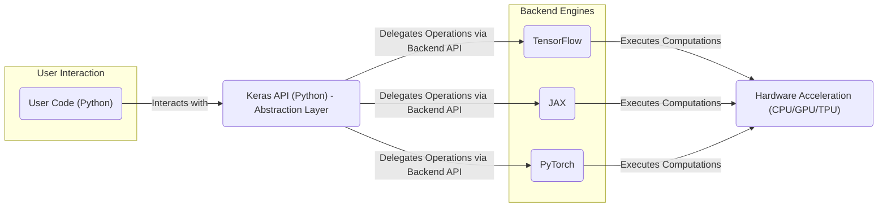
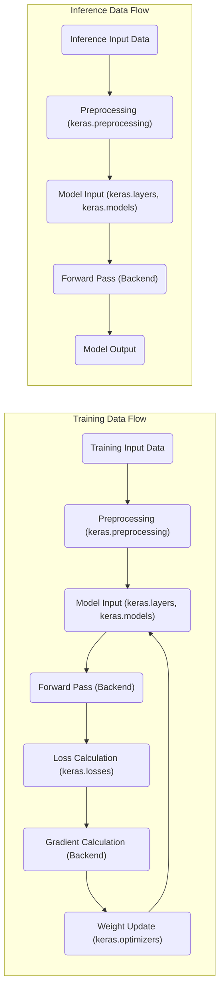

# Project Design Document: Keras

**Version:** 1.1
**Date:** October 26, 2023
**Prepared By:** AI Software Architect

## 1. Introduction

This document provides an enhanced design overview of the Keras project, an open-source Python library that offers a high-level API for building and training neural networks. Keras acts as a user-friendly interface to various backend deep learning frameworks, including TensorFlow, JAX, and PyTorch, abstracting away their complexities. This refined document aims to provide a clearer and more detailed understanding of the system's architecture, serving as a robust foundation for subsequent threat modeling activities.

## 2. Goals

The core objectives of the Keras project are to:

* **Provide a user-friendly and accessible API:**  Simplify the process of building and experimenting with neural networks.
* **Enable rapid prototyping and experimentation:**  Facilitate quick iteration and testing of different model architectures.
* **Support a wide range of neural network architectures:**  Accommodate convolutional, recurrent, and transformer-based models, as well as custom combinations.
* **Offer seamless execution across diverse hardware:**  Run efficiently on CPUs, GPUs, and TPUs without requiring significant code changes.
* **Be highly extensible and customizable:**  Allow users to easily add custom layers, metrics, losses, and other components.
* **Maintain backend agnosticism:**  Provide a consistent API regardless of the underlying deep learning framework being used.
* **Foster a strong and supportive community:** Encourage contributions and provide comprehensive documentation.

## 3. High-Level Architecture

Keras employs a layered architecture, providing a clear separation between the user-facing API and the backend computational engines. This abstraction is a key design principle.

**Description:**

* **User Interaction:** Represents developers and data scientists writing Python code to define, train, evaluate, and deploy machine learning models using the Keras API.
* **Keras API (Python) - Abstraction Layer:** This is the central component of Keras, offering a high-level, intuitive interface. It handles model definition, training loops, and evaluation procedures, abstracting away the specific implementation details of the backend frameworks.
* **Backend Engines:** These are the underlying computational frameworks responsible for performing the low-level tensor operations, automatic differentiation, and graph execution. Keras supports multiple backends, allowing users to choose the one that best suits their needs.
* **Hardware Acceleration (CPU/GPU/TPU):**  Represents the hardware resources utilized by the backend engines to accelerate computations, significantly speeding up training and inference.

## 4. Detailed Component Breakdown

The Keras library is composed of several interconnected modules, each responsible for specific functionalities:

* **Core Model Building Blocks:**
    * **`keras.layers`:**  A comprehensive collection of neural network layers (e.g., Dense, Conv2D, LSTM, Embedding, Attention). Each layer implements a specific transformation on the input data.
    * **`keras.models`:** Defines how layers are assembled into functional models.
        * **`Sequential`:**  For creating linear stacks of layers.
        * **Functional API:**  Provides a more flexible way to create complex models with shared layers and multiple inputs/outputs.
        * **Model Subclassing:**  Allows for highly customized model implementations by overriding the `call` method.
* **Model Training and Evaluation:**
    * **`keras.optimizers`:** Implements various optimization algorithms (e.g., Adam, SGD, RMSprop) used to update model weights during training.
    * **`keras.losses`:**  Defines different loss functions (e.g., MeanSquaredError, CategoricalCrossentropy) to measure the discrepancy between predicted and actual values.
    * **`keras.metrics`:** Provides functions to evaluate model performance (e.g., Accuracy, Precision, Recall, AUC).
    * **`keras.callbacks`:** Enables the execution of specific actions at different stages of the training process (e.g., `ModelCheckpoint`, `EarlyStopping`, `TensorBoard`).
* **Data Handling and Preprocessing:**
    * **`keras.datasets`:**  Includes utilities for loading common benchmark datasets.
    * **`keras.preprocessing`:** Offers tools for preparing data for model training:
        * **`image`:**  Image data generators and utilities.
        * **`text`:**  Text tokenization and sequence processing tools.
        * **`sequence`:** Utilities for padding and manipulating sequences.
* **Backend Abstraction:**
    * **`keras.backend`:**  Provides a unified interface to the underlying backend framework, allowing Keras to run on different engines without significant code changes. This handles low-level tensor operations and computations.
* **Model Sharing and Deployment:**
    * **`keras.applications`:**  Contains pre-trained models (e.g., ResNet, Inception, MobileNet) that can be used for transfer learning or feature extraction.
    * **`keras.saving`:**  Provides functionalities for saving and loading Keras models and their weights in various formats (e.g., SavedModel, HDF5).
* **Utilities and Tools:**
    * **`keras.utils`:**  Includes various utility functions for tasks like one-hot encoding, model visualization, and data manipulation.
* **Experimental Features:**
    * **`keras.experimental`:**  Contains modules for new and experimental features that are not yet part of the stable API.

## 5. Data Flow (Training and Inference)

The flow of data through a Keras model differs slightly between training and inference.

**Description:**

* **Training Data Flow:**
    * **Training Input Data:** The dataset used to train the model.
    * **Preprocessing:**  Data is prepared and transformed.
    * **Model Input:** Preprocessed data is fed into the model.
    * **Forward Pass:** Data propagates through the model's layers.
    * **Loss Calculation:** The difference between predictions and actual values is calculated.
    * **Gradient Calculation:** The gradients of the loss with respect to model weights are computed.
    * **Weight Update:** Optimizer adjusts model weights to minimize the loss.
* **Inference Data Flow:**
    * **Inference Input Data:** New, unseen data for which predictions are needed.
    * **Preprocessing:** Data is prepared similarly to training data.
    * **Model Input:** Preprocessed data is fed into the trained model.
    * **Forward Pass:** Data propagates through the model's layers using the learned weights.
    * **Model Output:** The model produces predictions based on the input data.

## 6. Key Technologies

* **Primary Programming Language:** Python
* **Core Numerical Libraries:** NumPy, potentially SciPy
* **Backend Deep Learning Frameworks:** TensorFlow, JAX, PyTorch
* **Data Manipulation and Analysis (Optional):** Pandas, scikit-learn
* **Hardware Acceleration Libraries:** CUDA (for NVIDIA GPUs), ROCm (for AMD GPUs), specific libraries for TPUs.
* **Model Serialization Formats:** HDF5, Protocol Buffers (for SavedModel)
* **Visualization Tools (Optional):** Matplotlib, Seaborn, TensorBoard

## 7. Deployment Models

Keras models can be deployed in a variety of environments and platforms:

* **Local Execution:** Running models directly on a user's workstation or server (CPU, GPU, or TPU).
* **Cloud-Based Deployment:**
    * **Managed Services:** Utilizing cloud platforms like AWS SageMaker, Google Cloud AI Platform (Vertex AI), Azure Machine Learning.
    * **Containerization:** Deploying models within Docker containers on platforms like Kubernetes, AWS ECS, Google Cloud Run, Azure Container Instances.
    * **Serverless Functions:** Deploying models as serverless functions using services like AWS Lambda, Google Cloud Functions, Azure Functions.
* **Web Applications:** Integrating Keras models into web applications using frameworks like Flask, Django, or FastAPI, often served via REST APIs.
* **Mobile and Edge Devices:**
    * **TensorFlow Lite:**  Optimized for on-device inference on mobile and embedded systems.
    * **TensorFlow.js:**  Running models directly in web browsers using JavaScript.
    * **Other Edge Deployment Solutions:**  Utilizing platform-specific tools for deploying on edge devices.
* **Embedded Systems:** Deploying models on resource-constrained embedded systems using specialized libraries and hardware.

## 8. Security Considerations (Initial Assessment)

This section provides an initial assessment of potential security considerations related to the Keras project. This will be further explored during dedicated threat modeling sessions.

* **Supply Chain Security:**
    * **Dependency Vulnerabilities:** Keras relies on numerous third-party libraries. Vulnerabilities in these dependencies could be exploited. Regular dependency scanning and updates are crucial.
    * **Malicious Packages:**  The risk of malicious packages being introduced into the dependency chain.
* **Backend Framework Security:**  Keras inherits the security posture of its underlying backend frameworks (TensorFlow, JAX, PyTorch). Vulnerabilities in these frameworks could directly impact Keras applications.
* **Model Security:**
    * **Adversarial Attacks:** Trained Keras models are susceptible to adversarial attacks (e.g., evasion attacks, poisoning attacks, model extraction).
    * **Model Confidentiality:**  Protecting trained models from unauthorized access and reverse engineering is important.
* **Data Security:**
    * **Training Data Integrity and Confidentiality:** Ensuring the security and integrity of the data used to train Keras models is critical. Data breaches or manipulation can lead to compromised models.
    * **Inference Data Security:** Protecting the data used for making predictions.
* **Serialization and Deserialization Vulnerabilities:**  Loading untrusted or maliciously crafted saved models could lead to arbitrary code execution. Secure model loading practices are essential.
* **User Input Validation:** When Keras models are integrated into applications, proper validation and sanitization of user inputs are crucial to prevent injection attacks and other vulnerabilities.
* **Access Control and Authentication:**  Implementing appropriate access controls for models, training data, and deployment environments is necessary to prevent unauthorized access and modification.
* **Code Injection:**  Potential vulnerabilities in custom layers, callbacks, or other user-defined components that could allow for code injection.
* **Denial of Service (DoS) Attacks:**  Consideration of how Keras applications might be vulnerable to DoS attacks, especially during inference.

## 9. Assumptions and Constraints

* **Ongoing Development and Maintenance:** It is assumed that the Keras project and its supported backend frameworks are actively developed and maintained, with security patches being released regularly.
* **Open Source Community:** Keras benefits from the scrutiny and contributions of a large open-source community, which can aid in identifying and addressing security vulnerabilities.
* **User Awareness and Best Practices:** Users are expected to follow secure development practices when using Keras, including managing dependencies, validating inputs, and securing their environments.
* **Backend Framework Compatibility:**  The design assumes compatibility and proper integration with the supported backend frameworks.
* **No Inherent Security Mechanisms:** Keras itself does not implement specific security mechanisms like encryption or authentication. These are typically handled at the application or infrastructure level.

This improved design document provides a more detailed and structured overview of the Keras project, enhancing its value as a foundation for comprehensive threat modeling activities.