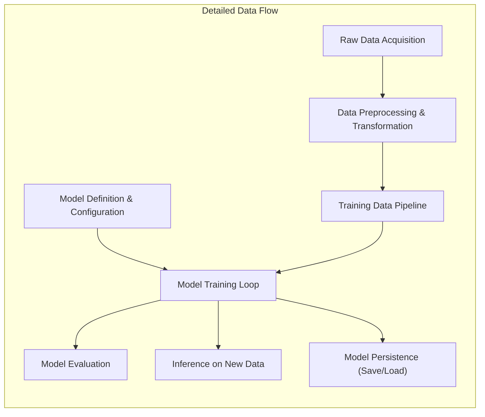

# Project Design Document: Keras (Improved)

**Version:** 1.1
**Date:** October 26, 2023
**Author:** AI Architecture Expert

## 1. Introduction

This document provides an enhanced architectural design of the Keras project, an open-source neural network library written in Python. This iteration aims to offer a more granular and precise understanding of the system's components, their interactions, and the flow of data, specifically tailored for effective threat modeling.

Keras serves as a high-level, user-friendly API for constructing and training neural network models. Its key strength lies in its ability to abstract away the complexities of underlying numerical computation backends like TensorFlow, PyTorch, and JAX. This allows developers to concentrate on the design and experimentation of model architectures without needing deep expertise in the specifics of each backend.

## 2. Goals and Objectives

* **Deliver a refined and more detailed architectural blueprint of the Keras project.** This includes a deeper dive into the responsibilities of individual components and the nuances of their interactions.
* **Provide a clearer and more comprehensive illustration of the data flow within the Keras ecosystem.** This will enhance the understanding of how data is processed, transformed, and utilized throughout the model's lifecycle, from inception to deployment.
* **Sharpen the focus on areas critical for security analysis and threat modeling.** By providing a more detailed architectural understanding, we can more effectively pinpoint potential vulnerabilities and delineate potential attack vectors.
* **Serve as an even more robust and accessible reference document for a wider range of stakeholders, including developers, security analysts, and operations teams.** The document aims for clarity and sufficient detail to be valuable across different roles.

## 3. System Architecture

The Keras architecture is structured in distinct layers and components, each with specific responsibilities:

* **User Interaction Layer (Python API):** This is the primary interface through which users interact with Keras. It exposes a rich set of Python APIs for:
    * Defining neural network layers (e.g., `Dense`, `Conv2D`, `LSTM`).
    * Constructing model graphs using the Sequential API, Functional API, or by subclassing the `Model` class.
    * Configuring the training process by specifying optimizers (e.g., `Adam`, `SGD`), loss functions (e.g., `MeanSquaredError`, `CategoricalCrossentropy`), and evaluation metrics (e.g., `Accuracy`, `Precision`).
    * Training models using methods like `fit()`.
    * Evaluating model performance on held-out datasets using methods like `evaluate()`.
    * Generating predictions on new data using methods like `predict()`.
* **Keras Core Abstraction Layer:** This layer embodies the core logic and abstractions of Keras, providing a backend-agnostic interface for model building and training. Key components include:
    * **`Layer` Class:** The fundamental building block for creating neural network layers, encapsulating state (weights) and computation (forward pass).
    * **`Model` Class:** Represents a complete neural network, composed of interconnected layers. It handles training, evaluation, and prediction logic.
    * **Optimizers (in `keras.optimizers`):** Implement various optimization algorithms used to update model weights during training.
    * **Loss Functions (in `keras.losses`):** Define the objective function that the optimizer aims to minimize.
    * **Metrics (in `keras.metrics`):** Functions used to evaluate the performance of the model.
    * **Callbacks (in `keras.callbacks`):** Utilities that allow users to customize the training loop, such as saving checkpoints, early stopping, and logging.
    * **Regularizers (in `keras.regularizers`):** Techniques to prevent overfitting by adding penalties to the loss function.
    * **Initializers (in `keras.initializers`):** Define how the initial values of model weights are set.
    * **Constraints (in `keras.constraints`):** Mechanisms to enforce constraints on the values of model weights.
* **Backend Agnostic Interface:** This crucial layer provides an abstraction that shields the Keras Core from the specifics of the underlying numerical computation libraries. It defines a set of tensor operations that all supported backends must implement.
* **Numerical Computation Backends:** These are the libraries that perform the heavy lifting of tensor computations required for training and inference. The backend in use is typically configured globally or per-model. Supported backends include:
    * **TensorFlow (via `tensorflow.keras`):** A comprehensive machine learning framework offering both high-level and low-level APIs.
    * **PyTorch (via `torch.nn` and related modules when using a Keras-like API wrapper):** Another leading machine learning framework known for its flexibility and dynamic computation graphs.
    * **JAX (via libraries like `flax.linen` or `haiku` when used with a Keras-like approach):** A high-performance numerical computation library with automatic differentiation capabilities, often leveraging XLA compilation for acceleration.
    * **NumPy (limited direct backend support, primarily used for data manipulation):** While not a primary deep learning backend, Keras can utilize NumPy arrays for certain operations.
* **Hardware Acceleration Layer:** The backend engines can leverage specialized hardware accelerators to significantly speed up computations:
    * **CPUs (Central Processing Units):** General-purpose processors used for a wide range of computations.
    * **GPUs (Graphics Processing Units):** Highly parallel processors well-suited for the matrix operations involved in deep learning.
    * **TPUs (Tensor Processing Units):** Custom-designed hardware accelerators developed by Google specifically for machine learning workloads.
* **Data Handling Utilities:** Keras provides and integrates with various utilities for efficient data management:
    * **`tf.data.Dataset` (when using TensorFlow backend):** A powerful API for building complex input pipelines.
    * **`torch.utils.data.DataLoader` (when using PyTorch backend):** Provides utilities for loading and batching data.
    * **NumPy arrays:** Commonly used for in-memory data representation.
    * **Pandas DataFrames:** Useful for data manipulation and analysis before feeding into models.

```mermaid
graph LR
    subgraph "User Environment"
        A["User Python Code"]
    end
    subgraph "Keras Architecture"
        B["Keras API (Python)"]
        C["Keras Core Abstraction"]
        D["Backend Agnostic Interface"]
    end
    subgraph "Backend Engines"
        E["TensorFlow"]
        F["PyTorch"]
        G["JAX"]
        H["NumPy (Data Handling)"]
    end
    subgraph "Hardware"
        I["CPU"]
        J["GPU"]
        K["TPU"]
    end
    subgraph "Data Sources"
        L["Files (e.g., CSV, Images)"]
        M["Databases"]
        N["Network Streams"]
    end

    A --> B
    B --> C
    C --> D
    D --> E
    D --> F
    D --> G
    D -.-> H  <!-- NumPy primarily for data -->
    E --> I
    E --> J
    E --> K
    F --> I
    F --> J
    G --> I
    G --> K
    L --> A
    M --> A
    N --> A
```

## 4. Data Flow (Detailed)

The data flow within a Keras project can be broken down into more specific stages:

* **Data Acquisition and Loading:**
    * Users retrieve raw data from diverse sources, including local files (CSV, images, text), databases (SQL, NoSQL), or network streams (APIs, sensors).
    * Keras integrates with backend-specific data loading utilities (e.g., `tf.data.Dataset` for TensorFlow) or relies on libraries like NumPy and Pandas for initial data handling.
* **Data Preprocessing and Transformation:**
    * Raw data undergoes transformations to prepare it for model training. This involves:
        * **Cleaning:** Handling missing values, outliers, and inconsistencies.
        * **Normalization/Scaling:** Adjusting the range of numerical features (e.g., Min-Max scaling, standardization).
        * **Categorical Encoding:** Converting categorical variables into numerical representations (e.g., one-hot encoding, label encoding).
        * **Text Processing:** Tokenization, stemming, and vectorization for text data.
        * **Image Processing:** Resizing, cropping, and augmentation for image data.
    * Keras provides `Preprocessing` layers that can be integrated directly into the model architecture for streamlined preprocessing.
* **Model Definition and Configuration:**
    * Users define the neural network architecture by instantiating and connecting Keras layers.
    * The model is configured by selecting an optimizer, loss function, and evaluation metrics.
* **Training Data Pipeline:**
    * Preprocessed data is organized into batches and fed into the model during training.
    * Backend-specific data loaders handle efficient data loading and batching, often leveraging techniques like prefetching and shuffling.
* **Model Training Loop:**
    * The core of the learning process, involving iterative updates to the model's weights:
        * **Forward Pass:** Input data propagates through the network, producing predictions.
        * **Loss Calculation:** The loss function compares the predictions with the true labels, quantifying the error.
        * **Backward Pass (Backpropagation):** Gradients of the loss with respect to the model's weights are calculated.
        * **Weight Update:** The optimizer uses the gradients to adjust the model's weights, aiming to minimize the loss.
    * Callbacks are invoked at various stages of the training loop (e.g., at the start/end of epochs or batches) to perform actions like saving checkpoints or logging metrics.
* **Model Evaluation Phase:**
    * The trained model's performance is assessed on a held-out validation or test dataset.
    * Evaluation metrics are computed to gauge the model's generalization ability.
* **Inference (Prediction) on New Data:**
    * Once trained, the model can be used to make predictions on new, unseen data.
    * The input data undergoes the same preprocessing steps as the training data.
* **Model Persistence (Saving and Loading):**
    * The trained model's architecture and learned weights can be saved to disk in various formats (e.g., SavedModel, HDF5).
    * Saved models can be loaded later for further training, evaluation, or deployment.



## 5. Key Components and Interactions (Enhanced)

This section provides a more detailed look at the interactions between key components:

* **User Python Code invokes Keras API functions:** Users interact with Keras by calling functions exposed by the Python API (e.g., `model.add()`, `model.compile()`, `model.fit()`).
* **Keras API translates user requests into operations on Keras Core abstractions:** API calls are mapped to actions on core components like `Layer` instances, `Model` instances, and optimizer objects.
* **Keras Core utilizes the Backend Agnostic Interface for tensor operations:** When computations are needed (e.g., matrix multiplications, activation functions), the Keras Core calls upon the backend interface, which provides a consistent way to perform these operations regardless of the underlying backend.
* **Backend Agnostic Interface dispatches operations to the configured Backend Engine:** The interface routes the computational requests to the currently active backend (TensorFlow, PyTorch, or JAX).
* **Backend Engines execute tensor operations, leveraging Hardware Acceleration:** The backend engine performs the actual numerical computations, utilizing available hardware like CPUs, GPUs, or TPUs for acceleration.
* **Data Handling utilities provide data to the Training Data Pipeline:** Libraries like `tf.data.Dataset` or `torch.utils.data.DataLoader` efficiently load and prepare data for training, feeding it to the model in batches.
* **Callbacks interact with the Model Training Loop to customize behavior:** During training, the training loop invokes registered callbacks at specific points, allowing for actions like logging progress, saving checkpoints, or stopping early.
* **Model Saving mechanisms serialize the model architecture and weights to Storage:** When a model is saved, Keras uses backend-specific mechanisms to serialize the model's structure and the values of its learned parameters.
* **Model Loading mechanisms deserialize the model from Storage:** Loading a saved model involves reading the serialized data and reconstructing the model architecture and weights.

## 6. Security Considerations (Detailed for Threat Modeling)

This section expands on potential security concerns, providing more specific examples relevant to threat modeling:

* **Dependency Vulnerabilities:**
    * **Risk:** Keras relies on numerous third-party libraries. Vulnerabilities in these dependencies (e.g., a flaw in NumPy allowing arbitrary code execution) could be exploited through Keras.
    * **Attack Vector:** An attacker could craft malicious input that triggers the vulnerable code path in a dependency used by Keras.
* **Input Data Poisoning:**
    * **Risk:** Maliciously crafted training data can manipulate the learning process, leading the model to make incorrect predictions or exhibit biased behavior.
    * **Attack Vector:** An attacker with access to the training data pipeline could inject subtly altered data points that, over time, corrupt the model.
* **Adversarial Attacks:**
    * **Risk:** Carefully crafted input data, designed to fool the model into making incorrect predictions during inference.
    * **Attack Vector:** An attacker could generate adversarial examples that, while appearing normal, cause the model to misclassify them.
* **Model Inversion Attacks:**
    * **Risk:** Attempting to reconstruct sensitive information from a trained model's parameters or predictions.
    * **Attack Vector:** An attacker with access to the model or its predictions could employ techniques to infer details about the training data.
* **Model Stealing/Extraction:**
    * **Risk:** Unauthorized copying or replication of a trained model's architecture and weights.
    * **Attack Vector:** An attacker could query the model extensively to learn its behavior and then train a surrogate model that mimics its functionality.
* **Backdoor Attacks:**
    * **Risk:** Injecting malicious logic into a model that can be triggered by specific inputs, causing the model to behave in a predetermined way.
    * **Attack Vector:** An attacker could subtly modify the training process or model architecture to introduce a backdoor.
* **Code Injection through Custom Components:**
    * **Risk:** If users can provide arbitrary code through custom layers, callbacks, or loss functions, it could lead to arbitrary code execution.
    * **Attack Vector:** A malicious user could create a custom layer that executes harmful code when the model is loaded or used.
* **Supply Chain Attacks on Keras Packages:**
    * **Risk:** Compromised Keras packages or dependencies distributed through package managers (e.g., PyPI) could introduce vulnerabilities.
    * **Attack Vector:** An attacker could inject malicious code into a Keras package, which would then be installed by unsuspecting users.
* **Insecure Model Serialization/Deserialization:**
    * **Risk:** Loading models from untrusted sources could execute arbitrary code embedded within the model file.
    * **Attack Vector:** A malicious actor could create a seemingly legitimate model file that contains malicious code that is executed when the model is loaded.
* **Lack of Access Controls:**
    * **Risk:** Unauthorized access to models, training data, or the training environment could lead to data breaches or model manipulation.
    * **Attack Vector:** An attacker could gain unauthorized access to a system hosting Keras models or training data and exfiltrate sensitive information or tamper with the models.

## 7. Deployment Considerations (Security Focused)

Deployment environments introduce specific security challenges:

* **Cloud Deployments:**
    * **Considerations:** Secure storage of models and data, access control to cloud resources, network security, API security for model serving endpoints.
    * **Threats:** Data breaches, unauthorized access to cloud accounts, denial-of-service attacks on serving endpoints.
* **Web Application Integration:**
    * **Considerations:** Input validation for data sent to the model, protection against injection attacks, secure communication protocols (HTTPS).
    * **Threats:** Cross-site scripting (XSS), SQL injection (if interacting with databases), adversarial attacks via web inputs.
* **Mobile and Edge Deployments:**
    * **Considerations:** Model security on potentially untrusted devices, data privacy on the device, secure communication with backend services.
    * **Threats:** Model extraction from the device, data breaches if the device is compromised, man-in-the-middle attacks on communication channels.

## 8. Future Considerations (Security Implications)

Future developments in Keras could introduce new security considerations:

* **Federated Learning:**  Securing the aggregation of model updates from multiple devices to protect data privacy and prevent malicious contributions.
* **Differential Privacy Integration:** Ensuring that model training does not reveal sensitive information about individual data points.
* **Homomorphic Encryption for Inference:** Allowing inference on encrypted data without decryption, enhancing data privacy.
* **Formal Verification of Model Robustness:** Techniques to mathematically prove the model's resilience against adversarial attacks.

This improved design document provides a more detailed and security-focused understanding of the Keras project architecture, facilitating more effective threat modeling and security analysis.