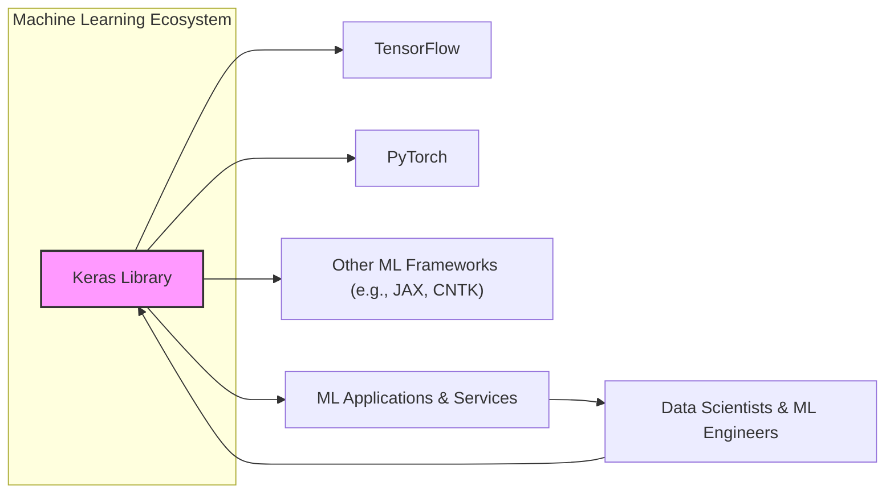
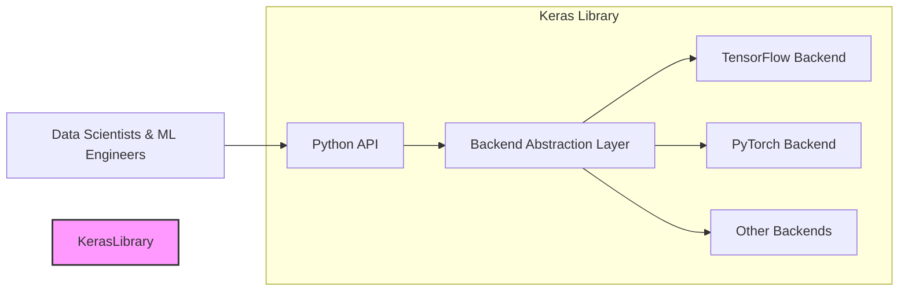
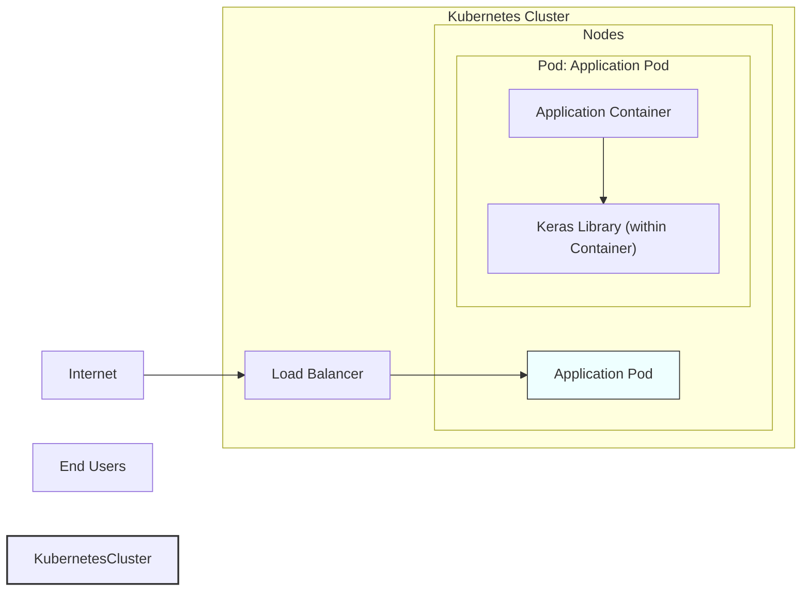
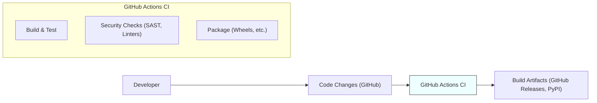

# BUSINESS POSTURE

This project, Keras, aims to provide a user-friendly, high-level neural networks API, capable of running on top of various backends like TensorFlow, PyTorch, and others. The primary business priority is to empower developers and researchers to build and experiment with machine learning models efficiently and effectively. The goal is to democratize deep learning by making it more accessible and easier to use.

Most important business risks that need to be addressed:
- Risk of losing community support and contributions if the project becomes too complex or difficult to contribute to.
- Risk of being superseded by competing frameworks if Keras fails to adapt to the evolving machine learning landscape.
- Risk of security vulnerabilities in Keras code that could be exploited in downstream applications using Keras.
- Risk of performance bottlenecks or inefficiencies that could hinder the adoption of Keras in performance-sensitive applications.

# SECURITY POSTURE

Existing security controls:
- security control: Open source development model with public code review on GitHub. Implemented in: GitHub repository and contribution process.
- security control: Reliance on underlying backend frameworks (TensorFlow, PyTorch, etc.) for core security features. Implemented in: Keras design and documentation.
- security control: Community-driven vulnerability reporting and patching. Implemented in: GitHub repository and community channels.
- security control: Regular updates and maintenance by the Keras team. Implemented in: Keras release cycle and GitHub activity.

Accepted risks:
- accepted risk: Vulnerabilities in underlying backend frameworks are outside of Keras project's direct control.
- accepted risk: Security of user-provided models and data is the responsibility of the user.
- accepted risk: Open source nature implies public disclosure of vulnerabilities after they are patched.

Recommended security controls:
- security control: Implement automated security scanning (SAST, DAST, dependency scanning) in the CI/CD pipeline.
- security control: Conduct regular security audits and penetration testing, especially before major releases.
- security control: Establish a clear vulnerability disclosure and response policy.
- security control: Provide security guidelines and best practices for Keras users in documentation.

Security requirements:
- Authentication: Not directly applicable to Keras library itself. Authentication is relevant in systems that use Keras models, but not within Keras library.
- Authorization: Not directly applicable to Keras library itself. Authorization is relevant in systems that use Keras models to control access to models or predictions, but not within Keras library.
- Input validation: Keras should perform input validation to prevent unexpected behavior or crashes due to malformed input data during model training and inference. Implemented in: Keras code, especially in layers and model APIs.
- Cryptography: Keras relies on backend frameworks for cryptographic operations if needed for specific layers or functionalities. Keras itself does not implement core cryptographic algorithms. Cryptography is relevant for secure storage and transmission of models and data in systems using Keras, but not within Keras library.

# DESIGN

## C4 CONTEXT

Elements of context diagram:
- Name: Keras Library
  - Type: Software System
  - Description: Keras is a high-level neural networks API, written in Python and capable of running on top of TensorFlow, PyTorch, and other backend frameworks. It is designed to enable fast experimentation with deep neural networks, being user-friendly, modular, and extensible.
  - Responsibilities: Provides a high-level API for building, training, evaluating, and deploying neural networks. Abstracts away the complexities of backend frameworks.
  - Security controls: Input validation within the library to prevent crashes or unexpected behavior. Reliance on backend frameworks for core security features.

- Name: Data Scientists & ML Engineers
  - Type: Person
  - Description: Users who utilize Keras to build, train, and deploy machine learning models for various tasks such as image recognition, natural language processing, and time series analysis.
  - Responsibilities: Using Keras to develop and implement machine learning solutions. Providing input data and configuring models.
  - Security controls: Responsible for the security of their own data, models, and applications built using Keras.

- Name: TensorFlow
  - Type: Software System
  - Description: An open-source machine learning framework developed by Google. Keras can run on top of TensorFlow as a backend, leveraging its computational capabilities.
  - Responsibilities: Provides the computational backend for Keras models when TensorFlow is selected as the backend. Handles low-level operations like tensor manipulation and gradient computation.
  - Security controls: TensorFlow's own security controls, including input validation, memory safety, and secure computation features.

- Name: PyTorch
  - Type: Software System
  - Description: An open-source machine learning framework developed by Meta. Keras can also run on top of PyTorch, offering an alternative backend.
  - Responsibilities: Provides the computational backend for Keras models when PyTorch is selected as the backend. Similar responsibilities to TensorFlow.
  - Security controls: PyTorch's own security controls, similar to TensorFlow.

- Name: Other ML Frameworks (e.g., JAX, CNTK)
  - Type: Software System
  - Description: Other machine learning frameworks that Keras can potentially support as backends, extending its compatibility and flexibility.
  - Responsibilities: Providing alternative computational backends for Keras.
  - Security controls: Security controls of each specific framework.

- Name: ML Applications & Services
  - Type: Software System
  - Description: Applications and services built using Keras models. These can range from web applications to mobile apps to embedded systems that incorporate machine learning functionalities.
  - Responsibilities: Utilizing Keras models to provide machine learning powered features to end-users. Handling user input and providing predictions based on Keras models.
  - Security controls: Responsible for the overall security of the application, including secure integration of Keras models, input validation, authorization, and data protection.

## C4 CONTAINER

Elements of container diagram:
- Name: Python API
  - Type: Library Interface
  - Description: The primary interface for users to interact with Keras. It provides a high-level, user-friendly API for defining, training, and using neural networks in Python.
  - Responsibilities: Exposing Keras functionalities to users through Python. Handling user requests and translating them into backend-specific operations.
  - Security controls: Input validation at the API level to ensure correct usage and prevent misuse.

- Name: Backend Abstraction Layer
  - Type: Software Component
  - Description: A layer within Keras that abstracts away the differences between various backend frameworks. It provides a consistent interface for the Python API to interact with different backends.
  - Responsibilities: Translating Keras API calls into backend-specific operations. Managing backend execution and data flow.
  - Security controls: Ensuring secure communication and data handling between the Python API and backend frameworks.

- Name: TensorFlow Backend
  - Type: Software Component
  - Description: The backend implementation for TensorFlow. It allows Keras to utilize TensorFlow's computational capabilities.
  - Responsibilities: Executing neural network operations using TensorFlow. Managing TensorFlow sessions and graphs.
  - Security controls: Reliance on TensorFlow's security controls. Secure integration with TensorFlow API.

- Name: PyTorch Backend
  - Type: Software Component
  - Description: The backend implementation for PyTorch. It enables Keras to run on PyTorch.
  - Responsibilities: Executing neural network operations using PyTorch. Managing PyTorch tensors and computations.
  - Security controls: Reliance on PyTorch's security controls. Secure integration with PyTorch API.

- Name: Other Backends
  - Type: Software Component
  - Description: Placeholders for other potential backend implementations (e.g., JAX, CNTK).
  - Responsibilities: Providing backend support for other machine learning frameworks.
  - Security controls: Security controls will depend on the specific backend framework. Secure integration with each backend API.

## DEPLOYMENT

Keras itself is not deployed as a standalone application. It is a library that is included and used within other applications and systems. The deployment context is therefore the deployment of applications that *use* Keras.

Possible deployment scenarios for applications using Keras:
1. Cloud-based deployment (e.g., AWS, GCP, Azure) using containers (Docker, Kubernetes) or serverless functions.
2. On-premises deployment on servers or workstations.
3. Edge deployment on mobile devices, embedded systems, or IoT devices.

Let's consider a cloud-based deployment using Docker and Kubernetes as a representative example.

Elements of deployment diagram:
- Name: Kubernetes Cluster
  - Type: Infrastructure
  - Description: A managed Kubernetes cluster in a cloud environment (e.g., AWS EKS, GCP GKE, Azure AKS). Provides orchestration and management for containerized applications.
  - Responsibilities: Hosting and managing application pods. Providing scalability, resilience, and networking for deployed applications.
  - Security controls: Kubernetes security features (RBAC, network policies, pod security policies), cloud provider security controls (IAM, VPC, security groups).

- Name: Nodes
  - Type: Infrastructure
  - Description: Worker nodes within the Kubernetes cluster. These are virtual machines or physical servers that run application pods.
  - Responsibilities: Executing containers and pods. Providing compute resources for applications.
  - Security controls: Operating system security hardening, node security configurations, security monitoring.

- Name: Application Pod
  - Type: Container
  - Description: A pod in Kubernetes that encapsulates the application container and the Keras library.
  - Responsibilities: Running the application logic that utilizes Keras models. Serving user requests and providing machine learning functionalities.
  - Security controls: Container security best practices, least privilege principle for container processes, resource limits.

- Name: Application Container
  - Type: Software Container
  - Description: A Docker container that packages the application code, dependencies, and the Keras library.
  - Responsibilities: Running the application code. Interacting with the Keras library to perform machine learning tasks.
  - Security controls: Base image security, vulnerability scanning of container images, secure container build process.

- Name: Keras Library (within Container)
  - Type: Software Library
  - Description: The Keras library included within the application container.
  - Responsibilities: Providing machine learning functionalities to the application code.
  - Security controls: Security controls of the Keras library itself (input validation, reliance on backend security).

- Name: Load Balancer
  - Type: Infrastructure
  - Description: A load balancer in front of the Kubernetes cluster that distributes incoming traffic to application pods.
  - Responsibilities: Distributing traffic, providing high availability, and potentially TLS termination.
  - Security controls: TLS/SSL encryption, DDoS protection, access control lists.

- Name: Internet
  - Type: Network
  - Description: The public internet from which users access the application.
  - Responsibilities: Providing connectivity for users to access the application.
  - Security controls: General internet security considerations, reliance on application and infrastructure security.

- Name: Users
  - Type: Person
  - Description: End users who interact with the deployed application.
  - Responsibilities: Using the application and its machine learning features.
  - Security controls: User-side security practices (strong passwords, avoiding phishing).

## BUILD

Elements of build diagram:
- Name: Developer
  - Type: Person
  - Description: Software developers contributing to the Keras project.
  - Responsibilities: Writing code, fixing bugs, adding new features, and submitting code changes.
  - Security controls: Secure coding practices, code review process, personal security hygiene.

- Name: Code Changes (GitHub)
  - Type: Data
  - Description: Code changes submitted by developers via pull requests to the Keras GitHub repository.
  - Responsibilities: Representing the source code modifications. Triggering the CI pipeline.
  - Security controls: GitHub access controls, branch protection rules, code review process.

- Name: GitHub Actions CI
  - Type: Automation System
  - Description: GitHub Actions is used for continuous integration and continuous delivery (CI/CD) of Keras. It automates the build, test, and release process.
  - Responsibilities: Automating the build process, running tests, performing security checks, and packaging the library.
  - Security controls: GitHub Actions security features, secure workflow configurations, secret management, access control to workflows.

- Name: Build & Test
  - Type: Build Step
  - Description: Compilation of Keras code, running unit tests, integration tests, and other quality assurance checks.
  - Responsibilities: Ensuring code quality, identifying bugs, and verifying functionality.
  - Security controls: Automated testing to detect regressions and vulnerabilities, code linters to enforce coding standards.

- Name: Security Checks (SAST, Linters)
  - Type: Build Step
  - Description: Static Application Security Testing (SAST) tools and linters are used to automatically scan the codebase for potential security vulnerabilities and coding style issues.
  - Responsibilities: Identifying potential security flaws and coding style violations early in the development process.
  - Security controls: SAST tools configuration, vulnerability reporting, integration with CI pipeline to fail builds on critical findings.

- Name: Package (Wheels, etc.)
  - Type: Build Step
  - Description: Packaging the built Keras library into distributable formats like Python wheels and source distributions.
  - Responsibilities: Creating release artifacts that can be easily installed by users.
  - Security controls: Ensuring integrity of packages, signing packages (if applicable), secure packaging process.

- Name: Build Artifacts (GitHub Releases, PyPI)
  - Type: Data
  - Description: The packaged Keras library artifacts are published to GitHub Releases and Python Package Index (PyPI) for users to download and install.
  - Responsibilities: Making Keras library available to users.
  - Security controls: Secure storage of artifacts, access control to release repositories, integrity checks (e.g., checksums) for downloaded artifacts, PyPI security controls.

# RISK ASSESSMENT

Critical business process we are trying to protect:
- Development and distribution of the Keras library itself. Ensuring the integrity and availability of Keras for the machine learning community.
- Trust and reputation of the Keras project. Maintaining user confidence in the security and reliability of Keras.

Data we are trying to protect and their sensitivity:
- Keras source code: High sensitivity. Confidentiality and integrity are important to prevent unauthorized modifications or disclosure of vulnerabilities.
- Build artifacts (packages): High sensitivity. Integrity is crucial to prevent supply chain attacks and ensure users download legitimate and untampered Keras packages.
- User data and models: User responsibility. Keras project does not directly handle user data or models, but vulnerabilities in Keras could potentially impact the security of user data and models in applications using Keras. Sensitivity depends on the specific user data and models.

# QUESTIONS & ASSUMPTIONS

Questions:
- What is the Keras team's current vulnerability disclosure and response process?
- Are there any existing security audits or penetration testing reports for Keras?
- What SAST and dependency scanning tools are currently used in the Keras CI pipeline?
- Are there specific security guidelines for contributors to the Keras project?

Assumptions:
- BUSINESS POSTURE: The primary goal of Keras is to be a user-friendly and widely adopted machine learning library. Security is important for maintaining user trust and project reputation.
- SECURITY POSTURE: Keras relies heavily on the security of its backend frameworks. Security controls are primarily focused on open source development best practices and community involvement.
- DESIGN: Keras architecture is modular with a clear separation between the Python API and backend implementations. Deployment context is primarily about applications that use Keras, not Keras itself. Build process is automated using GitHub Actions.