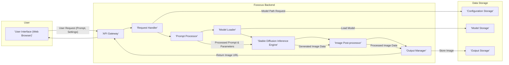
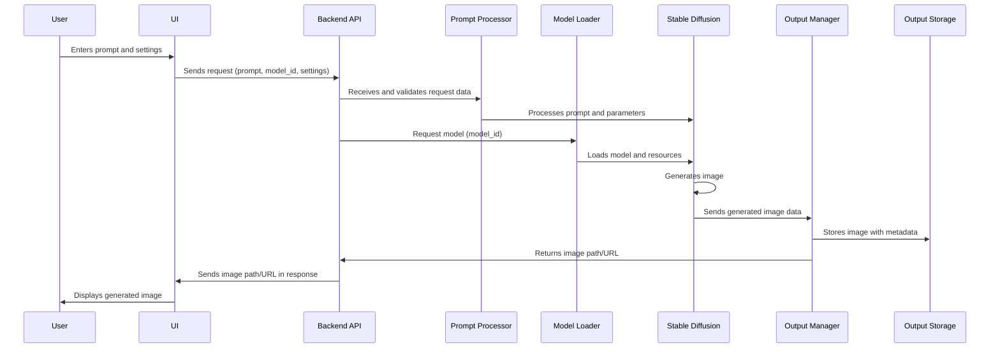

# Project Design Document: Fooocus Image Generation Tool

**Version:** 1.1
**Date:** October 26, 2023
**Author:** AI Software Architect

## 1. Introduction

This document outlines the design of the Fooocus image generation tool, based on the project available at [https://github.com/lllyasviel/Fooocus](https://github.com/lllyasviel/Fooocus). This document serves as a blueprint for understanding the system's architecture, components, and data flow, and will be used as the basis for subsequent threat modeling activities.

Fooocus is a streamlined and user-friendly interface built on top of Stable Diffusion, a powerful text-to-image generation model. It aims to simplify the process of generating high-quality images from textual prompts, making it accessible to a wider audience by abstracting away complex configurations.

## 2. Goals and Objectives

*   Provide a clear and comprehensive overview of the Fooocus system architecture.
*   Identify the key components and their interactions with greater detail.
*   Describe the data flow within the system, including specific data types.
*   Establish a solid foundation for identifying potential security vulnerabilities and threats, with more concrete examples.
*   Serve as a detailed reference point for future development, maintenance, and onboarding of new team members.

## 3. High-Level Architecture

The Fooocus system can be broadly divided into the following key components:

*   **User Interface (UI):**  Provides the primary means for users to interact with the system, input prompts, and configure generation parameters. This is typically a web application.
*   **Backend Service:**  The core logic of the application, responsible for receiving user requests, orchestrating the image generation pipeline, managing resources, and interacting with the underlying Stable Diffusion model.
*   **Stable Diffusion Model:** The pre-trained machine learning model (or models) responsible for generating images based on textual prompts and other conditioning inputs.
*   **Configuration Storage:** Stores application settings, model paths, API keys for external services, and other configuration parameters necessary for the system to function.
*   **Output Storage:**  The persistent storage location where generated images are saved.

## 4. Detailed Component Breakdown

### 4.1. User Interface (UI)

*   **Description:**  A web-based interface, likely a Single Page Application (SPA), built using technologies like HTML5, CSS3, and JavaScript. It provides a user-friendly and interactive way to interact with Fooocus.
*   **Functionality:**
    *   Accepts user input for text prompts, including support for negative prompts.
    *   Allows users to configure various image generation parameters such as:
        *   Image dimensions (width and height).
        *   Sampling methods (e.g., Euler a, DPM++ SDE).
        *   Number of inference steps.
        *   Seed values for reproducibility.
        *   Guidance scale (CFG scale).
        *   LoRA models and their weights.
        *   ControlNet and other conditioning inputs.
    *   Displays generated images to the user, often with options for downloading.
    *   Provides real-time feedback on the generation process (e.g., progress bar).
    *   May include features for managing generation history or favorite settings.
*   **Technology:** Likely built with a modern JavaScript framework (e.g., React, Vue.js, Svelte), potentially using a UI library like Material UI or Tailwind CSS. Communication with the backend is typically via RESTful APIs or WebSockets.

### 4.2. Backend Service

*   **Description:** The core application logic, almost certainly implemented in Python, responsible for managing the image generation workflow and interacting with the Stable Diffusion model.
*   **Functionality:**
    *   **API Gateway:**  Handles incoming HTTP requests from the UI, potentially performing authentication and rate limiting. Could be implemented using frameworks like FastAPI or API Gateway services from cloud providers.
    *   **Request Handler:**  Receives and validates user requests, ensuring that the provided data is in the correct format and within acceptable ranges.
    *   **Prompt Processor:**  Prepares the user's text prompt and other parameters for the Stable Diffusion model. This might involve:
        *   Tokenization of the text prompt.
        *   Applying any configured styles or presets.
        *   Constructing the input tensors for the model.
    *   **Model Loader:**  Loads the specified Stable Diffusion model (and potentially associated VAEs, LoRAs, etc.) from Model Storage into memory. This component manages model caching and potentially offloading to GPU memory.
    *   **Stable Diffusion Inference Engine:**  Executes the core image generation process using the loaded model, the processed prompt, and other conditioning inputs. This heavily relies on libraries like `diffusers`, `torch`, or `tensorflow`.
    *   **Image Post-processor:**  Performs any necessary post-processing on the generated image, such as:
        *   Applying upscaling algorithms.
        *   Watermarking.
        *   Format conversion (e.g., to PNG or JPEG).
    *   **Output Manager:**  Handles saving the generated image to Output Storage, potentially generating unique filenames and managing storage quotas. It also provides mechanisms for retrieving generated images (e.g., generating URLs).
*   **Technology:** Primarily Python (likely version 3.7+), utilizing frameworks like Flask or FastAPI for API development, and key libraries like `torch` or `tensorflow` for model inference, `diffusers` for interacting with Stable Diffusion models, and potentially libraries for image manipulation (e.g., Pillow).

### 4.3. Stable Diffusion Model

*   **Description:** One or more large, pre-trained deep learning models, typically based on a latent diffusion architecture, capable of generating realistic images from textual descriptions and other conditioning inputs.
*   **Functionality:**  Receives a processed text prompt (often represented as embeddings), noise, and potentially other conditioning information (e.g., ControlNet inputs, image variations) as input and iteratively refines the noise to produce a coherent image.
*   **Technology:**  Typically based on transformer architectures and trained on massive datasets of images and text. The specific models used by Fooocus are configurable and might include various versions of Stable Diffusion (e.g., SDXL, SD 1.5) or fine-tuned models. These models are often stored as large checkpoint files (e.g., `.ckpt`, `.safetensors`).

### 4.4. Configuration Storage

*   **Description:**  A persistent storage mechanism for application configuration settings.
*   **Functionality:**
    *   Stores paths to Stable Diffusion models, VAEs, LoRAs, and other resources.
    *   Stores default generation parameters and user preferences.
    *   May store API keys for external services (e.g., cloud storage).
    *   Stores application-level settings (e.g., UI themes, logging levels).
*   **Technology:**  Could be a simple configuration file (e.g., YAML, JSON, INI), environment variables, a dedicated configuration management library (e.g., `configparser` in Python), or a more robust solution like a key-value store (e.g., Redis) or a database.

### 4.5. Output Storage

*   **Description:**  The persistent storage location where generated images are saved.
*   **Functionality:**
    *   Persistently stores generated images, typically with metadata (e.g., generation parameters, timestamps).
    *   Provides a mechanism for retrieving generated images, often via URLs or file paths.
    *   May include features for organizing images into folders or using tagging.
*   **Technology:**  Could be the local file system, cloud object storage services (e.g., AWS S3, Google Cloud Storage, Azure Blob Storage), or a network-attached storage (NAS) device.

## 5. Data Flow

The typical data flow for an image generation request is as follows:

1. **User Input:** The user enters a text prompt, selects a Stable Diffusion model, and configures other parameters through the User Interface.
2. **Request Submission:** The UI sends an HTTP POST request containing the prompt, selected model identifier, and parameters (as JSON data) to the Backend Service's API Gateway.
3. **Request Handling:** The API Gateway routes the request to the Request Handler. The Request Handler validates the incoming data, checking for required fields and data types.
4. **Prompt Processing:** The Prompt Processor receives the validated prompt and parameters. It prepares the input for the Stable Diffusion model, potentially involving tokenization, embedding generation, and constructing tensors for conditioning inputs.
5. **Model Loading:** The Model Loader retrieves the specified Stable Diffusion model (and any associated resources like VAEs or LoRAs) from Model Storage based on the provided model identifier and configuration. The model is loaded into the GPU memory for efficient inference.
6. **Image Generation:** The Stable Diffusion Inference Engine receives the processed prompt, loaded model, and other conditioning inputs. It performs the iterative denoising process to generate the image in the latent space and then decodes it using the VAE.
7. **Image Post-processing:** The generated image data is passed to the Image Post-processor. This component might apply upscaling, format conversion (e.g., converting the image tensor to a PNG or JPEG), and potentially add watermarks.
8. **Output Storage:** The Output Manager receives the processed image data and saves it to Output Storage. It typically generates a unique filename and might store metadata alongside the image.
9. **Response to User:** The Backend Service sends an HTTP response back to the UI. This response typically includes a URL or path to the generated image, allowing the UI to display it to the user. The response might also include metadata about the generation process.
10. **Image Display:** The UI receives the response and uses the provided URL or path to display the generated image to the user.

## 6. Security Considerations

This section outlines potential security considerations based on the system design. A more detailed threat model will be developed based on this document.

*   **Input Validation:**
    *   **Threat:** Malicious users could inject specially crafted prompts to trigger unintended behavior in the Stable Diffusion model or the backend (e.g., prompt injection attacks, denial-of-service by requesting extremely large images).
    *   **Mitigation:** Implement robust input validation on the Backend Service to sanitize prompts, limit the length of prompts, restrict allowed characters, and validate numerical parameters (image dimensions, steps, etc.).
*   **Authentication and Authorization:**
    *   **Threat:** Unauthorized users could access the API and generate images, potentially consuming resources or accessing sensitive data if the system evolves to handle user-specific data.
    *   **Mitigation:** Implement authentication mechanisms (e.g., API keys, OAuth 2.0) to verify the identity of users or applications making requests. Implement authorization to control access to specific API endpoints or features.
*   **Model Security:**
    *   **Threat:**  Malicious actors could attempt to access, copy, or modify the Stable Diffusion models, which are valuable intellectual property.
    *   **Mitigation:** Restrict access to the Model Storage location. Implement appropriate file system permissions. If models are served via an API, implement authentication and authorization for model access. Consider using encrypted storage for models.
*   **Data Storage Security:**
    *   **Threat:** Generated images might contain sensitive information or could be tampered with if Output Storage is not properly secured.
    *   **Mitigation:** Implement access controls on the Output Storage (e.g., using cloud storage IAM roles or file system permissions). Consider encrypting images at rest.
*   **API Security:**
    *   **Threat:** The API endpoints are vulnerable to common web attacks like cross-site scripting (XSS) if user-generated content is not handled carefully in responses, and cross-site request forgery (CSRF) if proper anti-CSRF tokens are not used.
    *   **Mitigation:** Follow secure coding practices. Sanitize user inputs before displaying them in the UI. Implement CSRF protection mechanisms. Use HTTPS to encrypt communication between the UI and the Backend Service.
*   **Dependency Management:**
    *   **Threat:** Using outdated or vulnerable dependencies in the Backend Service or UI could introduce security vulnerabilities.
    *   **Mitigation:** Regularly scan dependencies for known vulnerabilities using tools like `pip audit` or Snyk. Keep dependencies up-to-date with the latest security patches.
*   **Rate Limiting:**
    *   **Threat:**  Malicious actors could overload the system with excessive image generation requests, leading to denial of service.
    *   **Mitigation:** Implement rate limiting on API endpoints to restrict the number of requests from a single IP address or user within a given time period.
*   **Configuration Security:**
    *   **Threat:** Sensitive information stored in Configuration Storage (e.g., API keys, database credentials) could be exposed if the configuration files or storage mechanism are not properly secured.
    *   **Mitigation:** Avoid storing sensitive information directly in configuration files. Use environment variables or secure configuration management tools. Encrypt sensitive data at rest.
*   **Code Injection:**
    *   **Threat:** If user-provided data is used in code execution paths without proper sanitization, it could lead to code injection vulnerabilities.
    *   **Mitigation:** Avoid using user input directly in code execution. If necessary, use secure evaluation methods and carefully sanitize input.

## 7. Deployment Considerations

The Fooocus system can be deployed in various ways, each with its own trade-offs:

*   **Local Machine:**
    *   **Description:** Running all components (UI, Backend, Stable Diffusion model) on a user's personal computer.
    *   **Pros:** Simple setup for individual use, direct access to hardware resources.
    *   **Cons:** Limited scalability, resource constraints of the local machine, not suitable for multi-user access.
    *   **Technologies:** Python environment with necessary libraries, web browser.
*   **Cloud Environment (e.g., AWS, Azure, GCP):**
    *   **Description:** Deploying the Backend Service and Stable Diffusion model on cloud infrastructure.
    *   **Pros:** Scalability, high availability, managed services for databases and storage, potential for cost optimization.
    *   **Cons:** Increased complexity in setup and management, potential vendor lock-in, cost considerations.
    *   **Technologies:** Virtual machines (EC2, Azure VMs, Compute Engine), container orchestration (Kubernetes, ECS, AKS, GKE), serverless functions (Lambda, Azure Functions, Cloud Functions), cloud storage (S3, Azure Blob Storage, Cloud Storage).
*   **Containerization (Docker):**
    *   **Description:** Packaging the Backend Service and potentially the UI into Docker containers for consistent deployment across different environments.
    *   **Pros:** Reproducible deployments, simplified management, isolation of dependencies.
    *   **Cons:** Requires understanding of containerization technologies.
    *   **Technologies:** Docker, Docker Compose, container registries (Docker Hub, ECR, ACR, GCR).
*   **Serverless Functions:**
    *   **Description:** Implementing parts of the Backend Service (e.g., the API Gateway, Prompt Processor) as serverless functions.
    *   **Pros:** Automatic scaling, cost-effective for spiky workloads, reduced operational overhead.
    *   **Cons:** Potential cold starts, limitations on execution time and resources, increased complexity in managing state.
    *   **Technologies:** AWS Lambda, Azure Functions, Google Cloud Functions.

The choice of deployment strategy will depend on factors such as the expected user load, performance requirements, budget, security requirements, and the team's expertise.

## 8. Non-Functional Requirements

While not explicitly part of the architecture, these are important considerations:

*   **Performance:** The system should generate images within an acceptable timeframe for users. This includes minimizing latency in API responses and optimizing the inference speed of the Stable Diffusion model (e.g., using GPU acceleration).
*   **Scalability:** The system should be able to handle increasing user load and demand. This might involve scaling the Backend Service horizontally and utilizing scalable storage solutions.
*   **Reliability:** The system should be reliable and available to users. This includes implementing error handling, monitoring, and potentially redundancy for critical components.
*   **Maintainability:** The codebase should be well-structured, documented, and easy to maintain and update.
*   **Security:** As detailed in Section 6, security is a paramount non-functional requirement.
*   **Usability:** The User Interface should be intuitive and easy to use for both novice and experienced users.

## 9. Future Considerations

*   **Enhanced User Interface:**  Adding more advanced features to the UI, such as:
    *   Inpainting and outpainting capabilities.
    *   Real-time preview of generation progress.
    *   More granular control over sampling parameters.
    *   Integration with community model repositories.
*   **Model Management:**  Providing a more robust mechanism for users to manage and switch between different Stable Diffusion models, VAEs, and LoRAs.
*   **Integration with other services:**  Allowing Fooocus to integrate with other applications or services via APIs or plugins.
*   **Performance Optimization:**  Continuously exploring techniques to improve the speed and efficiency of image generation, such as model quantization or optimized inference pipelines.
*   **Security Enhancements:**  Implementing more advanced security measures based on ongoing threat modeling and security best practices.
*   **Support for new Stable Diffusion features:**  Integrating new features and capabilities as they are released in the Stable Diffusion ecosystem.

This document provides a more detailed and comprehensive overview of the Fooocus image generation tool's design. It will serve as a valuable resource for understanding the system's architecture, data flow, and security considerations, and will be crucial for conducting thorough threat modeling activities and guiding future development.