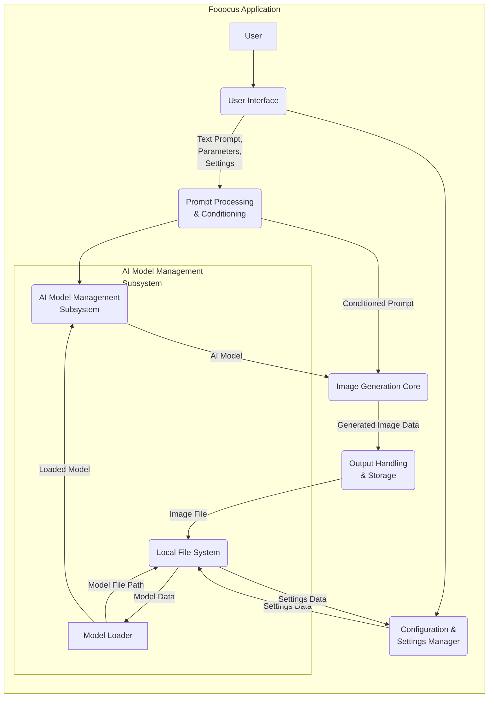

# Project Design Document: Fooocus - AI Image Generation Tool

**Version:** 1.1
**Date:** October 26, 2023
**Prepared By:** AI Architecture Expert

## 1. Introduction

This document provides a detailed architectural design of the Fooocus project, an offline image generation tool leveraging Stable Diffusion models. This document is intended to serve as a foundation for subsequent threat modeling activities. It outlines the key components, data flows, and technologies involved in the system, with a focus on aspects relevant to security.

## 2. Goals and Scope

The primary goal of this document is to clearly and comprehensively describe the architecture of the Fooocus application, specifically for security analysis. The scope includes:

*   The core functionalities of the application from a data and control flow perspective.
*   The major software components, their responsibilities, and interdependencies.
*   Detailed data flow diagrams illustrating the movement and transformation of data.
*   Key technologies, libraries, and frameworks utilized by the application.
*   The deployment model and operational environment of the application.

This document specifically excludes:

*   Granular code-level implementation details of individual functions or modules.
*   In-depth mathematical explanations of the Stable Diffusion algorithms.
*   Specific details about the training datasets or processes used for the underlying AI models.
*   Detailed user interface design specifications beyond their role in initiating actions and displaying results.

## 3. System Overview

Fooocus is a desktop application enabling users to generate images from textual prompts using pre-trained Stable Diffusion models. Its design emphasizes ease of use and offline functionality, allowing users to generate images without requiring a constant internet connection after the initial setup and model acquisition.

### 3.1. Key Components

*   **User Interface (UI):** The primary point of interaction for the user. It handles:
    *   Input of text prompts (positive and negative).
    *   Configuration of generation parameters (e.g., image dimensions, sampling methods, number of steps, random seeds).
    *   Selection of pre-configured styles or advanced options.
    *   Display of generated images and progress updates.
    *   Management of application settings, including model paths and output directories.
*   **Prompt Processing and Conditioning Module:**  Responsible for transforming the user's text prompt into a numerical representation (embeddings) that the Stable Diffusion model can understand. This involves:
    *   Tokenization of the input text.
    *   Encoding tokens into embeddings using models like CLIP.
    *   Handling negative prompts to guide the generation process.
*   **AI Model Management Subsystem:**  Handles the loading, caching, and management of Stable Diffusion model files. This subsystem includes:
    *   **Model Loader:** Responsible for reading model weights and configurations from disk.
    *   **Model Cache:**  Potentially stores loaded models in memory to improve performance for subsequent generations.
    *   **Model Configuration Reader:** Parses configuration files associated with the models.
*   **Image Generation Core:** The central engine that performs the iterative denoising process of Stable Diffusion. This involves:
    *   Utilizing the loaded AI model and the conditioned prompt.
    *   Applying sampling algorithms (e.g., DDIM, Euler).
    *   Generating the image pixel by pixel or in latent space.
*   **Configuration and Settings Manager:**  Manages application-level settings and user preferences. This includes:
    *   Reading configuration from files (e.g., JSON, YAML).
    *   Storing user preferences.
    *   Providing access to configuration parameters for other components.
*   **Output Handling and Storage:**  Responsible for saving the generated images to the local file system. This includes:
    *   Encoding image data into various formats (e.g., PNG, JPEG).
    *   Saving images to user-specified or default directories.
    *   Potentially generating metadata alongside the image.
*   **Dependency Management Layer:**  While not a visually distinct component, this encompasses the external libraries and frameworks the application relies on (e.g., PyTorch, Transformers, potentially CUDA for GPU acceleration).

### 3.2. Data Flow

**Detailed Data Flow Description:**

1. The **User** interacts with the **User Interface** to input a text prompt, configure generation parameters, and potentially modify application settings.
2. The **User Interface** sends the text prompt and generation parameters to the **Prompt Processing & Conditioning** module. Application settings might be sent to the **Configuration & Settings Manager**.
3. The **Prompt Processing & Conditioning** module processes the text prompt, potentially requiring information about the available AI models from the **AI Model Management Subsystem**.
4. The **AI Model Management Subsystem**, specifically the **Model Loader**, retrieves the necessary AI model data from the **Local File System** based on configured paths.
5. The **Model Loader** loads the model data and makes it available within the **AI Model Management Subsystem**.
6. The **Prompt Processing & Conditioning** module sends the conditioned prompt to the **Image Generation Core**.
7. The **AI Model Management Subsystem** provides the loaded AI model to the **Image Generation Core**.
8. The **Image Generation Core** uses the conditioned prompt and the AI model to generate image data.
9. The **Image Generation Core** sends the generated image data to the **Output Handling & Storage** module.
10. The **Output Handling & Storage** module saves the generated image as an image file to the **Local File System**.
11. The **User Interface** interacts with the **Configuration & Settings Manager** to load or save application settings, which are stored in the **Local File System**.

## 4. Component Details

### 4.1. User Interface (UI)

*   **Functionality:** Provides the user's gateway to interact with the application, controlling inputs, displaying outputs, and managing settings.
*   **Inputs:** Textual prompts (positive and negative), numerical parameters (image size, sampling steps, seed), user actions (generate, save, load settings).
*   **Outputs:** Displayed generated images, progress bars, status messages, error notifications.
*   **Technology:** Likely implemented using a Python-based GUI framework such as Gradio, Tkinter, or Qt, potentially leveraging web technologies rendered within a desktop application framework (e.g., Electron).

### 4.2. Prompt Processing and Conditioning Module

*   **Functionality:**  Transforms the raw text prompt into a numerical representation suitable for the AI model. This involves tokenization, embedding, and potentially handling prompt weighting or other advanced techniques.
*   **Inputs:** Raw text prompt from the UI.
*   **Outputs:** Conditioned prompt embeddings.
*   **Technology:**  Likely utilizes libraries from the Hugging Face Transformers ecosystem, such as tokenizers and models for CLIP or similar embedding models.

### 4.3. AI Model Management Subsystem

*   **Functionality:**  Handles the loading, caching, and management of Stable Diffusion model files.
    *   **Model Loader:** Reads model weights and configurations from disk.
        *   **Inputs:** File paths to model files.
        *   **Outputs:** In-memory representation of the AI model.
        *   **Technology:**  Relies heavily on deep learning frameworks like PyTorch or TensorFlow for loading model weights.
    *   **Model Cache:** Stores loaded models in memory for faster access.
        *   **Inputs:** Loaded AI models.
        *   **Outputs:** Cached AI models.
        *   **Technology:**  In-memory data structures.
    *   **Model Configuration Reader:** Parses configuration files associated with models (e.g., `.yaml`, `.json`).
        *   **Inputs:** Model configuration files.
        *   **Outputs:** Model configuration parameters.
        *   **Technology:**  Libraries for parsing configuration files (e.g., `json`, `yaml`).

### 4.4. Image Generation Core

*   **Functionality:**  Performs the core image generation process using the loaded AI model and the conditioned prompt. This involves iterative denoising based on the diffusion process and the selected sampling algorithm.
*   **Inputs:** Conditioned prompt embeddings, loaded AI model.
*   **Outputs:** Raw pixel data representing the generated image (often in latent space initially).
*   **Technology:**  Core Stable Diffusion implementation, heavily reliant on PyTorch or TensorFlow, potentially utilizing CUDA or other acceleration libraries for GPU processing.

### 4.5. Configuration and Settings Manager

*   **Functionality:**  Manages application-level settings and user preferences, such as model paths, output directories, and default generation parameters.
*   **Inputs:** User modifications via the UI, default configuration files.
*   **Outputs:** Application settings in memory, updated configuration files on disk.
*   **Technology:** Standard file I/O operations, potentially using libraries like `json` or `yaml` for serialization and deserialization of settings data.

### 4.6. Output Handling and Storage

*   **Functionality:**  Handles the saving of generated images to the local file system in various formats.
*   **Inputs:** Raw pixel data of the generated image.
*   **Outputs:** Saved image files on disk.
*   **Technology:**  Image processing libraries like Pillow (PIL) for encoding and saving images in formats like PNG, JPEG, etc.

### 4.7. Dependency Management Layer

*   **Functionality:** Ensures all necessary libraries and frameworks are available and correctly loaded at runtime.
*   **Inputs:**  Requirements specified by the application components.
*   **Outputs:**  Availability of required libraries and their functionalities.
*   **Technology:**  Package managers like `pip` (for Python) are used to install and manage dependencies. The application itself might use mechanisms to check for and potentially alert users about missing dependencies.

## 5. Security Considerations (For Threat Modeling)

This section expands on potential security concerns relevant for threat modeling:

*   **Input Validation and Sanitization:**
    *   **Prompt Injection Attacks:** Maliciously crafted prompts could potentially cause the AI model to generate harmful or inappropriate content, or even trigger unexpected application behavior if not properly sanitized.
    *   **Parameter Manipulation:**  Insufficient validation of numerical parameters (e.g., image dimensions, sampling steps) could lead to resource exhaustion (DoS) or unexpected errors.
    *   **File Path Injection (Settings):** If users can directly input file paths for models or output directories, this could be exploited to overwrite critical files or access sensitive data.
*   **AI Model Security:**
    *   **Loading Malicious Models:** If the application allows loading arbitrary model files, users could potentially load compromised models containing backdoors or designed to generate harmful outputs.
    *   **Model Integrity Verification:**  Lack of mechanisms to verify the integrity and authenticity of model files downloaded from the internet or other sources increases the risk of using tampered models.
*   **Data Storage Security:**
    *   **Configuration File Security:**  If configuration files store sensitive information (e.g., access tokens for future online services), they need to be protected from unauthorized access.
    *   **Generated Image Content:** While the application doesn't directly control the content generated, understanding the potential for generating sensitive or inappropriate content is important for user safety and responsible use.
*   **Dependency Management and Supply Chain Security:**
    *   **Vulnerable Dependencies:** Using outdated or vulnerable versions of libraries like PyTorch, Transformers, or Pillow can expose the application to known security flaws.
    *   **Dependency Tampering:**  Compromised dependencies introduced through supply chain attacks can have severe consequences. Mechanisms to verify the integrity of downloaded dependencies are crucial.
*   **Local File System Access Control:**
    *   **Excessive Permissions:**  The application should only request the necessary file system permissions. Overly broad permissions could be exploited.
    *   **Path Traversal Vulnerabilities:**  Vulnerabilities in how the application handles file paths could allow attackers to access or modify files outside of the intended directories.
*   **Code Execution Risks:**
    *   **Unsafe Deserialization:** If the application deserializes data from untrusted sources (e.g., configuration files), vulnerabilities in deserialization libraries could lead to arbitrary code execution.
    *   **Just-In-Time (JIT) Compilation Vulnerabilities:** If the underlying deep learning frameworks use JIT compilation, vulnerabilities in the compiler could be exploited.
*   **Information Disclosure:**
    *   **Error Messages:**  Verbose error messages might reveal sensitive information about the application's internal workings or file system structure.

## 6. Deployment Model

Fooocus is deployed as a **standalone desktop application**, designed for installation and execution directly on a user's local machine. The typical deployment involves:

*   **Download and Installation:** Users download an installer package (e.g., `.exe` for Windows, `.dmg` for macOS, or distribution-specific packages for Linux) from the project's repository or website.
*   **Local Execution:** The application runs entirely on the user's machine, performing image generation using local hardware resources (CPU, GPU).
*   **Offline Operation (Primarily):**  Once installed and configured with the necessary model files, the core image generation functionality operates offline, without requiring a constant internet connection. Initial model acquisition might require internet access.

## 7. Assumptions and Constraints

*   Users are responsible for acquiring and placing the necessary Stable Diffusion model files in a location accessible to the application, as configured through the settings.
*   The user's system meets the minimum hardware and software requirements for running the application and the underlying AI models (e.g., specific operating system versions, sufficient RAM, compatible GPU with adequate VRAM and drivers).
*   The primary use case is individual users generating images on their personal computers.
*   The core image generation functionality does not inherently rely on network communication after initial setup and model acquisition.
*   The security posture of the application is heavily influenced by the security of the user's operating system and other software installed on their machine.

## 8. Future Considerations (Out of Scope for Current Threat Model, but Relevant for Future Development)

*   **Cloud Integration:**  Future versions might integrate with cloud services for model storage, distributed processing, or collaborative features. This would introduce new security considerations related to cloud security, API authentication, and data transmission.
*   **Plugin or Extension Architecture:**  Allowing users to extend the application's functionality through plugins or extensions could introduce significant security risks if untrusted or malicious extensions are loaded. A robust security model for plugins would be necessary.
*   **Web Interface or API:**  Providing a web interface or an API for programmatic access would significantly expand the attack surface and require careful consideration of web security best practices (authentication, authorization, input validation, etc.).
*   **Automatic Model Downloading and Updating:**  Implementing features for automatically downloading or updating models would require secure channels and mechanisms to verify the integrity and authenticity of downloaded files.

This revised document provides a more detailed and structured architectural design of the Fooocus project, specifically tailored for threat modeling. The enhanced component descriptions, refined data flow diagram, and expanded security considerations offer a more comprehensive foundation for identifying and mitigating potential security vulnerabilities.